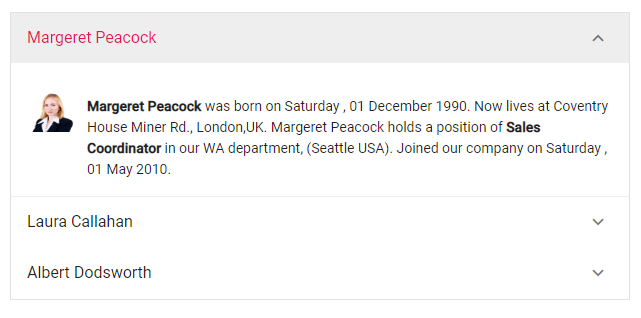

# Getting Started with Blazor Accordion Component

This section briefly explains about how to include [Blazor Accordion](https://www.syncfusion.com/blazor-components/blazor-accordion) component in your Blazor Server App and Blazor WebAssembly App using Visual Studio.

To get started quickly with Blazor Accordion, check on the following video:



## Prerequisites

* [System requirements for Blazor components](https://blazor.syncfusion.com/documentation/system-requirements)

## Create a new Blazor App in Visual Studio

You can create **Blazor Server App** or **Blazor WebAssembly App** using Visual Studio in one of the following ways,

* [Create a Project using Microsoft Templates](https://docs.microsoft.com/en-us/aspnet/core/blazor/tooling?pivots=windows)

* [Create a Project using Syncfusion Blazor Extension](https://blazor.syncfusion.com/documentation/visual-studio-integration/template-studio)

## Install Syncfusion Blazor Navigations NuGet in the App

To add Blazor Accordion component in the app, open the NuGet package manager in Visual Studio (*Tools → NuGet Package Manager → Manage NuGet Packages for Solution*), search for [Syncfusion.Blazor.Navigations](https://www.nuget.org/packages/Syncfusion.Blazor.Navigations/) and then install it. Alternatively, you can utilize the following package manager command to achieve the same.




PM> NuGet\Install-Package Syncfusion.Blazor.Navigations -Version {{ site.releaseversion }}




N> Syncfusion Blazor components are available in [nuget.org](https://www.nuget.org/packages?q=syncfusion.blazor). Refer to [NuGet packages topic](https://blazor.syncfusion.com/documentation/nuget-packages) for available NuGet packages list with component details.

## Register Syncfusion Blazor Service

Open **~/_Imports.razor** file and import the Syncfusion.Blazor namespace.




@using Syncfusion.Blazor
@using Syncfusion.Blazor.Navigations




Now, register the Syncfusion Blazor Service in the Blazor Server App or Blazor WebAssembly App. 




using Microsoft.AspNetCore.Components;
using Microsoft.AspNetCore.Components.Web;
using Syncfusion.Blazor;

var builder = WebApplication.CreateBuilder(args);

// Add services to the container.
builder.Services.AddRazorPages();
builder.Services.AddServerSideBlazor();
builder.Services.AddSyncfusionBlazor();

var app = builder.Build();
....




using Microsoft.AspNetCore.Components.Web;
using Microsoft.AspNetCore.Components.WebAssembly.Hosting;
using Syncfusion.Blazor;

var builder = WebAssemblyHostBuilder.CreateDefault(args);
builder.RootComponents.Add<App>("#app");
builder.RootComponents.Add<HeadOutlet>("head::after");

builder.Services.AddScoped(sp => new HttpClient { BaseAddress = new Uri(builder.HostEnvironment.BaseAddress) });

builder.Services.AddSyncfusionBlazor();
await builder.Build().RunAsync();
....




## Add style sheet

To add theme to the app, open the NuGet package manager in Visual Studio (Tools → NuGet Package Manager → Manage NuGet Packages for Solution), search for [Syncfusion.Blazor.Themes](https://www.nuget.org/packages/Syncfusion.Blazor.Themes/) and then install it. Then, the theme style sheet from NuGet can be referred as follows using [Static Web Assets](https://blazor.syncfusion.com/documentation/appearance/themes#static-web-assets),




PM> NuGet\Install-Package Syncfusion.Blazor.Themes -Version {{ site.releaseversion }}




* For .NET 6 Blazor Server App, add the Syncfusion bootstrap5 theme in the `<head>` of the **~/Pages/_Layout.cshtml** file.

* For .NET 7 Blazor Server App, add the Syncfusion bootstrap5 theme in the `<head>` of the **~/Pages/_Host.cshtml** file.

* For Blazor WebAssembly App, refer the theme style sheet from NuGet in the `<head>` of **wwwroot/index.html** file in the client web app.

```cshtml
<head>
    ...
    <link href="_content/Syncfusion.Blazor.Themes/bootstrap5.css" rel="stylesheet" />
</head>
```

N> Checkout the [Blazor Themes topic](https://blazor.syncfusion.com/documentation/appearance/themes) to learn different ways ([Static Web Assets](https://blazor.syncfusion.com/documentation/appearance/themes#static-web-assets), [CDN](https://blazor.syncfusion.com/documentation/appearance/themes#cdn-reference) and [CRG](https://blazor.syncfusion.com/documentation/common/custom-resource-generator)) to refer themes in Blazor application.

## Add script reference

 In this getting started walk-through, the required scripts are referred using [Static Web Assets](https://blazor.syncfusion.com/documentation/common/adding-script-references#static-web-assets) externally inside the `<head>` as follows. 

* For **.NET 6** app, refer script in the `<head>` of the **~/Pages/_Layout.cshtml** file.

* For **.NET 7** app, refer script in the `<head>` of the **~/Pages/_Host.cshtml** file.

* For Blazor WebAssembly App, refer script in the `<head>` of the **~/index.html** file.

```
<head>
    ....
    <link href="_content/Syncfusion.Blazor.Themes/bootstrap5.css" rel="stylesheet" />
    <script src="_content/Syncfusion.Blazor.Core/scripts/syncfusion-blazor.min.js" type="text/javascript"></script>
</head>
```

N> Checkout [Adding Script Reference topic](https://blazor.syncfusion.com/documentation/common/adding-script-references) to learn different ways to add script reference in Blazor Application. Make sure to [enable static web assets usage](https://blazor.syncfusion.com/documentation/common/adding-script-references#enable-static-web-assets-usage) to use static assets in your project.

## Add Blazor Accordion component

* Add the Syncfusion Blazor Accordion component in the **~/Pages/Index.razor** file under the **~/Pages** folder.




<SfAccordion>
    <AccordionItems>
        <AccordionItem Header="Margeret Peacock" Content="Margeret Peacock was born on Saturday , 01 December 1990. Now lives at Coventry House Miner Rd., London,UK. Margeret Peacock holds a position of Sales Coordinator in our WA department, (Seattle USA). Joined our company on Saturday , 01 May 2010"></AccordionItem>
        <AccordionItem Header="Laura Callahan" Content="Laura Callahan was born on Tuesday , 06 November 1990. Now lives at Edgeham Hollow Winchester Way, London,UK. Laura Callahan holds a position of Sales Coordinator in our WA department, (Seattle USA). Joined our company on Saturday , 01 May 2010"></AccordionItem>
        <AccordionItem Header="Albert Dodsworth" Content="Albert Dodsworth was born on Thursday , 19 October 1989. Now lives at 4726 - 11th Ave. N.E., Seattle,USA.Albert Dodsworth holds a position of Sales Representative in our WA department, (Seattle USA). Joined our company on Friday , 01 May 2009"></AccordionItem>
    </AccordionItems>
</SfAccordion>




* Press <kbd>Ctrl</kbd>+<kbd>F5</kbd> (Windows) or <kbd>⌘</kbd>+<kbd>F5</kbd> (macOS) to run the application. Then, the Syncfusion `Blazor Accordion` component will be rendered in the default web browser.


N> [View Sample in GitHub](https://github.com/SyncfusionExamples/Blazor-Getting-Started-Examples/tree/main/Accordion).

## Initialize Accordion using Template

The following code explains how to initialize Blazor Accordion using `Templates`.









## See also

1. [Getting Started with Syncfusion Blazor for client-side in .NET Core CLI](https://blazor.syncfusion.com/documentation/getting-started/blazor-webassembly-dotnet-cli)
2. [Getting Started with Syncfusion Blazor for client-side in Visual Studio](https://blazor.syncfusion.com/documentation/getting-started/blazor-webassembly-visual-studio)
3. [Getting Started with Syncfusion Blazor for server-side in .NET Core CLI](https://blazor.syncfusion.com/documentation/getting-started/blazor-server-side-dotnet-cli)

N> You can also explore our [Blazor Accordion example](https://blazor.syncfusion.com/demos/accordion/default-functionalities?theme=bootstrap5) that shows you how to render and configure the Accordion.
