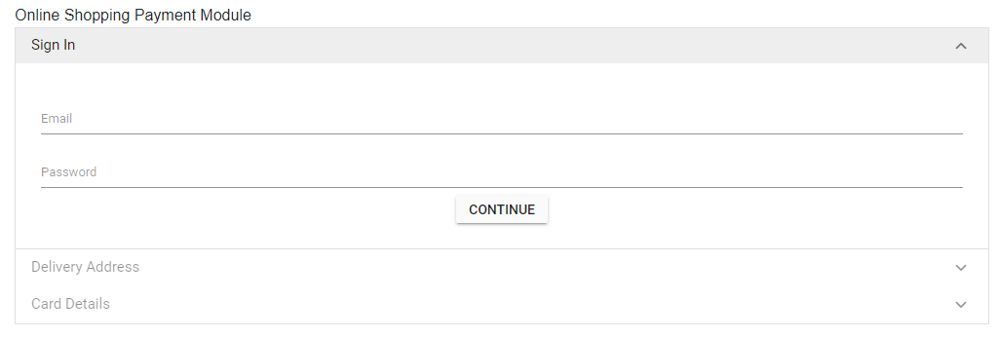

# Create Wizard in Blazor Accordion Component

Accordion items can be disabled and expanded dynamically using the accordion item's [Disabled](https://help.syncfusion.com/cr/blazor/Syncfusion.Blazor.Navigations.AccordionItem.html#Syncfusion_Blazor_Navigations_AccordionItem_Disabled) and [Expanded](https://help.syncfusion.com/cr/blazor/Syncfusion.Blazor.Navigations.AccordionItem.html#Syncfusion_Blazor_Navigations_AccordionItem_Expanded) properties.

The following demo is designed for simple payment module that enable or disable Accordion based on the sequential validation of each Accordion content.

```cshtml
@using Syncfusion.Blazor.Navigations
@using Syncfusion.Blazor.Inputs
@using Syncfusion.Blazor.Buttons
@using Syncfusion.Blazor.Calendars
@using Syncfusion.Blazor.Popups

<div class='template_title'> Online Shopping Payment Module</div>
<SfAccordion ID="AccordionElement" @ref="@Accordion">
    <AccordionEvents Created="OnCreate"></AccordionEvents>
    <AccordionItems>
        <AccordionItem Disabled=@DisableSignInItem @bind-Expanded="ExpandSignInItem">
            <HeaderTemplate>Sign In</HeaderTemplate>
            <ContentTemplate>
                <div id="Sign_In_Form" style="padding:10px">
                    <form id="formId">
                        <div class="form-group">
                            <div class="e-float-input">
                                <SfTextBox @ref="@EmailTextbox" Placeholder="Email"></SfTextBox>
                            </div>
                            <div class="e-float-input">
                                <SfTextBox @ref="@PasswordTextbox" Placeholder="Password" Type="InputType.Password"></SfTextBox>
                            </div>
                        </div>
                    </form>
                    <div style="text-align: center">
                        <SfButton @onclick="@OnSignIn">Continue</SfButton>
                        @if (EmptyField)
                        {
                            <div class="Error">* Please fill all fields</div>
                        }
                    </div>
                </div>
            </ContentTemplate>
        </AccordionItem>
        <AccordionItem Disabled=@DisableDeliveryItem @bind-Expanded="ExpandDeliveryItem">
            <HeaderTemplate>Delivery Address</HeaderTemplate>
            <ContentTemplate>
                <div>
                    <div id="Address_Fill" style="padding:10px">
                        <form id="formId_Address">
                            <div class="form-group">
                                <div class="e-float-input">
                                    <SfTextBox @ref="@NameTextbox" Placeholder="Name"></SfTextBox>
                                </div>
                            </div>
                            <div class="form-group">
                                <div class="e-float-input">
                                    <SfTextBox @ref="@AddressTextbox" Placeholder="Address"></SfTextBox>
                                </div>
                            </div>
                            <div class="form-group">
                                <SfNumericTextBox TValue="int" @ref="@MobileNumberTextbox" Placeholder="Mobile" FloatLabelType="@FloatLabelType.Auto" ShowSpinButton="false" Format="0"></SfNumericTextBox>
                            </div>
                        </form>
                        <div style="text-align: center">
                            <SfButton @onclick="@OnContinue">Continue</SfButton>
                            @if (EmptyField)
                            {
                                <div class="Error">* Please fill all fields</div>
                            }
                        </div>
                    </div>
                </div>
            </ContentTemplate>
        </AccordionItem>
        <AccordionItem Disabled=@DisableCardItem @bind-Expanded="ExpandCardItem">
            <HeaderTemplate> Card Details</HeaderTemplate>
            <ContentTemplate>
                <div id="Card_Fill" style="padding:10px">
                    <div class="col-xs-6 col-sm-6 col-lg-6 col-md-6">
                        <div class="form-group">
                            <SfNumericTextBox TValue="int" @ref="@CardNumberTextbox" Placeholder="Card No" FloatLabelType="@FloatLabelType.Auto" ShowSpinButton="false" Format="0"></SfNumericTextBox>
                        </div>
                    </div>
                    <div class="col-xs-6 col-sm-6 col-lg-6 col-md-6">
                        <div class="form-group">
                            <div class="e-float-input">
                                <SfTextBox @ref="@CardHolderNameTextbox" Placeholder="CardHolder Name"></SfTextBox>
                            </div>
                        </div>
                    </div>
                    <div class="col-xs-6 col-sm-6 col-lg-6 col-md-6">
                        <SfDatePicker TValue="DateTime" Width="100%" Placeholder="Expiry Date" Format="MM-yyyy" Readonly="false"></SfDatePicker>
                    </div>
                    <div class="col-xs-6 col-sm-6 col-lg-6 col-md-6">
                        <div class="form-group">
                            <SfNumericTextBox @ref="@CvvTextbox" TValue="int" Placeholder="CVV" FloatLabelType=@FloatLabelType.Auto Format="0" ShowSpinButton="false"></SfNumericTextBox>
                        </div>
                    </div>
                </div>
                <div style="text-align: center">
                    <SfButton @onclick="@GoBack">Back</SfButton>
                    <SfButton @onclick="@SaveDetails">Save</SfButton>
                    @if (EmptyField)
                    {
                        <div class="Error">* Please fill all fields</div>
                    }
                </div>
            </ContentTemplate>
        </AccordionItem>
    </AccordionItems>
</SfAccordion>

<SfDialog @ref="AlertDialog" Width=250 Target="#AccordionElement" IsModal=true Visible=false ShowCloseIcon="true">
    <DialogEvents Created="DialogCreate"></DialogEvents>
    <DialogTemplates>
        <Header><div>Alert</div></Header>
        <Content><div>Your payment was successfully processed</div></Content>
    </DialogTemplates>
    <DialogButtons>
        <DialogButton OnClick="@OnSubmit" Content="OK" IsPrimary="true"></DialogButton>
    </DialogButtons>
</SfDialog>

@code{
    SfAccordion Accordion;
    SfTextBox EmailTextbox;
    SfTextBox PasswordTextbox;
    SfTextBox NameTextbox;
    SfTextBox AddressTextbox;
    SfDialog AlertDialog;
    SfTextBox CardHolderNameTextbox;
    public SfNumericTextBox<int> CardNumberTextbox { get; set; }
    public SfNumericTextBox<int> MobileNumberTextbox { get; set; }
    public SfNumericTextBox<int> CvvTextbox { get; set; }
    public Boolean EmptyField { get; set; } = false;
    public Boolean DisableSignInItem { get; set; }
    public Boolean DisableDeliveryItem { get; set; }
    public Boolean DisableCardItem { get; set; }
    public Boolean ExpandSignInItem { get; set; }
    public Boolean ExpandDeliveryItem { get; set; }
    public Boolean ExpandCardItem { get; set; }

    public void OnCreate()
    {
        DisableDeliveryItem = true;
        DisableCardItem = true;
    }

    public async Task OnSignIn()
    {
        if (EmailTextbox.Value == null || PasswordTextbox.Value == null)
        {
            EmptyField = true;
        }
        else
        {
            EmptyField = false;
            DisableDeliveryItem = false;
            await Accordion.SelectAsync(1);
            ExpandSignInItem = false;
            ExpandDeliveryItem = true;
        }
    }
    public async Task OnContinue()
    {
        if (NameTextbox.Value == null || AddressTextbox.Value == null || MobileNumberTextbox == null)
        {
            EmptyField = true;
        }
        else
        {
            DisableCardItem = false;
            await Accordion.SelectAsync(2);
            ExpandDeliveryItem = false;
            ExpandCardItem = true;
        }
    }
    public async Task GoBack()
    {
        await Accordion.SelectAsync(1);
        ExpandCardItem = false;
        ExpandDeliveryItem = true;
    }
    public async Task SaveDetails()
    {
        if (CardNumberTextbox == null || CardHolderNameTextbox == null || CvvTextbox == null)
        {
            EmptyField = true;
        }
        else
        {
            EmptyField = false;
            await AlertDialog.ShowAsync();
        }
    }
    public async Task DialogCreate()
    {
        await AlertDialog.HideAsync();
    }
    public async Task OnSubmit(Object args)
    {

        await AlertDialog.HideAsync();
        ExpandCardItem = false;
        DisableSignInItem = false;
        DisableDeliveryItem = true;
        DisableCardItem = true;
        await Accordion.SelectAsync(0);
    }
}

<style>
    .Error {
        color: red;
    }
</style>
```


