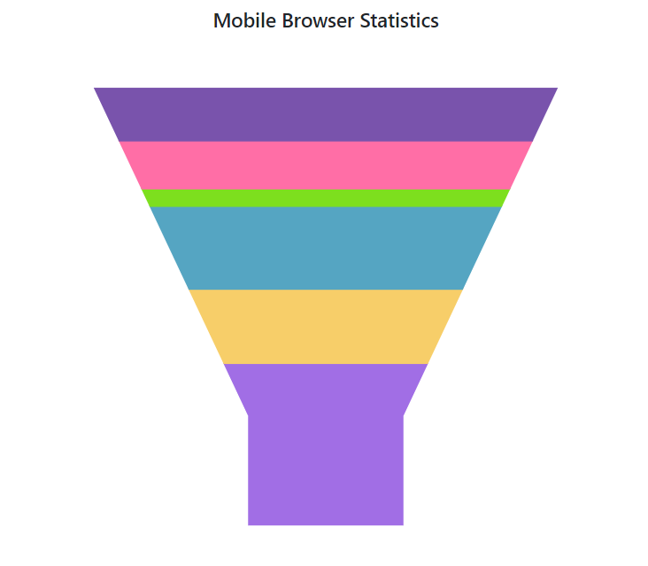
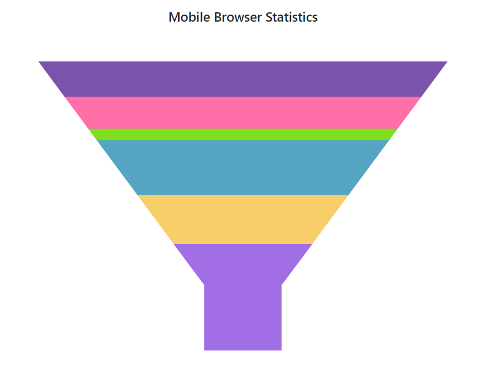
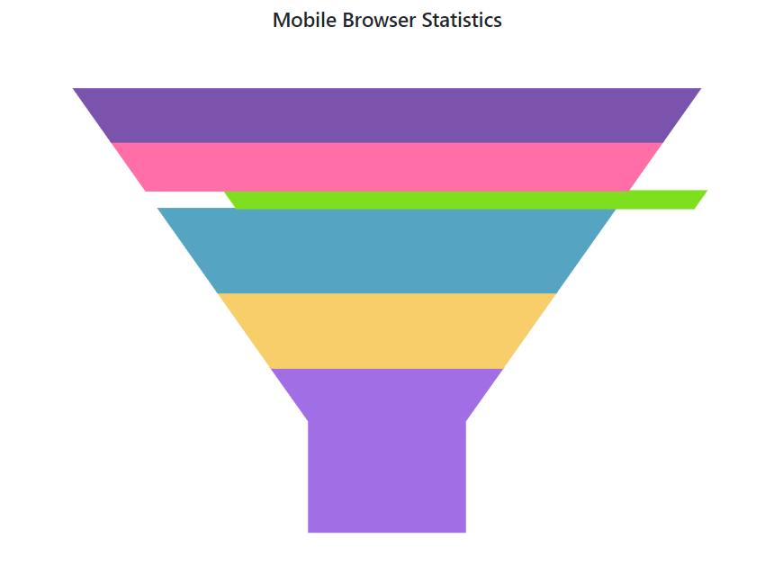

# Funnel Chart

To render a funnel series, use the series [`Type`](https://help.syncfusion.com/cr/blazor/Syncfusion.Blazor.Charts.AccumulationChartSeries.html#Syncfusion_Blazor_Charts_AccumulationChartSeries_Type)
as `Funnel`.



@using Syncfusion.Blazor.Charts
<SfAccumulationChart Title="Mobile Browser Statistics">
    <AccumulationChartSeriesCollection>
        <AccumulationChartSeries DataSource="@StatisticsDetails" XName="Browser" YName="Users"
                                 Name="Browser" Type="AccumulationType.Funnel">
        </AccumulationChartSeries>
    </AccumulationChartSeriesCollection>

    <AccumulationChartLegendSettings Visible="false"></AccumulationChartLegendSettings>
</SfAccumulationChart>

@code{
    public class Statistics
    {
        public string Browser { get; set; }
        public double Users { get; set; }
    }

    public List<Statistics> StatisticsDetails = new List<Statistics>
{
       new Statistics { Browser = "Chrome", Users = 37 },
       new Statistics { Browser = "UC Browser", Users = 17 },
       new Statistics { Browser = "iPhone", Users = 19 },
       new Statistics { Browser = "Others", Users = 4  },
       new Statistics { Browser = "Opera", Users = 11 },
       new Statistics { Browser = "Android", Users = 12 },
    };
}



## Size

The size of the funnel chart can be customized by using the  [`Width`](https://help.syncfusion.com/cr/blazor/Syncfusion.Blazor.Charts.AccumulationChartSeries.html#Syncfusion_Blazor_Charts_AccumulationChartSeries_Width) and [`Height`](https://help.syncfusion.com/cr/blazor/Syncfusion.Blazor.Charts.AccumulationChartSeries.html#Syncfusion_Blazor_Charts_AccumulationChartSeries_Height) properties.



@using Syncfusion.Blazor.Charts
<SfAccumulationChart Title="Mobile Browser Statistics">
    <AccumulationChartLegendSettings Visible="false"></AccumulationChartLegendSettings>

    <AccumulationChartSeriesCollection>
        <AccumulationChartSeries DataSource="@StatisticsDetails" XName="Browser" YName="Users"
                                 Name="Browser" Type="AccumulationType.Funnel" Width="60%" Height="80%">
        </AccumulationChartSeries>
    </AccumulationChartSeriesCollection>
</SfAccumulationChart>

@code{
    public class Statistics
    {
        public string Browser { get; set; }
        public double Users { get; set; }
    }

    public List<Statistics> StatisticsDetails = new List<Statistics>
{
       new Statistics { Browser = "Chrome", Users = 37 },
       new Statistics { Browser = "UC Browser", Users = 17 },
       new Statistics { Browser = "iPhone", Users = 19 },
       new Statistics { Browser = "Others", Users = 4  },
       new Statistics { Browser = "Opera", Users = 11 },
       new Statistics { Browser = "Android", Users = 12 },
    };
}



> Note: You can also explore our [`Blazor Funnel Chart`](https://blazor.syncfusion.com/demos/chart/funnel) example to knows how to render and configure the funnel chart.

## Neck Size

The neck size can be customized by using the [`NeckWidth`](https://help.syncfusion.com/cr/blazor/Syncfusion.Blazor.Charts.AccumulationChartSeries.html#Syncfusion_Blazor_Charts_AccumulationChartSeries_NeckWidth) and [`NeckHeight`](https://help.syncfusion.com/cr/blazor/Syncfusion.Blazor.Charts.AccumulationChartSeries.html#Syncfusion_Blazor_Charts_AccumulationChartSeries_NeckHeight) properties.



@using Syncfusion.Blazor.Charts
<SfAccumulationChart Title="Mobile Browser Statistics">
    <AccumulationChartSeriesCollection>
        <AccumulationChartSeries DataSource="@StatisticsDetails" XName="Browser" YName="Users"
                                 Name="Browser" Type="AccumulationType.Funnel" NeckWidth="15%" NeckHeight="18%">
        </AccumulationChartSeries>
    </AccumulationChartSeriesCollection>

    <AccumulationChartLegendSettings Visible="false"></AccumulationChartLegendSettings>
</SfAccumulationChart>

@code{
    public class Statistics
    {
        public string Browser  { get; set; }
        public double Users { get; set; }
    }

    public List<Statistics> StatisticsDetails = new List<Statistics>
{
       new Statistics { Browser = "Chrome", Users = 37 },
       new Statistics { Browser = "UC Browser", Users = 17 },
       new Statistics { Browser = "iPhone", Users = 19 },
       new Statistics { Browser = "Others", Users = 4  },
       new Statistics { Browser = "Opera", Users = 11 },
       new Statistics { Browser = "Android", Users = 12 },
    };
}



## Gap Between the Segments

[`Funnel chart`](https://www.syncfusion.com/blazor-components/blazor-charts/chart-types/funnel-chart) provides options to customize the space between the segments by using the [`GapRatio`](https://help.syncfusion.com/cr/blazor/Syncfusion.Blazor.Charts.AccumulationChartSeries.html#Syncfusion_Blazor_Charts_AccumulationChartSeries_GapRatio) property of the
series. It takes values from 0 to 1.



@using Syncfusion.Blazor.Charts
<SfAccumulationChart Title="Mobile Browser Statistics">
    <AccumulationChartSeriesCollection>
        <AccumulationChartSeries DataSource="@StatisticsDetails" XName="Browser" YName="Users"
                                 Name="Browser" Type=" AccumulationType.Funnel" GapRatio="0.08">
        </AccumulationChartSeries>
    </AccumulationChartSeriesCollection>

    <AccumulationChartLegendSettings Visible="false"></AccumulationChartLegendSettings>
</SfAccumulationChart>

@code{
    public class Statistics
    {
        public string Browser { get; set; }
        public double Users { get; set; }
    }

    public List<Statistics> StatisticsDetails = new List<Statistics>
{
       new Statistics { Browser = "Chrome", Users = 37 },
       new Statistics { Browser = "UC Browser", Users = 17 },
       new Statistics { Browser = "iPhone", Users = 19 },
       new Statistics { Browser = "Others", Users = 4  },
       new Statistics { Browser = "Opera", Users = 11 },
       new Statistics { Browser = "Android", Users = 12 },
    };
}



## Explode

Points can be exploded on mouse click by setting the [`Explode`](https://help.syncfusion.com/cr/blazor/Syncfusion.Blazor.Charts.AccumulationChartSeries.html#Syncfusion_Blazor_Charts_AccumulationChartSeries_Explode) property to **true**. You can also explode the point
on load using [`ExplodeIndex`](https://help.syncfusion.com/cr/blazor/Syncfusion.Blazor.Charts.AccumulationChartSeries.html#Syncfusion_Blazor_Charts_AccumulationChartSeries_ExplodeIndex). Explode distance can be set by using [`ExplodeOffset`](https://help.syncfusion.com/cr/blazor/Syncfusion.Blazor.Charts.AccumulationChartSeries.html#Syncfusion_Blazor_Charts_AccumulationChartSeries_ExplodeOffset) property.



@using Syncfusion.Blazor.Charts
<SfAccumulationChart Title="Mobile Browser Statistics">
    <AccumulationChartSeriesCollection>
        <AccumulationChartSeries DataSource="@StatisticsDetails" XName="Browser" YName="Users"
                                 Name="Browser" Type=" AccumulationType.Funnel" ExplodeIndex="3" Explode="true" ExplodeOffset="10%">
        </AccumulationChartSeries>
    </AccumulationChartSeriesCollection>

    <AccumulationChartLegendSettings Visible="false"></AccumulationChartLegendSettings>
</SfAccumulationChart>

@code{
    public class Statistics
    {
        public string Browser { get; set; }
        public double Users { get; set; }
    }

    public List<Statistics> StatisticsDetails = new List<Statistics>
{
       new Statistics { Browser = "Chrome", Users = 37 },
       new Statistics { Browser = "UC Browser", Users = 17 },
       new Statistics { Browser = "iPhone", Users = 19 },
       new Statistics { Browser = "Others", Users = 4  },
       new Statistics { Browser = "Opera", Users = 11 },
       new Statistics { Browser = "Android", Users = 12 },
    };
}



## Smart Data Label

Arrange the data label smartly on left side of the funnel and pyramid chart, when they overlaps with each other.



@using Syncfusion.Blazor.Charts
<SfAccumulationChart EnableAnimation="false">
    <AccumulationChartTooltipSettings Enable="true"></AccumulationChartTooltipSettings>

    <AccumulationChartLegendSettings Visible="false"></AccumulationChartLegendSettings>

    <AccumulationChartSeriesCollection>
        <AccumulationChartSeries DataSource="@StatisticsDetails" XName="Country" YName="Users"
                                 Type="AccumulationType.Funnel" Explode="false" NeckWidth="18%" NeckHeight="15%">
            <AccumulationDataLabelSettings Visible="true" Name="Country" Position="AccumulationLabelPosition.Outside">
                <AccumulationChartConnector Length="6%"></AccumulationChartConnector>
            </AccumulationDataLabelSettings>
        </AccumulationChartSeries>
    </AccumulationChartSeriesCollection>
</SfAccumulationChart>

@code{
    public class Statistics
    {
        public string Country { get; set; }
        public double Users { get; set; }
    }
    public List<Statistics> StatisticsDetails = new List<Statistics>
  {
            new Statistics { Country = "China", Users = 1409517397 },
            new Statistics { Country = "India", Users = 1339180127 },
            new Statistics { Country = "United States", Users = 324459463 },
            new Statistics { Country = "Indonesia", Users = 263991379  },
            new Statistics { Country = "Brazil", Users = 209288278 },
            new Statistics { Country = "Pakistan", Users = 197015955 },
            new Statistics { Country = "Nigeria", Users = 190886311 },
            new Statistics { Country = "Bangladesh", Users = 164669751 },
            new Statistics { Country = "Russia", Users = 143989754 },
            new Statistics { Country = "Mexico", Users = 129163276 },
            new Statistics { Country = "Japan", Users = 127484450 },
            new Statistics { Country = "Ethiopia", Users = 104957438 },
            new Statistics { Country = "Philippines", Users = 104918090 },
            new Statistics { Country = "Egypt", Users = 97553151 },
            new Statistics { Country = "Vietnam", Users = 95540800 },
            new Statistics { Country = "Germany", Users = 82114224 },
    };
}



## See Also

* [Data label](../data-label/)
* [Grouping](../grouping/)
