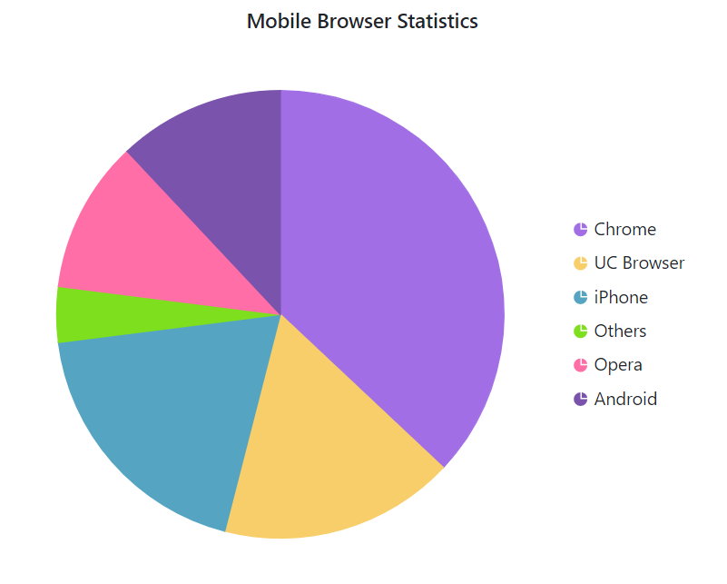
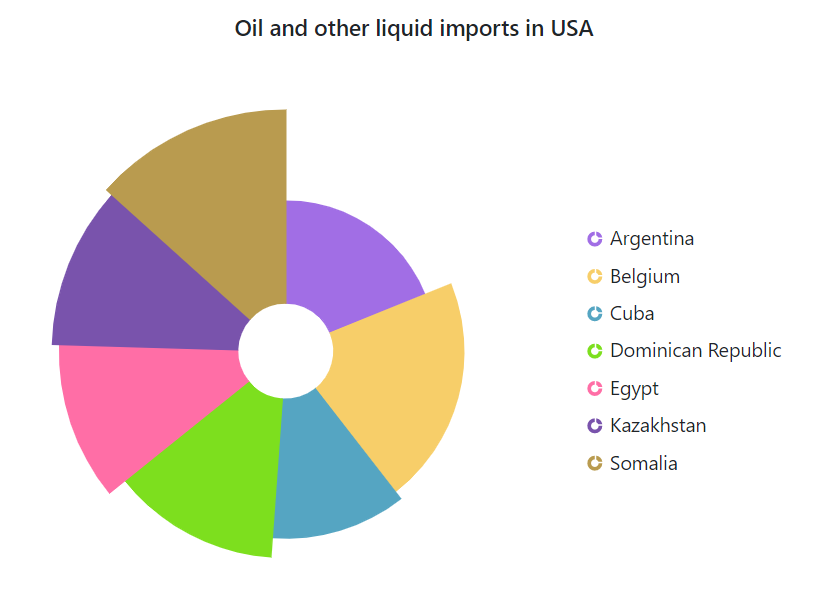
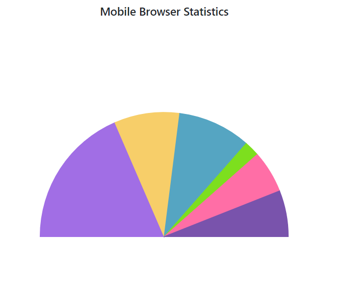
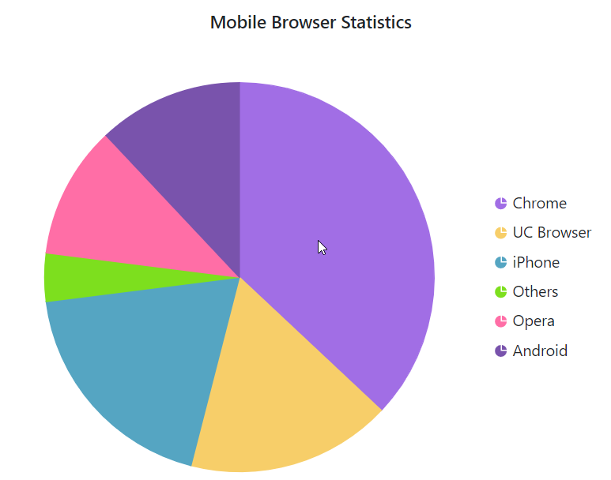

# Pie & Doughnut

## Pie Chart

The [`Pie Chart`](https://www.syncfusion.com/blazor-components/blazor-charts/chart-types/pie-chart) is used to represent numeric proportional data in divided slices. To render a [`Pie Chart`](https://help.syncfusion.com/cr/blazor/Syncfusion.Blazor.Charts.AccumulationType.html#Syncfusion_Blazor_Charts_AccumulationType_Pie), set the series [`Type`](https://help.syncfusion.com/cr/blazor/Syncfusion.Blazor.Charts.AccumulationChartSeries.html#Syncfusion_Blazor_Charts_AccumulationChartSeries_Type) as [`Pie`](https://help.syncfusion.com/cr/blazor/Syncfusion.Blazor.Charts.AccumulationType.html#Syncfusion_Blazor_Charts_AccumulationType_Pie).





## Radius Customization

The radius of the pie series will be set to 80% of its size (minimum of chart width and height) by default. The [`Radius`](https://help.syncfusion.com/cr/blazor/Syncfusion.Blazor.Charts.AccumulationChartSeries.html#Syncfusion_Blazor_Charts_AccumulationChartSeries_Radius) property of the series can be used to customize the radius of the pie chart.





## Pie Center

The center x and center y can be used to change the pie's center position. The pie series' center x and center y are set to 50% by default. The [`AccumulationChartCenter`](https://help.syncfusion.com/cr/blazor/Syncfusion.Blazor.Charts.AccumulationChartModel.html#Syncfusion_Blazor_Charts_AccumulationChartModel_Center) property of the series can be used to customize this.





## Various Radius Pie Chart

The [`Radius`](https://help.syncfusion.com/cr/blazor/Syncfusion.Blazor.Charts.AccumulationChartSeries.html#Syncfusion_Blazor_Charts_AccumulationChartSeries_Radius) mapping can be used to render the slice with different radius.





## Doughnut Chart

The doughnut chart can be created by setting the [`InnerRadius`](https://help.syncfusion.com/cr/blazor/Syncfusion.Blazor.Charts.AccumulationChartSeries.html#Syncfusion_Blazor_Charts_AccumulationChartSeries_InnerRadius) property of the [`Pie Chart`](https://help.syncfusion.com/cr/blazor/Syncfusion.Blazor.Charts.AccumulationType.html#Syncfusion_Blazor_Charts_AccumulationType_Pie) to a value ranging from 0% to 100%.





## Start and End angles

The [`StartAngle`](https://help.syncfusion.com/cr/blazor/Syncfusion.Blazor.Charts.AccumulationChartSeries.html#Syncfusion_Blazor_Charts_AccumulationChartSeries_StartAngle) and
[`EndAngle`](https://help.syncfusion.com/cr/blazor/Syncfusion.Blazor.Charts.AccumulationChartSeries.html#Syncfusion_Blazor_Charts_AccumulationChartSeries_EndAngle) properties can be used to customise the start and end angles of the pie series. StartAngle is set to 0 degrees by default, and EndAngle is set to 360 degrees by default. Semi-pie series can be achieved by customising these properties.





## Color and Text Mapping

[`PointColorMapping`](https://help.syncfusion.com/cr/blazor/Syncfusion.Blazor.Charts.AccumulationChartSeries.html#Syncfusion_Blazor_Charts_AccumulationChartSeries_PointColorMapping) in series and [`Name`](https://help.syncfusion.com/cr/blazor/Syncfusion.Blazor.Charts.AccumulationDataLabelSettings.html#Syncfusion_Blazor_Charts_AccumulationDataLabelSettings_Name) in datalabel can be used to map the fill colour and text from the data source to the chart.





## Hide pie or doughnut border

When the mouse hovers over the pie/doughnut chart, the border appears by default. The border can be turned off by setting the [`EnableBorderOnMouseMove`](https://help.syncfusion.com/cr/blazor/Syncfusion.Blazor.Charts.SfAccumulationChart.html#Syncfusion_Blazor_Charts_SfAccumulationChart_EnableBorderOnMouseMove) property to **false**.





> Refer to our [`Blazor Charts`](https://www.syncfusion.com/blazor-components/blazor-charts) feature tour page for its groundbreaking feature representations and also explore our [`Blazor Accumulation Chart Example`](https://blazor.syncfusion.com/demos/chart/pie?theme=bootstrap4) to know various features of accumulation charts and how it is used to represent numeric proportional data.

## See Also

* [Data label](../data-label/)
* [Grouping](../grouping/)