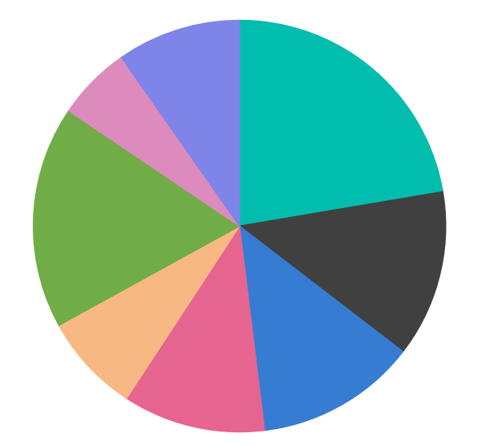
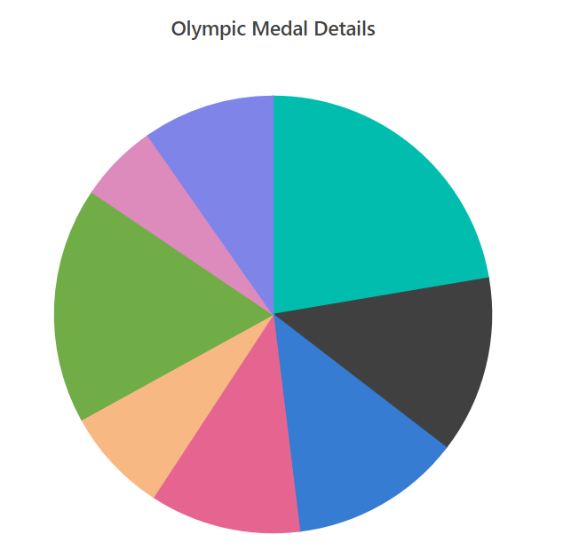
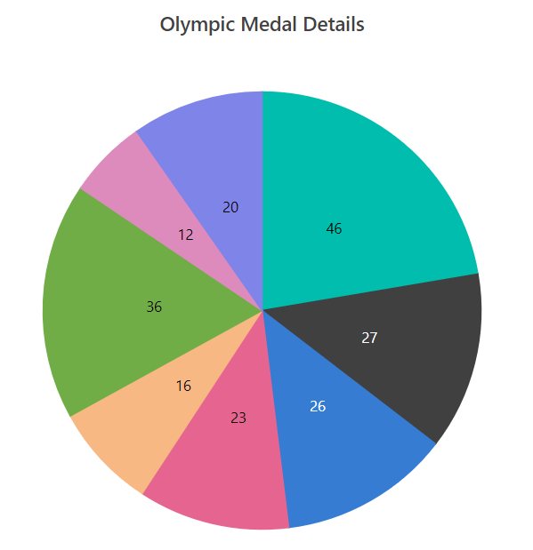
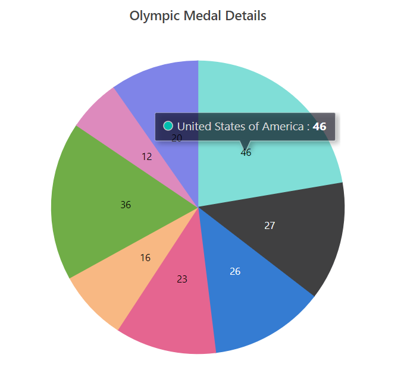
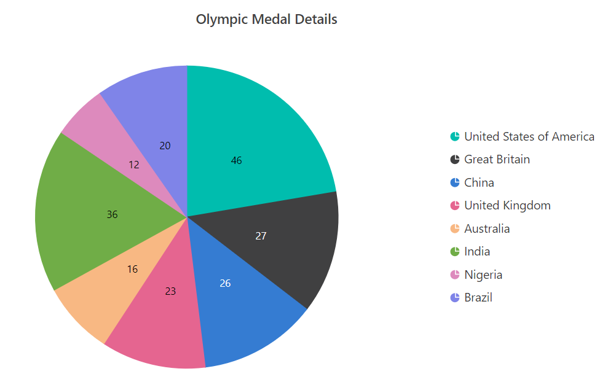

<!-- markdownlint-disable MD040 -->

# Blazor Accumulation Chart in Server Side App using Visual Studio

This section briefly explains about how to include a `Accumulation Chart` in your Blazor Server-Side application. You can refer [Getting Started with Syncfusion Blazor for Server-Side in Visual Studio 2019](https://blazor.syncfusion.com/documentation/getting-started/blazor-server-side-visual-studio-2019/) page for the introduction and configuring the common specifications.

## Importing Syncfusion Blazor component in the application

1. Install the **Syncfusion.Blazor**  NuGet package to the application by using the **NuGet Package Manager**.

2. You can add the client-side resources through CDN or from NuGet package in the **HEAD** element of the **~/Pages/_Host.cshtml** page. For Internet Explorer 11, kindly refer the polyfills. Refer the [documentation](https://blazor.syncfusion.com/documentation/common/how-to/render-blazor-server-app-in-ie/) for more information.

    ```html
    <head>
        <environment include="Development">
        ....
        ....
        <script src="https://github.com/Daddoon/Blazor.Polyfill/releases/download/3.0.1/blazor.polyfill.min.js"></script>
        </environment>
    </head>
    ```

3. Now add the lodash script to the **HEAD** element of the **/Pages/Host.cshtml** page, since we have used it in our [chart interactive]([https://www.syncfusion.com/blazor-components/blazor-charts/interactive-chart]) features. The absence of the script will result in console errors.

    ```html
    <head>
    <environment include="Development">
        ....
        ....
        <script src="https://github.com/Daddoon/Blazor.Polyfill/releases/download/3.0.1/blazor.polyfill.min.js"></script>
        <script src="https://cdnjs.cloudflare.com/ajax/libs/lodash.js/4.17.20/lodash.min.js"></script>
    </environment>
    </head>
    ```

## Adding component package to the application

Open `**~/_Imports.razor` file and include the `Syncfusion.Blazor.**` namespaces.

```cshtml 
@using Syncfusion.Blazor
@using Syncfusion.Blazor.Charts
```

## Add SyncfusionBlazor service in Startup.cs

Open the **Startup.cs** file and add services required by Syncfusion components using **service.AddSyncfusionBlazor()** method. Add this method in the **ConfigureServices** function as follows.

```c# 
using Syncfusion.Blazor;
namespace BlazorApplication
{
    public class Startup
    {
        ....
        ....
        public void ConfigureServices(IServiceCollection services)
        {
            ....
            ....
            services.AddSyncfusionBlazor();
        }
    }
}
```

During initial loading, we collect and send individual character size information in-order to render the chart. To avoid any disconnection, increase the buffer size to 64 KB or more over the SignalR connection.

```c# 
using Syncfusion.Blazor;
namespace BlazorApplication
{
    public class Startup
    {
        ....
        ....
        public void ConfigureServices(IServiceCollection services)
        {
            ....
            ....
            services.AddSyncfusionBlazor();
            services.AddSignalR(e => {
              e.MaximumReceiveMessageSize = 65536;
            });
        }
    }
}
```

> Use the following configuration to host your Blazor server application on **Azure SignalR**.

```c#
using Syncfusion.Blazor;
namespace BlazorApplication
{
    public class Startup
    {
        ....
        ....
        public void ConfigureServices(IServiceCollection services)
        {
            ....
            ....
            services.AddSyncfusionBlazor();
            services.AddSignalR(e => {e.MaximumReceiveMessageSize = 65536;}).AddAzureSignalR();
        }
    }
}
```

## Add Accumulation Chart

To initialize the accumulation chart component add the below code to your **Index.razor** view page under **~/Pages** folder. In a new application, if **Index.razor** page has any default content template, then those content can be completely removed and following code can be added.

```cshtml 
@page "/"
@using Syncfusion.Blazor.Charts
<SfAccumulationChart>
    <AccumulationChartSeriesCollection>
        <AccumulationChartSeries DataSource="@MedalDetails" XName="Country" YName="Medals">
        </AccumulationChartSeries>
    </AccumulationChartSeriesCollection>
</SfAccumulationChart>

@code{
    public class ChartData
    {
        public string Country { get; set;}
        public double Medals { get; set;}
    }

    public List<ChartData> MedalDetails = new List<ChartData>
    {
        new ChartData { Country= "United States of America", Medals= 46 },
        new ChartData { Country= "Great Britain", Medals= 27 },
        new ChartData { Country= "China", Medals= 26 },
        new ChartData { Country= "United Kingdom", Medals= 23 },
        new ChartData { Country= "Australia", Medals= 16 },
        new ChartData { Country= "India", Medals= 36 },
        new ChartData { Country= "Nigeria", Medals= 12 },
        new ChartData { Country= "Brazil", Medals= 20 },
     };
}
```

On successful compilation of your application, the Syncfusion Blazor Accumulation Chart component will render in the web browser.



## Add Title

Using the [Title](https://help.syncfusion.com/cr/blazor/Syncfusion.Blazor.Charts.SfAccumulationChart.html#Syncfusion_Blazor_Charts_SfAccumulationChart_Title) property, you can add a title to the accumulation chart to provide the user with quick information about the data plotted in the chart.

```cshtml 
@page "/"
@using Syncfusion.Blazor.Charts

<SfAccumulationChart Title="Olympic Medal Details">
    <AccumulationChartSeriesCollection>
        <AccumulationChartSeries DataSource="@MedalDetails" XName="Country" YName="Medals">
        </AccumulationChartSeries>
    </AccumulationChartSeriesCollection>
</SfAccumulationChart>
@code{
    public class ChartData
    {
        public string Country { get; set; }
        public double Medals { get; set; }
    }

    public List<ChartData> MedalDetails = new List<ChartData>
    {
        new ChartData { Country= "United States of America", Medals= 46 },
        new ChartData { Country= "Great Britain", Medals= 27 },
        new ChartData { Country= "China", Medals= 26 },
        new ChartData { Country= "United Kingdom", Medals= 23 },
        new ChartData { Country= "Australia", Medals= 16 },
        new ChartData { Country= "India", Medals= 36 },
        new ChartData { Country= "Nigeria", Medals= 12 },
        new ChartData { Country= "Brazil", Medals= 20 },
     };
}
```



## Add Data Label

You can add data labels to improve the readability of the accumulation chart. This can be achieved by setting the [Visible](https://help.syncfusion.com/cr/blazor/Syncfusion.Blazor.Charts.AccumulationDataLabelSettings.html#Syncfusion_Blazor_Charts_AccumulationDataLabelSettings_Visible) property to **true** in the [AccumulationDataLabelSettings](https://help.syncfusion.com/cr/blazor/Syncfusion.Blazor.Charts.AccumulationDataLabelSettings.html).

```cshtml 
@page "/"
@using Syncfusion.Blazor.Charts

<SfAccumulationChart Title="Olympic Medal Details">
    <AccumulationChartSeriesCollection>
        <AccumulationChartSeries DataSource="@MedalDetails" XName="Country" YName="Medals">
            <AccumulationDataLabelSettings Visible="true"/>
        </AccumulationChartSeries>
    </AccumulationChartSeriesCollection>
</SfAccumulationChart>

@code{
    public class ChartData
    {
        public string Country { get; set; }
        public double Medals { get; set; }
    }

    public List<ChartData> MedalDetails = new List<ChartData>
    {
        new ChartData { Country= "United States of America", Medals= 46 },
        new ChartData { Country= "Great Britain", Medals= 27 },
        new ChartData { Country= "China", Medals= 26 },
        new ChartData { Country= "United Kingdom", Medals= 23 },
        new ChartData { Country= "Australia", Medals= 16 },
        new ChartData { Country= "India", Medals= 36 },
        new ChartData { Country= "Nigeria", Medals= 12 },
        new ChartData { Country= "Brazil", Medals= 20 },
     };
}
```



## Enable Tooltip

When space constraints prevent you from displaying information using data labels, the tooltip comes in handy. The tooltip can be enabled by setting the [Enable](https://help.syncfusion.com/cr/blazor/Syncfusion.Blazor.Charts.AccumulationChartTooltipSettings.html#Syncfusion_Blazor_Charts_AccumulationChartTooltipSettings_Enable) property in [AccumulationChartTooltipSettings](https://help.syncfusion.com/cr/blazor/Syncfusion.Blazor.Charts.AccumulationChartTooltipSettings.html) to **true**.

```cshtml 
@page "/"
@using Syncfusion.Blazor.Charts

<SfAccumulationChart Title="Olympic Medal Details">
    <AccumulationChartSeriesCollection>
        <AccumulationChartSeries DataSource="@MedalDetails" XName="Country" YName="Medals">
        </AccumulationChartSeries>
    </AccumulationChartSeriesCollection>
    <AccumulationChartTooltipSettings Enable="true"></AccumulationChartTooltipSettings>
</SfAccumulationChart>

@code{
    public class ChartData
    {
        public string Country { get; set;}
        public double Medals {get; set;}
    }

    public List<ChartData> MedalDetails = new List<ChartData>
    {
        new ChartData { Country= "United States of America", Medals= 46 },
        new ChartData { Country= "Great Britain", Medals= 27 },
        new ChartData { Country= "China", Medals= 26 },
        new ChartData { Country= "United Kingdom", Medals= 23 },
        new ChartData { Country= "Australia", Medals= 16 },
        new ChartData { Country= "India", Medals= 36 },
        new ChartData { Country= "Nigeria", Medals= 12 },
        new ChartData { Country= "Brazil", Medals= 20 },
     };
}
```



## Enable Legend

You can use legend for the accumulation chart by setting the [Visible](https://help.syncfusion.com/cr/blazor/Syncfusion.Blazor.Charts.AccumulationChartLegendSettings.html#Syncfusion_Blazor_Charts_AccumulationChartLegendSettings_Visible) property to **true** in [AccumulationChartLegendSettings](https://help.syncfusion.com/cr/blazor/Syncfusion.Blazor.Charts.AccumulationChartLegendSettings.html).

```cshtml 
 @page "/"
 @using Syncfusion.Blazor.Charts

 <SfAccumulationChart Title="Olympic Medal Details">
        <AccumulationChartSeriesCollection>
            <AccumulationChartSeries DataSource="@MedalDetails" XName="Country" YName="Medals">
                <AccumulationDataLabelSettings Visible="true"></AccumulationDataLabelSettings>
            </AccumulationChartSeries>
        </AccumulationChartSeriesCollection>
        <AccumulationChartTooltipSettings Enable="true"></AccumulationChartTooltipSettings>
        <AccumulationChartLegendSettings Visible="true"></AccumulationChartLegendSettings>
    </SfAccumulationChart>

@code{
    public class ChartData
    {
        public string Country { get; set;}
        public double Medals { get; set;}
    }
    
    public List<ChartData> MedalDetails = new List<ChartData>
    {
        new ChartData { Country= "United States of America", Medals= 46 },
        new ChartData { Country= "Great Britain", Medals= 27 },
        new ChartData { Country= "China", Medals= 26 },
        new ChartData { Country= "United Kingdom", Medals= 23 },
        new ChartData { Country= "Australia", Medals= 16 },
        new ChartData { Country= "India", Medals= 36 },
        new ChartData { Country= "Nigeria", Medals= 12 },
        new ChartData { Country= "Brazil", Medals= 20 },
     };
}
```



> You can find the fully working sample for accumulation chart [here](https://www.syncfusion.com/downloads/support/directtrac/general/ze/BlazorDocApp2124811315.zip).

## See also

* [Getting Started with Syncfusion Blazor for Client-Side in .NET Core CLI](https://blazor.syncfusion.com/documentation/getting-started/blazor-webassembly-dotnet-cli/)
* [Getting Started with Syncfusion Blazor for Server-Side in Visual Studio 2019 Preview](https://blazor.syncfusion.com/documentation/getting-started/blazor-server-side-visual-studio-2019/?no-cache=1)
* [Getting Started with Syncfusion Blazor for Server-Side in .NET Core CLI](https://blazor.syncfusion.com/documentation/getting-started/blazor-server-side-dotnet-cli/)