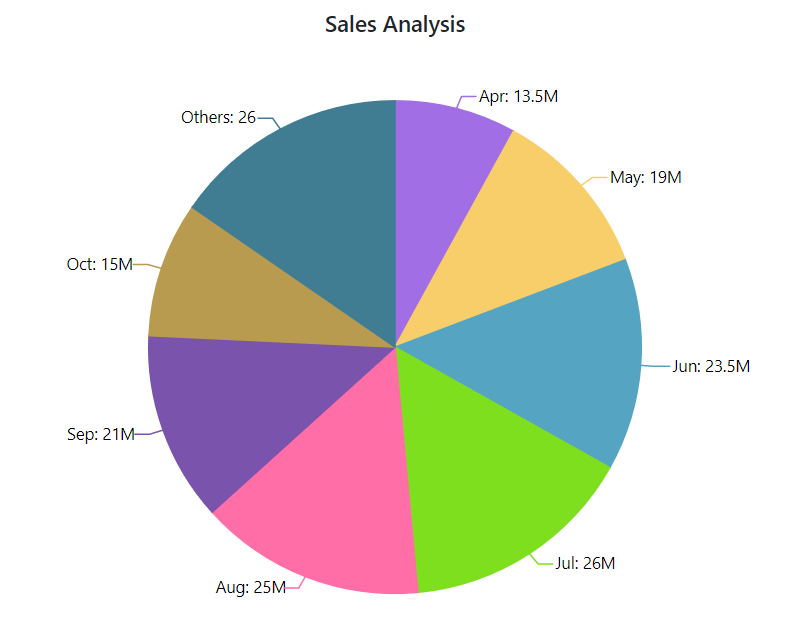
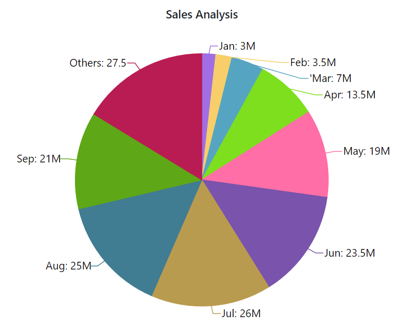

<!-- markdownlint-disable MD036 -->

# Grouping

You can club/group few points of the series based on
[`GroupTo`](https://help.syncfusion.com/cr/blazor/Syncfusion.Blazor.Charts.AccumulationChartSeries.html#Syncfusion_Blazor_Charts_AccumulationChartSeries_GroupTo)
property. For example, if the group to value is 11, then the points with value less than 11 is grouped together and will be showed as a single point with label `others`. The property also takes value in percentage
(percentage of total data points value).



@using Syncfusion.Blazor.Charts
<SfAccumulationChart Title="RIO Olympics Gold" EnableSmartLabels="true">
    <AccumulationChartLegendSettings Visible="false"></AccumulationChartLegendSettings>

    <AccumulationChartSeriesCollection>
        <AccumulationChartSeries DataSource="@DataSource" XName="XValue" YName="YValue" Name="RIO" GroupTo="10">
            <AccumulationDataLabelSettings Visible="true" Name="Text" Position="AccumulationLabelPosition.Outside">
            </AccumulationDataLabelSettings>
        </AccumulationChartSeries>
    </AccumulationChartSeriesCollection>
</SfAccumulationChart>

@code{
    public class ChartData
    {
        public string XValue { get; set; }
        public double YValue { get; set; }
        public string Text { get; set; }
    }

    public List<ChartData> DataSource = new List<ChartData>
{
       new ChartData { XValue = "Jan", YValue = 3, Text= "Jan: 3" },
       new ChartData { XValue = "Feb", YValue = 3.5, Text= "Feb: 3.5" },
       new ChartData { XValue = "Mar", YValue = 7, Text= "'Mar: 7" },
       new ChartData { XValue = "Apr", YValue = 13.5, Text= "Apr: 13.5" },
       new ChartData { XValue = "May", YValue = 19, Text= "May: 19" },
       new ChartData { XValue = "Jun", YValue = 23.5, Text= "Jun: 23.5" },
       new ChartData { XValue = "Jul", YValue = 26, Text= "Jul: 26" },
       new ChartData { XValue = "Aug", YValue = 25, Text= "Aug: 25" },
       new ChartData { XValue = "Sep", YValue = 21, Text= "Sep: 21" },
       new ChartData { XValue = "Oct", YValue = 15, Text= "Oct: 15" },
       new ChartData { XValue = "Nov", YValue = 9, Text= "Nov: 9" },
       new ChartData { XValue = "Dec", YValue = 3.5, Text= "Dec: 3.5" }
   };
}



## Pie Grouping

**Broken Slice**

You can visualize all points grouped together by clicking on the group. For example, if 5 points are grouped together it will be showed as a single slice with label `others` and when we click on `others` it will get explode and broken into 5 seperate slices.



@using Syncfusion.Blazor.Charts
<SfAccumulationChart Title="Mobile Browser Statistics" EnableSmartLabels="true">
    <AccumulationChartTooltipSettings Enable="true"></AccumulationChartTooltipSettings>

    <AccumulationChartLegendSettings Visible="false"></AccumulationChartLegendSettings>

    <AccumulationChartSeriesCollection>
        <AccumulationChartSeries DataSource="@StatisticsDetails" XName="Browser" YName="Users" Name="RIO" GroupTo="10">
            <AccumulationDataLabelSettings Visible="true" Name="Text" Position="AccumulationLabelPosition.Outside">
                <AccumulationChartConnector Type="ConnectorType.Line" Length="5%"></AccumulationChartConnector>
                <AccumulationChartDataLabelFont Size="14px"></AccumulationChartDataLabelFont>
            </AccumulationDataLabelSettings>
        </AccumulationChartSeries>
    </AccumulationChartSeriesCollection>
</SfAccumulationChart>

@code{
    public class Statistics
    {
        public string Browser { get; set; }
        public double Users { get; set; }

    }

    public List<Statistics> StatisticsDetails = new List<Statistics>
{
        new Statistics { Browser = "Chrome", Users = 37 },
        new Statistics { Browser = "UC Browser", Users = 17 },
        new Statistics { Browser = "iPhone", Users = 19 },
        new Statistics { Browser = "Others", Users = 4  },
        new Statistics { Browser = "Opera", Users = 11 },
        new Statistics { Browser = "Android", Users = 12 },
   };

}



**Group Mode**

Slice can also be grouped based on number of points by specifying the [`GroupMode`](https://help.syncfusion.com/cr/blazor/Syncfusion.Blazor.Charts.AccumulationChartSeries.html#Syncfusion_Blazor_Charts_AccumulationChartSeries_GroupMode)
to Point. For example, if the group to value is 11,  chart will show 1st 11 points and will group remaining entries from the collection as a single point.



@using Syncfusion.Blazor.Charts
<SfAccumulationChart Title="Mobile Browser Statistics" EnableSmartLabels="true">
    <AccumulationChartTooltipSettings Enable="true"></AccumulationChartTooltipSettings>

    <AccumulationChartLegendSettings Visible="false"></AccumulationChartLegendSettings>

    <AccumulationChartSeriesCollection>
        <AccumulationChartSeries DataSource="@StatisticsDetails" XName="Browser" YName="Users" Name="RIO" GroupTo="10" GroupMode=GroupMode.Point>
            <AccumulationDataLabelSettings Visible="true" Name="Text" Position="AccumulationLabelPosition.Outside">
                <AccumulationChartConnector Type="ConnectorType.Line" Length="5%"></AccumulationChartConnector>
                <AccumulationChartDataLabelFont Size="14px"></AccumulationChartDataLabelFont>
            </AccumulationDataLabelSettings>
        </AccumulationChartSeries>
    </AccumulationChartSeriesCollection>
</SfAccumulationChart>
@code{
    public class Statistics
    {
        public string Browser { get; set; }
        public double Users { get; set; }

    }

    public List<Statistics> StatisticsDetails = new List<Statistics>
{
        new Statistics { Browser = "Chrome", Users = 37 },
        new Statistics { Browser = "UC Browser", Users = 17 },
        new Statistics { Browser = "iPhone", Users = 19 },
        new Statistics { Browser = "Others", Users = 4  },
        new Statistics { Browser = "Opera", Users = 11 },
        new Statistics { Browser = "Android", Users = 12 },
   };

}



