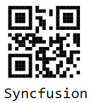
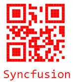
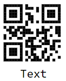

# QR Code generator in Blazor Barcode Component

## QR Code

A QR Code is a two-dimensional barcode that consists of a grid of dark and light dots or blocks that form a square. The data encoded in the barcode can be numeric, alphanumeric, or Shift Japanese Industrial Standards (JIS8) characters. The QR Code uses version from 1 to 40. Version 1 measures 21 modules x 21 modules, Version 2 measures 25 modules x 25 modules, and so on. The number of modules increases in steps of 4 modules per side up to Version 40 that measures 177 modules x 177 modules. Each version has its own capacity. By default, the barcode control automatically set the version according to the length of the input text. The QR Barcodes are designed for industrial uses and also commonly used in consumer advertising.

```cshtml
@using Syncfusion.Blazor.BarcodeGenerator

<SfQRCodeGenerator Width="200px" Height="150px"  Value="Syncfusion"></SfQRCodeGenerator>

```



## Customizing the Barcode color

A page or printed media with barcode often appears colorful in the background and surrounding region with other contents. In such cases the barcode can also be customized to suit the needs. You can achieve this by using for [ForeColor](https://help.syncfusion.com/cr/blazor/Syncfusion.Blazor.BarcodeGenerator.SfQRCodeGenerator.html#Syncfusion_Blazor_BarcodeGenerator_SfQRCodeGenerator_ForeColor) property .

```cshtml
@using Syncfusion.Blazor.BarcodeGenerator

<SfQRCodeGenerator Width="200px" Height="150px" ForeColor="red" Value="Syncfusion"></SfQRCodeGenerator>

```



## Customizing the Barcode dimension

The dimension of the barcode can be changed using the [Height](https://help.syncfusion.com/cr/blazor/Syncfusion.Blazor.BarcodeGenerator.SfQRCodeGenerator.html#Syncfusion_Blazor_BarcodeGenerator_SfQRCodeGenerator_Height) and [Width](https://help.syncfusion.com/cr/blazor/Syncfusion.Blazor.BarcodeGenerator.SfQRCodeGenerator.html#Syncfusion_Blazor_BarcodeGenerator_SfQRCodeGenerator_Width) properties of the barcodegenerator.

```cshtml
@using Syncfusion.Blazor.BarcodeGenerator

<SfQRCodeGenerator Width="200px" Height="150px"  Value="Syncfusion"></SfQRCodeGenerator>

```

## Customizing the text

In barcode generators You can customize the barcode text by using display [Text](https://help.syncfusion.com/cr/blazor/Syncfusion.Blazor.BarcodeGenerator.QRCodeGeneratorDisplayText.html#Syncfusion_Blazor_BarcodeGenerator_QRCodeGeneratorDisplayText_Text) property .

```cshtml
@using Syncfusion.Blazor.BarcodeGenerator

<SfQRCodeGenerator Width="200px" Height="150px" Value="Syncfusion">
    <QRCodeGeneratorDisplayText text="Text" ></QRCodeGeneratorDisplayText>
</SfQRCodeGenerator>

```



## Event

`OnValidationFailed` event in the `SfQRCodeGenerator` is used to trigger when the input is an invalid string.

```cshtml
@using Syncfusion.Blazor.BarcodeGenerator

<SfQRCodeGenerator Width="200px" Height="150px" Value="Syncfusion" OnValidationFailed="@OnValidationFailed"></SfQRCodeGenerator>

@code 
{ 
    public void OnValidationFailed(ValidationFailedEventArgs args)
    {
    }
}

```