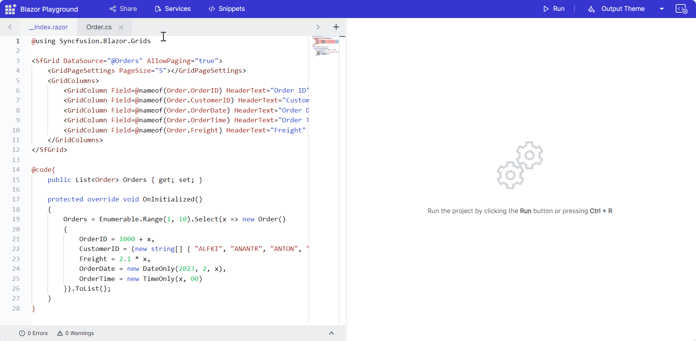

# Adding and Removing Child components

This section briefly explains about the adding and removing of child components:

1. To create a child component, you can click the "+" button in the Blazor playground. This will add a new component to the project. You can then type the name for the child component in the input box.

Add the code in the child component.

```cshtml

Password:
<input @oninput="OnPasswordChanged"
       required
       type="@(_showPassword ? "text" : "password")"
       value="@Password" />
<button class="btn btn-primary" @onclick="ToggleShowPassword">
    Show password
</button>
@code {
    private bool _showPassword;
    [Parameter]
    public string Password { get; set; }
    [Parameter]
    public EventCallback<string> PasswordChanged { get; set; }

    private Task OnPasswordChanged(ChangeEventArgs e)
    {
        Password = e.Value.ToString();

        return PasswordChanged.InvokeAsync(Password);
    }
    private void ToggleShowPassword()
    {
        _showPassword = !_showPassword;
    }
}

```

2. The __Index.razor file is the main file for the Blazor playground application. To view the outcome of the child component, you should refer the child component in the __Index.razor file and press run button to execute the code.

```cshtml

<h1>Parent Component</h1>

<ChildComponent @bind-Password="_password" />

@code {
    private string _password;
}

```

3. To remove a child component, you can simply click the delete icon. This will remove the component from the Blazor playground.

N> After deleting a child component from the Blazor playground, the references to the component will not be removed from the index.razor file. This is because the index.razor file is a static file that is not updated when you delete a child component from the Blazor playground.


4. You can generate multiple components simultaneously according to your specific needs.

# How to add/remove classes

1. To generate a class file, click on the "+" icon and input the desired class name. The system will create the class file, setting up the required using statements, namespace, and class name according to your input. 

```csharp

using System;
using System.Text;
using System.Linq;
using System.Threading.Tasks;
using System.Collections.Generic;

namespace Playground.User
{
    public class Order {
        public int? OrderID { get; set; }
        public string CustomerID { get; set; }
        public DateOnly? OrderDate { get; set; }
        public TimeOnly? OrderTime { get; set; }
        public double? Freight { get; set; }
    }
}

```


2. Then, reference this class as required within your codebase.


```csharp
@using Syncfusion.Blazor.Grids

<SfGrid DataSource="@Orders" AllowPaging="true">
    <GridPageSettings PageSize="5"></GridPageSettings>
    <GridColumns>
        <GridColumn Field=@nameof(Order.OrderID) HeaderText="Order ID" TextAlign="TextAlign.Right" Width="120"></GridColumn>
        <GridColumn Field=@nameof(Order.CustomerID) HeaderText="Customer Name" Width="150"></GridColumn>
        <GridColumn Field=@nameof(Order.OrderDate) HeaderText="Order Date" Format="d" Type="ColumnType.DateOnly" TextAlign="TextAlign.Right" Width="130"></GridColumn>
        <GridColumn Field=@nameof(Order.OrderTime) HeaderText="Order Time" Type="ColumnType.TimeOnly" TextAlign="TextAlign.Right" Width="130"></GridColumn>
        <GridColumn Field=@nameof(Order.Freight) HeaderText="Freight" Format="C2" TextAlign="TextAlign.Right" Width="120"></GridColumn>
    </GridColumns>
</SfGrid>

@code{
    public List<Order> Orders { get; set; }

    protected override void OnInitialized()
    {
        Orders = Enumerable.Range(1, 10).Select(x => new Order()
        {
            OrderID = 1000 + x,
            CustomerID = (new string[] { "ALFKI", "ANANTR", "ANTON", "BLONP", "BOLID" })[new Random().Next(5)],
            Freight = 2.1 * x,
            OrderDate = new DateOnly(2023, 2, x),
            OrderTime = new TimeOnly(x, 00)
        }).ToList();
    }
}

```

To remove a class file, click the delete icon corresponding to the specific component.

N>Remember to include the ".cs" extension; otherwise, the file will be generated as a razor file.


