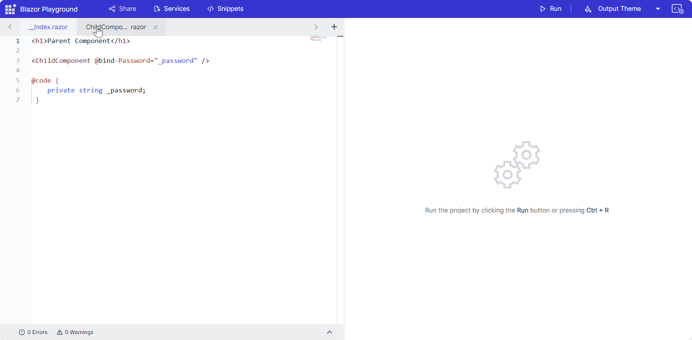

# Working with components in Blazor Playground

## Adding a child component

1. Click the "+" button to add a new component.
2. Name the component in the input box.
3. Add the corresponding code within the child component file (e.g., .razor).

For example, ChildComponent.razor
```cshtml
<input @oninput="OnPasswordChanged"
       required
       type="@(_showPassword ? "text" : "password")"
       value="@Password" />
<button class="btn btn-primary" @onclick="ToggleShowPassword">
    Show password
</button>
@code {
    private bool _showPassword;
    [Parameter]
    public string Password { get; set; }
    [Parameter]
    public EventCallback<string> PasswordChanged { get; set; }

    private Task OnPasswordChanged(ChangeEventArgs e)
    {
        Password = e.Value.ToString();

        return PasswordChanged.InvokeAsync(Password);
    }
    private void ToggleShowPassword()
    {
        _showPassword = !_showPassword;
    }
}
```
4. The __Index.razor file is the main file for the Blazor playground application. To view the outcome of the child component, refer the child component in the __Index.razor file.

```cshtml
<h1>Parent Component</h1>

<ChildComponent @bind-Password="_password" />

@code {
    private string _password;
}
```
5. Press the "Run" button to execute the code and see the component rendered.



## Removing a child component:

Click the delete icon next to the child component in the Playground.

N>The Playground doesn't automatically remove references from __Index.razor. Manually update the file to reflect the deletion.

