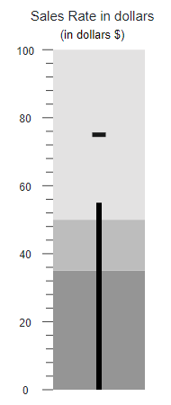

---
title: "Customization in the Blazor Bullet Chart component | Syncfusion"

component: "Bullet Chart"

description: "Learn here all about the customization of Syncfusion Bullet Chart (SfBulletChart) component and more."
---

# Customization in the Blazor Bullet Chart (SfBulletChart)

## Orientation

The Bullet Chart can be rendered in different orientations such as [`Horizontal`](https://help.syncfusion.com/cr/blazor/Syncfusion.Blazor.Charts.OrientationType.html#Syncfusion_Blazor_Charts_OrientationType_Horizontal) or [`Vertical`](https://help.syncfusion.com/cr/blazor/Syncfusion.Blazor.Charts.OrientationType.html#Syncfusion_Blazor_Charts_OrientationType_Vertical) via the [`Orientation`](https://help.syncfusion.com/cr/blazor/Syncfusion.Blazor.Charts.SfBulletChart-1.html#Syncfusion_Blazor_Charts_SfBulletChart_1_Orientation) property. By default, the Bullet Chart is rendered in the [`Horizontal`](https://help.syncfusion.com/cr/blazor/Syncfusion.Blazor.Charts.OrientationType.html#Syncfusion_Blazor_Charts_OrientationType_Horizontal) orientation.

```csharp
@using Syncfusion.Blazor.Charts

<SfBulletChart DataSource="@BulletChartData" Orientation="OrientationType.Vertical" Width="20%" Title="Sales Rate in dollars" Subtitle="(in dollars $)" ValueField="FieldValue" TargetField="TargetValue" Minimum="0" Maximum="100" Interval="20">
    <BulletChartRangeCollection>
        <BulletChartRange End=35></BulletChartRange>
        <BulletChartRange End=50></BulletChartRange>
        <BulletChartRange End=100></BulletChartRange>
    </BulletChartRangeCollection>
</SfBulletChart>

@code{
    public class ChartData
    {
        public double FieldValue { get; set; }
        public double TargetValue { get; set; }
    }
    public List<ChartData> BulletChartData = new List<ChartData>
    {
        new ChartData { FieldValue = 55, TargetValue = 75 }
    };
}
```



## Right-to-left (RTL)

The Bullet Chart supports the right-to-left rendering that can be enabled by setting the [`EnableRtl`](https://help.syncfusion.com/cr/blazor/Syncfusion.Blazor.Charts.SfBulletChart-1.html#Syncfusion_Blazor_Charts_SfBulletChart_1_EnableRtl) property to **true**.

```csharp
<SfBulletChart DataSource="@BulletChartData" EnableRtl="true" ValueField="FieldValue" TargetField="TargetValue" Minimum="0" Maximum="100" Interval="20">
    <BulletChartRangeCollection>
        <BulletChartRange End=35></BulletChartRange>
        <BulletChartRange End=50></BulletChartRange>
        <BulletChartRange End=100></BulletChartRange>
    </BulletChartRangeCollection>
</SfBulletChart>
```

> Refer to the [code block](#orientation) to know about the property value of **BulletChartData**.


## Animation

The actual and the target bar supports the linear animation via the [`BulletChartAnimation`](https://help.syncfusion.com/cr/blazor/Syncfusion.Blazor.Charts.BulletChartAnimation.html) setting. The speed and the delay are controlled using the [`Duration`](https://help.syncfusion.com/cr/blazor/Syncfusion.Blazor.Charts.BulletChartAnimation.html#Syncfusion_Blazor_Charts_BulletChartAnimation_Duration) and the [`Delay`](https://help.syncfusion.com/cr/blazor/Syncfusion.Blazor.Charts.BulletChartAnimation.html#Syncfusion_Blazor_Charts_BulletChartAnimation_Delay) properties respectively.

```csharp
@using Syncfusion.Blazor.Charts

<SfBulletChart DataSource="@BulletChartData" ValueField="FieldValue" TargetField="TargetValue" Minimum="0" Maximum="100" Interval="20">
    <BulletChartAnimation Delay="0" Duration="2000"></BulletChartAnimation>
    <BulletChartRangeCollection>
        <BulletChartRange End=35></BulletChartRange>
        <BulletChartRange End=50></BulletChartRange>
        <BulletChartRange End=100></BulletChartRange>
    </BulletChartRangeCollection>
</SfBulletChart>
```

> Refer to the [code block](#orientation) to know about the property value of **BulletChartData**.

## Theme

The Bullet Chart supports different type of themes via the [`Theme`](https://help.syncfusion.com/cr/blazor/Syncfusion.Blazor.Charts.SfBulletChart-1.html#Syncfusion_Blazor_Charts_SfBulletChart_1_Theme) property.

```csharp
@using Syncfusion.Blazor.Charts
@using Syncfusion.Blazor

<SfBulletChart DataSource="@BulletChartData" Theme="Theme.HighContrast" ValueField="FieldValue" TargetField="TargetValue" Minimum="0" Maximum="100" Interval="20">
    <BulletChartRangeCollection>
        <BulletChartRange End=35></BulletChartRange>
        <BulletChartRange End=50></BulletChartRange>
        <BulletChartRange End=100></BulletChartRange>
    </BulletChartRangeCollection>
</SfBulletChart>
```

> Refer to the [code block](#orientation) to know about the property value of **BulletChartData**.


## Border

The Bullet Chart border color can be enabled by setting the [`Color`](https://help.syncfusion.com/cr/blazor/Syncfusion.Blazor.Charts.BulletChartCommonBorder.html#Syncfusion_Blazor_Charts_BulletChartCommonBorder_Color) property in the [`BulletChartBorder`](https://help.syncfusion.com/cr/blazor/Syncfusion.Blazor.Charts.SfBulletChart-1.html#Syncfusion_Blazor_Charts_SfBulletChart_1_Theme), and the width of the border can be customized using the [`Width`](https://help.syncfusion.com/cr/blazor/Syncfusion.Blazor.Charts.BulletChartCommonBorder.html#Syncfusion_Blazor_Charts_BulletChartCommonBorder_Width) property.

```csharp
@using Syncfusion.Blazor.Charts

<SfBulletChart DataSource="@BulletChartData" Height="150px" Title="Sales Rate in dollars" Subtitle="(in dollars $)" ValueField="FieldValue" TargetField="TargetValue" Minimum="0" Maximum="100" Interval="20">
    <BulletChartBorder Color="red" Width="2"></BulletChartBorder>
    <BulletChartRangeCollection>
        <BulletChartRange End=35> </BulletChartRange>
        <BulletChartRange End=50></BulletChartRange>
        <BulletChartRange End=100></BulletChartRange>
    </BulletChartRangeCollection>
</SfBulletChart>
```

> Refer to the [code block](#orientation) to know about the property value of **BulletChartData**.


