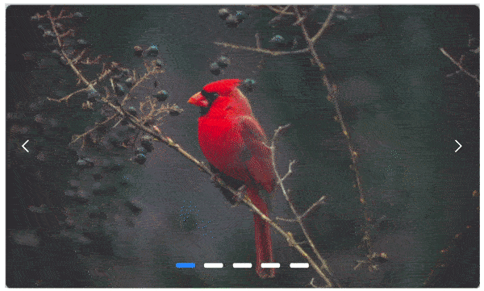
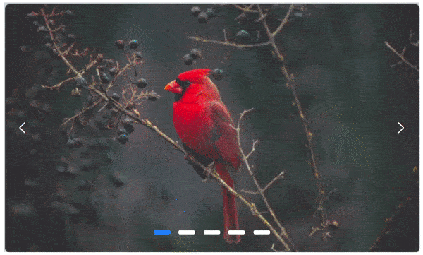
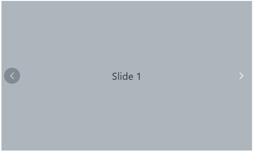

# Animations and Transitions with Blazor Carousel Component

## Animations

### Fade animation

In Carousel, two built-in animations are provided for slide transitions. You can disable animation using the [AnimationEffect](https://help.syncfusion.com/cr/blazor/Syncfusion.Blazor.Navigations.SfCarousel.html#Syncfusion_Blazor_Navigations_SfCarousel_AnimationEffect) property. By default, `Slide` animation is applied for the transition between slides.

The following demo depicts the example for `Fade` animation,

```cshtml
@using Syncfusion.Blazor.Navigations

<div class="control-container">
    <SfCarousel AnimationEffect="CarouselAnimationEffect.Fade">
        <CarouselItem>
            <figure class="img-container"><figcaption class="img-caption">Cardinal</figcaption></figure>
        </CarouselItem>
        <CarouselItem>
            <figure class="img-container"><figcaption class="img-caption">Kingfisher</figcaption></figure>
        </CarouselItem>
        <CarouselItem>
            <figure class="img-container"><figcaption class="img-caption">Keel-billed-toucan</figcaption></figure>
        </CarouselItem>
        <CarouselItem>
            <figure class="img-container"><figcaption class="img-caption">Yellow-warbler</figcaption></figure>
        </CarouselItem>
        <CarouselItem>
           <figure class="img-container"><figcaption class="img-caption">Bee-eater</figcaption></figure>
        </CarouselItem>
    </SfCarousel>
</div>

<style>
    .control-container {
        height: 300px;
        margin: 0 auto;
        width: 500px;
    }

    .img-container {
        height: 100%;
        margin: 0;
    }

    .img-caption {
        color: #fff;
        font-size: 1rem;
        position: absolute;
        bottom: 3rem;
        width: 100%;
        text-align: center;
    }

</style>
```



### Custom animation

In Carousel, you can use customized animation effects for slide transitions using the [`Custom`](https://help.syncfusion.com/cr/blazor/Syncfusion.Blazor.Navigations.CarouselAnimationEffect.html) option of the [`AnimationEffect`](https://help.syncfusion.com/cr/blazor/Syncfusion.Blazor.Navigations.SfCarousel.html#Syncfusion_Blazor_Navigations_SfCarousel_AnimationEffect) property and apply custom animation css via [`CssClass`](https://help.syncfusion.com/cr/blazor/Syncfusion.Blazor.Navigations.SfCarousel.html#Syncfusion_Blazor_Navigations_SfCarousel_CssClass) property.

The following demo depicts the example for `parallax` custom animation

```cshtml
@using Syncfusion.Blazor.Navigations

<div class="control-container">
    <SfCarousel AnimationEffect="CarouselAnimationEffect.Custom" CssClass="parallax">
        <CarouselItem>
            <figure class="img-container"><figcaption class="img-caption">Cardinal</figcaption></figure>
        </CarouselItem>
        <CarouselItem>
            <figure class="img-container"><figcaption class="img-caption">Kingfisher</figcaption></figure>
        </CarouselItem>
        <CarouselItem>
            <figure class="img-container"><figcaption class="img-caption">Keel-billed-toucan</figcaption></figure>
        </CarouselItem>
        <CarouselItem>
            <figure class="img-container"><figcaption class="img-caption">Yellow-warbler</figcaption></figure>
        </CarouselItem>
        <CarouselItem>
           <figure class="img-container"><figcaption class="img-caption">Bee-eater</figcaption></figure>
        </CarouselItem>
    </SfCarousel>
</div>

<style>
    .control-container {
        height: 300px;
        margin: 0 auto;
        width: 500px;
    }

    .img-container {
        height: 100%;
        margin: 0;
    }

    .img-caption {
        color: #fff;
        font-size: 1rem;
        position: absolute;
        bottom: 3rem;
        width: 100%;
        text-align: center;
    }

    /* Parallax animation */
    .parallax .e-carousel-item {
        transition: transform 1s ease-in-out;
    }

    .parallax .e-carousel-item.e-next {
        animation: ParallaxIn 1s ease-in-out;
    }

    .parallax .e-carousel-item.e-prev {
        animation: ParallaxOut 1s ease-in-out;
    }

    @@keyframes ParallaxIn {
        from {
         opacity: 0;
        transform: scale(0) translateY(100%);
        }   

        to {
            opacity: 1;
            transform: scale(1) translateY(0);
        }
    }

    @@keyframes ParallaxOut {
        from {
            opacity: 1;
            transform: scale(1) translateY(0);
        }

        to {
            opacity: 0;
            transform: scale(0) translateY(-100%);
        }
    }

</style>
```



## Intervals between slides

Using the items property, you can set different intervals for each item to transition between slides. The default interval is `5000 ms` (5 seconds). The following example depicts the code for setting the different intervals between each item.

```cshtml
@using Syncfusion.Blazor.Navigations

<div class="control-container">
    <SfCarousel>
        <CarouselItem Interval="2000">
            <div class="slide-content">Slide 1</div>
        </CarouselItem>
        <CarouselItem Interval="4000">
            <div class="slide-content">Slide 2</div>
        </CarouselItem>
        <CarouselItem>
            <div class="slide-content">Slide 3</div>
        </CarouselItem>
        <CarouselItem Interval="6000">
            <div class="slide-content">Slide 4</div>
        </CarouselItem>
        <CarouselItem Interval="8000">
            <div class="slide-content">Slide 5</div>
        </CarouselItem>
    </SfCarousel>
</div>

<style>
    .control-container {
        background-color: #adb5bd;
        height: 300px;
        margin: 0 auto;
        width: 500px;
    }

    .e-carousel .slide-content {
        align-items: center;
        display: flex;
        font-size: 1.25rem;
        height: 100%;
        justify-content: center;
    }
</style>
```

**Note**: Interval property can accept value in terms of milliseconds.

## Auto play slides

In the carousel, all slides transitions are performed continuously after the specified or default intervals. You can enable or disable the auto slide transition using the [AutoPlay](https://help.syncfusion.com/cr/blazor/Syncfusion.Blazor.Navigations.SfCarousel.html#Syncfusion_Blazor_Navigations_SfCarousel_AutoPlay) property. The following example depicts the code to disable the auto slide transitions.

```cshtml
@using Syncfusion.Blazor.Navigations

<div class="control-container">
    <SfCarousel AutoPlay="false">
        <CarouselItem>
            <div class="slide-content">Slide 1</div>
        </CarouselItem>
        <CarouselItem>
            <div class="slide-content">Slide 2</div>
        </CarouselItem>
        <CarouselItem>
            <div class="slide-content">Slide 3</div>
        </CarouselItem>
        <CarouselItem>
            <div class="slide-content">Slide 4</div>
        </CarouselItem>
        <CarouselItem>
            <div class="slide-content">Slide 5</div>
        </CarouselItem>
    </SfCarousel>
</div>

<style>
    .control-container {
        background-color: #adb5bd;
        height: 300px;
        margin: 0 auto;
        width: 500px;
    }

    .e-carousel .slide-content {
        align-items: center;
        display: flex;
        font-size: 1.25rem;
        height: 100%;
        justify-content: center;
    }
</style>
```

## Pause on hover

By default, Slide transitions are paused when hovering the mouse pointer over the Carousel element. You can enable or disable this functionality using the [`PauseOnHover`](https://help.syncfusion.com/cr/blazor/Syncfusion.Blazor.Navigations.SfCarousel.html#Syncfusion_Blazor_Navigations_SfCarousel_PauseOnHover) property.

The following example depicts the code to play the slides when hovering the mouse pointer over the Carousel element.

```cshtml
@using Syncfusion.Blazor.Navigations

<div class="control-container">
    <SfCarousel  PauseOnHover="false">
        <CarouselItem>
            <div class="slide-content">Slide 1</div>
        </CarouselItem>
        <CarouselItem>
            <div class="slide-content">Slide 2</div>
        </CarouselItem>
        <CarouselItem>
            <div class="slide-content">Slide 3</div>
        </CarouselItem>
        <CarouselItem>
            <div class="slide-content">Slide 4</div>
        </CarouselItem>
        <CarouselItem>
            <div class="slide-content">Slide 5</div>
        </CarouselItem>
    </SfCarousel>
</div>

<style>
    .control-container {
        background-color: #adb5bd;
        height: 300px;
        margin: 0 auto;
        width: 500px;
    }

    .e-carousel .slide-content {
        align-items: center;
        display: flex;
        font-size: 1.25rem;
        height: 100%;
        justify-content: center;
    }
</style>
```

## Looping slides

In the carousel, slides transitions are repeated continuously when you reach the last slide by default. You can enable or disable the infinite slide transition using the [Loop](https://help.syncfusion.com/cr/blazor/Syncfusion.Blazor.Navigations.SfCarousel.html#Syncfusion_Blazor_Navigations_SfCarousel_Loop) property. The following example depicts the code to disable the infinite slide transitions.

```cshtml
@using Syncfusion.Blazor.Navigations

<div class="control-container">
    <SfCarousel Loop="false">
        <CarouselItem>
            <div class="slide-content">Slide 1</div>
        </CarouselItem>
        <CarouselItem>
            <div class="slide-content">Slide 2</div>
        </CarouselItem>
        <CarouselItem>
            <div class="slide-content">Slide 3</div>
        </CarouselItem>
        <CarouselItem>
            <div class="slide-content">Slide 4</div>
        </CarouselItem>
        <CarouselItem>
            <div class="slide-content">Slide 5</div>
        </CarouselItem>
    </SfCarousel>
</div>

<style>
    .control-container {
        background-color: #adb5bd;
        height: 300px;
        margin: 0 auto;
        width: 500px;
    }

    .e-carousel .slide-content {
        align-items: center;
        display: flex;
        font-size: 1.25rem;
        height: 100%;
        justify-content: center;
    }
</style>
```



## Slide changing events

Using the [SlideItemChanged](https://help.syncfusion.com/cr/blazor/Syncfusion.Blazor.Navigations.SfCarousel.html#Syncfusion_Blazor_Navigations_SfCarousel_SelectedIndexChanged) events of the Carousel component, you can perform sample end customization while the carousel items are switched.

The following demo depicts the example for carousel events,

```cshtml
@using Syncfusion.Blazor.Navigations

<div class="control-container">
    <SfCarousel SelectedIndexChanged="OnSelectedIndexChanged">
        <CarouselItem>
            <div class="slide-content">Slide 1</div>
        </CarouselItem>
        <CarouselItem>
            <div class="slide-content">Slide 2</div>
        </CarouselItem>
        <CarouselItem>
            <div class="slide-content">Slide 3</div>
        </CarouselItem>
        <CarouselItem>
            <div class="slide-content">Slide 4</div>
        </CarouselItem>
        <CarouselItem>
            <div class="slide-content">Slide 5</div>
        </CarouselItem>
    </SfCarousel>
</div>

@code {
    void OnSelectedIndexChanged(int index)
    {
        Console.WriteLine(index);
    }
}

<style>
    .control-container {
        background-color: #adb5bd;
        height: 300px;
        margin: 0 auto;
        width: 500px;
    }

    .e-carousel .slide-content {
        align-items: center;
        display: flex;
        font-size: 1.25rem;
        height: 100%;
        justify-content: center;
    }
</style>
```

## Disable touch swiping

In the carousel, you can able to perform swipe the carousel slides using touch actions by default. You can enable or disable the swipe action using the [EnableTouchSwipe](https://help.syncfusion.com/cr/blazor/Syncfusion.Blazor.Navigations.SfCarousel.html#Syncfusion_Blazor_Navigations_SfCarousel_EnableTouchSwipe) property. The following example depicts the code to disable the swipe action for the slide.

```cshtml
@using Syncfusion.Blazor.Navigations

<div class="control-container">
    <SfCarousel EnableTouchSwipe="false">
        <CarouselItem>
            <div class="slide-content">Slide 1</div>
        </CarouselItem>
        <CarouselItem>
            <div class="slide-content">Slide 2</div>
        </CarouselItem>
        <CarouselItem>
            <div class="slide-content">Slide 3</div>
        </CarouselItem>
        <CarouselItem>
            <div class="slide-content">Slide 4</div>
        </CarouselItem>
        <CarouselItem>
            <div class="slide-content">Slide 5</div>
        </CarouselItem>
    </SfCarousel>
</div>

<style>
    .control-container {
        background-color: #adb5bd;
        height: 300px;
        margin: 0 auto;
        width: 500px;
    }

    .e-carousel .slide-content {
        align-items: center;
        display: flex;
        font-size: 1.25rem;
        height: 100%;
        justify-content: center;
    }
</style>
```
