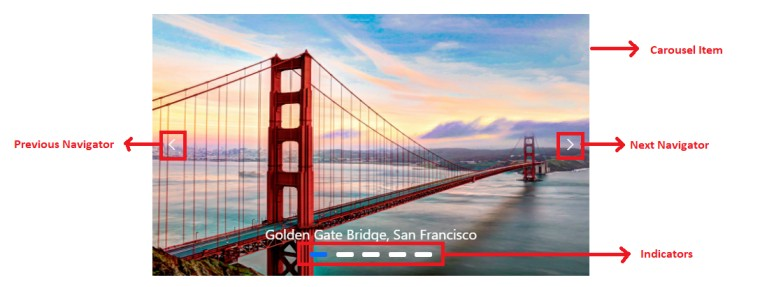
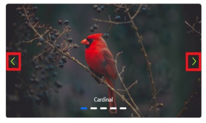
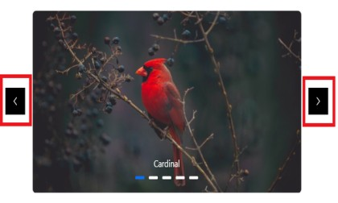

# Styles and Appearances in Blazor Carousel Component

To modify the Carousel appearance, you need to override the default CSS of Carousel component. Please find the list of CSS classes and its corresponding section in Carousel component. Also, you have an option to create your own custom theme for the controls using our [`Theme Studio`](https://ej2.syncfusion.com/themestudio/?theme=material).

## CSS Structure in Blazor Carousel Component

The following content provides the exact CSS structure that can be used to modify the control’s appearance based on user preference.

CSS Class | Purpose of Class
-----|-----
|.e-carousel .e-carousel-item|To customize the carousel item
|.e-carousel-item.e-active| To customize the active carousel item
|.e-carousel .e-carousel-indicators|To customize the indicators
|.e-carousel .e-carousel-indicators .e-indicator-bars .e-indicator-bar|To customize the indicator bars
|.e-carousel .e-carousel-indicators .e-indicator-bars .e-indicator-bar .e-indicator|To customize the individual indicator appearance
|.e-carousel .e-carousel-navigators|To customize the navigators
|.e-carousel .e-carousel-navigators .e-previous|To customize the previous button
|.e-carousel .e-carousel-navigators .e-play-pause|To customize the play and pause button
|.e-carousel.e-partial .e-carousel-slide-container|To customize the partial visible slides



## Customizing the indicators

Use the following CSS to customize the space between indicators by overriding the `.e-indicator-bar` CSS class.

```CSS

.e-carousel .e-carousel-indicators .e-indicator-bars .e-indicator-bar {
    padding: 8px;
}

```


Use the following CSS to customize the indicators appearance by overriding the `.e-indicator` CSS class.

```CSS

.e-carousel .e-carousel-indicators .e-indicator-bars .e-indicator-bar .e-indicator {
    width: 20px;
    border-radius: 100%;
}

```


Use the following CSS to render the indicators outside the carousel items by overriding the `.e-carousel-indicators` CSS class.

```CSS

.e-carousel .e-carousel-indicators {
    bottom: auto;
}

```


## Customizing the navigators

Use the following CSS to customize the previous and next icon size and colors.

```CSS

.e-carousel .e-carousel-navigators .e-next .e-btn:not(:disabled) .e-btn-icon,
.e-carousel .e-carousel-navigators .e-previous .e-btn:not(:disabled) .e-btn-icon
{
    color: greenyellow;
    font-size: 25px;
}

```



Use the following CSS to customize the navigators position to bottom by overriding the `.e-carousel-navigators` CSS class.

```CSS

.e-carousel .e-carousel-navigators {
   top: 120px;
}

```


Use the following CSS to render the previous and next icon to outside the carousel items by overriding the `.e-previous` and `.e-next` CSS class.

```CSS

.e-carousel .e-carousel-navigators .e-previous,
.e-carousel .e-carousel-navigators .e-next
{
    margin: -60px;
    background: black;
}

```



## Customizing partial slides size

You can customize the partial slide size by overriding the `e-carousel-item` CSS class.

```CSS

.e-carousel.e-partial .e-carousel-slide-container{
    padding: 0 150px;
}

```

