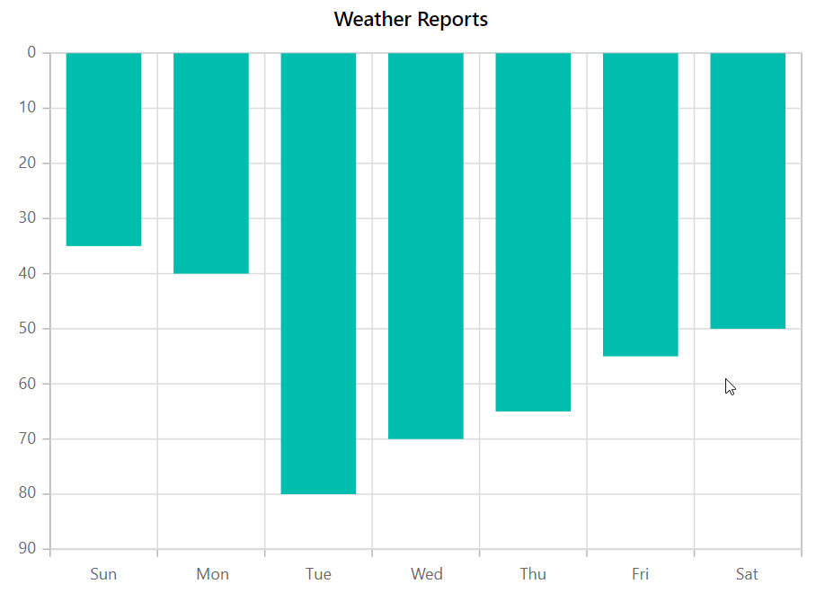

---
title: "Axis Customization in Blazor Charts component | Syncfusion"

component: "Charts"

description: "Learn here all about Axis Customization of Syncfusion Charts (SfCharts) component and more."
---

# Axis Customization in Blazor Charts (SfCharts)

## Axis Crossing

An axis can be positioned in the chart area using [`CrossesAt`](https://help.syncfusion.com/cr/blazor/Syncfusion.Blazor.Charts.ChartCommonAxis.html#Syncfusion_Blazor_Charts_ChartCommonAxis_CrossesAt) and [`CrossesInAxis`](https://help.syncfusion.com/cr/blazor/Syncfusion.Blazor.Charts.ChartCommonAxis.html#Syncfusion_Blazor_Charts_ChartCommonAxis_CrossesInAxis) properties. The [`CrossesAt`](https://help.syncfusion.com/cr/blazor/Syncfusion.Blazor.Charts.ChartCommonAxis.html#Syncfusion_Blazor_Charts_ChartCommonAxis_CrossesAt) property specifies the values (datetime, numeric, or logarithmic) at which the axis line has to be intersected with the vertical axis or vice-versa, and the [`CrossesInAxis`](https://help.syncfusion.com/cr/blazor/Syncfusion.Blazor.Charts.ChartCommonAxis.html#Syncfusion_Blazor_Charts_ChartCommonAxis_CrossesInAxis) property specifies the axis name with which the axis line has to be crossed.





## Title

A title can be added to the axis using [`Title`](https://help.syncfusion.com/cr/blazor/Syncfusion.Blazor.Charts.ChartCommonAxis.html#Syncfusion_Blazor_Charts_ChartCommonAxis_Title) property to provide quick information to the user about the data plotted in the axis. Title text can be customized using [`TitleStyle`](https://help.syncfusion.com/cr/blazor/Syncfusion.Blazor.Charts.ChartCommonAxis.html#Syncfusion_Blazor_Charts_ChartCommonAxis_TitleStyle) property of the axis.





## Tick Lines Customization

The width, color and size of the minor and major tick lines can be customized using [`MajorTickLines`](https://help.syncfusion.com/cr/blazor/Syncfusion.Blazor.Charts.ChartCommonAxis.html#Syncfusion_Blazor_Charts_ChartCommonAxis_MajorTickLines) and [`MinorTickLines`](https://help.syncfusion.com/cr/blazor/Syncfusion.Blazor.Charts.ChartCommonAxis.html#Syncfusion_Blazor_Charts_ChartCommonAxis_MinorTickLines) properties in the axis.





## Grid Lines Customization

The width, color and dash-array of the minor and major grid lines can be customized using [`MajorGridLines`](https://help.syncfusion.com/cr/blazor/Syncfusion.Blazor.Charts.ChartCommonAxis.html#Syncfusion_Blazor_Charts_ChartCommonAxis_MajorGridLines) and [`MinorGridLines`](https://help.syncfusion.com/cr/blazor/Syncfusion.Blazor.Charts.ChartCommonAxis.html#Syncfusion_Blazor_Charts_ChartCommonAxis_MinorGridLines) properties in the axis.





## Multiple Axis

The [`ChartAxes`](https://help.syncfusion.com/cr/blazor/Syncfusion.Blazor.Charts.ChartAxes.html), the secondary axis collection can be used, to add n number of axes to the chart in addition to the basic X and Y axis. By mapping with the axis' unique name, series can be linked to it.

## See also

* [Mixed Chart](./chart-series)
* [Multiple Panes](./multiple-panes)





## Inversed Axis

<!-- markdownlint-disable MD033 -->

 When an axis is inversed, the axis' greatest value moves closer to the origin, and vice versa. Set this property [`IsInversed`](https://help.syncfusion.com/cr/blazor/Syncfusion.Blazor.Charts.ChartCommonAxis.html#Syncfusion_Blazor_Charts_ChartCommonAxis_IsInversed) to **true** to invert the axis.

 



## Opposed Position

Set the  [`OpposedPosition`](https://help.syncfusion.com/cr/blazor/Syncfusion.Blazor.Charts.ChartCommonAxis.html#Syncfusion_Blazor_Charts_ChartCommonAxis_OpposedPosition) property of an axis to **true** to place it in the opposite position of its original position.





> Refer to our [`Blazor Charts`](https://www.syncfusion.com/blazor-components/blazor-charts) feature tour page for its groundbreaking feature representations and also explore our [`Blazor Chart example`](https://blazor.syncfusion.com/demos/chart/line?theme=bootstrap4) to know various chart types and how to represent time-dependent data, showing trends at equal intervals.

## See Also

* [Data Label](./data-labels)
* [Tooltip](./tool-tip)
* [Marker](./data-markers)