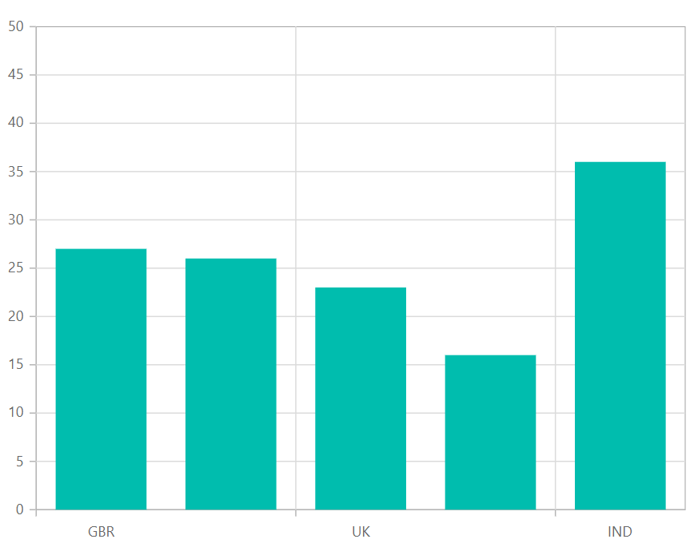
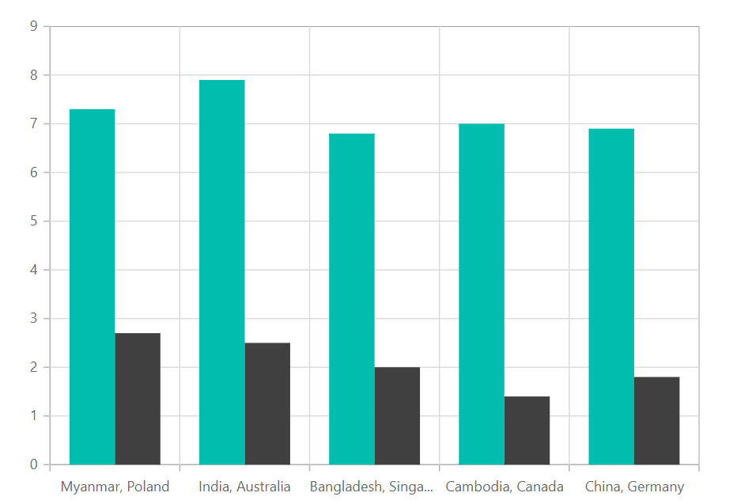

---
title: "Category Axis  in Blazor Charts component | Syncfusion"

component: "Charts"

description: "Learn here all about Category Axis of Syncfusion Charts (SfCharts) component and more."
---

# Category Axis in Blazor Charts (SfCharts)

The category axis is used to represent string values instead of integers.





## Labels Placement

The category labels are positioned between the ticks by default, but the [`LabelPlacement`](https://help.syncfusion.com/cr/blazor/Syncfusion.Blazor.Charts.ChartCommonAxis.html#Syncfusion_Blazor_Charts_ChartCommonAxis_LabelPlacement) property allows them to be placed on the ticks as well with the [`BetweenTicks`](https://help.syncfusion.com/cr/blazor/Syncfusion.Blazor.Charts.LabelPlacement.html#Syncfusion_Blazor_Charts_LabelPlacement_BetweenTicks) and [`OnTicks`](https://help.syncfusion.com/cr/blazor/Syncfusion.Blazor.Charts.LabelPlacement.html#Syncfusion_Blazor_Charts_LabelPlacement_OnTicks) options.





## Range and Interval

The [`Minimum`](https://help.syncfusion.com/cr/blazor/Syncfusion.Blazor.Charts.ChartCommonAxis.html#Syncfusion_Blazor_Charts_ChartCommonAxis_Minimum), [`Maximum`](https://help.syncfusion.com/cr/blazor/Syncfusion.Blazor.Charts.ChartCommonAxis.html#Syncfusion_Blazor_Charts_ChartCommonAxis_Maximum), and [`Interval`](https://help.syncfusion.com/cr/blazor/Syncfusion.Blazor.Charts.ChartCommonAxis.html#Syncfusion_Blazor_Charts_ChartCommonAxis_Interval) properties of the axis can be used to customize the range of the [`Category`](https://help.syncfusion.com/cr/blazor/Syncfusion.Blazor.Charts.ValueType.html#Syncfusion_Blazor_Charts_ValueType_Category) axis.





## Indexed category axis

The data source index values can also be used to render the category axis. This can be achieved by setting the [`IsIndexed`](https://help.syncfusion.com/cr/blazor/Syncfusion.Blazor.Charts.ChartCommonAxis.html#Syncfusion_Blazor_Charts_ChartCommonAxis_IsIndexed) property in the axis to **true**.





> Refer to our [`Blazor Charts`](https://www.syncfusion.com/blazor-components/blazor-charts) feature tour page for its groundbreaking feature representations and also explore our [`Blazor Chart example`](https://blazor.syncfusion.com/demos/chart/line?theme=bootstrap4) to knows various chart types and how to represent time-dependent data, showing trends in data at equal intervals.

## See Also

* [Data Label](./data-labels)
* [Tooltip](./tool-tip)
* [Marker](./data-markers)