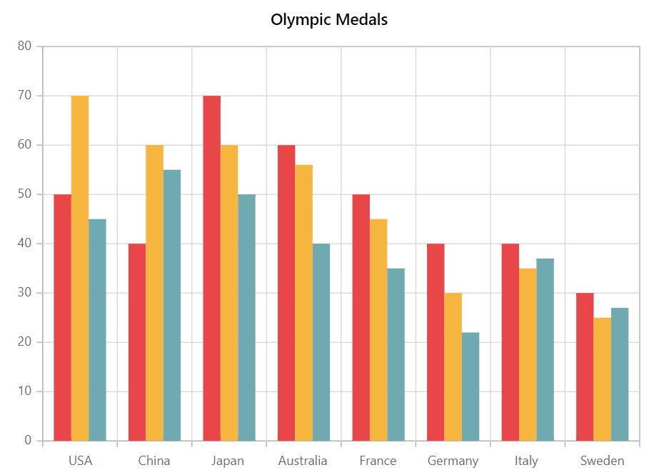
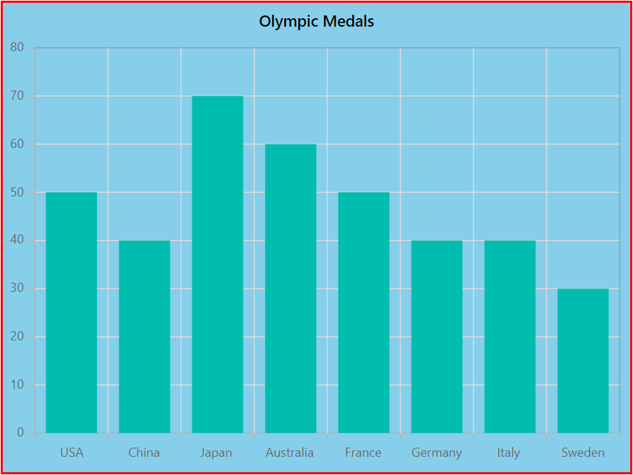
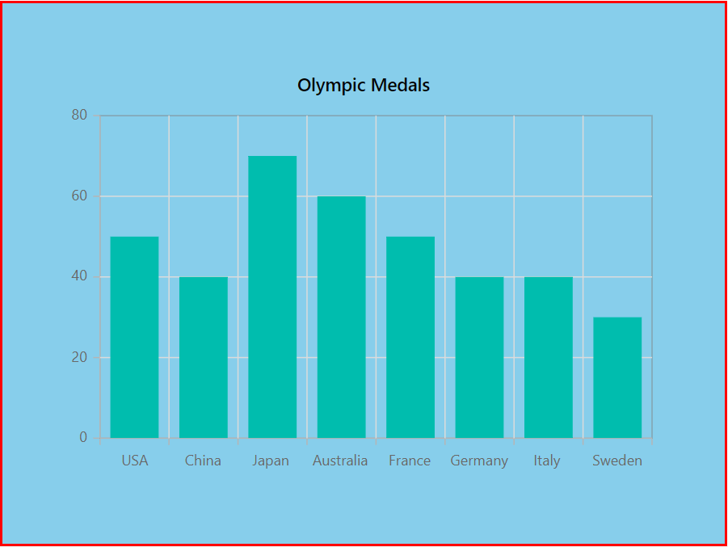
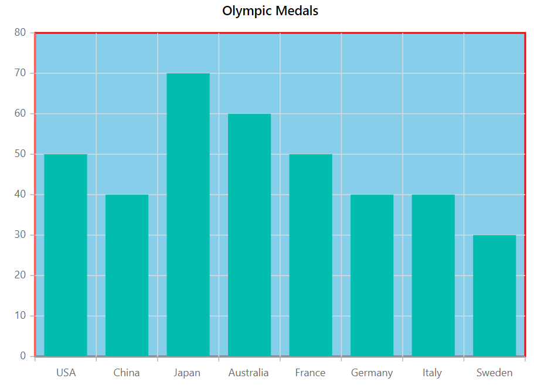
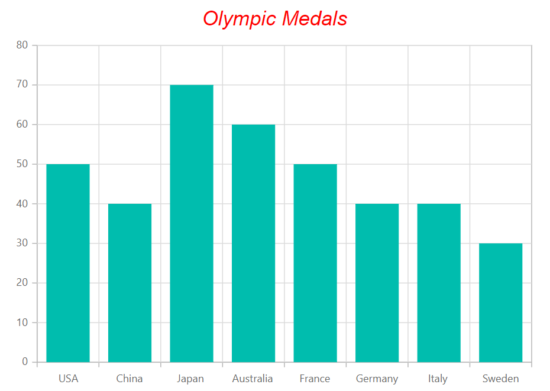

# Appearance in Blazor Charts Component

## Custom Color Palette

The default color of series or points can be changed by providing a custom color palette to the [`Palettes`](https://help.syncfusion.com/cr/blazor/Syncfusion.Blazor.Charts.SfChart.html#Syncfusion_Blazor_Charts_SfChart_Palettes) property.

```cshtml

@using Syncfusion.Blazor.Charts

<SfChart Title="Olympic Medals" Palettes="@palettes">
    <ChartPrimaryXAxis ValueType="Syncfusion.Blazor.Charts.ValueType.Category">
    </ChartPrimaryXAxis>

    <ChartSeriesCollection>
        <ChartSeries DataSource="@MedalDetails" XName="Country" YName="Gold" Type="ChartSeriesType.Column">
        </ChartSeries>
        <ChartSeries DataSource="@MedalDetails" XName="Country" YName="Silver" Type="ChartSeriesType.Column">
        </ChartSeries>
        <ChartSeries DataSource="@MedalDetails" XName="Country" YName="Bronze" Type="ChartSeriesType.Column">
        </ChartSeries>
    </ChartSeriesCollection>
</SfChart>

@code{
    public class ChartData
    {
        public string Country { get; set; }
        public double Gold { get; set; }
        public double Silver { get; set; }
        public double Bronze { get; set; }
    }
	
    public List<ChartData> MedalDetails = new List<ChartData>
	{
         new ChartData{ Country= "USA", Gold=50, Silver=70, Bronze=45 },
         new ChartData{ Country="China", Gold=40, Silver= 60, Bronze=55 },
         new ChartData{ Country= "Japan", Gold=70, Silver= 60, Bronze=50 },
         new ChartData{ Country= "Australia", Gold=60, Silver= 56, Bronze=40 },
         new ChartData{ Country= "France", Gold=50, Silver= 45, Bronze=35 },
         new ChartData{ Country= "Germany", Gold=40, Silver=30, Bronze=22 },
         new ChartData{ Country= "Italy", Gold=40, Silver=35, Bronze=37 },
         new ChartData{ Country= "Sweden", Gold=30, Silver=25, Bronze=27 }
    };
	
    public String[] palettes = new String[] { "#E94649", "#F6B53F", "#6FAAB0" };
}

```



<!-- markdownlint-disable MD036 -->

## Chart Customization

<!-- markdownlint-disable MD036 -->

### Chart Background and Border

<!-- markdownlint-disable MD013 -->

The chart's background color and border can be customized using the [`Background`](https://help.syncfusion.com/cr/blazor/Syncfusion.Blazor.Charts.SfChart.html#Syncfusion_Blazor_Charts_SfChart_Background) and [`Border`](https://help.syncfusion.com/cr/blazor/Syncfusion.Blazor.Charts.ChartBorder.html) properties respectively.

```cshtml

@using Syncfusion.Blazor.Charts

<SfChart Title="Olympic Medals" Background="skyblue">
    <ChartBorder Color="#FF0000" Width="2"></ChartBorder>

    <ChartPrimaryXAxis ValueType="Syncfusion.Blazor.Charts.ValueType.Category" />

    <ChartSeriesCollection>
        <ChartSeries DataSource="@MedalDetails" XName="Country" YName="Gold" Type="ChartSeriesType.Column">
        </ChartSeries>
    </ChartSeriesCollection>
</SfChart>

@code{
    public class ChartData
    {
        public string Country { get; set; }
        public double Gold { get; set; }
    }
	
    public List<ChartData> MedalDetails = new List<ChartData>
	{
		new ChartData{ Country= "USA", Gold=50  },
		new ChartData{ Country="China", Gold=40 },
		new ChartData{ Country= "Japan", Gold=70 },
		new ChartData{ Country= "Australia", Gold=60},
		new ChartData{ Country= "France", Gold=50 },
		new ChartData{ Country= "Germany", Gold=40 },
		new ChartData{ Country= "Italy", Gold=40 },
		new ChartData{ Country= "Sweden", Gold=30 }
    };
}

```



### Chart Margin

The chart's margin from its container can be customized using the [`Margin`](https://help.syncfusion.com/cr/blazor/Syncfusion.Blazor.Charts.ChartMargin.html) property.

```cshtml

@using Syncfusion.Blazor.Charts

<SfChart Title="Olympic Medals" Background="skyblue">
    <ChartBorder Color="#FF0000" Width="2"></ChartBorder>

    <ChartMargin Left="60" Right="60" Top="60" Bottom="60"></ChartMargin>

    <ChartPrimaryXAxis ValueType="Syncfusion.Blazor.Charts.ValueType.Category">
    </ChartPrimaryXAxis>

    <ChartSeriesCollection>
        <ChartSeries DataSource="@MedalDetails" XName="Country" YName="Gold" Type="ChartSeriesType.Column">
        </ChartSeries>
    </ChartSeriesCollection>
</SfChart>

@code{
    public class ChartData
    {
        public string Country { get; set; }
        public double Gold { get; set; }
    }
	
    public List<ChartData> MedalDetails = new List<ChartData>
	{
		new ChartData{ Country= "USA", Gold=50  },
		new ChartData{ Country="China", Gold=40 },
		new ChartData{ Country= "Japan", Gold=70 },
		new ChartData{ Country= "Australia", Gold=60},
		new ChartData{ Country= "France", Gold=50 },
		new ChartData{ Country= "Germany", Gold=40 },
		new ChartData{ Country= "Italy", Gold=40 },
		new ChartData{ Country= "Sweden", Gold=30 }
    };
}

```



### Chart Area Background and Border

The chart area's background color and border can be customized using the [`Background`](https://help.syncfusion.com/cr/blazor/Syncfusion.Blazor.Charts.ChartArea.html#Syncfusion_Blazor_Charts_ChartArea_Background) and [`Border`](https://help.syncfusion.com/cr/blazor/Syncfusion.Blazor.Charts.ChartArea.html#Syncfusion_Blazor_Charts_ChartArea_Border) properties in the [`ChartArea`](https://help.syncfusion.com/cr/blazor/Syncfusion.Blazor.Charts.ChartArea.html).

```cshtml

@using Syncfusion.Blazor.Charts

<SfChart Title="Olympic Medals" >
    <ChartArea Background="skyblue">
        <ChartAreaBorder Color="#FF0000"  Width="2" />
    </ChartArea>

    <ChartPrimaryXAxis ValueType="Syncfusion.Blazor.Charts.ValueType.Category" />

    <ChartSeriesCollection>
        <ChartSeries DataSource="@MedalDetails" XName="Country" YName="Gold" Type="ChartSeriesType.Column" />
    </ChartSeriesCollection>
</SfChart>

@code{
    public class ChartData
    {
        public string Country { get; set; }
        public double Gold { get; set; }
    }
	
    public List<ChartData> MedalDetails = new List<ChartData>
	{
		new ChartData{ Country= "USA", Gold=50  },
		new ChartData{ Country="China", Gold=40 },
		new ChartData{ Country= "Japan", Gold=70 },
		new ChartData{ Country= "Australia", Gold=60},
		new ChartData{ Country= "France", Gold=50 },
		new ChartData{ Country= "Germany", Gold=40 },
		new ChartData{ Country= "Italy", Gold=40 },
		new ChartData{ Country= "Sweden", Gold=30 }
    };
}

```



## Animation

The [`Animation`](https://help.syncfusion.com/cr/blazor/Syncfusion.Blazor.Charts.ChartSeries.html#Syncfusion_Blazor_Charts_ChartSeries_Animation) property allows to customize animation for a certain series. The [`Enable`](https://help.syncfusion.com/cr/blazor/Syncfusion.Blazor.Charts.StockChartCommonAnimation.html#Syncfusion_Blazor_Charts_StockChartCommonAnimation_Enable) property can be used to enable or disable the series animation. The duration of the animation is specified by [`Duration`](https://help.syncfusion.com/cr/blazor/Syncfusion.Blazor.Charts.StockChartCommonAnimation.html#Syncfusion_Blazor_Charts_StockChartCommonAnimation_Duration) property, and [`Delay`](https://help.syncfusion.com/cr/blazor/Syncfusion.Blazor.Charts.StockChartCommonAnimation.html#Syncfusion_Blazor_Charts_StockChartCommonAnimation_Delay) property allows to start the animation at a specific moment.

```cshtml

@using Syncfusion.Blazor.Charts

<SfChart Title="Olympic Medals">
    <ChartPrimaryXAxis ValueType="Syncfusion.Blazor.Charts.ValueType.Category"/>    

    <ChartSeriesCollection>
        <ChartSeries DataSource="@MedalDetails" Name="Gold" XName="Country" Width="2" Opacity="1" YName="Gold" Type="ChartSeriesType.Column">
            <ChartSeriesAnimation Enable="true" Duration="2000" Delay="200"></ChartSeriesAnimation>
            <ChartSeriesBorder Width="3" Color="red"></ChartSeriesBorder>
        </ChartSeries>
    </ChartSeriesCollection>
</SfChart>

@code{
    public class ChartData
    {
        public string Country { get; set; }
        public double Gold { get; set; }
        public double Silver { get; set; }
        public double Bronze { get; set; }
    }
	
    public List<ChartData> MedalDetails = new List<ChartData>
	{
        new ChartData{ Country= "USA", Gold=50, Silver=70, Bronze=45 },
        new ChartData{ Country="China", Gold=40, Silver= 60, Bronze=55 },
        new ChartData{ Country= "Japan", Gold=70, Silver= 60, Bronze=50 },
        new ChartData{ Country= "Australia", Gold=60, Silver= 56, Bronze=40 },
        new ChartData{ Country= "France", Gold=50, Silver= 45, Bronze=35 },
        new ChartData{ Country= "Germany", Gold=40, Silver=30, Bronze=22 },
        new ChartData{ Country= "Italy", Gold=40, Silver=35, Bronze=37 },
        new ChartData{ Country= "Sweden", Gold=30, Silver=25, Bronze=27 }
    };
}

```

## Chart Title

The [`Title`](https://help.syncfusion.com/cr/blazor/Syncfusion.Blazor.Charts.SfChart.html#Syncfusion_Blazor_Charts_SfChart_Title) property can be used to give the chart a title in-order to provide information about the data displayed.

```cshtml

@using Syncfusion.Blazor.Charts

<SfChart Title="Olympic Medals">
    <ChartTitleStyle Size="23px" Color="red" FontFamily="Arial" FontWeight="regular" FontStyle="italic"></ChartTitleStyle>

    <ChartPrimaryXAxis ValueType="Syncfusion.Blazor.Charts.ValueType.Category">
    </ChartPrimaryXAxis>

    <ChartSeriesCollection>
        <ChartSeries DataSource="@MedalDetails" XName="Country" YName="Gold" Type="ChartSeriesType.Column">
        </ChartSeries>
    </ChartSeriesCollection>
</SfChart>

@code{
    public class ChartData
    {
        public string Country { get; set; }
        public double Gold {get; set; }
    }
	
    public List<ChartData> MedalDetails = new List<ChartData>
	{
		new ChartData{ Country= "USA", Gold=50  },
		new ChartData{ Country="China", Gold=40 },
		new ChartData{ Country= "Japan", Gold=70 },
		new ChartData{ Country= "Australia", Gold=60},
		new ChartData{ Country= "France", Gold=50 },
		new ChartData{ Country= "Germany", Gold=40 },
		new ChartData{ Country= "Italy", Gold=40 },
		new ChartData{ Country= "Sweden", Gold=30 }
    };
}

```



## Chart Subtitle

The [`SubTitle`](https://help.syncfusion.com/cr/blazor/Syncfusion.Blazor.Charts.SfChart.html#Syncfusion_Blazor_Charts_SfChart_SubTitle) property can be used to give the chart a subtitle in-order to provide additional information about the data displayed.

```cshtml

@using Syncfusion.Blazor.Charts

<SfChart Title="Olympic Medals" SubTitle="Medals">
    <ChartSubTitleStyle FontFamily="Arial" FontStyle="italic" FontWeight="regular" Size="18px" Color="red"></ChartSubTitleStyle>

    <ChartTitleStyle FontFamily="Arial" FontStyle="italic" FontWeight="regular" Size="23px" Color="red"></ChartTitleStyle>

    <ChartPrimaryXAxis ValueType="Syncfusion.Blazor.Charts.ValueType.Category">
    </ChartPrimaryXAxis>

    <ChartSeriesCollection>
        <ChartSeries DataSource="@MedalDetails" XName="Country" YName="Gold" Type="ChartSeriesType.Column">
        </ChartSeries>
    </ChartSeriesCollection>
</SfChart>

@code{
    public class ChartData
    {
        public string Country { get; set; }
        public double Gold { get; set; }
    }
	
    public List<ChartData> MedalDetails = new List<ChartData>
	{
		new ChartData{ Country= "USA", Gold=50  },
		new ChartData{ Country="China", Gold=40 },
		new ChartData{ Country= "Japan", Gold=70 },
		new ChartData{ Country= "Australia", Gold=60},
		new ChartData{ Country= "France", Gold=50 },
		new ChartData{ Country= "Germany", Gold=40 },
		new ChartData{ Country= "Italy", Gold=40 },
		new ChartData{ Country= "Sweden", Gold=30 }
    };
}

```


> Refer to our [`Blazor Charts`](https://www.syncfusion.com/blazor-components/blazor-charts) feature tour page for its groundbreaking feature representations and also explore our [`Blazor Chart Example`](https://blazor.syncfusion.com/demos/chart/line?theme=bootstrap4) to know various chart types and how to represent time-dependent data, showing trends at equal intervals.

## See Also

* [Data Label](./data-labels)
* [Tooltip](./tool-tip)