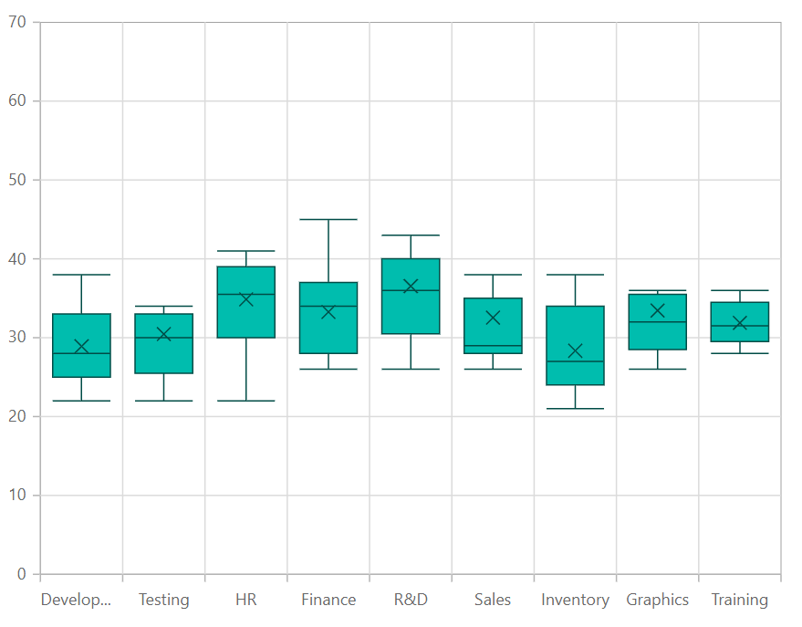
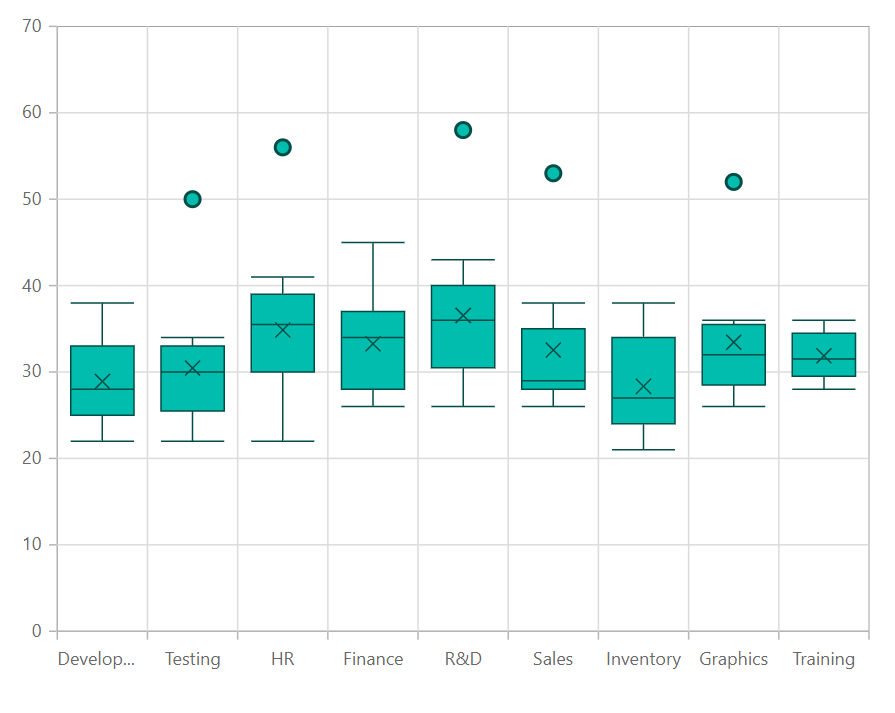
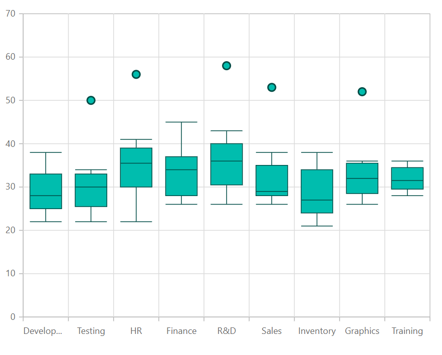

# Box and Whisker in Blazor Charts Component

## Box and Whisker

To render a [`Box and Whisker Chart`](https://www.syncfusion.com/blazor-components/blazor-charts/chart-types/box-and-whisker-chart) set the [`Type`](https://help.syncfusion.com/cr/blazor/Syncfusion.Blazor.Charts.ChartSeries.html#Syncfusion_Blazor_Charts_ChartSeries_Type) property to [`BoxAndWhisker`](https://help.syncfusion.com/cr/blazor/Syncfusion.Blazor.Charts.ChartSeriesType.html#Syncfusion_Blazor_Charts_ChartSeriesType_BoxAndWhisker). The property [`YName`](https://help.syncfusion.com/cr/blazor/Syncfusion.Blazor.Charts.ChartSeries.html#Syncfusion_Blazor_Charts_ChartSeries_YName) requires  **n** number of data or it should contains minimum of five values.

```csharp

@using Syncfusion.Blazor.Charts

<SfChart>
    <ChartPrimaryXAxis ValueType="Syncfusion.Blazor.Charts.ValueType.Category">
    </ChartPrimaryXAxis>

    <ChartSeriesCollection>
        <ChartSeries DataSource="@ExpenseDetails" XName="XValue" YName="YValue" Type="ChartSeriesType.BoxAndWhisker">
        </ChartSeries>
    </ChartSeriesCollection>
</SfChart>

@code{
    public class ChartData
    {
        public string XValue { get; set; }
        public double[] YValue { get; set; }
    }

    public List<ChartData> ExpenseDetails = new List<ChartData>
{
        new ChartData { XValue = "Development", YValue = new double[]{ 22, 22, 23, 25, 25, 25, 26, 27, 27, 28, 28, 29, 30, 32, 34, 32, 34, 36, 35, 38 } },
        new ChartData { XValue = "Testing", YValue = new double[] { 22, 33, 23, 25, 26, 28, 29, 30, 34, 33, 32, 31, 50 }},
        new ChartData { XValue = "HR", YValue = new double[] { 22, 24, 25, 30, 32, 34, 36, 38, 39, 41, 35, 36, 40, 56 } },
        new ChartData { XValue = "Finance", YValue =  new double[] { 26, 27, 28, 30, 32, 34, 35, 37, 35, 37, 45 } },
        new ChartData { XValue = "R&D", YValue = new double[] { 26, 27, 29, 32, 34, 35, 36, 37, 38, 39, 41, 43, 58 } },
        new ChartData { XValue = "Sales", YValue = new double[] { 27, 26, 28, 29, 29, 29, 32, 35, 32, 38, 53 } },
        new ChartData { XValue = "Inventory", YValue = new double[] { 21, 23, 24, 25, 26, 27, 28, 30, 34, 36, 38 } },
        new ChartData { XValue = "Graphics", YValue = new double[] { 26, 28, 29, 30, 32, 33, 35, 36, 52 } },
        new ChartData { XValue = "Training", YValue = new double[] { 28, 29, 30, 31, 32, 34, 35, 36 } }
    };
}

```



> Refer to our Blazor [`Box and Whisker Chart`](https://www.syncfusion.com/blazor-components/blazor-charts/chart-types/box-and-whisker-chart) feature tour page to know about its other groundbreaking feature representations. Explore our Blazor [`Box and Whisker Chart`](https://blazor.syncfusion.com/demos/chart/box-and-whisker) example to know how to render and configure the box and whisker type charts.

## Box Plot

To change the rendering mode of the Box and Whisker series, use the [`BoxPlotMode`](https://help.syncfusion.com/cr/blazor/Syncfusion.Blazor.Charts.BoxPlotMode.html) property. The default [`BoxPlotMode`](https://help.syncfusion.com/cr/blazor/Syncfusion.Blazor.Charts.BoxPlotMode.html) is [`Exclusive`](https://help.syncfusion.com/cr/blazor/Syncfusion.Blazor.Charts.BoxPlotMode.html#Syncfusion_Blazor_Charts_BoxPlotMode_Exclusive).

```csharp

@using Syncfusion.Blazor.Charts

<SfChart>
    <ChartPrimaryXAxis ValueType="Syncfusion.Blazor.Charts.ValueType.Category">
    </ChartPrimaryXAxis>

    <ChartSeriesCollection>
        <ChartSeries DataSource="@ExpenseDetails" XName="XValue" YName="YValue" Type="ChartSeriesType.BoxAndWhisker">
        </ChartSeries>
    </ChartSeriesCollection>
</SfChart>

@code{
    public class ChartData
    {
        public string XValue {get; set;}
        public double[] YValue {get; set; }
    }

    public List<ChartData> ExpenseDetails = new List<ChartData>
{
        new ChartData { XValue = "Development", YValue = new double[]{ 22, 22, 23, 25, 25, 25, 26, 27, 27, 28, 28, 29, 30, 32, 34, 32, 34, 36, 35, 38 } },
        new ChartData { XValue = "Testing", YValue = new double[] { 22, 33, 23, 25, 26, 28, 29, 30, 34, 33, 32, 31, 50 }},
        new ChartData { XValue = "HR", YValue = new double[] { 22, 24, 25, 30, 32, 34, 36, 38, 39, 41, 35, 36, 40, 56 } },
        new ChartData { XValue = "Finance", YValue =  new double[] { 26, 27, 28, 30, 32, 34, 35, 37, 35, 37, 45 } },
        new ChartData { XValue = "R&D", YValue = new double[] { 26, 27, 29, 32, 34, 35, 36, 37, 38, 39, 41, 43, 58 } },
        new ChartData { XValue = "Sales", YValue = new double[] { 27, 26, 28, 29, 29, 29, 32, 35, 32, 38, 53 } },
        new ChartData { XValue = "Inventory", YValue = new double[] { 21, 23, 24, 25, 26, 27, 28, 30, 34, 36, 38 } },
        new ChartData { XValue = "Graphics", YValue = new double[] { 26, 28, 29, 30, 32, 33, 35, 36, 52 } },
        new ChartData { XValue = "Training", YValue = new double[] { 28, 29, 30, 31, 32, 34, 35, 36 } }
    };
}

```



## Show Mean

In Box and Whisker series, [`ShowMean`](https://help.syncfusion.com/cr/blazor/Syncfusion.Blazor.Charts.ChartSeries.html#Syncfusion_Blazor_Charts_ChartSeries_ShowMean) property is used to show the box and whisker average value. The default value of [`ShowMean`](https://help.syncfusion.com/cr/blazor/Syncfusion.Blazor.Charts.ChartSeries.html#Syncfusion_Blazor_Charts_ChartSeries_ShowMean) is **false**.

```csharp

@using Syncfusion.Blazor.Charts

<SfChart>
    <ChartPrimaryXAxis ValueType="Syncfusion.Blazor.Charts.ValueType.Category">
    </ChartPrimaryXAxis>

    <ChartSeriesCollection>
        <ChartSeries DataSource="@ExpenseDetails" XName="XValue" YName="YValue" Type="ChartSeriesType.BoxAndWhisker" ShowMean="false">
        </ChartSeries>
    </ChartSeriesCollection>
</SfChart>

@code{
    public class ChartData
    {
        public string XValue { get; set; }
        public double[] YValue { get; set; }
    }

    public List<ChartData> ExpenseDetails = new List<ChartData>
{
        new ChartData { XValue = "Development", YValue = new double[]{ 22, 22, 23, 25, 25, 25, 26, 27, 27, 28, 28, 29, 30, 32, 34, 32, 34, 36, 35, 38 } },
        new ChartData { XValue = "Testing", YValue = new double[] { 22, 33, 23, 25, 26, 28, 29, 30, 34, 33, 32, 31, 50 }},
        new ChartData { XValue = "HR", YValue = new double[] { 22, 24, 25, 30, 32, 34, 36, 38, 39, 41, 35, 36, 40, 56 } },
        new ChartData { XValue = "Finance", YValue =  new double[] { 26, 27, 28, 30, 32, 34, 35, 37, 35, 37, 45 } },
        new ChartData { XValue = "R&D", YValue = new double[] { 26, 27, 29, 32, 34, 35, 36, 37, 38, 39, 41, 43, 58 } },
        new ChartData { XValue = "Sales", YValue = new double[] { 27, 26, 28, 29, 29, 29, 32, 35, 32, 38, 53 } },
        new ChartData { XValue = "Inventory", YValue = new double[] { 21, 23, 24, 25, 26, 27, 28, 30, 34, 36, 38 } },
        new ChartData { XValue = "Graphics", YValue = new double[] { 26, 28, 29, 30, 32, 33, 35, 36, 52 } },
        new ChartData { XValue = "Training", YValue = new double[] { 28, 29, 30, 31, 32, 34, 35, 36 } }
    };
}

```



> Refer to our [`Blazor Charts`](https://www.syncfusion.com/blazor-components/blazor-charts) feature tour page for its groundbreaking feature representations and also explore our [`Blazor Chart example`](https://blazor.syncfusion.com/demos/chart/line?theme=bootstrap4) to know various chart types and how to represent time-dependent data, showing trends at equal intervals.

## See Also

* [Data Label](../data-labels)
* [Tooltip](../tool-tip) [Tooltip](../tool-tip)