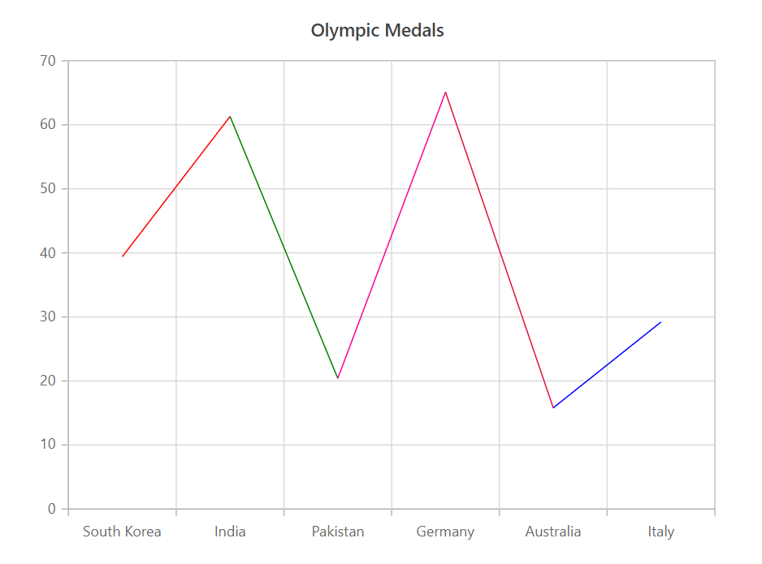

# Line Chart in Blazor Charts (SfCharts)

## Line

[`Line Chart`](https://www.syncfusion.com/blazor-components/blazor-charts/chart-types/line-chart) represents and visualizes the time-dependent data to show the trends at equal intervals. It can be rendered by specifying the series [`Type`](https://help.syncfusion.com/cr/blazor/Syncfusion.Blazor.Charts.ChartSeries.html#Syncfusion_Blazor_Charts_ChartSeries_Type) to [`Line`](https://help.syncfusion.com/cr/blazor/Syncfusion.Blazor.Charts.ChartSeriesType.html#Syncfusion_Blazor_Charts_ChartSeriesType_Line).

```csharp

@using Syncfusion.Blazor.Charts

<SfChart Title="Olympic Medals">
    <ChartPrimaryXAxis ValueType="Syncfusion.Blazor.Charts.ValueType.Category"></ChartPrimaryXAxis>
    <ChartSeriesCollection>
        <ChartSeries DataSource="@MedalDetails" XName="X" YName="Y" Type="ChartSeriesType.Line">
        </ChartSeries>
    </ChartSeriesCollection>
</SfChart>

@code{
    public class ChartData
    {
        public string X { get; set;}
        public double Y {get; set;}
    }
    public List<ChartData> MedalDetails = new List<ChartData>
{
        new ChartData { X= "South Korea", Y= 39.4 },
        new ChartData { X= "India", Y= 61.3 },
        new ChartData { X= "Pakistan", Y= 20.4 },
        new ChartData { X= "Germany", Y= 65.1 },
        new ChartData { X= "Australia", Y= 15.8 },
        new ChartData { X= "Italy", Y= 29.2 },
        new ChartData { X= "United Kingdom", Y= 44.6 },
        new ChartData { X= "Saudi Arabia", Y= 9.7 },
        new ChartData { X= "Russia", Y= 40.8 },
        new ChartData { X= "Mexico", Y= 31 },
        new ChartData { X= "Brazil", Y= 75.9 },
        new ChartData { X= "China", Y= 51.4 }
    };
}

```


> Refer to our [`Blazor Line Chart`](https://www.syncfusion.com/blazor-components/blazor-charts/chart-types/line-chart) feature tour page to know about its other groundbreaking feature representations. Explore our [`Blazor Line Chart Example`](https://blazor.syncfusion.com/demos/chart/line?theme=bootstrap4) to know how to represent time-dependent data, showing trends at equal intervals.

## Multicolored Line

To render a multicolored area series, by specifying the [`Type`](https://help.syncfusion.com/cr/blazor/Syncfusion.Blazor.Charts.ChartSeries.html#Syncfusion_Blazor_Charts_ChartSeries_Type) property as [`MultiColoredArea`](https://help.syncfusion.com/cr/blazor/Syncfusion.Blazor.Charts.ChartSeriesType.html#Syncfusion_Blazor_Charts_ChartSeriesType_MultiColoredArea) in [`ChartSeries`](https://help.syncfusion.com/cr/blazor/Syncfusion.Blazor.Charts.ChartSeries.html). Here, the individual colors of the segment can be mapped by using [`PointColorMapping`](https://help.syncfusion.com/cr/blazor/Syncfusion.Blazor.Charts.ChartSeries.html#Syncfusion_Blazor_Charts_ChartSeries_PointColorMapping) property in [`ChartSeries`](https://help.syncfusion.com/cr/blazor/Syncfusion.Blazor.Charts.ChartSeries.html).

```csharp

@using Syncfusion.Blazor.Charts

<SfChart Title="Olympic Medals">
    <ChartPrimaryXAxis ValueType="Syncfusion.Blazor.Charts.ValueType.Category"></ChartPrimaryXAxis>
    <ChartSeriesCollection>
        <ChartSeries DataSource="@MedalDetails" XName="X" YName="Y" PointColorMapping="Color" Type="ChartSeriesType.MultiColoredLine">
        </ChartSeries>
    </ChartSeriesCollection>
</SfChart>

@code{
    public class ChartData
    {
        public string X { get; set; }
        public double Y { get; set; }
        public string Color { get; set; }
    }
    public List<ChartData> MedalDetails = new List<ChartData>
{
        new ChartData { X= "South Korea", Y= 39.4, Color="red" },
        new ChartData { X= "India", Y= 61.3, Color="green" },
        new ChartData { X= "Pakistan", Y= 20.4, Color="#ff0097" },
        new ChartData { X= "Germany", Y= 65.1, Color="crimson" },
        new ChartData { X= "Australia", Y= 15.8, Color="blue" },
        new ChartData { X= "Italy", Y= 29.2, Color="darkorange" },
    };
}

```



## Series Customization

The following properties can be used to customize the [`Line`](https://help.syncfusion.com/cr/blazor/Syncfusion.Blazor.Charts.ChartSeriesType.html#Syncfusion_Blazor_Charts_ChartSeriesType_Line) series.

* [`Fill`](https://help.syncfusion.com/cr/blazor/Syncfusion.Blazor.Charts.ChartSeries.html#Syncfusion_Blazor_Charts_ChartSeries_Fill) – Specifies the color of the series.
* [`Opacity`](https://help.syncfusion.com/cr/blazor/Syncfusion.Blazor.Charts.ChartSeries.html#Syncfusion_Blazor_Charts_ChartSeries_Opacity) – Specifies the opacity of [`Fill`](https://help.syncfusion.com/cr/blazor/Syncfusion.Blazor.Charts.ChartSeries.html#Syncfusion_Blazor_Charts_ChartSeries_Fill).
* [`DashArray`](https://help.syncfusion.com/cr/blazor/Syncfusion.Blazor.Charts.ChartSeries.html#Syncfusion_Blazor_Charts_ChartSeries_DashArray) – Specifies the dashes for series.
* [`Width`](https://help.syncfusion.com/cr/blazor/Syncfusion.Blazor.Charts.ChartSeries.html#Syncfusion_Blazor_Charts_ChartSeries_Width) – Specifies the width for series.

```csharp

@using Syncfusion.Blazor.Charts

<SfChart Title="Olympic Medals">
    <ChartPrimaryXAxis ValueType="Syncfusion.Blazor.Charts.ValueType.Category"></ChartPrimaryXAxis>
    <ChartSeriesCollection>
        <ChartSeries DataSource="@MedalDetails" XName="X" YName="Y" Width="3" Opacity="0.5"
                     DashArray="5,5" Fill="blue" Type="ChartSeriesType.Line">
        </ChartSeries>
    </ChartSeriesCollection>
</SfChart>

@code{
    public class ChartData
    {
        public string X { get; set; }
        public double Y { get; set; }
    }
    public List<ChartData> MedalDetails = new List<ChartData>
{
        new ChartData { X= "South Korea", Y= 39.4 },
        new ChartData { X= "India", Y= 61.3 },
        new ChartData { X= "Pakistan", Y= 20.4 },
        new ChartData { X= "Germany", Y= 65.1 },
        new ChartData { X= "Australia", Y= 15.8 },
        new ChartData { X= "Italy", Y= 29.2 },
        new ChartData { X= "United Kingdom", Y= 44.6 },
        new ChartData { X= "Saudi Arabia", Y= 9.7 },
        new ChartData { X= "Russia", Y= 40.8 },
        new ChartData { X= "Mexico", Y= 31 },
        new ChartData { X= "Brazil", Y= 75.9 },
        new ChartData { X= "China", Y= 51.4 }
    };
}

```


> Refer to our [`Blazor Charts`](https://www.syncfusion.com/blazor-components/blazor-charts) feature tour page for its groundbreaking feature representations and also explore our [`Blazor Chart example`](https://blazor.syncfusion.com/demos/chart/line?theme=bootstrap4) to know various chart types and how to represent time-dependent data, showing trends at equal intervals.

## See Also

* [Data Label](../data-labels)
* [Tooltip](../tool-tip)