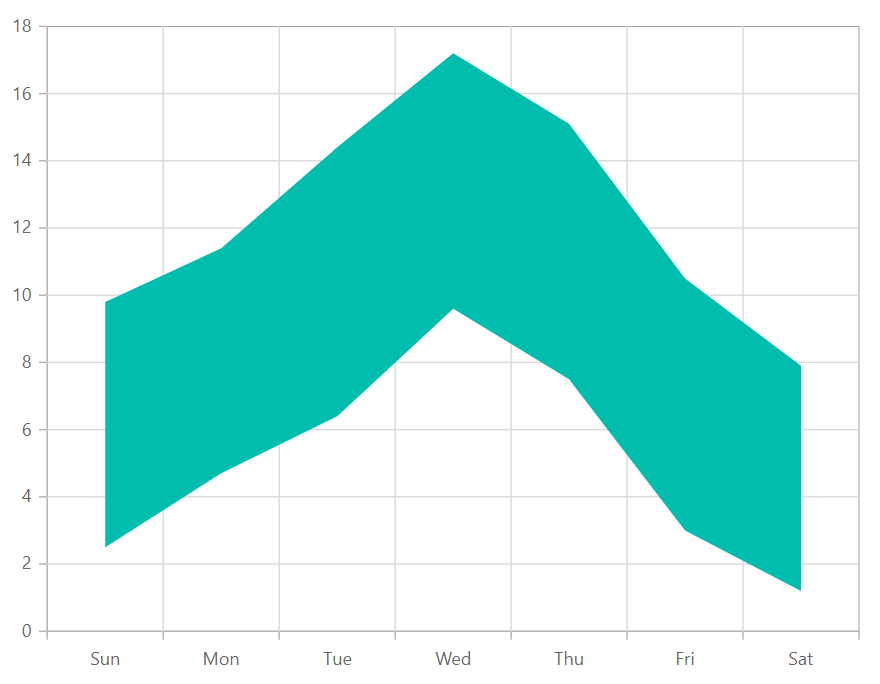

# Range Area Chart in Blazor Charts (SfCharts)

## Range Area

[`Range Area Chart`](https://www.syncfusion.com/blazor-components/blazor-charts/chart-types/range-area-chart) visualizes variations in the data values for a given time. The area between the high and low range is filled. To render a [`Range Area Chart`](https://help.syncfusion.com/cr/blazor/Syncfusion.Blazor.Charts.ChartSeriesType.html#Syncfusion_Blazor_Charts_ChartSeriesType_RangeArea), use series [`Type`](https://help.syncfusion.com/cr/blazor/Syncfusion.Blazor~Syncfusion.Blazor.Charts.ChartSeries~Type.html) as [`RangeArea`](https://help.syncfusion.com/cr/blazor/Syncfusion.Blazor.Charts.ChartSeriesType.html#Syncfusion_Blazor_Charts_ChartSeriesType_RangeArea).

```csharp

@using Syncfusion.Blazor.Charts

<SfChart>
    <ChartPrimaryXAxis ValueType="Syncfusion.Blazor.Charts.ValueType.Category"/>
    <ChartSeriesCollection>
        <ChartSeries DataSource="@WeatherReports" XName="X" High="High" Low="Low" Type="ChartSeriesType.RangeArea">
        </ChartSeries>
    </ChartSeriesCollection>
</SfChart>

@code{
    public class ChartData
    {
        public string X { get; set; }
        public double Low { get; set; }
        public double High { get; set; }
    }

    public List<ChartData> WeatherReports = new List<ChartData>
    {
         new ChartData { X= "Sun", Low= 2.5, High= 9.8 },
         new ChartData { X= "Mon", Low= 4.7, High= 11.4 },
         new ChartData { X= "Tue", Low= 6.4, High= 14.4 },
         new ChartData { X= "Wed", Low= 9.6, High= 17.2 },
         new ChartData { X= "Thu", Low= 7.5, High= 15.1 },
         new ChartData { X= "Fri", Low= 3.0, High= 10.5 },
         new ChartData { X= "Sat", Low= 1.2, High= 7.9 }
    };
}

```



> Refer to our [`Blazor Range Area Chart`](https://www.syncfusion.com/blazor-components/blazor-charts/chart-types/range-area-chart) feature tour page to know about its other groundbreaking feature representations. Explore our [`Blazor Range Area Chart Example`](https://blazor.syncfusion.com/demos/chart/range-area?theme=bootstrap4) to know how to show variations in the data values for a given time.

## Series Customization

The following properties can be used to customize the [`Range Area`](https://help.syncfusion.com/cr/blazor/Syncfusion.Blazor.Charts.ChartSeriesType.html#Syncfusion_Blazor_Charts_ChartSeriesType_RangeArea) series.

* [`Fill`](https://help.syncfusion.com/cr/blazor/Syncfusion.Blazor.Charts.ChartSeries.html#Syncfusion_Blazor_Charts_ChartSeries_Fill) – Specifies the color of the series.
* [`Opacity`](https://help.syncfusion.com/cr/blazor/Syncfusion.Blazor.Charts.ChartSeries.html#Syncfusion_Blazor_Charts_ChartSeries_Opacity) – Specifies the opacity of [`Fill`](https://help.syncfusion.com/cr/blazor/Syncfusion.Blazor.Charts.ChartSeries.html#Syncfusion_Blazor_Charts_ChartSeries_Fill).
* [`DashArray`](https://help.syncfusion.com/cr/blazor/Syncfusion.Blazor.Charts.ChartSeries.html#Syncfusion_Blazor_Charts_ChartSeries_DashArray) – Specifies the dashes of series border.
* [`ChartSeriesBorder`](https://help.syncfusion.com/cr/blazor/Syncfusion.Blazor.Charts.ChartSeriesBorder.html) – Specifies the [`Color`](https://help.syncfusion.com/cr/blazor/Syncfusion.Blazor.Charts.ChartCommonBorder.html#Syncfusion_Blazor_Charts_ChartCommonBorder_Color) and [`Width`](https://help.syncfusion.com/cr/blazor/Syncfusion.Blazor.Charts.ChartCommonBorder.html#Syncfusion_Blazor_Charts_ChartCommonBorder_Width) of series border.

```csharp

@using Syncfusion.Blazor.Charts

<SfChart>
    <ChartPrimaryXAxis ValueType="Syncfusion.Blazor.Charts.ValueType.Category" />
    <ChartSeriesCollection>
        <ChartSeries DataSource="@WeatherReports" XName="X" High="High" Low="Low" Opacity="0.5"
                     DashArray="5,5" Fill="blue" Type="ChartSeriesType.RangeArea">
            <ChartSeriesBorder Width="2" Color="red"></ChartSeriesBorder>
        </ChartSeries>
    </ChartSeriesCollection>
</SfChart>

@code{
    public class ChartData
    {
        public string X { get; set; }
        public double Low { get; set; }
        public double High { get; set; }
    }

    public List<ChartData> WeatherReports = new List<ChartData>
	{
        new  ChartData { X=  "Sun", Low=  2.5, High=  9.8 },
        new  ChartData { X=  "Mon", Low=  4.7, High=  11.4 },
        new  ChartData { X=  "Tue", Low=  6.4, High=  14.4 },
        new  ChartData { X=  "Wed", Low=  9.6, High=  17.2 },
        new  ChartData { X=  "Thu", Low=  7.5, High=  15.1 },
        new  ChartData { X=  "Fri", Low=  3.0, High=  10.5 },
        new  ChartData { X=  "Sat", Low=  1.2, High=  7.9 }
    };
}

```


> Refer to our [`Blazor Charts`](https://www.syncfusion.com/blazor-components/blazor-charts) feature tour page for its groundbreaking feature representations and also explore our [`Blazor Chart example`](https://blazor.syncfusion.com/demos/chart/line?theme=bootstrap4) to know various chart types and how to represent time-dependent data, showing trends at equal intervals.

## See Also

* [Data Label](../data-labels)

* [Tooltip](../tool-tip)