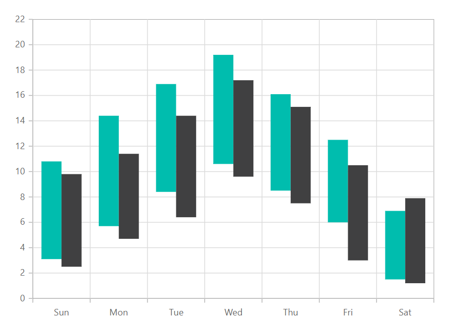

# Range Column Chart in Blazor Charts (SfCharts)

## Range Column

[`Range Column Chart`](https://www.syncfusion.com/blazor-components/blazor-charts/chart-types/range-column-chart) visualizes the variations in the data values for a given time using vertical bars. To render a [`Range Column Chart`](https://help.syncfusion.com/cr/blazor/Syncfusion.Blazor.Charts.ChartSeriesType.html#Syncfusion_Blazor_Charts_ChartSeriesType_RangeColumn), use series [`Type`](https://help.syncfusion.com/cr/blazor/Syncfusion.Blazor~Syncfusion.Blazor.Charts.ChartSeries~Type.html) as [`RangeColumn`](https://help.syncfusion.com/cr/blazor/Syncfusion.Blazor.Charts.ChartSeriesType.html#Syncfusion_Blazor_Charts_ChartSeriesType_RangeColumn).



@using Syncfusion.Blazor.Charts

<SfChart>
    <ChartPrimaryXAxis ValueType="Syncfusion.Blazor.Charts.ValueType.Category"></ChartPrimaryXAxis>

    <ChartSeriesCollection>
        <ChartSeries DataSource="@WeatherReport1" XName="X" High="High" Low="Low" Width="2" Type="ChartSeriesType.RangeColumn">
        </ChartSeries>
        <ChartSeries DataSource="@WeatherReport2" XName="X" High="High" Low="Low" Width="2" Type="ChartSeriesType.RangeColumn">
        </ChartSeries>
    </ChartSeriesCollection>
</SfChart>

@code{
    public class ChartData
    {
        public string X { get; set; }
        public double Low { get; set; }
        public double High { get; set; }
    }
    public List<ChartData> WeatherReport1 = new List<ChartData>
{
        new ChartData { X= "Sun", Low= 3.1, High= 10.8 },
        new ChartData { X= "Mon", Low= 5.7, High= 14.4 },
        new ChartData { X= "Tue", Low= 8.4, High= 16.9 },
        new ChartData { X= "Wed", Low= 10.6, High= 19.2 },
        new ChartData { X= "Thu", Low= 8.5, High= 16.1 },
        new ChartData { X= "Fri", Low= 6.0, High= 12.5 },
        new ChartData { X= "Sat", Low= 1.5, High= 6.9 }
    };

    public List<ChartData> WeatherReport2 = new List<ChartData>
{
        new ChartData { X= "Sun", Low= 2.5, High= 9.8 },
        new ChartData { X= "Mon", Low= 4.7, High= 11.4 },
        new ChartData { X= "Tue", Low= 6.4, High= 14.4 },
        new ChartData { X= "Wed", Low= 9.6, High= 17.2 },
        new ChartData { X= "Thu", Low= 7.5, High= 15.1 },
        new ChartData { X= "Fri", Low= 3.0, High= 10.5 },
        new ChartData { X= "Sat", Low= 1.2, High= 7.9 }
    };
}



> Refer to our [`Blazor Range Column Chart`](https://www.syncfusion.com/blazor-components/blazor-charts/chart-types/range-column-chart) feature tour page to know about its other groundbreaking feature representations. Explore our [`Blazor Range Column Chart Example`](https://blazor.syncfusion.com/demos/chart/range-column?theme=bootstrap4) to know how to show variations in the data values for a given time.

## Series Customization

The following properties can be used to customize the [`Range Column`](https://help.syncfusion.com/cr/blazor/Syncfusion.Blazor.Charts.ChartSeriesType.html#Syncfusion_Blazor_Charts_ChartSeriesType_RangeColumn) series.

* [`Fill`](https://help.syncfusion.com/cr/blazor/Syncfusion.Blazor.Charts.ChartSeries.html#Syncfusion_Blazor_Charts_ChartSeries_Fill) – Specifies the color of the series.
* [`Opacity`](https://help.syncfusion.com/cr/blazor/Syncfusion.Blazor.Charts.ChartSeries.html#Syncfusion_Blazor_Charts_ChartSeries_Opacity) – Specifies the opacity of [`Fill`](https://help.syncfusion.com/cr/blazor/Syncfusion.Blazor.Charts.ChartSeries.html#Syncfusion_Blazor_Charts_ChartSeries_Fill).
* [`DashArray`](https://help.syncfusion.com/cr/blazor/Syncfusion.Blazor.Charts.ChartSeries.html#Syncfusion_Blazor_Charts_ChartSeries_DashArray) – Specifies the dashes of series border.
* [`ChartSeriesBorder`](https://help.syncfusion.com/cr/blazor/Syncfusion.Blazor.Charts.ChartSeriesBorder.html) – Specifies the [`Color`](https://help.syncfusion.com/cr/blazor/Syncfusion.Blazor.Charts.ChartCommonBorder.html#Syncfusion_Blazor_Charts_ChartCommonBorder_Color) and [`Width`](https://help.syncfusion.com/cr/blazor/Syncfusion.Blazor.Charts.ChartCommonBorder.html#Syncfusion_Blazor_Charts_ChartCommonBorder_Width) of series border.
* [`ColumnSpacing`](https://help.syncfusion.com/cr/blazor/Syncfusion.Blazor.Charts.ChartSeries.html#Syncfusion_Blazor_Charts_ChartSeries_ColumnSpacing) – Specifies the space between the series segments.



@using  Syncfusion.Blazor.Charts

<SfChart>
    <ChartPrimaryXAxis ValueType="Syncfusion.Blazor.Charts.ValueType.Category"></ChartPrimaryXAxis>
    <ChartSeriesCollection>
        <ChartSeries DataSource="@WeatherReport1" XName="X" High="High" Low="Low" Width="2" Type="ChartSeriesType.RangeColumn" Fill="green" ColumnSpacing="0.4" DashArray="5,5" Opacity="0.7">
            <ChartSeriesBorder Width="2" Color="green"></ChartSeriesBorder>
        </ChartSeries>
        <ChartSeries DataSource="@WeatherReport2" XName="X" High="High" Low="Low" Width="2" Type="ChartSeriesType.RangeColumn" Fill="red" ColumnSpacing="0.4" DashArray="5,5" Opacity="0.7">
            <ChartSeriesBorder Width="2" Color="red"></ChartSeriesBorder>
        </ChartSeries>
    </ChartSeriesCollection>
</SfChart>

@code{ 
    public class ChartData
    {

        public string X { get; set; }
        public double Low { get; set; }
        public double High { get; set; }
    }
    
    public List<ChartData> WeatherReport1 = new List<ChartData>
    {
        new  ChartData { X=  "Sun", Low=  3.1, High=  10.8 },
        new  ChartData { X=  "Mon", Low=  5.7, High=  14.4 },
        new  ChartData { X=  "Tue", Low=  8.4, High=  16.9 },
        new  ChartData { X=  "Wed", Low=  10.6, High=  19.2 },
        new  ChartData { X=  "Thu", Low=  8.5, High=  16.1 },
        new  ChartData { X=  "Fri", Low=  6.0, High=  12.5 },
        new  ChartData { X=  "Sat", Low=  1.5, High=  6.9 }
    };

    public List<ChartData> WeatherReport2 = new List<ChartData>
    {
        new  ChartData { X=  "Sun", Low=  2.5, High=  9.8 },
        new  ChartData { X=  "Mon", Low=  4.7, High=  11.4 },
        new  ChartData { X=  "Tue", Low=  6.4, High=  14.4 },
        new  ChartData { X=  "Wed", Low=  9.6, High=  17.2 },
        new  ChartData { X=  "Thu", Low=  7.5, High=  15.1 },
        new  ChartData { X=  "Fri", Low=  3.0, High=  10.5 },
        new  ChartData { X=  "Sat", Low=  1.2, High=  7.9 } 
    }; 
}



> Refer to our [`Blazor Charts`](https://www.syncfusion.com/blazor-components/blazor-charts) feature tour page for its groundbreaking feature representations and also explore our [`Blazor Chart example`](https://blazor.syncfusion.com/demos/chart/line?theme=bootstrap4) to know various chart types and how to represent time-dependent data, showing trends at equal intervals.

## See Also

* [Data Label](../data-labels)

* [Tooltip](../tool-tip)