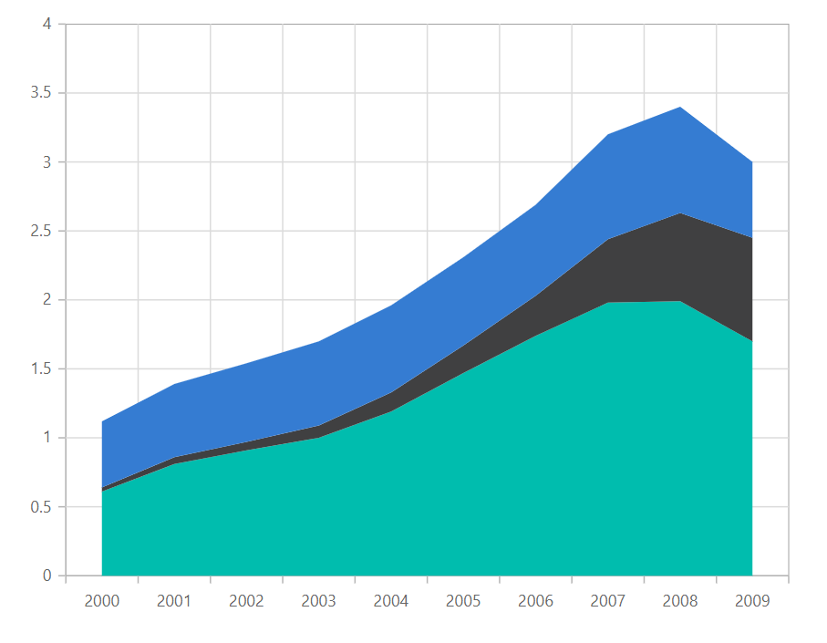
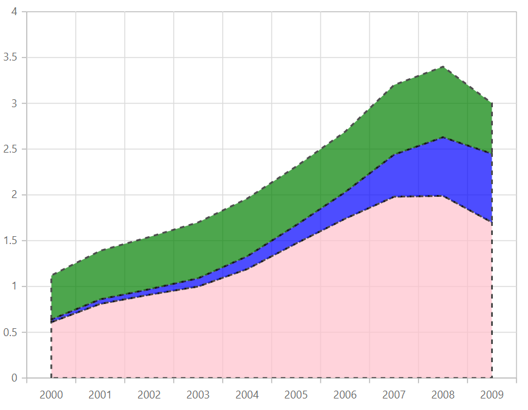

# Stacked Area in Blazor Charts Component

## Stacked Area

[`Blazor Stacked Area Chart`](https://www.syncfusion.com/blazor-components/blazor-charts/chart-types/stacked-area-chart) is a chart with Y values stacked over one another in the series order. It shows the relation between individual values to the total sum of the points. To render a [`Stacked Area`](https://www.syncfusion.com/blazor-components/blazor-charts/chart-types/stacked-area-chart) series, set the series [`Type`](https://help.syncfusion.com/cr/blazor/Syncfusion.Blazor.Charts.ChartSeries.html#Syncfusion_Blazor_Charts_ChartSeries_Type) as [`StackingArea`](https://help.syncfusion.com/cr/blazor/Syncfusion.Blazor.Charts.ChartSeriesType.html#Syncfusion_Blazor_Charts_ChartSeriesType_StackingArea).

```cshtml

@using Syncfusion.Blazor.Charts

<SfChart>
    <ChartPrimaryXAxis ValueType="Syncfusion.Blazor.Charts.ValueType.Category"/>
	
    <ChartSeriesCollection>
        <ChartSeries DataSource="@MedalDetails" XName="X" YName="Y" Type="ChartSeriesType.StackingArea"/>    
        <ChartSeries DataSource="@MedalDetails" XName="X" YName="Y1" Type="ChartSeriesType.StackingArea"/>
        <ChartSeries DataSource="@MedalDetails" XName="X" YName="Y2" Type="ChartSeriesType.StackingArea"/> 
    </ChartSeriesCollection>
</SfChart>

@code{
    public class ChartData
    {
        public double X { get; set; }
        public double Y { get; set; }
        public double Y1 { get; set; }
        public double Y2 { get; set; }
    }
	
    public List<ChartData> MedalDetails = new List<ChartData>
	{
        new ChartData{ X=2000, Y= 0.61, Y1= 0.03, Y2= 0.48},
        new ChartData{ X=2001, Y= 0.81, Y1= 0.05, Y2= 0.53 },
        new ChartData{ X=2002, Y= 0.91, Y1= 0.06, Y2= 0.57 },
        new ChartData{ X=2003, Y= 1, Y1= 0.09, Y2= 0.61 },
        new ChartData{ X=2004, Y= 1.19, Y1= 0.14, Y2= 0.63 },
        new ChartData{ X=2005, Y= 1.47, Y1= 0.20, Y2= 0.64 },
        new ChartData{ X=2006, Y= 1.74, Y1= 0.29, Y2= 0.66 },
        new ChartData{ X=2007, Y= 1.98, Y1= 0.46, Y2= 0.76 },
        new ChartData{ X=2008, Y= 1.99, Y1= 0.64, Y2= 0.77 },
        new ChartData{ X=2009, Y= 1.70, Y1= 0.75, Y2= 0.55 }
    };
}

``` 



> Refer to our [`Blazor Stacked Area Chart`](https://www.syncfusion.com/blazor-components/blazor-charts/chart-types/stacked-area-chart) feature tour page to know about its other groundbreaking feature representations. Explore our [`Blazor Stacked Area Chart Example`](https://blazor.syncfusion.com/demos/chart/stacked-area?theme=bootstrap4) to know how to to render and configure the Stacked Area type chart.

## Series Customization

The following properties can be used to customize the [`Stacked Area`](https://help.syncfusion.com/cr/blazor/Syncfusion.Blazor.Charts.ChartSeriesType.html#Syncfusion_Blazor_Charts_ChartSeriesType_StackingArea) series.

* [`Fill`](https://help.syncfusion.com/cr/blazor/Syncfusion.Blazor.Charts.ChartSeries.html#Syncfusion_Blazor_Charts_ChartSeries_Fill) – Specifies the color of the series.
* [`Opacity`](https://help.syncfusion.com/cr/blazor/Syncfusion.Blazor.Charts.ChartSeries.html#Syncfusion_Blazor_Charts_ChartSeries_Opacity) – Specifies the opacity of [`Fill`](https://help.syncfusion.com/cr/blazor/Syncfusion.Blazor.Charts.ChartSeries.html#Syncfusion_Blazor_Charts_ChartSeries_Fill).
* [`DashArray`](https://help.syncfusion.com/cr/blazor/Syncfusion.Blazor.Charts.ChartSeries.html#Syncfusion_Blazor_Charts_ChartSeries_DashArray) – Specifies the dashes of series border.
* [`ChartSeriesBorder`](https://help.syncfusion.com/cr/blazor/Syncfusion.Blazor.Charts.ChartSeriesBorder.html) – Specifies the [`Color`](https://help.syncfusion.com/cr/blazor/Syncfusion.Blazor.Charts.ChartCommonBorder.html#Syncfusion_Blazor_Charts_ChartCommonBorder_Color) and [`Width`](https://help.syncfusion.com/cr/blazor/Syncfusion.Blazor.Charts.ChartCommonBorder.html#Syncfusion_Blazor_Charts_ChartCommonBorder_Width) of series border.

```cshtml

@using Syncfusion.Blazor.Charts

<SfChart>
    <ChartPrimaryXAxis ValueType="Syncfusion.Blazor.Charts.ValueType.Category" />
	
    <ChartSeriesCollection>
        <ChartSeries DataSource="@MedalDetails" XName="X" YName="Y" Fill="pink" Opacity="0.7" DashArray="5,5" Type="ChartSeriesType.StackingArea">
            <ChartSeriesBorder Width="2" Color="black"></ChartSeriesBorder>
        </ChartSeries>
        <ChartSeries DataSource="@MedalDetails" XName="X" YName="Y1" Fill="blue" Opacity="0.7" DashArray="5,5" Type="ChartSeriesType.StackingArea">
            <ChartSeriesBorder Width="2" Color="black"></ChartSeriesBorder>
        </ChartSeries>
        <ChartSeries DataSource="@MedalDetails" XName="X" YName="Y2" Fill="green" Opacity="0.7" DashArray="5,5" Type="ChartSeriesType.StackingArea">
            <ChartSeriesBorder Width="2" Color="black"></ChartSeriesBorder>
        </ChartSeries>
    </ChartSeriesCollection>
</SfChart>

@code{
    public class ChartData
    {
        public double X { get; set; }
        public double Y { get; set; }
        public double Y1 { get; set; }
        public double Y2 { get; set; }
    }
	
    public List<ChartData> MedalDetails = new List<ChartData>
	{
          new ChartData{ X=2000, Y= 0.61, Y1= 0.03, Y2= 0.48},
          new ChartData{ X=2001, Y= 0.81, Y1= 0.05, Y2= 0.53 },
          new ChartData{ X=2002, Y= 0.91, Y1= 0.06, Y2= 0.57 },
          new ChartData{ X=2003, Y= 1, Y1= 0.09, Y2= 0.61 },
          new ChartData{ X=2004, Y= 1.19, Y1= 0.14, Y2= 0.63 },
          new ChartData{ X=2005, Y= 1.47, Y1= 0.20, Y2= 0.64 },
          new ChartData{ X=2006, Y= 1.74, Y1= 0.29, Y2= 0.66 },
          new ChartData{ X=2007, Y= 1.98, Y1= 0.46, Y2= 0.76 },
          new ChartData{ X=2008, Y= 1.99, Y1= 0.64, Y2= 0.77 },
          new ChartData{ X=2009, Y= 1.70, Y1= 0.75, Y2= 0.55 }
    };
}

``` 



> Refer to our [`Blazor Charts`](https://www.syncfusion.com/blazor-components/blazor-charts) feature tour page for its groundbreaking feature representations and also explore our [`Blazor Chart Example`](https://blazor.syncfusion.com/demos/chart/line?theme=bootstrap4) to know various chart types and how to represent time-dependent data, showing trends at equal intervals.

## See Also

* [Data Label](../data-labels)
* [Tooltip](../tool-tip)