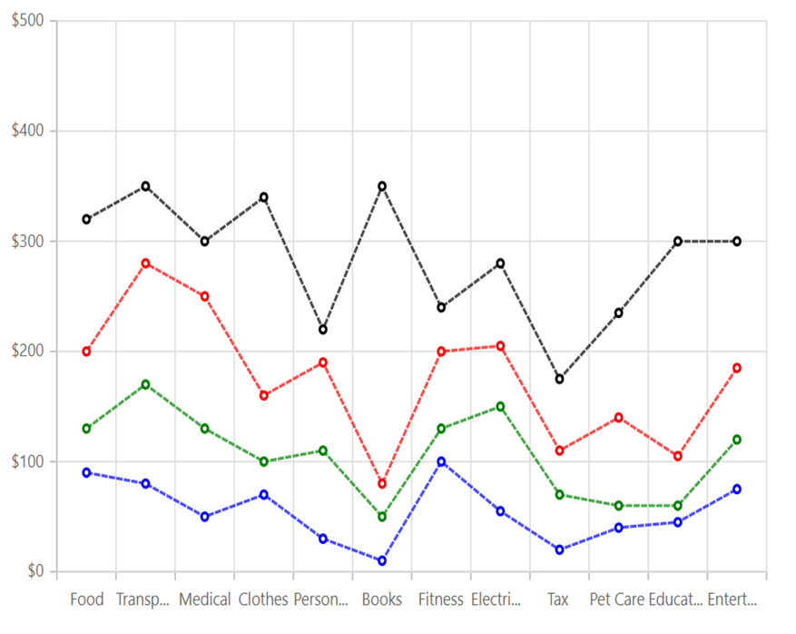

# Stacked Line Chart in Blazor Charts Component

## Stacked Line

[`Stacked Line Chart`](https://www.syncfusion.com/blazor-components/blazor-charts/chart-types/stacked-line-chart) is a chart with Y values stacked over one another in the series order. It shows the relation between individual values to the total sum of the points. To render a [`Stacked Line`](https://www.syncfusion.com/blazor-components/blazor-charts/chart-types/stacked-line-chart) series, set the series [`Type`](https://help.syncfusion.com/cr/blazor/Syncfusion.Blazor.Charts.ChartSeries.html#Syncfusion_Blazor_Charts_ChartSeries_Type) as [`StackingLine`](https://help.syncfusion.com/cr/blazor/Syncfusion.Blazor.Charts.ChartSeriesType.html#Syncfusion_Blazor_Charts_ChartSeriesType_StackingLine).



```cshtml

@using Syncfusion.Blazor.Charts

<SfChart Title="Family Expense for Month">
    <ChartPrimaryXAxis ValueType="Syncfusion.Blazor.Charts.ValueType.Category" Interval="1">
    </ChartPrimaryXAxis>
	
    <ChartPrimaryYAxis Title="Expense" Interval="100" LabelFormat="${value}">
    </ChartPrimaryYAxis>

    <ChartArea>
        <ChartAreaBorder Width="0"></ChartAreaBorder>
    </ChartArea>

    <ChartSeriesCollection>
        <ChartSeries XName="X" DataSource="@ExpenseReports"
                     YName="Y" Type="ChartSeriesType.StackingLine">
            <ChartMarker Visible="true">
            </ChartMarker>
        </ChartSeries>
        <ChartSeries XName="X" DataSource="@ExpenseReports"
                     YName="Y1" Type="ChartSeriesType.StackingLine">
            <ChartMarker Visible="true">
            </ChartMarker>
        </ChartSeries>
        <ChartSeries XName="X" DataSource="@ExpenseReports"
                     YName="Y2" Type="ChartSeriesType.StackingLine">
            <ChartMarker Visible="true">
            </ChartMarker>
        </ChartSeries>
        <ChartSeries XName="X" DataSource="@ExpenseReports"
                     YName="Y3" Type="ChartSeriesType.StackingLine">
            <ChartMarker Visible="true">
            </ChartMarker>
        </ChartSeries>
    </ChartSeriesCollection>
</SfChart>

@code{
    public class ChartData
    {
        public string X { get; set; }
        public double Y { get; set; }
        public double Y1 { get; set; }
        public double Y2 { get; set; }
        public double Y3 { get; set; }
    }
	
    public List<ChartData> ExpenseReports = new List<ChartData>
	{
        new ChartData { X = "Food" , Y = 90, Y1 = 40 , Y2= 70, Y3= 120},
        new ChartData { X = "Transport", Y = 80, Y1 = 90, Y2= 110, Y3= 70 },
        new ChartData { X = "Medical",Y = 50, Y1 = 80, Y2= 120, Y3= 50 },
        new ChartData { X = "Clothes",Y = 70, Y1 = 30, Y2= 60, Y3= 180 },
        new ChartData { X = "Personal Care", Y = 30, Y1 = 80, Y2= 80, Y3= 30 },
        new ChartData { X = "Books", Y = 10, Y1 = 40, Y2= 30, Y3= 270},
        new ChartData { X = "Fitness",Y = 100, Y1 = 30, Y2= 70, Y3= 40 },
        new ChartData { X = "Electricity", Y = 55, Y1 = 95, Y2= 55, Y3= 75},
        new ChartData { X = "Tax", Y = 20, Y1 = 50, Y2= 40, Y3= 65 },
        new ChartData { X = "Pet Care", Y = 40, Y1 = 20, Y2= 80, Y3= 95 },
        new ChartData { X = "Education", Y = 45, Y1 = 15, Y2= 45, Y3= 195 },
        new ChartData { X = "Entertainment", Y = 75, Y1 = 45, Y2= 65, Y3= 115 }
    };
}

``` 


> Refer to our [`Blazor Stacked Line Chart`](https://www.syncfusion.com/blazor-components/blazor-charts/chart-types/stacked-line-chart) feature tour page to know about its other groundbreaking feature representations. Explore our [`Blazor Stacked Line Chart Example`](https://blazor.syncfusion.com/demos/chart/stacked-line?theme=bootstrap4) to know how to render and configure the Stacked Line type chart.

## Series Customization

The following properties can be used to customize the [`Stacked Line`](https://help.syncfusion.com/cr/blazor/Syncfusion.Blazor.Charts.ChartSeriesType.html#Syncfusion_Blazor_Charts_ChartSeriesType_StackingLine) series.

* [`Fill`](https://help.syncfusion.com/cr/blazor/Syncfusion.Blazor.Charts.ChartSeries.html#Syncfusion_Blazor_Charts_ChartSeries_Fill) – Specifies the color of the series.
* [`Opacity`](https://help.syncfusion.com/cr/blazor/Syncfusion.Blazor.Charts.ChartSeries.html#Syncfusion_Blazor_Charts_ChartSeries_Opacity) – Specifies the opacity of [`Fill`](https://help.syncfusion.com/cr/blazor/Syncfusion.Blazor.Charts.ChartSeries.html#Syncfusion_Blazor_Charts_ChartSeries_Fill).
* [`Width`](https://help.syncfusion.com/cr/blazor/Syncfusion.Blazor.Charts.ChartSeries.html#Syncfusion_Blazor_Charts_ChartSeries_Width) – Specifies the width of the line stroke.
* [`DashArray`](https://help.syncfusion.com/cr/blazor/Syncfusion.Blazor.Charts.ChartSeries.html#Syncfusion_Blazor_Charts_ChartSeries_DashArray) – Specifies the dashes of line stroke.

```cshtml

@using Syncfusion.Blazor.Charts

<SfChart Title="Family Expense for Month">
    <ChartPrimaryXAxis ValueType="Syncfusion.Blazor.Charts.ValueType.Category" Interval="1">
    </ChartPrimaryXAxis>
	
    <ChartPrimaryYAxis Title="Expense" Interval="100" LabelFormat="${value}">
    </ChartPrimaryYAxis>

    <ChartArea>
        <ChartAreaBorder Width="0"></ChartAreaBorder>
    </ChartArea>

    <ChartSeriesCollection>
        <ChartSeries XName="X" Width="2" DashArray="5,1" DataSource="@ExpenseReports"
                     YName="Y" Fill="blue" Opacity="0.7" Type="ChartSeriesType.StackingLine">
            <ChartMarker Visible="true">
            </ChartMarker>
        </ChartSeries>
        <ChartSeries XName="X" Width="2" DashArray="5,1" DataSource="@ExpenseReports"
                     YName="Y1" Fill="green" Opacity="0.7" Type="ChartSeriesType.StackingLine">
            <ChartMarker Visible="true">
            </ChartMarker>
        </ChartSeries>
        <ChartSeries XName="X" Width="2" DashArray="5,1" DataSource="@ExpenseReports"
                     YName="Y2" Fill="red" Opacity="0.7" Type="ChartSeriesType.StackingLine">
            <ChartMarker Visible="true">
            </ChartMarker>
        </ChartSeries>
        <ChartSeries XName="X" Width="2" DashArray="5,1" DataSource="@ExpenseReports"
                     YName="Y3" Fill="black" Opacity="0.7" Type="ChartSeriesType.StackingLine">
            <ChartMarker Visible="true">
            </ChartMarker>
        </ChartSeries>
    </ChartSeriesCollection>
</SfChart>

@code{
    public class ChartData
    {
        public string X { get; set; }
        public double Y { get; set; }
        public double Y1 { get; set; }
        public double Y2 { get; set; }
        public double Y3 { get; set; }
    }
	
    public List<ChartData> ExpenseReports = new List<ChartData>
	{
         new ChartData { X = "Food" , Y = 90, Y1 = 40 , Y2= 70, Y3= 120},
         new ChartData { X = "Transport", Y = 80, Y1 = 90, Y2= 110, Y3= 70 },
         new ChartData { X = "Medical",Y = 50, Y1 = 80, Y2= 120, Y3= 50 },
         new ChartData { X = "Clothes",Y = 70, Y1 = 30, Y2= 60, Y3= 180 },
         new ChartData { X = "Personal Care", Y = 30, Y1 = 80, Y2= 80, Y3= 30 },
         new ChartData { X = "Books", Y = 10, Y1 = 40, Y2= 30, Y3= 270},
         new ChartData { X = "Fitness",Y = 100, Y1 = 30, Y2= 70, Y3= 40 },
         new ChartData { X = "Electricity", Y = 55, Y1 = 95, Y2= 55, Y3= 75},
         new ChartData { X = "Tax", Y = 20, Y1 = 50, Y2= 40, Y3= 65 },
         new ChartData { X = "Pet Care", Y = 40, Y1 = 20, Y2= 80, Y3= 95 },
         new ChartData { X = "Education", Y = 45, Y1 = 15, Y2= 45, Y3= 195 },
         new ChartData { X = "Entertainment", Y = 75, Y1 = 45, Y2= 65, Y3= 115 }
    };
}

``` 



> Refer to our [`Blazor Charts`](https://www.syncfusion.com/blazor-components/blazor-charts) feature tour page for its groundbreaking feature representations and also explore our [`Blazor Chart Example`](https://blazor.syncfusion.com/demos/chart/line?theme=bootstrap4) to know various chart types and how to represent time-dependent data, showing trends at equal intervals.

## See Also

* [Data Label](../data-labels)
* [Tooltip](../tool-tip)