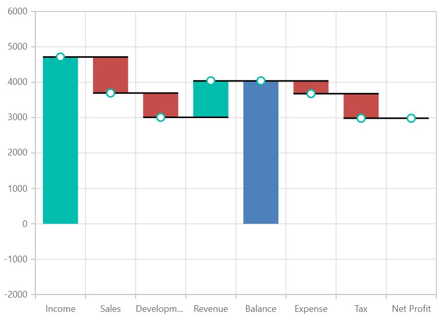
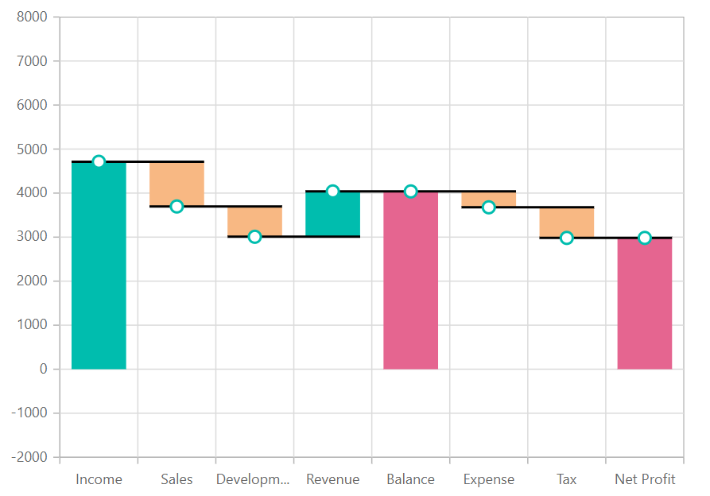

# Waterfall Chart in Blazor Charts (SfCharts)

## Waterfall

[`Blazor Waterfall Chart`](https://blazor.syncfusion.com/demos/chart/waterfall?theme=bootstrap4) helps to understand the cumulative effect of the sequentially introduced positive and negative values. To render a [`Waterfall`](https://blazor.syncfusion.com/demos/chart/waterfall?theme=bootstrap4) series, use series [`Type`](https://help.syncfusion.com/cr/blazor/Syncfusion.Blazor~Syncfusion.Blazor.Charts.ChartSeries~Type.html) as [`Waterfall`](https://help.syncfusion.com/cr/blazor/Syncfusion.Blazor.Charts.ChartSeriesType.html#Syncfusion_Blazor_Charts_ChartSeriesType_Waterfall). [`IntermediateSumIndexes`](https://help.syncfusion.com/cr/blazor/Syncfusion.Blazor.Charts.ChartSeries.html#Syncfusion_Blazor_Charts_ChartSeries_IntermediateSumIndexes) property of waterfall is used to represent the in between sum values and [`SumIndexes`](https://help.syncfusion.com/cr/blazor/Syncfusion.Blazor.Charts.ChartSeries.html#Syncfusion_Blazor_Charts_ChartSeries_SumIndexes) property is used to represent the cumulative sum values.

```csharp

@using Syncfusion.Blazor.Charts

<SfChart>
    <ChartPrimaryXAxis ValueType="Syncfusion.Blazor.Charts.ValueType.Category">
    </ChartPrimaryXAxis>

    <ChartSeriesCollection>
        <ChartSeries DataSource="@SalesReports" XName="XValue" YName="YValue" Type="ChartSeriesType.Waterfall" IntermediateSumIndexes="@index" SumIndexes="@sumIndex">
            <ChartMarker Height="10" Width="10" Visible="true"></ChartMarker>
        </ChartSeries>
    </ChartSeriesCollection>
</SfChart>

@code{
    public class ChartData
    {
        public string XValue { get; set; }
        public double YValue { get; set; }
    }

    public List<ChartData> SalesReports = new List<ChartData>
	{
            new ChartData { XValue = "Income", YValue = 4711 },
            new ChartData { XValue = "Sales", YValue = -1015 },
            new ChartData { XValue = "Development", YValue = -688 },
            new ChartData { XValue = "Revenue", YValue = 1030 },
            new ChartData { XValue = "Balance" },
            new ChartData { XValue = "Expense", YValue = -361 },
            new ChartData { XValue = "Tax", YValue = -695 },
            new ChartData { XValue = "Net Profit" },
        };
    double[] index = new double[] { 4 };
    double[] sumIndex = new double[] { 8 };
}

```



> Explore our [`Blazor Waterfall Chart Example`](https://blazor.syncfusion.com/demos/chart/waterfall?theme=bootstrap4) to know how to render a Waterfall series.

## Series Customization

The negative changes of [`Waterfall Chart`](https://blazor.syncfusion.com/demos/chart/waterfall?theme=bootstrap4) is represented by using [`NegativeFillColor`](https://help.syncfusion.com/cr/blazor/Syncfusion.Blazor~Syncfusion.Blazor.Charts.ChartSeries~NegativeFillColor.html) and the summary changes are represented by using [`SummaryFillColor`](https://help.syncfusion.com/cr/blazor/Syncfusion.Blazor~Syncfusion.Blazor.Charts.ChartSeries~SummaryFillColor.html) properties. By default, the  [`NegativeFillColor`](https://help.syncfusion.com/cr/blazor/Syncfusion.Blazor~Syncfusion.Blazor.Charts.ChartSeries~NegativeFillColor.html) is **#E94649** and the [`SummaryFillColor`](https://help.syncfusion.com/cr/blazor/Syncfusion.Blazor~Syncfusion.Blazor.Charts.ChartSeries~SummaryFillColor.html) is **#4E81BC**.

```csharp

@using Syncfusion.Blazor.Charts

<SfChart>
    <ChartPrimaryXAxis ValueType="Syncfusion.Blazor.Charts.ValueType.Category">
    </ChartPrimaryXAxis>

    <ChartSeriesCollection>
        <ChartSeries DataSource="@ExpenseDetails" XName="XValue" SummaryFillColor="#e56590" NegativeFillColor="#f8b883"
                     YName="YValue" Type="ChartSeriesType.Waterfall" IntermediateSumIndexes="@intermediateSumIndexes" SumIndexes="@sumIndexes">
            <ChartMarker Height="10" Width="10" Visible="true"></ChartMarker>
        </ChartSeries>
    </ChartSeriesCollection>
</SfChart>

@code{
    public class ChartData
    {
        public string XValue;
        public double YValue;
    }
    public List<ChartData> ExpenseDetails = new List<ChartData>
	{
        new ChartData { XValue = "Income", YValue = 4711 },
        new ChartData { XValue = "Sales", YValue = -1015 },
        new ChartData { XValue = "Development", YValue = -688 },
        new ChartData { XValue = "Revenue", YValue = 1030 },
        new ChartData { XValue = "Balance" },
        new ChartData { XValue = "Expense", YValue = -361 },
        new ChartData { XValue = "Tax", YValue = -695 },
        new ChartData { XValue = "Net Profit" },
    };
    double[] intermediateSumIndexes = new double[] { 4 };
    double[] sumIndexes = new double[] { 7 };
}

```



> Refer to our [`Blazor Charts`](https://www.syncfusion.com/blazor-components/blazor-charts) feature tour page for its groundbreaking feature representations and also explore our [`Blazor Chart example`](https://blazor.syncfusion.com/demos/chart/line?theme=bootstrap4) to know various chart types and how to represent time-dependent data, showing trends at equal intervals.

## See Also

* [Data Label](../data-labels)
* [Tooltip](../tool-tip)