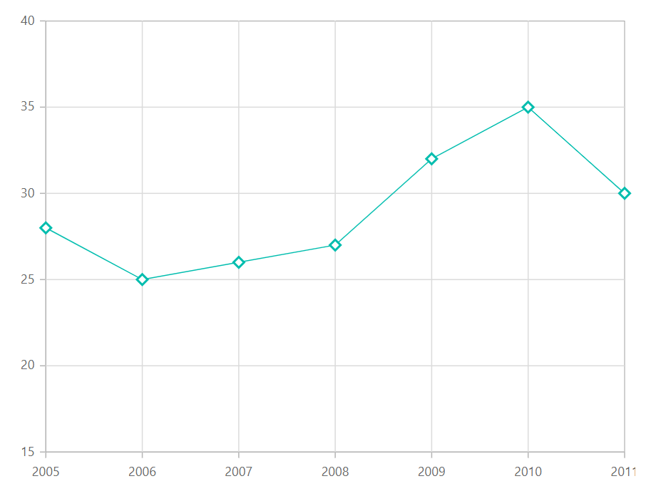
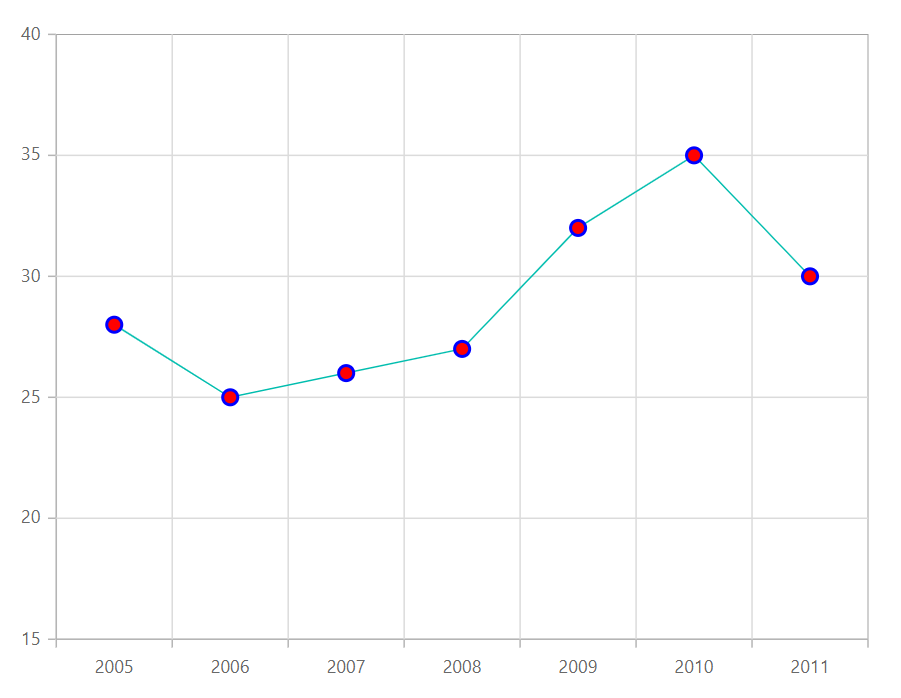

# Data Markers

Data markers are used to provide information about the data points in the series. You can add a shape to adorn each data point.

<!-- markdownlint-disable MD036 -->

## Marker

<!-- markdownlint-disable MD036 -->

Markers can be added to the points by enabling the [`Visible`](https://help.syncfusion.com/cr/blazor/Syncfusion.Blazor~Syncfusion.Blazor.Charts.ChartMarker~Visible.html)
option of the marker property.

```csharp

@using Syncfusion.Blazor.Charts

<SfChart>
    <ChartSeriesCollection>
        <ChartSeries DataSource="@ConsumerReports" XName="X" YName="Y" Type="ChartSeriesType.Line">
            <ChartMarker Visible="true" Height="10" Width="10"/>            
        </ChartSeries>
    </ChartSeriesCollection>
</SfChart>

@code{
    public class ChartData
    {
        public double X { get; set; }
        public double Y { get; set; }
    }

    public List<ChartData> ConsumerReports = new List<ChartData>
{
            new ChartData{ X= 2005, Y= 28 },
            new ChartData{ X= 2006, Y= 25 },
            new ChartData{ X= 2007, Y= 26 },
            new ChartData{ X= 2008, Y= 27 },
            new ChartData{ X= 2009, Y= 32 },
            new ChartData{ X= 2010, Y= 35 },
            new ChartData{ X= 2011, Y= 30 }
        };
}

```


## Shape

Markers can be assigned with different shapes such as Rectangle, Circle, Diamond etc using the [`Shape`](https://help.syncfusion.com/cr/blazor/Syncfusion.Blazor.Charts.ChartCommonMarker.html#Syncfusion_Blazor_Charts_ChartCommonMarker_Shape) property.

```csharp

@using Syncfusion.Blazor.Charts

<SfChart>
    <ChartSeriesCollection>
        <ChartSeries DataSource="@ConsumerReports" XName="X" YName="Y" Type="ChartSeriesType.Line">
            <ChartMarker Visible="true" Height="10" Width="10" Shape="ChartShape.Diamond"/>            
        </ChartSeries>
    </ChartSeriesCollection>
</SfChart>

@code{
    public class ChartData
    {
        public double X { get; set; }
        public double Y { get; set; }
    }

    public List<ChartData> ConsumerReports = new List<ChartData>
{
            new ChartData{ X= 2005, Y= 28 },
            new ChartData{ X= 2006, Y= 25 },
            new ChartData{ X= 2007, Y= 26 },
            new ChartData{ X= 2008, Y= 27 },
            new ChartData{ X= 2009, Y= 32 },
            new ChartData{ X= 2010, Y= 35 },
            new ChartData{ X= 2011, Y= 30 }
        };
}

```



## Images

Apart from the shapes, you can also add custom images to mark the data point using the
[`ImageUrl`](https://help.syncfusion.com/cr/blazor/Syncfusion.Blazor.Charts.ChartCommonMarker.html#Syncfusion_Blazor_Charts_ChartCommonMarker_ImageUrl) property.

```csharp

@using Syncfusion.Blazor.Charts

<SfChart>
    <ChartSeriesCollection>
        <ChartSeries DataSource="@ConsumerReports" XName="X" YName="Y" Type="ChartSeriesType.Line">
            <ChartMarker Visible="true" Height="10" Width="10" ImageUrl="https://ej2.syncfusion.com/demos/src/chart/images/cloud.png">
            </ChartMarker>
        </ChartSeries>
    </ChartSeriesCollection>
</SfChart>

@code{
    public class ChartData
    {
        public double X { get; set; }
        public double Y { get; set; }
    }

    public List<ChartData> ConsumerReports = new List<ChartData>
{
            new ChartData{ X= 2005, Y= 28 },
            new ChartData{ X= 2006, Y= 25 },
            new ChartData{ X= 2007, Y= 26 },
            new ChartData{ X= 2008, Y= 27 },
            new ChartData{ X= 2009, Y= 32 },
            new ChartData{ X= 2010, Y= 35 },
            new ChartData{ X= 2011, Y= 30 }
        };
}

```

## Customization

Marker color and border can be customized using [`Fill`](https://help.syncfusion.com/cr/blazor/Syncfusion.Blazor.Charts.ChartCommonMarker.html#Syncfusion_Blazor_Charts_ChartCommonMarker_Fill) and [`Border`](https://help.syncfusion.com/cr/blazor/Syncfusion.Blazor.Charts.ChartCommonMarker.html#Syncfusion_Blazor_Charts_ChartCommonMarker_Border) properties.

```csharp

@using Syncfusion.Blazor.Charts

<SfChart>
    <ChartPrimaryXAxis ValueType="Syncfusion.Blazor.Charts.ValueType.Category">
    </ChartPrimaryXAxis>

    <ChartSeriesCollection>
        <ChartSeries DataSource="@ConsumerReports" XName="X" YName="Y" Type="ChartSeriesType.Line">
            <ChartMarker Visible="true" Height="10" Width="10" Fill="red">
                <ChartMarkerBorder Width="2" Color="blue"></ChartMarkerBorder>
            </ChartMarker>
        </ChartSeries>
    </ChartSeriesCollection>
</SfChart>

@code{
    public class ChartData
    {
        public double X { get; set; }
        public double Y { get; set; }
    }

    public List<ChartData> ConsumerReports = new List<ChartData>
{
            new ChartData{ X= 2005, Y= 28 },
            new ChartData{ X= 2006, Y= 25 },
            new ChartData{ X= 2007, Y= 26 },
            new ChartData{ X= 2008, Y= 27 },
            new ChartData{ X= 2009, Y= 32 },
            new ChartData{ X= 2010, Y= 35 },
            new ChartData{ X= 2011, Y= 30 }
        };
}

```



> Note: You can refer to our [`Blazor Charts`](https://www.syncfusion.com/blazor-components/blazor-charts) feature tour page for its groundbreaking feature representations. You can also explore our [`Blazor Chart example`](https://blazor.syncfusion.com/demos/chart/line?theme=bootstrap4) to knows various chart types and how to represent time-dependent data, showing trends in data at equal intervals.

## See Also

* [Tooltip](./tool-tip)
* [Legend](./legend)