<!-- markdownlint-disable MD040 -->

# Blazor Chart Component in Client Side (WebAssembly) App

This article provides a step-by-step instructions to configure Syncfusion Blazor Chart in a simple Blazor WebAssembly application using Visual Studio 2019.

## Create a Blazor WebAssembly project in Visual Studio 2019

1. Choose **Create a new project** from the Visual Studio dashboard.

    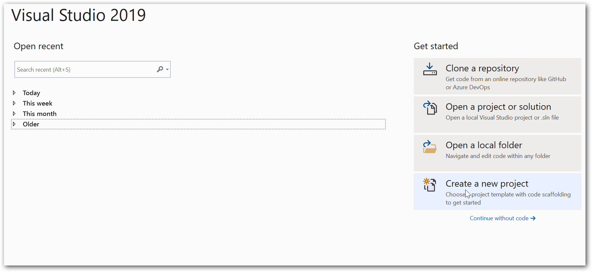

2. Select **Blazor App** from the template and click **Next** button.

    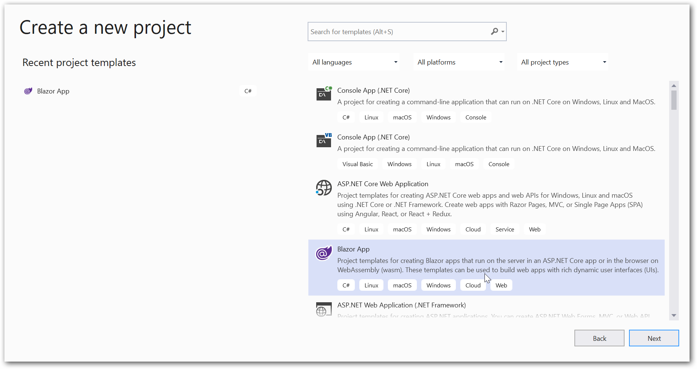

3. Now, the project configuration window will popup. Click **Create** button to create a new project with the default project configuration.

    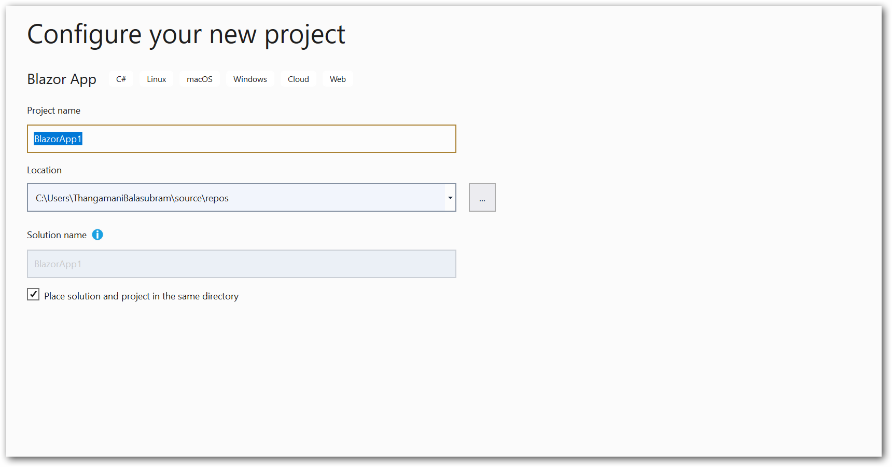

4. Depending on the requirement, select **.NET Core 3.1 or higher** as the target framework.

    

5. Choose **Blazor WebAssembly App** from the dashboard and click **Create** button to create a new Blazor WebAssembly application.

    

## Importing Syncfusion Blazor component in the application

1. Now, install **Syncfusion.Blazor** NuGet package to the newly created application by using the **NuGet Package Manager**. Right-click the project and select **Manage NuGet Packages**.

    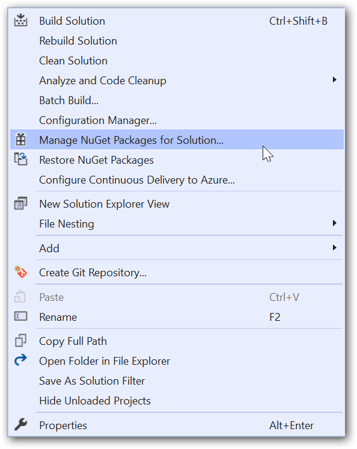

2. Search **Syncfusion.Blazor** keyword in the **Browser** tab and install Syncfusion.Blazor NuGet package in the application.

    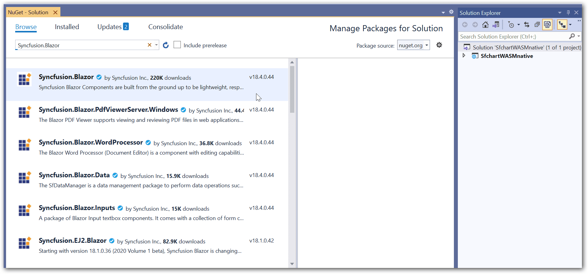

3. You can add the client-side resources through CDN or from NuGet package in the **HEAD** element of the **~/wwwroot/index.html** page. For Internet Explorer 11, kindly refer the polyfills.

    ```html
    <head>
        ....
        ....
        <script src="https://github.com/Daddoon/Blazor.Polyfill/releases/download/3.0.1/blazor.polyfill.min.js"></script>
    </head>
    ```

4. Now add the lodash script to the **HEAD** element of the **~/wwwroot/index.html** page, since we have used it in our [chart interactive]([https://www.syncfusion.com/blazor-components/blazor-charts/interactive-chart]) features. The absence of the script will result in console errors.

    ```html
    <head>
        ....
        ....
        <script src="https://github.com/Daddoon/Blazor.Polyfill/releases/download/3.0.1/blazor.polyfill.min.js"></script>
        <script src="https://cdnjs.cloudflare.com/ajax/libs/lodash.js/4.17.20/lodash.min.js"></script>
    </head>
    ```

## Adding component package to the application

Open `**~/_Imports.razor` file and include the `Syncfusion.Blazor.**` namespaces.

```cshtml
@using Syncfusion.Blazor
@using Syncfusion.Blazor.Charts
```

## Add SyncfusionBlazor service in Startup.cs

Open the **~/Program.cs** file and register the Syncfusion Blazor Service.

```csharp
using Syncfusion.Blazor;

namespace WebApplication1
{
    public class Program
    {
        public static async Task Main(string[] args)
        {
            ....
            ....
            builder.Services.AddSyncfusionBlazor();
            await builder.Build().RunAsync();
        }
    }
}
```

## Add Chart Component

To initialize the chart component add the below code to your **Index.razor** view page under **~/Pages** folder. In a new application, if **Index.razor** page has any default content template, then those content can be completely removed and following code can be added.

```cshtml
@page "/"

<SfChart>

</SfChart>
```

On successful compilation of your application, the Syncfusion Blazor Chart component will render in the web browser.

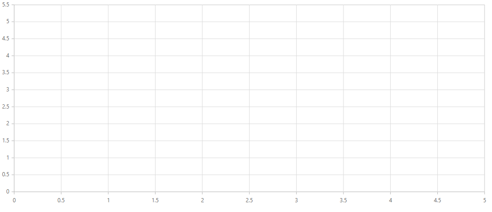

## Populate Chart with Data

To bind data for the chart component, you can assign a IEnumerable object to the [DataSource](https://help.syncfusion.com/cr/blazor/Syncfusion.Blazor.Charts.ChartSeries.html#Syncfusion_Blazor_Charts_ChartSeries_DataSource) property. It can also be provided as an instance of the [DataManager](https://help.syncfusion.com/cr/blazor/Syncfusion.Blazor.DataManager.html).

```csharp
public class SalesInfo
{
    public string Month { get; set; }
    public double SalesValue { get; set; }
}

public List<SalesInfo> Sales = new List<SalesInfo>
{
    new SalesInfo { Month = "Jan", SalesValue = 35 },
    new SalesInfo { Month = "Feb", SalesValue = 28 },
    new SalesInfo { Month = "Mar", SalesValue = 34 },
    new SalesInfo { Month = "Apr", SalesValue = 32 },
    new SalesInfo { Month = "May", SalesValue = 40 },
    new SalesInfo { Month = "Jun", SalesValue = 32 },
    new SalesInfo { Month = "Jul", SalesValue = 35 }
};
```

Now, map the data fields  `Month` and `Sales` to the series [XName](https://help.syncfusion.com/cr/blazor/Syncfusion.Blazor.Charts.ChartSeries.html#Syncfusion_Blazor_Charts_ChartSeries_XName) and [YName](https://help.syncfusion.com/cr/blazor/Syncfusion.Blazor.Charts.ChartSeries.html#Syncfusion_Blazor_Charts_ChartSeries_YName) properties, then set the data to the [DataSource](https://help.syncfusion.com/cr/blazor/Syncfusion.Blazor.Charts.ChartSeries.html#Syncfusion_Blazor_Charts_ChartSeries_DataSource) property, and the [chart type](https://help.syncfusion.com/cr/blazor/Syncfusion.Blazor.Charts.ChartSeries.html#Syncfusion_Blazor_Charts_ChartSeries_Type) to **Column** because we will be viewing the data in a column chart.

```cshtml
@page "/"
@using Syncfusion.Blazor.Charts

    <SfChart>
        <ChartPrimaryXAxis ValueType="Syncfusion.Blazor.Charts.ValueType.Category"></ChartPrimaryXAxis>
        <ChartSeriesCollection>
            <ChartSeries DataSource="@Sales" XName="Month" YName="SalesValue" Type="ChartSeriesType.Column">
            </ChartSeries>
        </ChartSeriesCollection>
    </SfChart>

@code {
    public class SalesInfo
    {
        public string Month { get; set;}
        public double SalesValue { get; set;}
    }
    
    public List<SalesInfo> Sales = new List<SalesInfo>
    {
        new SalesInfo { Month = "Jan", SalesValue = 35 },
        new SalesInfo { Month = "Feb", SalesValue = 28 },
        new SalesInfo { Month = "Mar", SalesValue = 34 },
        new SalesInfo { Month = "Apr", SalesValue = 32 },
        new SalesInfo { Month = "May", SalesValue = 40 },
        new SalesInfo { Month = "Jun", SalesValue = 32 },
        new SalesInfo { Month = "Jul", SalesValue = 35 }
    };
}
```

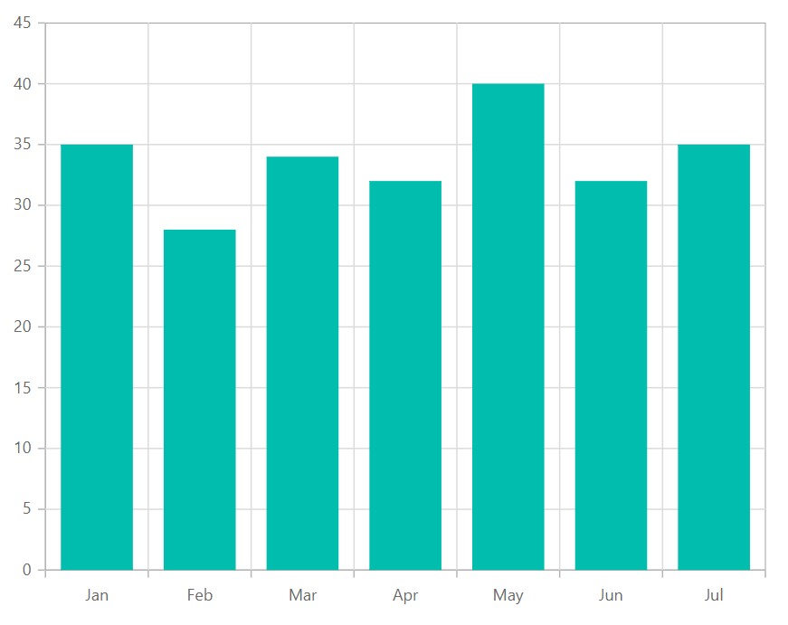

## Add Titles

Using the [Title](https://help.syncfusion.com/cr/blazor/Syncfusion.Blazor.Charts.SfChart.html#Syncfusion_Blazor_Charts_SfChart_Title) property, you can add a title to the chart and the axes to provide the user with quick information about the data plotted in the chart.

```cshtml
@page "/"
@using Syncfusion.Blazor.Charts

    <SfChart Title="Sales Analysis">
        <ChartPrimaryXAxis Title="Month" ValueType="Syncfusion.Blazor.Charts.ValueType.Category"></ChartPrimaryXAxis>
        <ChartPrimaryYAxis Title="Sales in Dollar"></ChartPrimaryYAxis>
        <ChartSeriesCollection>
            <ChartSeries DataSource="@Sales" XName="Month" YName="SalesValue" Type="ChartSeriesType.Column">
            </ChartSeries>
        </ChartSeriesCollection>
    </SfChart>

@code {
    public class SalesInfo
    {
        public string Month { get; set;}
        public double SalesValue { get; set;}
    }

    public List<SalesInfo> Sales = new List<SalesInfo>
    {
        new SalesInfo { Month = "Jan", SalesValue = 35 },
        new SalesInfo { Month = "Feb", SalesValue = 28 },
        new SalesInfo { Month = "Mar", SalesValue = 34 },
        new SalesInfo { Month = "Apr", SalesValue = 32 },
        new SalesInfo { Month = "May", SalesValue = 40 },
        new SalesInfo { Month = "Jun", SalesValue = 32 },
        new SalesInfo { Month = "Jul", SalesValue = 35 }
    };
}
```

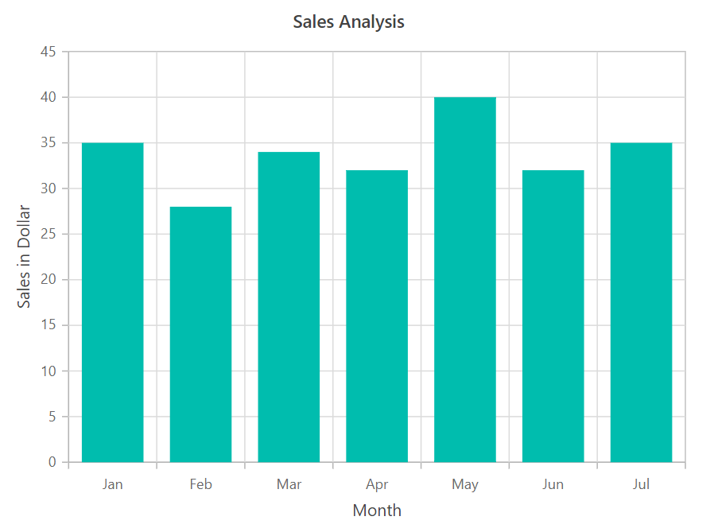

## Add Data Label

You can add data labels to improve the readability of the chart. This can be achieved by setting the [Visible](https://help.syncfusion.com/cr/blazor/Syncfusion.Blazor.Charts.ChartDataLabel.html#Syncfusion_Blazor_Charts_ChartDataLabel_Visible) property to **true** in the [ChartDataLabel](https://help.syncfusion.com/cr/blazor/Syncfusion.Blazor.Charts.ChartDataLabel.html).

```cshtml
@page "/"
@using Syncfusion.Blazor.Charts

<SfChart Title="Sales Analysis">
    <ChartPrimaryXAxis Title="Month" ValueType="Syncfusion.Blazor.Charts.ValueType.Category"></ChartPrimaryXAxis>
    <ChartPrimaryYAxis Title="Sales in Dollar"></ChartPrimaryYAxis>
    <ChartSeriesCollection>
        <ChartSeries DataSource="@Sales" XName="Month" YName="SalesValue" Type="ChartSeriesType.Column">
            <ChartMarker>
                <ChartDataLabel Visible="true"></ChartDataLabel>
            </ChartMarker>
        </ChartSeries>
    </ChartSeriesCollection>
</SfChart>

@code {
    public class SalesInfo
    {
        public string Month { get; set; }
        public double SalesValue { get; set; }
    }

    public List<SalesInfo> Sales = new List<SalesInfo>
    {
        new SalesInfo { Month = "Jan", SalesValue = 35 },
        new SalesInfo { Month = "Feb", SalesValue = 28 },
        new SalesInfo { Month = "Mar", SalesValue = 34 },
        new SalesInfo { Month = "Apr", SalesValue = 32 },
        new SalesInfo { Month = "May", SalesValue = 40 },
        new SalesInfo { Month = "Jun", SalesValue = 32 },
        new SalesInfo { Month = "Jul", SalesValue = 35 }
    };
}
```

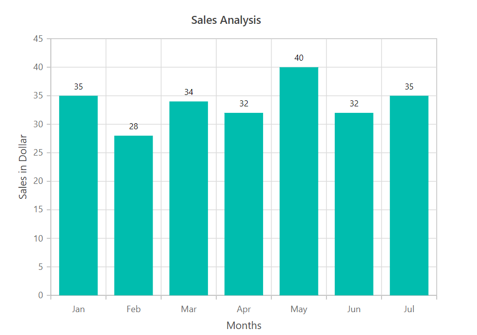

## Enable Tooltip

When space constraints prevent you from displaying information using data labels, the tooltip comes in handy. The tooltip can be enabled by setting the [Enable](https://help.syncfusion.com/cr/blazor/Syncfusion.Blazor.Charts.ChartTooltipSettings.html#Syncfusion_Blazor_Charts_ChartTooltipSettings_Enable) property in [ChartTooltipSettings](https://help.syncfusion.com/cr/blazor/Syncfusion.Blazor.Charts.ChartTooltipSettings.html) to **true**.

```cshtml
@page "/"
@using Syncfusion.Blazor.Charts

<SfChart Title="Sales Analysis">
    <ChartPrimaryXAxis Title="Month" ValueType="Syncfusion.Blazor.Charts.ValueType.Category"></ChartPrimaryXAxis>
    <ChartPrimaryYAxis Title="Sales in Dollar"></ChartPrimaryYAxis>
    <ChartTooltipSettings Enable="true"></ChartTooltipSettings>
    <ChartSeriesCollection>
        <ChartSeries DataSource="@Sales" XName="Month" YName="SalesValue" Type="ChartSeriesType.Column">
        </ChartSeries>
    </ChartSeriesCollection>
</SfChart>

@code {
    public class SalesInfo
    {
        public string Month { get; set; }
        public double SalesValue { get; set; }
    }

    public List<SalesInfo> Sales = new List<SalesInfo>
    {
        new SalesInfo { Month = "Jan", SalesValue = 35 },
        new SalesInfo { Month = "Feb", SalesValue = 28 },
        new SalesInfo { Month = "Mar", SalesValue = 34 },
        new SalesInfo { Month = "Apr", SalesValue = 32 },
        new SalesInfo { Month = "May", SalesValue = 40 },
        new SalesInfo { Month = "Jun", SalesValue = 32 },
        new SalesInfo { Month = "Jul", SalesValue = 35 }
    };
}
```

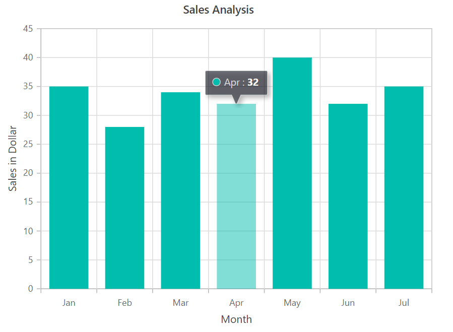

## Enable Legend

You can use legend for the chart by setting the [Visible](https://help.syncfusion.com/cr/blazor/Syncfusion.Blazor.Charts.ChartLegendSettings.html#Syncfusion_Blazor_Charts_ChartLegendSettings_Visible) property to **true** in [ChartLegendSettings](https://help.syncfusion.com/cr/blazor/Syncfusion.Blazor.Charts.ChartLegendSettings.html). The legend name can be changed by using the [Name](https://help.syncfusion.com/cr/blazor/Syncfusion.Blazor.Charts.ChartSeries.html#Syncfusion_Blazor_Charts_ChartSeries_Name) property in the series.

```cshtml
@page "/"
@using Syncfusion.Blazor.Charts

    <SfChart Title="Sales Analysis">
        <ChartPrimaryXAxis Title="Month" ValueType="Syncfusion.Blazor.Charts.ValueType.Category"></ChartPrimaryXAxis>
        <ChartPrimaryYAxis Title="Sales in Dollar"></ChartPrimaryYAxis>
        <ChartLegendSettings Visible="true"></ChartLegendSettings>
        <ChartSeriesCollection>
            <ChartSeries DataSource="@Sales" Name="Sales" XName="Month" YName="SalesValue" Type="ChartSeriesType.Column">
            </ChartSeries>
        </ChartSeriesCollection>
    </SfChart>

@code {
    public class SalesInfo
    {
        public string Month { get; set;}
        public double SalesValue { get; set;}
    }

    public List<SalesInfo> Sales = new List<SalesInfo>
    {
        new SalesInfo { Month = "Jan", SalesValue = 35 },
        new SalesInfo { Month = "Feb", SalesValue = 28 },
        new SalesInfo { Month = "Mar", SalesValue = 34 },
        new SalesInfo { Month = "Apr", SalesValue = 32 },
        new SalesInfo { Month = "May", SalesValue = 40 },
        new SalesInfo { Month = "Jun", SalesValue = 32 },
        new SalesInfo { Month = "Jul", SalesValue = 35 }
    };
}
```

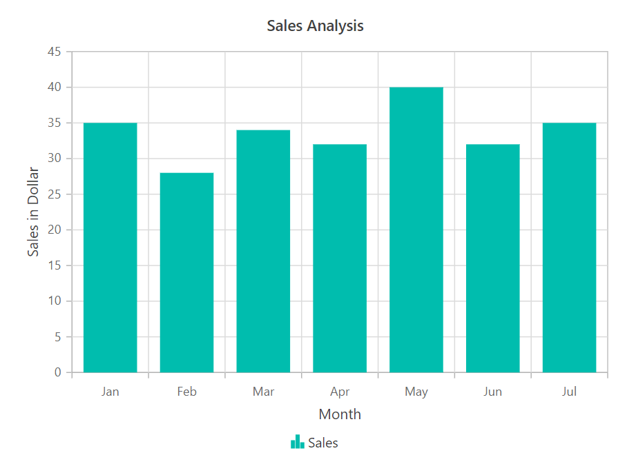

> You can find the fully working sample for chart [here](https://www.syncfusion.com/downloads/support/directtrac/general/ze/WASM1504645919.zip). And also you can refer to our [Blazor Charts](https://www.syncfusion.com/blazor-components/blazor-charts) feature tour page for its groundbreaking feature representations. You can also explore our [Blazor Chart Example](https://blazor.syncfusion.com/demos/chart/line?theme=bootstrap4) to knows various chart types and how to represent time-dependent data, showing trends in data at equal intervals.

## See also

* [Getting Started with Syncfusion Blazor for Client-Side in .NET Core CLI](https://blazor.syncfusion.com/documentation/getting-started/blazor-webassembly-dotnet-cli/)
* [Getting Started with Syncfusion Blazor for Server-Side in Visual Studio 2019 Preview](https://blazor.syncfusion.com/documentation/getting-started/blazor-server-side-visual-studio-2019/?no-cache=1)
* [Getting Started with Syncfusion Blazor for Server-Side in .NET Core CLI](https://blazor.syncfusion.com/documentation/getting-started/blazor-server-side-dotnet-cli/)