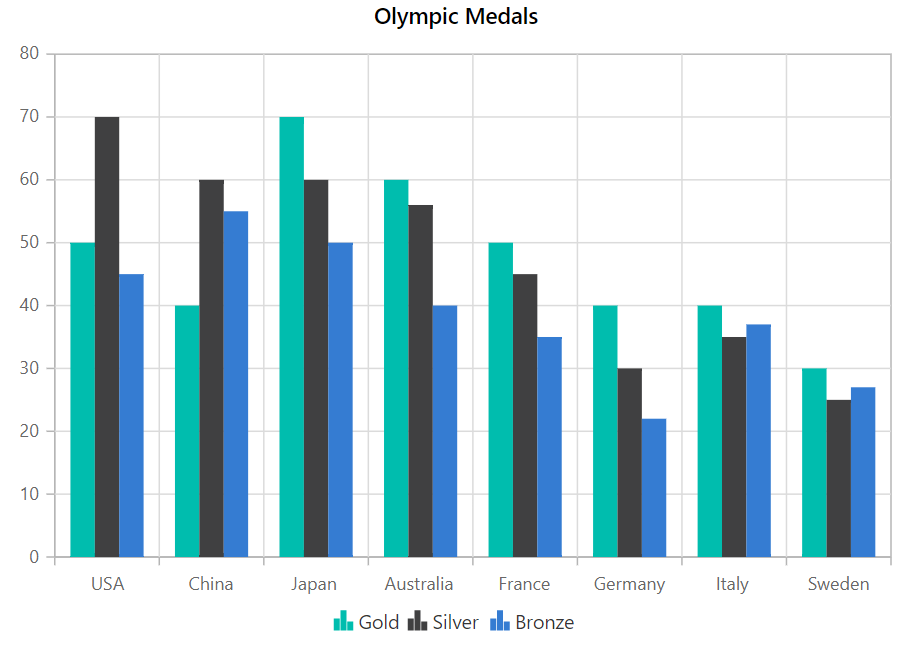
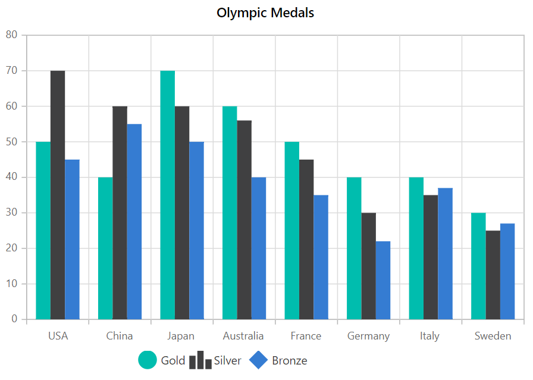

# Legend in Blazor Charts Component

Legend provides information about the series rendered in the chart.

## Enable Legend

You can use legend for the chart by setting the [`Visible`](https://help.syncfusion.com/cr/blazor/Syncfusion.Blazor.Charts.ChartLegendSettings.html#Syncfusion_Blazor_Charts_ChartLegendSettings_Visible)
property to **true** in [`ChartLegendSettings`](https://help.syncfusion.com/cr/blazor/Syncfusion.Blazor.Charts.ChartLegendSettings.html).

```csharp

@using Syncfusion.Blazor.Charts

<SfChart Title="Inflation - Consumer Price">
    <ChartPrimaryXAxis LabelFormat="yyyy" IntervalType="IntervalType.Years" ValueType="Syncfusion.Blazor.Charts.ValueType.DateTime"/>    

    <ChartSeriesCollection>
        <ChartSeries DataSource="@ConsumerReports" Name="Germany" XName="XValue" YName="YValue" Type="ChartSeriesType.Column"/>        
    </ChartSeriesCollection>

    <ChartLegendSettings Visible="true"/>
</SfChart>

@code{
    public class ChartData
    {
        public DateTime XValue { get; set; }
        public double YValue { get; set; }
    }

    public List<ChartData> ConsumerReports = new List<ChartData> {
            new ChartData { XValue = new DateTime(2005, 01, 01), YValue = 21 },
            new ChartData { XValue = new DateTime(2006, 01, 01), YValue = 24 },
            new ChartData { XValue = new DateTime(2007, 01, 01), YValue = 36 },
            new ChartData { XValue = new DateTime(2008, 01, 01), YValue = 38 },
            new ChartData { XValue = new DateTime(2009, 01, 01), YValue = 54 },
            new ChartData { XValue = new DateTime(2010, 01, 01), YValue = 57 },
            new ChartData { XValue = new DateTime(2011, 01, 01), YValue = 70 },
        };
}


```



## Position and Alignment

By using the [`Position`](https://help.syncfusion.com/cr/blazor/Syncfusion.Blazor.Charts.ChartLegendSettings.html#Syncfusion_Blazor_Charts_ChartLegendSettings_Position) property, you can position the legend
at left, right, top or bottom of the chart. The legend is positioned at the bottom of the chart, by default.

```csharp

@using Syncfusion.Blazor.Charts

<SfChart Title="Olympic Medals">

    <ChartPrimaryXAxis ValueType="Syncfusion.Blazor.Charts.ValueType.Category"/>    

    <ChartSeriesCollection>
        <ChartSeries DataSource="@MedalDetails" Name="Gold" XName="Country" Width="2" Opacity="1" YName="Gold" Type="ChartSeriesType.Column"/>      
        <ChartSeries DataSource="@MedalDetails" Name="Silver" XName="Country" Width="2" Opacity="1" YName="Silver" Type="ChartSeriesType.Column"/>     
        <ChartSeries DataSource="@MedalDetails" Name="Bronze" XName="Country" Width="2" Opacity="1" YName="Bronze" Type="ChartSeriesType.Column"/>      
    </ChartSeriesCollection>

    <ChartLegendSettings Visible="true" Position="LegendPosition.Top"/>
</SfChart>

@code{
    public class ChartData
    {
        public string Country { get; set; }
        public double Gold { get; set; }
        public double Silver { get; set; }
        public double Bronze { get; set; }
    }

    public List<ChartData> MedalDetails = new List<ChartData>
{
            new ChartData{ Country= "USA", Gold=50, Silver=70, Bronze=45 },
            new ChartData{ Country="China", Gold=40, Silver= 60, Bronze=55 },
            new ChartData{ Country= "Japan", Gold=70, Silver= 60, Bronze=50 },
            new ChartData{ Country= "Australia", Gold=60, Silver= 56, Bronze=40 },
            new ChartData{ Country= "France", Gold=50, Silver= 45, Bronze=35 },
            new ChartData{ Country= "Germany", Gold=40, Silver=30, Bronze=22 },
            new ChartData{ Country= "Italy", Gold=40, Silver=35, Bronze=37 },
            new ChartData{ Country= "Sweden", Gold=30, Silver=25, Bronze=27 }
        };
}

```

Custom position helps you to position the legend anywhere in the chart using x, y coordinates.

```csharp

@using Syncfusion.Blazor.Charts

<SfChart Title="Inflation - Consumer Price">

    <ChartPrimaryXAxis LabelFormat="yyyy" RangePadding="ChartRangePadding.Additional" ValueType="Syncfusion.Blazor.Charts.ValueType.DateTime"/>    

    <ChartPrimaryYAxis LabelFormat="{value}%" RangePadding="ChartRangePadding.None" Minimum="0" Maximum="100" Interval="20"/>    

    <ChartSeriesCollection>
        <ChartSeries DataSource="@MedalDetails" Name="Gold" XName="XValue" Width="2" Opacity="1" YName="YValue" Type="ChartSeriesType.Column"/>        
        <ChartSeries DataSource="@MedalDetails" Name="Silver" XName="XValue" Width="2" Opacity="1" YName="YValue1" Type="ChartSeriesType.Column"/>        
    </ChartSeriesCollection>

    <ChartLegendSettings Visible="true" Position="LegendPosition.Top"/>
</SfChart>

@code{
    public class ChartData
    {
        public DateTime XValue { get; set; }
        public double YValue { get; set; }
        public double YValue1 { get; set; }
    }

    public List<ChartData> MedalDetails = new List<ChartData> {
            new ChartData { XValue = new DateTime(2005, 01, 01), YValue = 21, YValue1 = 28 },
            new ChartData { XValue = new DateTime(2006, 01, 01), YValue = 24, YValue1 = 44 },
            new ChartData { XValue = new DateTime(2007, 01, 01), YValue = 36, YValue1 = 48 },
            new ChartData { XValue = new DateTime(2008, 01, 01), YValue = 38, YValue1 = 50 },
            new ChartData { XValue = new DateTime(2009, 01, 01), YValue = 54, YValue1 = 66 },
            new ChartData { XValue = new DateTime(2010, 01, 01), YValue = 57, YValue1 = 78 },
            new ChartData { XValue = new DateTime(2011, 01, 01), YValue = 70, YValue1 = 84 },
        };
}


```

<!-- markdownlint-disable MD036 -->

**Legend Alignment**

<!-- markdownlint-disable MD036 -->

You can align the legend at `Center`, `Far` or `Near` to the chart using
[`Alignment`](https://help.syncfusion.com/cr/blazor/Syncfusion.Blazor.Charts.ChartLegendSettings.html#Syncfusion_Blazor_Charts_ChartLegendSettings_Alignment) property.

```csharp

@using Syncfusion.Blazor.Charts

<SfChart Title="Olympic Medals">
    <ChartPrimaryXAxis ValueType="Syncfusion.Blazor.Charts.ValueType.Category">
    </ChartPrimaryXAxis>

    <ChartSeriesCollection>
        <ChartSeries DataSource="@MedalDetails" Name="Gold" XName="Country" Width="2" Opacity="1" YName="Gold" Type="ChartSeriesType.Column">
        </ChartSeries>
        <ChartSeries DataSource="@MedalDetails" Name="Silver" XName="Country" Width="2" Opacity="1" YName="Silver" Type="ChartSeriesType.Column">
        </ChartSeries>
        <ChartSeries DataSource="@MedalDetails" Name="Bronze" XName="Country" Width="2" Opacity="1" YName="Bronze" Type="ChartSeriesType.Column">
        </ChartSeries>
    </ChartSeriesCollection>

    <ChartLegendSettings Visible="true" Alignment="Alignment.Far"></ChartLegendSettings>
</SfChart>

@code{
    public class ChartData
    {
        public string Country { get; set; }
        public double Gold { get; set; }
        public double Silver { get; set; }
        public double Bronze { get; set; }
    }

    public List<ChartData> MedalDetails = new List<ChartData>
{
            new ChartData{ Country= "USA", Gold=50, Silver=70, Bronze=45 },
            new ChartData{ Country="China", Gold=40, Silver= 60, Bronze=55 },
            new ChartData{ Country= "Japan", Gold=70, Silver= 60, Bronze=50 },
            new ChartData{ Country= "Australia", Gold=60, Silver= 56, Bronze=40 },
            new ChartData{ Country= "France", Gold=50, Silver= 45, Bronze=35 },
            new ChartData{ Country= "Germany", Gold=40, Silver=30, Bronze=22 },
            new ChartData{ Country= "Italy", Gold=40, Silver=35, Bronze=37 },
            new ChartData{ Country= "Sweden", Gold=30, Silver=25, Bronze=27 }
        };

}


```


## Customization

To change the legend icon shape, you can use [`LegendShape`](https://help.syncfusion.com/cr/blazor/Syncfusion.Blazor.Charts.ChartSeries.html#Syncfusion_Blazor_Charts_ChartSeries_LegendShape) property in the Series. By default legend icon shape is **SeriesType**.

```csharp

@using Syncfusion.Blazor.Charts

<SfChart Title="Olympic Medals">
    <ChartPrimaryXAxis ValueType="Syncfusion.Blazor.Charts.ValueType.Category"/>    

    <ChartSeriesCollection>
        <ChartSeries DataSource="@MedalDetails" Name="Gold" XName="Country" Width="2" Opacity="1" YName="Gold" Type="ChartSeriesType.Column">
        </ChartSeries>
        <ChartSeries DataSource="@MedalDetails" Name="Silver" XName="Country" Width="2" Opacity="1" YName="Silver" Type="ChartSeriesType.Column">
        </ChartSeries>
        <ChartSeries DataSource="@MedalDetails" Name="Bronze" XName="Country" Width="2" Opacity="1" YName="Bronze" Type="ChartSeriesType.Column">
        </ChartSeries>
    </ChartSeriesCollection>

    <ChartLegendSettings Visible="true" Position="LegendPosition.Custom">
        <ChartLocation X="200" Y="100"/>
    </ChartLegendSettings>
</SfChart>

@code{


    public class ChartData
    {
        public string Country { get; set; }
        public double Gold { get; set; }
        public double Silver { get; set; }
        public double Bronze { get; set; }
    }

    public List<ChartData> MedalDetails = new List<ChartData>
    {
        new ChartData{ Country= "USA", Gold=50, Silver=70, Bronze=45 },
        new ChartData{ Country="China", Gold=40, Silver= 60, Bronze=55 },
        new ChartData{ Country= "Japan", Gold=70, Silver= 60, Bronze=50 },
        new ChartData{ Country= "Australia", Gold=60, Silver= 56, Bronze=40 },
        new ChartData{ Country= "France", Gold=50, Silver= 45, Bronze=35 },
        new ChartData{ Country= "Germany", Gold=40, Silver=30, Bronze=22 },
        new ChartData{ Country= "Italy", Gold=40, Silver=35, Bronze=37 },
        new ChartData{ Country= "Sweden", Gold=30, Silver=25, Bronze=27 }
        };
}


```

**Legend Size**

By default, legend takes 20% - 25% of the chart's height, when it is placed on top or bottom position and 20% - 25% of the
chart's width, when placed on left or right position of the chart. You can change this default legend size by using the
[`Width`](https://help.syncfusion.com/cr/blazor/Syncfusion.Blazor.Charts.ChartLegendSettings.html#Syncfusion_Blazor_Charts_ChartLegendSettings_Width) and [`Height`](https://help.syncfusion.com/cr/blazor/Syncfusion.Blazor.Charts.ChartLegendSettings.html#Syncfusion_Blazor_Charts_ChartLegendSettings_Height) property.

```csharp

@using Syncfusion.Blazor.Charts

<SfChart Title="Olympic Medals">
    <ChartPrimaryXAxis ValueType="Syncfusion.Blazor.Charts.ValueType.Category"/>    

    <ChartSeriesCollection>
        <ChartSeries DataSource="@MedalDetails" Name="Gold" XName="Country" Width="2" LegendShape="LegendShape.Circle" Opacity="1" YName="Gold" Type="ChartSeriesType.Column">
        </ChartSeries>
        <ChartSeries DataSource="@MedalDetails" Name="Silver" XName="Country" Width="2" LegendShape="LegendShape.SeriesType" Opacity="1" YName="Silver" Type="ChartSeriesType.Column">
        </ChartSeries>
        <ChartSeries DataSource="@MedalDetails" Name="Bronze" XName="Country" Width="2" LegendShape="LegendShape.Diamond" Opacity="1" YName="Bronze" Type="ChartSeriesType.Column">
        </ChartSeries>
    </ChartSeriesCollection>

    <ChartLegendSettings Visible="true" Height="50" Width="300" >
        <ChartLegendBorder Color="red" Width="3"/>
    </ChartLegendSettings>
</SfChart>

@code{

    public class ChartData
    {
        public string Country { get; set; }
        public double Gold { get; set; }
        public double Silver { get; set; }
        public double Bronze { get; set; }
    }

    public List<ChartData> MedalDetails = new List<ChartData>
{
            new ChartData{ Country= "USA", Gold=50, Silver=70, Bronze=45 },
            new ChartData{ Country="China", Gold=40, Silver= 60, Bronze=55 },
            new ChartData{ Country= "Japan", Gold=70, Silver= 60, Bronze=50 },
            new ChartData{ Country= "Australia", Gold=60, Silver= 56, Bronze=40 },
            new ChartData{ Country= "France", Gold=50, Silver= 45, Bronze=35 },
            new ChartData{ Country= "Germany", Gold=40, Silver=30, Bronze=22 },
            new ChartData{ Country= "Italy", Gold=40, Silver=35, Bronze=37 },
            new ChartData{ Country= "Sweden", Gold=30, Silver=25, Bronze=27 }

    };

}

```

**Legend Item Size**

You can customize the size of the legend items by using the [`ShapeHeight`](https://help.syncfusion.com/cr/blazor/Syncfusion.Blazor.Charts.ChartLegendSettings.html#Syncfusion_Blazor_Charts_ChartLegendSettings_ShapeHeight)
and [`ShapeWidth`](https://help.syncfusion.com/cr/blazor/Syncfusion.Blazor.Charts.ChartLegendSettings.html#Syncfusion_Blazor_Charts_ChartLegendSettings_ShapeWidth) property.

```csharp

@using Syncfusion.Blazor.Charts

<SfChart Title="Olympic Medals">
    <ChartPrimaryXAxis ValueType="Syncfusion.Blazor.Charts.ValueType.Category"/>    

    <ChartSeriesCollection>
        <ChartSeries DataSource="@MedalDetails" Name="Gold" XName="Country" Width="2" LegendShape="LegendShape.Circle" Opacity="1" YName="Gold" Type="ChartSeriesType.Column">
        </ChartSeries>
        <ChartSeries DataSource="@MedalDetails" Name="Silver" XName="Country" Width="2" LegendShape="LegendShape.SeriesType" Opacity="1" YName="Silver" Type="ChartSeriesType.Column">
        </ChartSeries>
        <ChartSeries DataSource="@MedalDetails" Name="Bronze" XName="Country" Width="2" LegendShape="LegendShape.Diamond" Opacity="1" YName="Bronze" Type="ChartSeriesType.Column">
        </ChartSeries>
    </ChartSeriesCollection>

    <ChartLegendSettings Visible="true" Height="50" Width="300" ShapeHeight="20" ShapeWidth="20">
        <ChartLegendBorder Color="red" Width="3"/>
    </ChartLegendSettings>
</SfChart>

@code{

    public class ChartData
    {
        public string Country { get; set; }
        public double Gold { get; set; }
        public double Silver { get; set; }
        public double Bronze { get; set; }
    }

    public List<ChartData> MedalDetails = new List<ChartData>
{
            new ChartData{ Country= "USA", Gold=50, Silver=70, Bronze=45 },
            new ChartData{ Country="China", Gold=40, Silver= 60, Bronze=55 },
            new ChartData{ Country= "Japan", Gold=70, Silver= 60, Bronze=50 },
            new ChartData{ Country= "Australia", Gold=60, Silver= 56, Bronze=40 },
            new ChartData{ Country= "France", Gold=50, Silver= 45, Bronze=35 },
            new ChartData{ Country= "Germany", Gold=40, Silver=30, Bronze=22 },
            new ChartData{ Country= "Italy", Gold=40, Silver=35, Bronze=37 },
            new ChartData{ Country= "Sweden", Gold=30, Silver=25, Bronze=27 }

    };

}

```



**Paging for Legend**

Paging will be enabled by default, when the legend items exceeds the legend bounds. You can view each legend items by navigating between the pages using navigation buttons.

```csharp

@using Syncfusion.Blazor.Charts

<SfChart Title="Olympic Medals">
    <ChartPrimaryXAxis ValueType="Syncfusion.Blazor.Charts.ValueType.Category">
    </ChartPrimaryXAxis>

    <ChartSeriesCollection>
        <ChartSeries DataSource="@MedalDetails" Name="Gold" XName="Country" Width="2" LegendShape="LegendShape.Circle" Opacity="1" YName="Gold" Type="ChartSeriesType.Column">
        </ChartSeries>
        <ChartSeries DataSource="@MedalDetails" Name="Silver" XName="Country" Width="2" LegendShape="LegendShape.SeriesType" Opacity="1" YName="Silver" Type="ChartSeriesType.Column">
        </ChartSeries>
        <ChartSeries DataSource="@MedalDetails" Name="Bronze" XName="Country" Width="2" LegendShape="LegendShape.Diamond" Opacity="1" YName="Bronze" Type="ChartSeriesType.Column">
        </ChartSeries>
    </ChartSeriesCollection>

    <ChartLegendSettings Visible="true" Width="100" Height="70" Padding="10" ShapePadding="10" >
    </ChartLegendSettings>
</SfChart>

@code{

    public class ChartData
    {
        public string Country { get; set; }
        public double Gold { get; set; }
        public double Silver { get; set; }
        public double Bronze { get; set; }
    }

    public List<ChartData> MedalDetails = new List<ChartData>
{
            new ChartData{ Country= "USA", Gold=50, Silver=70, Bronze=45 },
            new ChartData{ Country="China", Gold=40, Silver= 60, Bronze=55 },
            new ChartData{ Country= "Japan", Gold=70, Silver= 60, Bronze=50 },
            new ChartData{ Country= "Australia", Gold=60, Silver= 56, Bronze=40 },
            new ChartData{ Country= "France", Gold=50, Silver= 45, Bronze=35 },
            new ChartData{ Country= "Germany", Gold=40, Silver=30, Bronze=22 },
            new ChartData{ Country= "Italy", Gold=40, Silver=35, Bronze=37 },
            new ChartData{ Country= "Sweden", Gold=30, Silver=25, Bronze=27 }
   };

}

```

## Series Selection on Legend

By default, legend click enables you to collapse the series visibility. On other hand, if you need to select a series through legend click, disable the
[`ToggleVisibility`](https://help.syncfusion.com/cr/blazor/Syncfusion.Blazor.Charts.ChartLegendSettings.html#Syncfusion_Blazor_Charts_ChartLegendSettings_ToggleVisibility).

```csharp

@using Syncfusion.Blazor.Charts

<SfChart Title="Olympic Medals" SelectionMode="SelectionMode.Series">
    <ChartPrimaryXAxis ValueType="Syncfusion.Blazor.Charts.ValueType.Category"/>

    <ChartSeriesCollection>
        <ChartSeries DataSource="@MedalDetails" Name="Gold" XName="Country" Width="2" LegendShape="LegendShape.Circle" Opacity="1" YName="Gold" Type="ChartSeriesType.Column">
        </ChartSeries>
        <ChartSeries DataSource="@MedalDetails" Name="Silver" XName="Country" Width="2" LegendShape="LegendShape.SeriesType" Opacity="1" YName="Silver" Type="ChartSeriesType.Column">
        </ChartSeries>
        <ChartSeries DataSource="@MedalDetails" Name="Bronze" XName="Country" Width="2" LegendShape="LegendShape.Diamond" Opacity="1" YName="Bronze" Type="ChartSeriesType.Column">
        </ChartSeries>
    </ChartSeriesCollection>

    <ChartLegendSettings Visible="true" ToggleVisibility="false"/>
</SfChart>
@code{
    public class ChartData
    {
        public string Country { get; set; }
        public double Gold { get; set; }
        public double Silver { get; set; }
        public double Bronze { get; set; }
    }

    public List<ChartData> MedalDetails = new List<ChartData>
{
            new ChartData{ Country= "USA", Gold=50, Silver=70, Bronze=45 },
            new ChartData{ Country="China", Gold=40, Silver= 60, Bronze=55 },
            new ChartData{ Country= "Japan", Gold=70, Silver= 60, Bronze=50 },
            new ChartData{ Country= "Australia", Gold=60, Silver= 56, Bronze=40 },
            new ChartData{ Country= "France", Gold=50, Silver= 45, Bronze=35 },
            new ChartData{ Country= "Germany", Gold=40, Silver=30, Bronze=22 },
            new ChartData{ Country= "Italy", Gold=40, Silver=35, Bronze=37 },
            new ChartData{ Country= "Sweden", Gold=30, Silver=25, Bronze=27 }
        };
}

```

## Collapsing Legend Item

By default, series name will be displayed as legend. To skip the legend for a particular series, you can give empty string to the series name.

```csharp

@using Syncfusion.Blazor.Charts

<SfChart Title="Olympic Medals">
    <ChartPrimaryXAxis ValueType="Syncfusion.Blazor.Charts.ValueType.Category">
    </ChartPrimaryXAxis>

    <ChartSeriesCollection>
        <ChartSeries DataSource="@MedalDetails" Name="Gold" XName="Country" Width="2" LegendShape="LegendShape.Circle" Opacity="1" YName="Gold" Type="ChartSeriesType.Column">
        </ChartSeries>
        <ChartSeries DataSource="@MedalDetails" Name="" XName="Country" Width="2" LegendShape="LegendShape.SeriesType" Opacity="1" YName="Silver" Type="ChartSeriesType.Column">
        </ChartSeries>
        <ChartSeries DataSource="@MedalDetails" Name="Bronze" XName="Country" Width="2" LegendShape="LegendShape.Diamond" Opacity="1" YName="Bronze" Type="ChartSeriesType.Column">
        </ChartSeries>
    </ChartSeriesCollection>

    <ChartLegendSettings Visible="true" ToggleVisibility="true">
    </ChartLegendSettings>
</SfChart>
@code{
    public class ChartData
    {
        public string Country { get; set; }
        public double Gold { get; set; }
        public double Silver { get; set; }
        public double Bronze { get; set; }
    }

    public List<ChartData> MedalDetails = new List<ChartData>
{
            new ChartData{ Country= "USA", Gold=50, Silver=70, Bronze=45 },
            new ChartData{ Country="China", Gold=40, Silver= 60, Bronze=55 },
            new ChartData{ Country= "Japan", Gold=70, Silver= 60, Bronze=50 },
            new ChartData{ Country= "Australia", Gold=60, Silver= 56, Bronze=40 },
            new ChartData{ Country= "France", Gold=50, Silver= 45, Bronze=35 },
            new ChartData{ Country= "Germany", Gold=40, Silver=30, Bronze=22 },
            new ChartData{ Country= "Italy", Gold=40, Silver=35, Bronze=37 },
            new ChartData{ Country= "Sweden", Gold=30, Silver=25, Bronze=27 }
        };
}

```


> Note: You can refer to our [`Blazor Charts`](https://www.syncfusion.com/blazor-components/blazor-charts) feature tour page for its groundbreaking feature representations. You can also explore our [`Blazor Chart example`](https://blazor.syncfusion.com/demos/chart/line?theme=bootstrap4) to knows various chart types and how to represent time-dependent data, showing trends in data at equal intervals.

## See Also

* [Data label](./data-labels)
* [Marker](./data-markers)