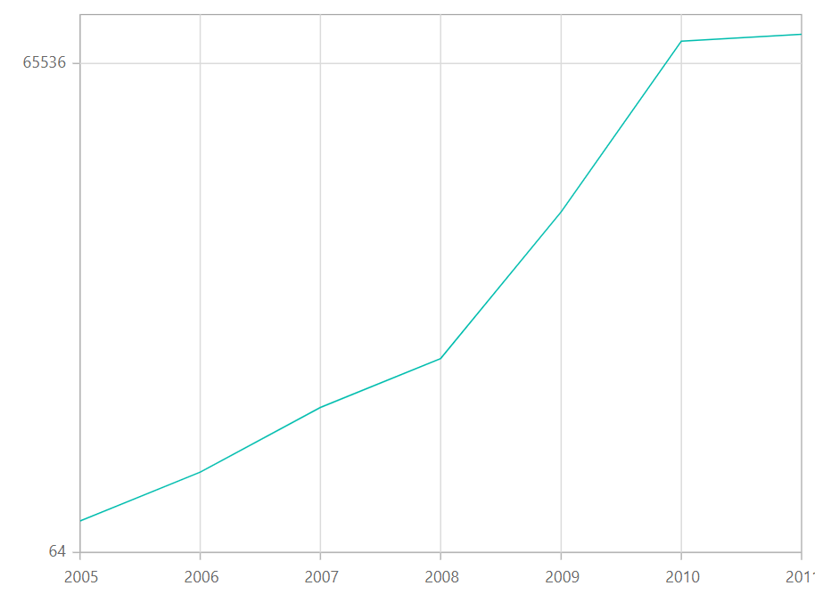
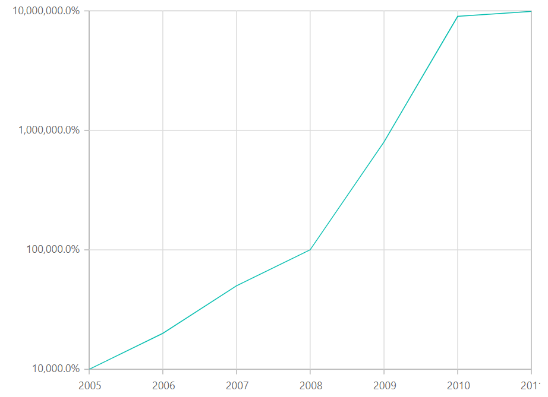
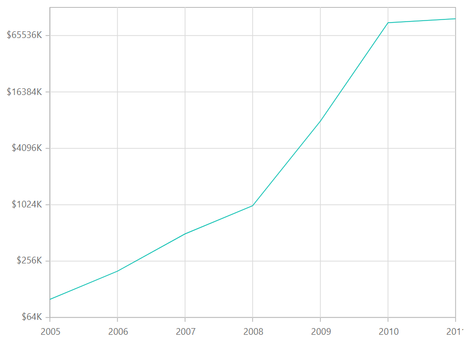

# Logarithmic Axis in Blazor Charts Component

<!-- markdownlint-disable MD033 -->

When data contains numeric values in both the lower order of magnitude (eg: 10<sup>-6</sup>) and the upper order of magnitude (eg: 10<sup>6</sup>), a logarithmic axis is highly useful in visualizing it.

```cshtml

@using Syncfusion.Blazor.Charts

<SfChart>
    <ChartPrimaryXAxis ValueType="Syncfusion.Blazor.Charts.ValueType.DateTime"/>    

    <ChartPrimaryYAxis ValueType="Syncfusion.Blazor.Charts.ValueType.Logarithmic"/>    

    <ChartSeriesCollection>
        <ChartSeries DataSource="@Data" XName="XValue" YName="YValue" />        
    </ChartSeriesCollection>
</SfChart>

@code{
    public class ChartData
    {
        public DateTime XValue { get; set; }
        public double YValue { get; set; }
    }

    public List<ChartData> Data = new List<ChartData> 
	{
		new ChartData { XValue = new DateTime(2005, 01, 01), YValue = 100   },
		new ChartData { XValue = new DateTime(2006, 01, 01), YValue = 200   },
		new ChartData { XValue = new DateTime(2007, 01, 01), YValue = 500   },
		new ChartData { XValue = new DateTime(2008, 01, 01), YValue = 1000  },
		new ChartData { XValue = new DateTime(2009, 01, 01), YValue = 8000  },
		new ChartData { XValue = new DateTime(2010, 01, 01), YValue = 90000 },
		new ChartData { XValue = new DateTime(2011, 01, 01), YValue = 99000 },
	};
}

```


## Range

The axis range will be calculated automatically based on the provided data; however, the axis range can also be customized using [`Minimum`](https://help.syncfusion.com/cr/blazor/Syncfusion.Blazor.Charts.ChartCommonAxis.html#Syncfusion_Blazor_Charts_ChartCommonAxis_Minimum),
[`Maximum`](https://help.syncfusion.com/cr/blazor/Syncfusion.Blazor.Charts.ChartCommonAxis.html#Syncfusion_Blazor_Charts_ChartCommonAxis_Maximum) and [`Interval`](https://help.syncfusion.com/cr/blazor/Syncfusion.Blazor.Charts.ChartCommonAxis.html#Syncfusion_Blazor_Charts_ChartCommonAxis_Interval) properties.

```cshtml

@using Syncfusion.Blazor.Charts

<SfChart>
    <ChartPrimaryXAxis ValueType="Syncfusion.Blazor.Charts.ValueType.DateTime"/>
    
    <ChartPrimaryYAxis Minimum="100" Maximum="10000" ValueType="Syncfusion.Blazor.Charts.ValueType.Logarithmic"/>

    <ChartSeriesCollection>
        <ChartSeries DataSource="@Data" XName="XValue" YName="YValue"/>
    </ChartSeriesCollection>
</SfChart>

@code{
    public class ChartData
    {
        public DateTime XValue { get; set; }
        public double YValue { get; set; }
    }

    public List<ChartData> Data = new List<ChartData> 
	{
		new ChartData { XValue = new DateTime(2005, 01, 01), YValue = 100   },
		new ChartData { XValue = new DateTime(2006, 01, 01), YValue = 200   },
		new ChartData { XValue = new DateTime(2007, 01, 01), YValue = 500   },
		new ChartData { XValue = new DateTime(2008, 01, 01), YValue = 1000  },
		new ChartData { XValue = new DateTime(2009, 01, 01), YValue = 8000  },
		new ChartData { XValue = new DateTime(2010, 01, 01), YValue = 90000 },
		new ChartData { XValue = new DateTime(2011, 01, 01), YValue = 99000 },
	};
}

```


## Logarithmic Base

Logarithmic base can be customized using the [`LogBase`](https://help.syncfusion.com/cr/blazor/Syncfusion.Blazor.Charts.ChartCommonAxis.html#Syncfusion_Blazor_Charts_ChartCommonAxis_LogBase) property of the axis. When the LogBase is 5, the axis values are 5<sup>-2</sup>, 5<sup>-1</sup>, 5<sup>0</sup>, 5<sup>1</sup>, 5<sup>2</sup> and so on.

```cshtml

@using Syncfusion.Blazor.Charts

<SfChart>
    <ChartPrimaryXAxis ValueType="Syncfusion.Blazor.Charts.ValueType.DateTime"/>    

    <ChartPrimaryYAxis LogBase="2" ValueType="Syncfusion.Blazor.Charts.ValueType.Logarithmic"/>    

    <ChartSeriesCollection>
        <ChartSeries DataSource="@Data" XName="XValue" YName="YValue" />        
    </ChartSeriesCollection>
</SfChart>

@code{
    public class ChartData
    {
        public DateTime XValue { get; set; }
        public double YValue { get; set; }
    }

    public List<ChartData> Data = new List<ChartData> 
	{
		new ChartData { XValue = new DateTime(2005, 01, 01), YValue = 100   },
		new ChartData { XValue = new DateTime(2006, 01, 01), YValue = 200   },
		new ChartData { XValue = new DateTime(2007, 01, 01), YValue = 500   },
		new ChartData { XValue = new DateTime(2008, 01, 01), YValue = 1000  },
		new ChartData { XValue = new DateTime(2009, 01, 01), YValue = 8000  },
		new ChartData { XValue = new DateTime(2010, 01, 01), YValue = 90000 },
		new ChartData { XValue = new DateTime(2011, 01, 01), YValue = 99000 },
	};
}

```



## Logarithmic Interval

The interval can be customized using the [`Interval`](https://help.syncfusion.com/cr/blazor/Syncfusion.Blazor.Charts.ChartCommonAxis.html#Syncfusion_Blazor_Charts_ChartCommonAxis_Interval) property of the logarithmic axis. When the logarithmic base is **10** and logarithmic interval is **2**, then the axis labels are placed at an interval of **10<sup>2</sup>**. The default value of the interval is **1**.

```cshtml

@using Syncfusion.Blazor.Charts

<SfChart>
    <ChartPrimaryXAxis ValueType="Syncfusion.Blazor.Charts.ValueType.DateTime"/>    

    <ChartPrimaryYAxis Interval="2" LogBase="2" ValueType="Syncfusion.Blazor.Charts.ValueType.Logarithmic"/>    

    <ChartSeriesCollection>
        <ChartSeries DataSource="@Data" XName="XValue" YName="YValue" />        
    </ChartSeriesCollection>
</SfChart>

@code{
    public class ChartData
    {
        public DateTime XValue { get; set; }
        public double YValue { get; set; }
    }

    public List<ChartData> Data = new List<ChartData> 
	{
		new ChartData { XValue = new DateTime(2005, 01, 01), YValue = 100   },
		new ChartData { XValue = new DateTime(2006, 01, 01), YValue = 200   },
		new ChartData { XValue = new DateTime(2007, 01, 01), YValue = 500   },
		new ChartData { XValue = new DateTime(2008, 01, 01), YValue = 1000  },
		new ChartData { XValue = new DateTime(2009, 01, 01), YValue = 8000  },
		new ChartData { XValue = new DateTime(2010, 01, 01), YValue = 90000 },
		new ChartData { XValue = new DateTime(2011, 01, 01), YValue = 99000 },
	};
}

```


## Label Format

Using the [`LabelFormat`](https://help.syncfusion.com/cr/blazor/Syncfusion.Blazor.Charts.ChartCommonAxis.html#Syncfusion_Blazor_Charts_ChartCommonAxis_LabelFormat) property on an axis, it is possible to format the logarithmic labels to all globalize formats.

```cshtml

@using Syncfusion.Blazor.Charts

<SfChart>
    <ChartPrimaryXAxis ValueType="Syncfusion.Blazor.Charts.ValueType.DateTime"/>    

    <ChartPrimaryYAxis LabelFormat="P1" ValueType="Syncfusion.Blazor.Charts.ValueType.Logarithmic"/>    

    <ChartSeriesCollection>
        <ChartSeries DataSource="@Data" XName="XValue" YName="YValue" />        
    </ChartSeriesCollection>
</SfChart>

@code{
    public class ChartData
    {
        public DateTime XValue { get; set; }
        public double YValue { get; set; }
    }

    public List<ChartData> Data = new List<ChartData> 
	{
		new ChartData { XValue = new DateTime(2005, 01, 01), YValue = 100   },
		new ChartData { XValue = new DateTime(2006, 01, 01), YValue = 200   },
		new ChartData { XValue = new DateTime(2007, 01, 01), YValue = 500   },
		new ChartData { XValue = new DateTime(2008, 01, 01), YValue = 1000  },
		new ChartData { XValue = new DateTime(2009, 01, 01), YValue = 8000  },
		new ChartData { XValue = new DateTime(2010, 01, 01), YValue = 90000 },
		new ChartData { XValue = new DateTime(2011, 01, 01), YValue = 99000 },
	};
}

```




The table below shows the results of applying some commonly used label formats to logarithmic values.

<!-- markdownlint-disable MD033 -->

<table>
<tr>
<td><b>Label Value</b></td>
<td><b>Label Format property value</b></td>
<td><b>Result </b></td>
<td><b>Description </b></td>
</tr>
<tr>
<td>1000</td>
<td>n1</td>
<td>1000.0</td>
<td>The value is rounded to 1 decimal place.</td>
</tr>
<tr>
<td>1000</td>
<td>n2</td>
<td>1000.00</td>
<td>The value is rounded to 2 decimal place.</td>
</tr>
<tr>
<td>1000</td>
<td>n3</td>
<td>1000.000</td>
<td>The value is rounded to 3 decimal place.</td>
</tr>
<tr>
<td>0.01</td>
<td>p1</td>
<td>1.0%</td>
<td>The value is converted to percentage with 1 decimal place.</td>
</tr>
<tr>
<td>0.01</td>
<td>p2</td>
<td>1.00%</td>
<td>The value is converted to percentage with 2 decimal place.</td>
</tr>
<tr>
<td>0.01</td>
<td>p3</td>
<td>1.000%</td>
<td>The value is converted to percentage with 3 decimal place.</td>
</tr>
<tr>
<td>1000</td>
<td>c1</td>
<td>$1000.0</td>
<td>The currency symbol is appended to number and number is rounded to 1 decimal place.</td>
</tr>
<tr>
<td>1000</td>
<td>c2</td>
<td>$1000.00</td>
<td>The currency symbol is appended to number and number is rounded to 2 decimal place.</td>
</tr>
</table>

## Custom Label Format

Axis also supports custom label format using placeholders such as {value}K, where the value represents the axis label, for example, 200K.



```cshtml

<SfChart>
    <ChartPrimaryXAxis ValueType="Syncfusion.Blazor.Charts.ValueType.DateTime"/>    

    <ChartPrimaryYAxis ValueType="Syncfusion.Blazor.Charts.ValueType.Logarithmic" LabelFormat="${value}K" RangePadding="ChartRangePadding.Auto"/> 

    <ChartSeriesCollection>
        <ChartSeries DataSource="@Data" XName="XValue" YName="YValue" />        
    </ChartSeriesCollection>
</SfChart>

@code{
    public class ChartData
    {
        public DateTime XValue { get; set; }
        public double YValue { get; set; }
    }

    public List<ChartData> Data = new List<ChartData> 
	{
		new ChartData { XValue = new DateTime(2005, 01, 01), YValue = 100   },
		new ChartData { XValue = new DateTime(2006, 01, 01), YValue = 200   },
		new ChartData { XValue = new DateTime(2007, 01, 01), YValue = 500   },
		new ChartData { XValue = new DateTime(2008, 01, 01), YValue = 1000  },
		new ChartData { XValue = new DateTime(2009, 01, 01), YValue = 8000  },
		new ChartData { XValue = new DateTime(2010, 01, 01), YValue = 90000 },
		new ChartData { XValue = new DateTime(2011, 01, 01), YValue = 99000 },
	};
}

```



> Refer to our [`Blazor Charts`](https://www.syncfusion.com/blazor-components/blazor-charts) feature tour page for its groundbreaking feature representations and also explore our [`Blazor Chart Example`](https://blazor.syncfusion.com/demos/chart/line?theme=bootstrap4) to know various chart types and how to represent time-dependent data, showing trends at equal intervals.

## See Also

* [Data label](./data-labels)
* [Tooltip](./tool-tip)
* [Marker](./data-markers)