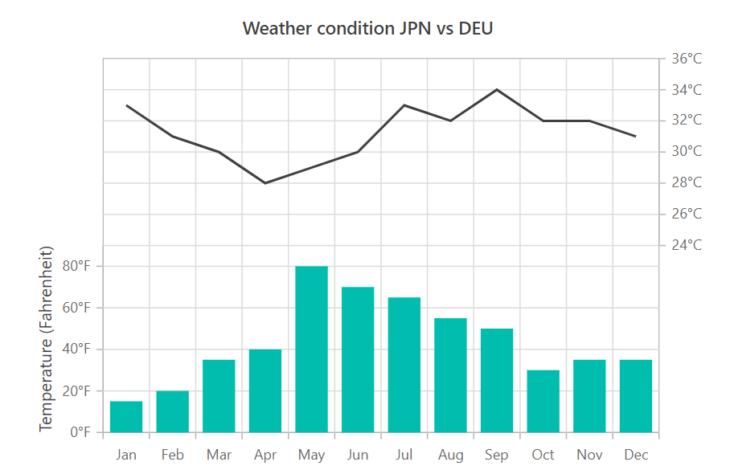
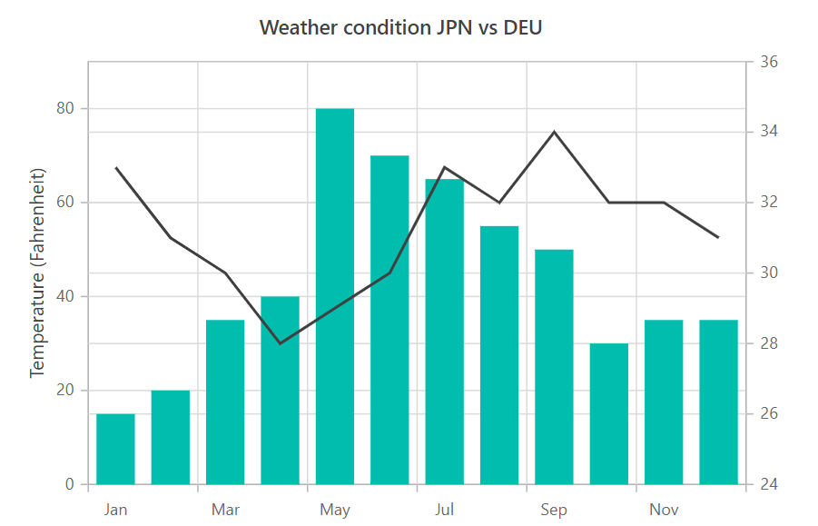

# Multiple Panes in Blazor Charts Component

Chart area can be divided into multiple panes using [`Rows`](https://help.syncfusion.com/cr/blazor/Syncfusion.Blazor.Charts.ChartRow.html) and
[`Columns`](https://help.syncfusion.com/cr/blazor/Syncfusion.Blazor.Charts.ChartColumn.html).

## Rows

To split the chart area vertically into number of rows, use [`Rows`](https://help.syncfusion.com/cr/blazor/Syncfusion.Blazor.Charts.ChartRow.html) property of the chart.

* You can allocate space for each row by using the [`Height`](https://help.syncfusion.com/cr/blazor/Syncfusion.Blazor.Charts.ChartRow.html#Syncfusion_Blazor_Charts_ChartRow_Height)
property. The value can be either in percentage or in pixel.
* To associate a vertical axis to a particular row, specify its index to
[`RowIndex`](https://help.syncfusion.com/cr/blazor/Syncfusion.Blazor.Charts.ChartCommonAxis.html#Syncfusion_Blazor_Charts_ChartCommonAxis_RowIndex) property of the axis.
* To customize each row bottom line, use [`Border`](https://help.syncfusion.com/cr/blazor/Syncfusion.Blazor.Charts.ChartRow.html#Syncfusion_Blazor_Charts_ChartRow_Border) property.

```csharp

@using Syncfusion.Blazor.Charts

<SfChart Title="Weather condition JPN vs DEU">
    <ChartPrimaryXAxis ValueType="Syncfusion.Blazor.Charts.ValueType.Category"/>    

    <ChartPrimaryYAxis Title="Temperature (Fahrenheit)" LabelFormat="{value}°F" Minimum="0" Maximum="90" Interval="20"/>    

    <ChartRows>
        <ChartRow Height="50%"/>
        <ChartRow Height="50%"/>
    </ChartRows>

    <ChartAxes>
        <ChartAxis Minimum="24" Maximum="36" Interval="2" OpposedPosition="true" RowIndex="1" Name="YAxis" LabelFormat="{value}°C"/>        
    </ChartAxes>

    <ChartSeriesCollection>

        <ChartSeries DataSource="@WeatherReports" XName="X" YName="Y" Type="ChartSeriesType.Column"/>
        
        <ChartSeries DataSource="@WeatherReports" XName="X" YName="Y1" YAxisName="YAxis"/>
        
    </ChartSeriesCollection>
</SfChart>

@code{
    public class ChartData
    {
        public string X { get; set; }
        public double Y { get; set; }
        public double Y1 { get; set; }
    }

    public List<ChartData> WeatherReports = new List<ChartData>
{
      new ChartData{ X= "Jan", Y= 15, Y1= 33 },
      new ChartData{ X= "Feb", Y= 20, Y1= 31 },
      new ChartData{ X= "Mar", Y= 35, Y1= 30 },
      new ChartData{ X= "Apr", Y= 40, Y1= 28 },
      new ChartData{ X= "May", Y= 80, Y1= 29 },
      new ChartData{ X= "Jun", Y= 70, Y1= 30 },
      new ChartData{ X= "Jul", Y= 65, Y1= 33 },
      new ChartData{ X= "Aug", Y= 55, Y1= 32 },
      new ChartData{ X= "Sep", Y= 50, Y1= 34 },
      new ChartData{ X= "Oct", Y= 30, Y1= 32 },
      new ChartData{ X= "Nov", Y= 35, Y1= 32 },
      new ChartData{ X= "Dec", Y= 35, Y1= 31 }
   };
}


```



For spanning the vertical axis along multiple row, you can use [`Span`](https://help.syncfusion.com/cr/blazor/Syncfusion.Blazor.Charts.ChartCommonAxis.html#Syncfusion_Blazor_Charts_ChartCommonAxis_Span) property of the axis.

```csharp

@using Syncfusion.Blazor.Charts

<SfChart Title="Weather condition JPN vs DEU">
    <ChartPrimaryXAxis ValueType="Syncfusion.Blazor.Charts.ValueType.Category"/>    

    <ChartPrimaryYAxis Span="2" Title="Temperature (Fahrenheit)" LabelFormat="{value}°F" Minimum="0" Maximum="90" Interval="20"/>    

    <ChartRows>
        <ChartRow Height="50%"/>
        <ChartRow Height="50%"/>
    </ChartRows>

    <ChartAxes>
        <ChartAxis Minimum="24" Maximum="36" Interval="2" OpposedPosition="true" RowIndex="1" Name="YAxis" LabelFormat="{value}°C"/>        
    </ChartAxes>

    <ChartSeriesCollection>

        <ChartSeries DataSource="@WeatherReports" XName="X" YName="Y" Type="ChartSeriesType.Column"/>
        
        <ChartSeries DataSource="@WeatherReports" XName="X" YName="Y1" YAxisName="YAxis"/>
        
    </ChartSeriesCollection>
</SfChart>

@code{
    public class ChartData
    {
        public string X { get; set; }
        public double Y { get; set; }
        public double Y1 { get; set; }
    }

    public List<ChartData> WeatherReports = new List<ChartData>
{
      new ChartData{ X= "Jan", Y= 15, Y1= 33 },
      new ChartData{ X= "Feb", Y= 20, Y1= 31 },
      new ChartData{ X= "Mar", Y= 35, Y1= 30 },
      new ChartData{ X= "Apr", Y= 40, Y1= 28 },
      new ChartData{ X= "May", Y= 80, Y1= 29 },
      new ChartData{ X= "Jun", Y= 70, Y1= 30 },
      new ChartData{ X= "Jul", Y= 65, Y1= 33 },
      new ChartData{ X= "Aug", Y= 55, Y1= 32 },
      new ChartData{ X= "Sep", Y= 50, Y1= 34 },
      new ChartData{ X= "Oct", Y= 30, Y1= 32 },
      new ChartData{ X= "Nov", Y= 35, Y1= 32 },
      new ChartData{ X= "Dec", Y= 35, Y1= 31 }
   };
}


```


## Columns

To split the chart area horizontally into number of columns, use [`Columns`](https://help.syncfusion.com/cr/blazor/Syncfusion.Blazor.Charts.ChartColumn.html) property of the chart.

* You can allocate space for each column by using the [`Width`](https://help.syncfusion.com/cr/blazor/Syncfusion.Blazor.Charts.ChartColumn.html#Syncfusion_Blazor_Charts_ChartColumn_Width)
property. The given width can be either in percentage or in pixel.
* To associate a horizontal axis to a particular column, specify its index to
[`ColumnIndex`](https://help.syncfusion.com/cr/blazor/Syncfusion.Blazor.Charts.ChartCommonAxis.html#Syncfusion_Blazor_Charts_ChartCommonAxis_ColumnIndex) property of the axis.
* To customize each column bottom line, use [`Border`](https://help.syncfusion.com/cr/blazor/Syncfusion.Blazor.Charts.ChartColumn.html#Syncfusion_Blazor_Charts_ChartColumn_Border) property.

```csharp

@using Syncfusion.Blazor.Charts

<SfChart Title="Weather condition JPN vs DEU">

    <ChartPrimaryXAxis ValueType="Syncfusion.Blazor.Charts.ValueType.Category"/>    

    <ChartPrimaryYAxis Title="Temperature (Fahrenheit)" LabelFormat="{value}°F" Minimum="0" Maximum="90" Interval="20"/>
    
    <ChartColumns>
        <ChartColumn Width="50%"/>        
        <ChartColumn Width="50%"/>        
    </ChartColumns>

    <ChartAxes>
        <ChartAxis Interval="2" OpposedPosition="true" ColumnIndex="1" Name="XAxis" ValueType="Syncfusion.Blazor.Charts.ValueType.Category"/>
       
    </ChartAxes>

    <ChartSeriesCollection>
        <ChartSeries DataSource="@WeatherReports" XName="X" YName="Y" Type="ChartSeriesType.Column"/>
        <ChartSeries DataSource="@WeatherReports" XName="X" YName="Y1" XAxisName="XAxis" />       
    </ChartSeriesCollection>
</SfChart>

@code{
    public class ChartData
    {
        public string X { get; set; }
        public double Y { get; set; }
        public double Y1 { get; set; }
    }

    public List<ChartData> WeatherReports = new List<ChartData>
{
      new ChartData{ X= "Jan", Y= 15, Y1= 33 },
      new ChartData{ X= "Feb", Y= 20, Y1= 31 },
      new ChartData{ X= "Mar", Y= 35, Y1= 30 },
      new ChartData{ X= "Apr", Y= 40, Y1= 28 },
      new ChartData{ X= "May", Y= 80, Y1= 29 },
      new ChartData{ X= "Jun", Y= 70, Y1= 30 },
      new ChartData{ X= "Jul", Y= 65, Y1= 33 },
      new ChartData{ X= "Aug", Y= 55, Y1= 32 },
      new ChartData{ X= "Sep", Y= 50, Y1= 34 },
      new ChartData{ X= "Oct", Y= 30, Y1= 32 },
      new ChartData{ X= "Nov", Y= 35, Y1= 32 },
      new ChartData{ X= "Dec", Y= 35, Y1= 31 }
   };
}

```


For spanning the horizontal axis along multiple column, you can use [`Span`](https://help.syncfusion.com/cr/blazor/Syncfusion.Blazor.Charts.ChartAxis.html#Syncfusion_Blazor_Charts_ChartAxis_Span) property of an axis.

```csharp

@using Syncfusion.Blazor.Charts

<SfChart Title="Weather condition JPN vs DEU">

    <ChartPrimaryXAxis Span="2" ValueType="Syncfusion.Blazor.Charts.ValueType.Category"/>    

    <ChartPrimaryYAxis Title="Temperature (Fahrenheit)" LabelFormat="{value}°F" Minimum="0" Maximum="90" Interval="20"/>
    
    <ChartColumns>
        <ChartColumn Width="50%"/>        
        <ChartColumn Width="50%"/>        
    </ChartColumns>

    <ChartAxes>
        <ChartAxis Interval="2" OpposedPosition="true" ColumnIndex="1" Name="XAxis" ValueType="Syncfusion.Blazor.Charts.ValueType.Category"/>
       
    </ChartAxes>

    <ChartSeriesCollection>
        <ChartSeries DataSource="@WeatherReports" XName="X" YName="Y" Type="ChartSeriesType.Column"/>
        <ChartSeries DataSource="@WeatherReports" XName="X" YName="Y1" XAxisName="XAxis" />       
    </ChartSeriesCollection>
</SfChart>

@code{
    public class ChartData
    {
        public string X { get; set; }
        public double Y { get; set; }
        public double Y1 { get; set; }
    }

    public List<ChartData> WeatherReports = new List<ChartData>
{
      new ChartData{ X= "Jan", Y= 15, Y1= 33 },
      new ChartData{ X= "Feb", Y= 20, Y1= 31 },
      new ChartData{ X= "Mar", Y= 35, Y1= 30 },
      new ChartData{ X= "Apr", Y= 40, Y1= 28 },
      new ChartData{ X= "May", Y= 80, Y1= 29 },
      new ChartData{ X= "Jun", Y= 70, Y1= 30 },
      new ChartData{ X= "Jul", Y= 65, Y1= 33 },
      new ChartData{ X= "Aug", Y= 55, Y1= 32 },
      new ChartData{ X= "Sep", Y= 50, Y1= 34 },
      new ChartData{ X= "Oct", Y= 30, Y1= 32 },
      new ChartData{ X= "Nov", Y= 35, Y1= 32 },
      new ChartData{ X= "Dec", Y= 35, Y1= 31 }
   };
}

```



> Note: You can refer to our [`Blazor Charts`](https://www.syncfusion.com/blazor-components/blazor-charts) feature tour page for its groundbreaking feature representations. You can also explore our [`Blazor Chart example`](https://blazor.syncfusion.com/demos/chart/line?theme=bootstrap4) to knows various chart types and how to represent time-dependent data, showing trends in data at equal intervals.

## See Also

* [Data label](./data-labels)
* [Tooltip](./tool-tip)
* [Marker](./data-markers)