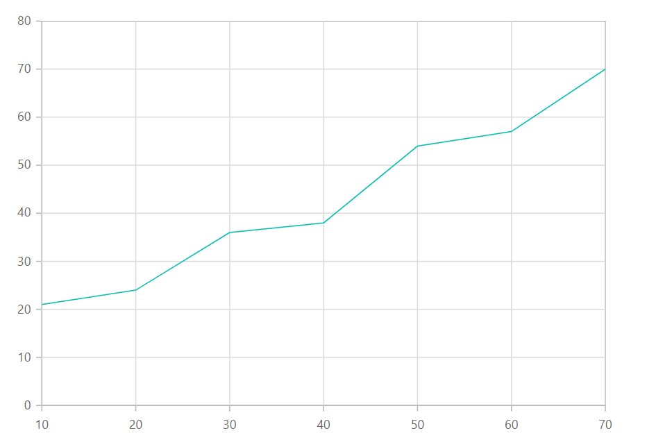
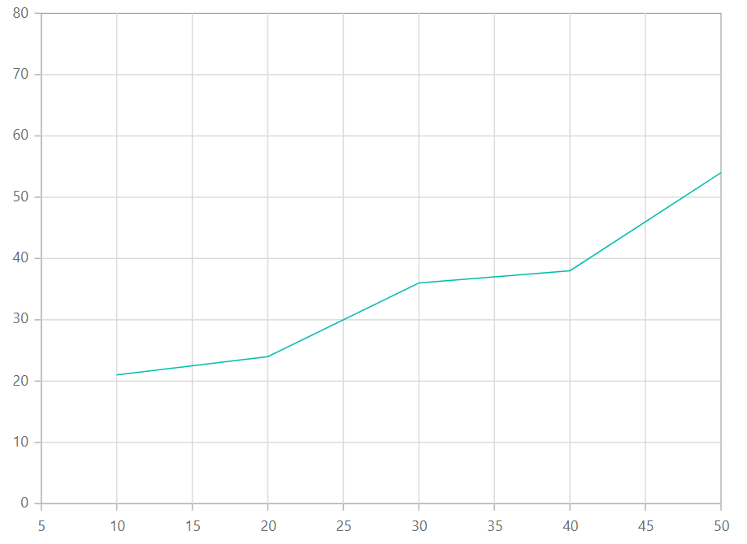

<!-- markdownlint-disable MD036 -->

# Numeric Axis

You can use numeric axis to represent numeric values of data in chart. By default, the [`ValueType`](https://help.syncfusion.com/cr/blazor/Syncfusion.Blazor.Charts.AxisModel.html#Syncfusion_Blazor_Charts_AxisModel_ValueType) of an axis is `Double`.



@using Syncfusion.Blazor.Charts

<SfChart>
    <ChartSeriesCollection>
        <ChartSeries DataSource="@Data" XName="XValue" YName="YValue">
        </ChartSeries>
    </ChartSeriesCollection>
</SfChart>

@code{
    public class ChartData
    {
        public double XValue { get; set; }
        public double YValue { get; set; }
    }
    public List<ChartData> Data = new List<ChartData>
{
            new ChartData { XValue = 10, YValue = 21 },
            new ChartData { XValue = 20, YValue = 24 },
            new ChartData { XValue = 30, YValue = 36 },
            new ChartData { XValue = 40, YValue = 38 },
            new ChartData { XValue = 50, YValue = 54 },
            new ChartData { XValue = 60, YValue = 57 },
            new ChartData { XValue = 70, YValue = 70 },
        };
}



## Range and Interval

Range for the axis, will be calculated automatically based on the provided data, you can also customize the range
of the axis using [`Minimum`](https://help.syncfusion.com/cr/blazor/Syncfusion.Blazor.Charts.AxisModel.html#Syncfusion_Blazor_Charts_AxisModel_Minimum),
[`Maximum`](https://help.syncfusion.com/cr/blazor/Syncfusion.Blazor.Charts.AxisModel.html#Syncfusion_Blazor_Charts_AxisModel_Maximum) and [`Interval`](https://help.syncfusion.com/cr/blazor/Syncfusion.Blazor~Syncfusion.Blazor.Charts.AxisModel~Interval.html) property of
the axis.



@using Syncfusion.Blazor.Charts

<SfChart>
    <ChartPrimaryXAxis Minimum="5" Maximum="50" Interval="2"/>

    <ChartSeriesCollection>
        <ChartSeries DataSource="@Data" XName="XValue" YName="YValue"/>
    </ChartSeriesCollection>
</SfChart>

@code{
    public class ChartData
    {
        public double XValue { get; set; }
        public double YValue { get; set; }
    }
    public List<ChartData> Data = new List<ChartData>
{
            new ChartData { XValue = 10, YValue = 21 },
            new ChartData { XValue = 20, YValue = 24 },
            new ChartData { XValue = 30, YValue = 36 },
            new ChartData { XValue = 40, YValue = 38 },
            new ChartData { XValue = 50, YValue = 54 },
            new ChartData { XValue = 60, YValue = 57 },
            new ChartData { XValue = 70, YValue = 70 },
        };
}



## Range Padding

Padding can be applied to the minimum and maximum extremes of the axis range by using the
[`RangePadding`](https://help.syncfusion.com/cr/blazor/Syncfusion.Blazor.Charts.AxisModel.html#Syncfusion_Blazor_Charts_AxisModel_RangePadding) property. Numeric axis supports following types of padding.

* None
* Round
* Additional
* Normal
* Auto

**Numeric - None**

When the [`RangePadding`](https://help.syncfusion.com/cr/blazor/Syncfusion.Blazor.Charts.AxisModel.html#Syncfusion_Blazor_Charts_AxisModel_RangePadding) is set to **None**, minimum and maximum of an axis is based on the data.



@using Syncfusion.Blazor.Charts

<SfChart Width="60%">

    <ChartPrimaryYAxis RangePadding="ChartRangePadding.None"/>

    <ChartSeriesCollection>
        <ChartSeries DataSource="@Data" XName="XValue" YName="YValue"/>
    </ChartSeriesCollection>
</SfChart>

@code{
    public class ChartData
    {
        public double XValue { get; set; }
        public double YValue { get; set; }
    }
    public List<ChartData> Data = new List<ChartData>
{
            new ChartData { XValue = 10, YValue = 21 },
            new ChartData { XValue = 20, YValue = 24 },
            new ChartData { XValue = 30, YValue = 36 },
            new ChartData { XValue = 40, YValue = 38 },
            new ChartData { XValue = 50, YValue = 54 },
            new ChartData { XValue = 60, YValue = 57 },
            new ChartData { XValue = 70, YValue = 70 },
        };
}



**Numeric - Round**

When the [`RangePadding`](https://help.syncfusion.com/cr/blazor/Syncfusion.Blazor.Charts.AxisModel.html#Syncfusion_Blazor_Charts_AxisModel_RangePadding) is set to **Round**, minimum and maximum will be
rounded to the nearest possible value divisible by interval. For example, when the minimum is 3.5 and the interval
is 1, then the minimum will be rounded to 3.



@using Syncfusion.Blazor.Charts

<SfChart Width="60%">

    <ChartPrimaryYAxis RangePadding="ChartRangePadding.Round"/>

    <ChartSeriesCollection>
        <ChartSeries DataSource="@Data" XName="XValue" YName="YValue"/>
    </ChartSeriesCollection>
</SfChart>

@code{
    public class ChartData
    {
        public double XValue { get; set; }
        public double YValue { get; set; }
    }
    public List<ChartData> Data = new List<ChartData>
{
            new ChartData { XValue = 10, YValue = 21 },
            new ChartData { XValue = 20, YValue = 24 },
            new ChartData { XValue = 30, YValue = 36 },
            new ChartData { XValue = 40, YValue = 38 },
            new ChartData { XValue = 50, YValue = 54 },
            new ChartData { XValue = 60, YValue = 57 },
            new ChartData { XValue = 70, YValue = 70 },
        };
}



**Numeric - Additional**

When the [`RangePadding`](https://help.syncfusion.com/cr/blazor/Syncfusion.Blazor.Charts.AxisModel.html#Syncfusion_Blazor_Charts_AxisModel_RangePadding) is set to **Additional**, interval of an axis will
be padded to the minimum and maximum of the axis.



@using Syncfusion.Blazor.Charts

<SfChart>

    <ChartPrimaryYAxis RangePadding="ChartRangePadding.Additional"/>

    <ChartSeriesCollection>
        <ChartSeries DataSource="@Data" XName="XValue" YName="YValue"/>
    </ChartSeriesCollection>
</SfChart>

@code{
    public class ChartData
    {
        public double XValue { get; set; }
        public double YValue { get; set; }
    }
    public List<ChartData> Data = new List<ChartData>
{
            new ChartData { XValue = 10, YValue = 21 },
            new ChartData { XValue = 20, YValue = 24 },
            new ChartData { XValue = 30, YValue = 36 },
            new ChartData { XValue = 40, YValue = 38 },
            new ChartData { XValue = 50, YValue = 54 },
            new ChartData { XValue = 60, YValue = 57 },
            new ChartData { XValue = 70, YValue = 70 },
        };
}



**Numeric - Normal**

When the [`RangePadding`](https://help.syncfusion.com/cr/blazor/Syncfusion.Blazor.Charts.AxisModel.html#Syncfusion_Blazor_Charts_AxisModel_RangePadding) is set to **Normal**, padding is applied to the axis
based on default range calculation.



@using Syncfusion.Blazor.Charts

<SfChart Width="60%">

    <ChartPrimaryYAxis RangePadding="ChartRangePadding.Normal"/>

    <ChartSeriesCollection>
        <ChartSeries DataSource="@Data" XName="XValue" YName="YValue"/>
    </ChartSeriesCollection>
</SfChart>

@code{
    public class ChartData
    {
        public double XValue { get; set; }
        public double YValue { get; set; }
    }
    public List<ChartData> Data = new List<ChartData>
{
            new ChartData { XValue = 10, YValue = 21 },
            new ChartData { XValue = 20, YValue = 24 },
            new ChartData { XValue = 30, YValue = 36 },
            new ChartData { XValue = 40, YValue = 38 },
            new ChartData { XValue = 50, YValue = 54 },
            new ChartData { XValue = 60, YValue = 57 },
            new ChartData { XValue = 70, YValue = 70 },
        };
}



**Numeric - Auto**

When the [`RangePadding`](https://help.syncfusion.com/cr/blazor/Syncfusion.Blazor.Charts.AxisModel.html#Syncfusion_Blazor_Charts_AxisModel_RangePadding) is set to **Auto**, horizontal numeric axis takes
None as padding calculation, while the vertical numeric axis takes Normal as padding calculation.



@using Syncfusion.Blazor.Charts

<SfChart>

    <ChartPrimaryYAxis RangePadding="ChartRangePadding.Auto"/>
    <ChartPrimaryXAxis RangePadding="ChartRangePadding.Auto"/>

    <ChartSeriesCollection>
        <ChartSeries DataSource="@Data" XName="XValue" YName="YValue"/>
    </ChartSeriesCollection>
</SfChart>

@code{
    public class ChartData
    {
        public double XValue { get; set; }
        public double YValue { get; set; }
    }
    public List<ChartData> Data = new List<ChartData>
{
            new ChartData { XValue = 10, YValue = 21 },
            new ChartData { XValue = 20, YValue = 24 },
            new ChartData { XValue = 30, YValue = 36 },
            new ChartData { XValue = 40, YValue = 38 },
            new ChartData { XValue = 50, YValue = 54 },
            new ChartData { XValue = 60, YValue = 57 },
            new ChartData { XValue = 70, YValue = 70 },
        };
}



## Label Format

**Numeric Label Format**

Numeric labels can be formatted by using the [`LabelFormat`](https://help.syncfusion.com/cr/blazor/Syncfusion.Blazor.Charts.AxisModel.html#Syncfusion_Blazor_Charts_AxisModel_LabelFormat) property.
Numeric labels supports all globalize format.



@using Syncfusion.Blazor.Charts

<SfChart Title="Sales Comparison">

    <ChartPrimaryYAxis LabelFormat="c"/>    

    <ChartSeriesCollection>
        <ChartSeries DataSource="@Data" XName="X" YName="Y" Type="ChartSeriesType.Column"/>
    </ChartSeriesCollection>
</SfChart>

@code{
    public class ChartData
    {
        public double X { get; set; }
        public double Y { get; set; }
    }
    public List<ChartData> Data = new List<ChartData>
{
          new ChartData{ X= 10, Y=7000 },
          new ChartData{ X= 20, Y= 1000 },
          new ChartData{ X= 30, Y= 12000 },
          new ChartData{ X= 40, Y= 14000 },
          new ChartData{ X= 50, Y= 11000 },
          new ChartData{ X= 60, Y= 5000 },
          new ChartData{ X= 70, Y= 7300 },
          new ChartData{ X= 80, Y= 9000 },
          new ChartData{ X= 90, Y= 12000 },
          new ChartData{ X= 100, Y= 14000 },
          new ChartData{ X= 110, Y= 11000 },
          new ChartData{ X= 120, Y= 5000 }
        };
}



The following table describes the result of applying some commonly used label formats on numeric values.

<!-- markdownlint-disable MD033 -->

<table>
<tr>
<td><b>Label Value</b></td>
<td><b>Label Format property value</b></td>
<td><b>Result </b></td>
<td><b>Description </b></td>
</tr>
<tr>
<td>1000</td>
<td>n1</td>
<td>1000.0</td>
<td>The Number is rounded to 1 decimal place</td>
</tr>
<tr>
<td>1000</td>
<td>n2</td>
<td>1000.00</td>
<td>The Number is rounded to 2 decimal place</td>
</tr>
<tr>
<td>1000</td>
<td>n3</td>
<td>1000.000</td>
<td>The Number is rounded to 3 decimal place</td>
</tr>
<tr>
<td>0.01</td>
<td>p1</td>
<td>1.0%</td>
<td>The Number is converted to percentage with 1 decimal place</td>
</tr>
<tr>
<td>0.01</td>
<td>p2</td>
<td>1.00%</td>
<td>The Number is converted to percentage with 2 decimal place</td>
</tr>
<tr>
<td>0.01</td>
<td>p3</td>
<td>1.000%</td>
<td>The Number is converted to percentage with 3 decimal place</td>
</tr>
<tr>
<td>1000</td>
<td>c1</td>
<td>$1000.0</td>
<td>The Currency symbol is appended to number and number is rounded to 1 decimal place</td>
</tr>
<tr>
<td>1000</td>
<td>c2</td>
<td>$1000.00</td>
<td>The Currency symbol is appended to number and number is rounded to 2 decimal place</td>
</tr>
</table>

## Custom Label Format

Axis also supports custom label format using placeholder like {value}°C, in which the value represent the axis
label e.g 20°C.



@using Syncfusion.Blazor.Charts

<SfChart>

    <ChartPrimaryYAxis LabelFormat="${value}K" />

    <ChartSeriesCollection>
        <ChartSeries DataSource="@Data" XName="XValue" YName="YValue" />
    </ChartSeriesCollection>
</SfChart>

@code{
    public class ChartData
    {
        public double XValue { get; set; }
        public double YValue { get; set; }
    }
    public List<ChartData> Data = new List<ChartData>
    {
    new ChartData { XValue = 10, YValue = 21 },
    new ChartData { XValue = 20, YValue = 24 },
    new ChartData { XValue = 30, YValue = 36 },
    new ChartData { XValue = 40, YValue = 38 },
    new ChartData { XValue = 50, YValue = 54 },
    new ChartData { XValue = 60, YValue = 57 },
    new ChartData { XValue = 70, YValue = 70 },
    };
}



> Note: You can refer to our [`Blazor Charts`](https://www.syncfusion.com/blazor-components/blazor-charts) feature tour page for its groundbreaking feature representations. You can also explore our [`Blazor Chart example`](https://blazor.syncfusion.com/demos/chart/line?theme=bootstrap4) to knows various chart types and how to represent time-dependent data, showing trends in data at equal intervals.

## See Also

* [Data label](./data-labels)
* [Tooltip](./tool-tip)
* [Marker](./data-markers)