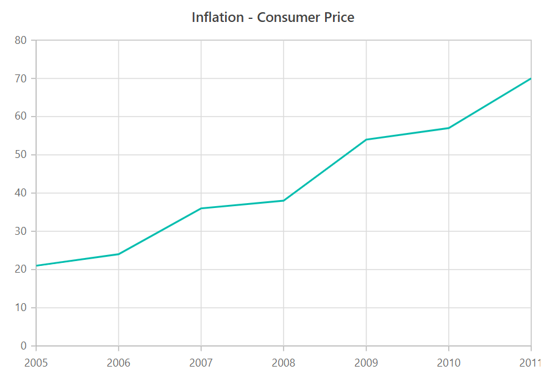
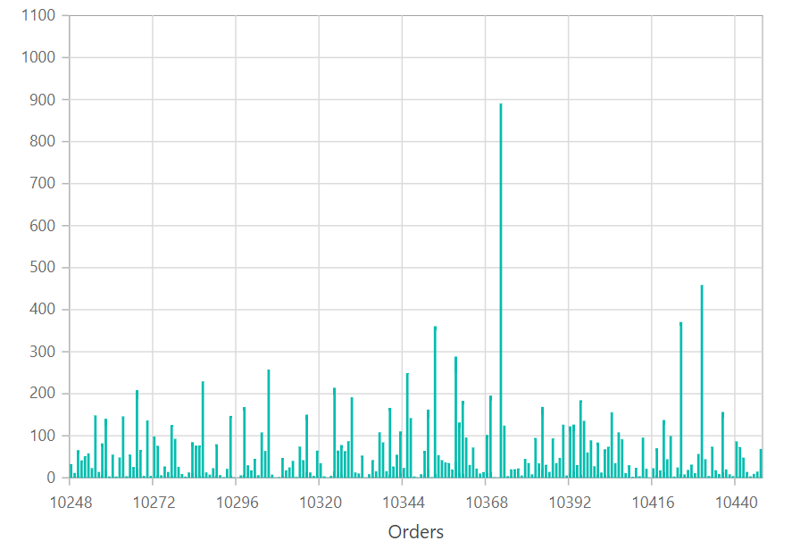
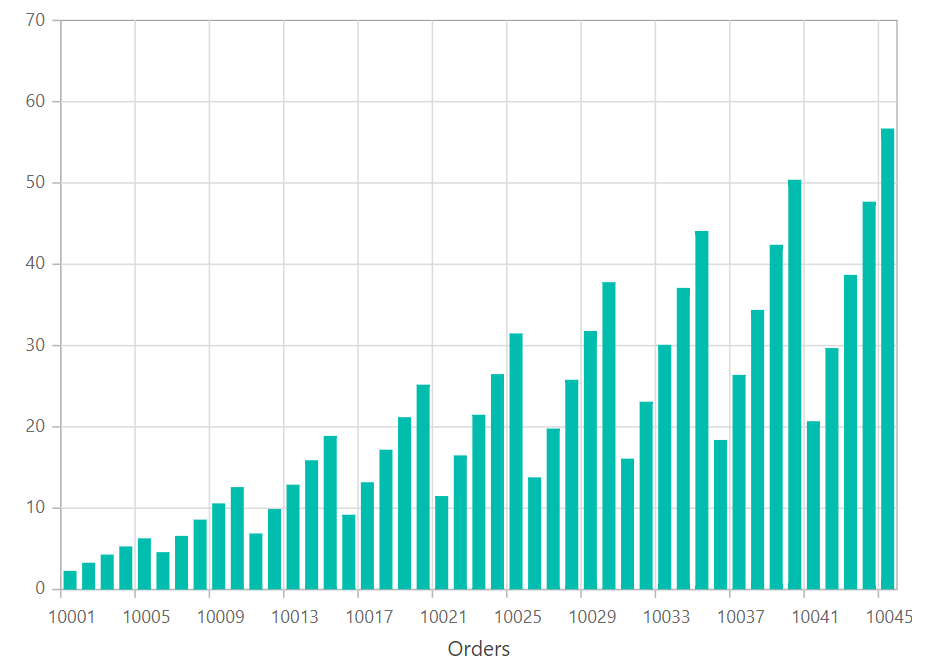

<!-- markdownlint-disable MD036 -->

# Working with Data in Blazor Charts Component

The Chart uses [`SfDataManager`](https://help.syncfusion.com/cr/blazor/Syncfusion.Blazor.Data.SfDataManager.html), which supports both RESTful JSON data services binding and IEnumerable binding. The [`DataSource`](https://help.syncfusion.com/cr/blazor/Syncfusion.Blazor.Charts.ChartSeries.html#Syncfusion_Blazor_Charts_ChartSeries_DataSource) value can be set using either [`SfDataManager`](https://help.syncfusion.com/cr/blazor/Syncfusion.Blazor.Data.SfDataManager.html) property values or a list of business objects.

It supports the following data binding methods:
* List binding
* Remote data

## List binding

An IEnumerable object can be assigned to the [`DataSource`](https://help.syncfusion.com/cr/blazor/Syncfusion.Blazor.Charts.ChartSeries.html#Syncfusion_Blazor_Charts_ChartSeries_DataSource) property. The list data source can alternatively be given as an instance of [`SfDataManager`](https://help.syncfusion.com/cr/blazor/Syncfusion.Blazor.Data.SfDataManager.html) or by using [`SfDataManager`](https://help.syncfusion.com/cr/blazor/Syncfusion.Blazor.Data.SfDataManager.html) or as a component of the [`SfDataManager`](https://help.syncfusion.com/cr/blazor/Syncfusion.Blazor.Data.SfDataManager.html) or by using [`SfDataManager`](https://help.syncfusion.com/cr/blazor/Syncfusion.Blazor.Data.SfDataManager.html). The data fields should now be mapped to the [`XName`](https://help.syncfusion.com/cr/blazor/Syncfusion.Blazor.Charts.ChartSeries.html#Syncfusion_Blazor_Charts_ChartSeries_XName) and [`YName`](https://help.syncfusion.com/cr/blazor/Syncfusion.Blazor.Charts.ChartSeries.html#Syncfusion_Blazor_Charts_ChartSeries_YName) properties.

```cshtml

@using Syncfusion.Blazor.Charts

<SfChart Title="Inflation - Consumer Price" Width="60%">
    <ChartPrimaryXAxis IntervalType="IntervalType.Years" LabelFormat="yyyy" ValueType="Syncfusion.Blazor.Charts.ValueType.DateTime">
    </ChartPrimaryXAxis>
	<ChartSeriesCollection>
        <ChartSeries DataSource="@ConsumerReports" XName="XValue" YName="YValue" Type="ChartSeriesType.Line">
        </ChartSeries>
    </ChartSeriesCollection>
</SfChart>

@code{
    public class ChartData
    {
        public DateTime XValue { get; set; }
        public double YValue { get; set; }
    }

    public List<ChartData> ConsumerReports = new List<ChartData>
    {
		new ChartData { XValue = new DateTime(2005, 01, 01), YValue = 21 },
		new ChartData { XValue = new DateTime(2006, 01, 01), YValue = 24 },
		new ChartData { XValue = new DateTime(2007, 01, 01), YValue = 36 },
		new ChartData { XValue = new DateTime(2008, 01, 01), YValue = 38 },
		new ChartData { XValue = new DateTime(2009, 01, 01), YValue = 54 },
		new ChartData { XValue = new DateTime(2010, 01, 01), YValue = 57 },
		new ChartData { XValue = new DateTime(2011, 01, 01), YValue = 70 },
	};
}

```



> By default, [`SfDataManager`](https://help.syncfusion.com/cr/blazor/Syncfusion.Blazor.Data.SfDataManager.html) uses **BlazorAdaptor** for list data-binding.

### ExpandoObject binding

Chart is a generic component which is strongly bound to a model type. There are cases when the model type is unknown during compile time. In such circumstances data can be bound to the chart as a list of **ExpandoObjects**. The **ExpandoObject** can be bound to chart by assigning to the [`DataSource`](https://help.syncfusion.com/cr/blazor/Syncfusion.Blazor.Charts.ChartSeries.html#Syncfusion_Blazor_Charts_ChartSeries_DataSource) property.

```cshtml
@using Syncfusion.Blazor.Charts
@using System.Dynamic

<SfChart>
    <ChartPrimaryXAxis ValueType="Syncfusion.Blazor.Charts.ValueType.Category" />
    <ChartSeriesCollection>
        <ChartSeries DataSource="@MedalDetails" XName="X" YName="Y" Type="ChartSeriesType.Column">
        </ChartSeries>
    </ChartSeriesCollection>
</SfChart>

@code{
    private List<string> countries = new List<string> { "South Korea", "India", "Germany", "Italy", "Russia" };
    private Random randomNum = new Random();
    public List<ExpandoObject> MedalDetails { get; set; } = new List<ExpandoObject>();
    protected override void OnInitialized()
    {
        MedalDetails = Enumerable.Range(0, 5).Select((x) =>
        {
            dynamic d = new ExpandoObject();
            d.X = countries[x];
            d.Y = randomNum.Next(20, 80);
            return d;
        }).Cast<ExpandoObject>().ToList<ExpandoObject>();
    }
}
```


## Remote Data

Assign service data as an instance of [`SfDataManager`](https://help.syncfusion.com/cr/blazor/Syncfusion.Blazor.Data.SfDataManager.html) to the [`DataSource`](https://help.syncfusion.com/cr/blazor/Syncfusion.Blazor.Charts.ChartSeries.html#Syncfusion_Blazor_Charts_ChartSeries_DataSource) property to bind remote data to the chart component. Provide the endpoint Url to communicate with a remote data source.

```cshtml

@using Syncfusion.Blazor.Data
@using Syncfusion.Blazor.Charts

<SfChart>
    <SfDataManager Url="https://services.odata.org/V4/Northwind/Northwind.svc/Orders" Adaptor="Adaptors.ODataV4Adaptor"></SfDataManager>

    <ChartPrimaryXAxis Title="Orders" ValueType="Syncfusion.Blazor.Charts.ValueType.Category"
                       RangePadding="ChartRangePadding.Additional"></ChartPrimaryXAxis>

    <ChartSeriesCollection>
        <ChartSeries XName="OrderID" YName="Freight" Type="ChartSeriesType.Column"></ChartSeries>
    </ChartSeriesCollection>
</SfChart>

```



### Binding with OData services

[OData](http://www.odata.org/documentation/odata-version-3-0/) is a standardized data creation and consumption protocol. The [`SfDataManager`](https://help.syncfusion.com/cr/blazor/Syncfusion.Blazor.Data.SfDataManager.html) can be used to retrieve data from an [OData](http://www.odata.org/documentation/odata-version-3-0/) service. For remote data binding using the [OData](http://www.odata.org/documentation/odata-version-3-0/) service, see the code below.

### Binding with OData v4 services

The [`SfDataManager`](https://help.syncfusion.com/cr/blazor/Syncfusion.Blazor.Data.SfDataManager.html) can retrieve and consume OData v4 services, which is an upgraded version of OData protocols. Please refer to the  [OData documentation](http://docs.oasis-open.org/odata/odata/v4.0/errata03/os/complete/part1-protocol/odata-v4.0-errata03-os-part1-protocol-complete.html#_Toc453752197) for additional information on OData v4 services. To bind an OData v4 service, use the **ODataV4Adaptor**.

### Web API

The [`WebApiAdaptor`](https://help.syncfusion.com/cr/blazor/Syncfusion.Blazor.Data.WebApiAdaptor.html) can be used to bind a chart to a Web API created using an [OData](http://www.odata.org/documentation/odata-version-3-0/) endpoint.

```cshtml
@using Syncfusion.Blazor.Data
@using Syncfusion.Blazor.Charts

<SfChart>
    <SfDataManager Url="https://ej2services.syncfusion.com/production/web-services/api/Orders" Adaptor="Adaptors.WebApiAdaptor"></SfDataManager>

    <ChartPrimaryXAxis Title="Orders" ValueType="Syncfusion.Blazor.Charts.ValueType.Category"
                       ></ChartPrimaryXAxis>

    <ChartSeriesCollection>
        <ChartSeries XName="OrderID" YName="Freight" Type="ChartSeriesType.Column"></ChartSeries>
    </ChartSeriesCollection>
</SfChart>
```



### Sending additional parameters to the server

To create a data request with a custom parameter, add additional parameters to the [`Query`](https://help.syncfusion.com/cr/blazor/Syncfusion.Blazor.Charts.ChartSeries.html#Syncfusion_Blazor_Charts_ChartSeries_Query) object and assign it to the chart's Query property.

The following sample code shows how to send parameters using the Query property in the series.

```cshtml
@using Syncfusion.Blazor.Data
@using Syncfusion.Blazor.Charts

<SfChart>
    <SfDataManager Url="https://services.odata.org/V4/Northwind/Northwind.svc/Orders" Adaptor="Adaptors.ODataV4Adaptor"></SfDataManager>

    <ChartPrimaryXAxis Title="Orders" ValueType="Syncfusion.Blazor.Charts.ValueType.Category"
                       RangePadding="ChartRangePadding.Additional"></ChartPrimaryXAxis>

    <ChartSeriesCollection>
        <ChartSeries Query="ChartQuery" XName="OrderID" YName="Freight" Type="ChartSeriesType.Column"></ChartSeries>
    </ChartSeriesCollection>
</SfChart>

@code{
    public Query ChartQuery { get; set; }

    protected override void OnInitialized()
    {
        ChartQuery = new Query().Take(10).Where("Freight", "GreaterThan", 300, false);
    }

}
```

## Entity Framework

Entity Framework acts as a modern object-database mapper for .NET. This section explains how to bind data to the chart component from a **Microsoft SQL Server** database.

### Create DBContext class

To connect to a Microsoft SQL Server database, the first step is to construct a DBContext class named **OrderContext**.

```csharp
using System;
using System.Collections.Generic;
using System.Linq;
using System.Threading.Tasks;
using Microsoft.EntityFrameworkCore;
using System.ComponentModel.DataAnnotations;
using EFChart.Data;

namespace EFChart.Data
{
    public class OrderContext : DbContext
    {
        public virtual DbSet<Order> Orders { get; set; }

        protected override void OnConfiguring(DbContextOptionsBuilder optionsBuilder)
        {
            if (!optionsBuilder.IsConfigured)
            {
                // Configures the context to connect to a Microsoft SQL Serve database
                optionsBuilder.UseSqlServer(@"Data Source=(LocalDB)\MSSQLLocalDB;AttachDbFilename='D:\blazor\EFTreeMap\App_Data\NORTHWND.MDF';Integrated Security=True;Connect Timeout=30");
            }
        }
    }

    public class Order
    {
        [Key]
        public int? OrderID { get; set; }
        [Required]
        public string CustomerID { get; set; }
        [Required]
        public int EmployeeID { get; set; }
    }
}

```

### Create data access layer to perform data operation

Then construct a class named **OrderDataAccessLayer** that will serve as a data access layer for retrieving records from the database table.

```csharp
using Microsoft.EntityFrameworkCore;
using System;
using System.Collections.Generic;
using System.Linq;
using System.Threading.Tasks;
using static BlazorApp1.Data.OrderContext;
using EFChart.Data;

namespace EFChart.Data
{
    public class OrderDataAccessLayer
    {
        OrderContext db = new OrderContext();

        //To Get all Orders details
        public DbSet<Order> GetAllOrders()
        {
            try
            {
                return db.Orders;
            }
            catch
            {
                throw;
            }
        }
    }
}

```

### Creating Web API Controller

Need to create a Web API Controller that allows the chart to receive data directly from the Entity Framework.

```csharp
using System;
using System.Collections;
using System.Collections.Generic;
using System.Linq;
using System.Threading.Tasks;
using Microsoft.AspNetCore.Http;
using Microsoft.AspNetCore.Mvc;
using Microsoft.Extensions.Primitives;
using static BlazorApp1.Data.OrderContext;
using EFChart.Data;

namespace EFChart.Controller
{
    [Route("api/[controller]")]
    [ApiController]
    public class DefaultController : ControllerBase
    {
        OrderDataAccessLayer db = new OrderDataAccessLayer();
        [HttpGet]
        public object Get()
        {
            IQueryable<Order> data = db.GetAllOrders().AsQueryable();
            var count = data.Count();
            var queryString = Request.Query;
            if (queryString.Keys.Contains("$inlinecount"))
            {
                StringValues Skip;
                StringValues Take;
                int skip = (queryString.TryGetValue("$skip", out Skip)) ? Convert.ToInt32(Skip[0]) : 0;
                int top = (queryString.TryGetValue("$top", out Take)) ? Convert.ToInt32(Take[0]) : data.Count();
                return new { Items = data.Skip(skip).Take(top), Count = count };
            }
            else
            {
                return data;
            }
        }
    }
}

```

### Add Web API Controller services in Startup.cs

As shown below, open the **Startup.cs** file and add the services and endpoints necessary for Web API Controller.

```csharp
using EFChart.Data;
using Newtonsoft.Json.Serialization;

namespace BlazorApplication
{
    public class Startup
    {
        ....
        ....
        public void ConfigureServices(IServiceCollection services)
        {
            ....
            ....
            services.AddSingleton<OrderDataAccessLayer>();

            // Adds services for controllers to the specified Microsoft.Extensions.DependencyInjection.IServiceCollection.
            services.AddControllers().AddNewtonsoftJson(options =>
            {
                options.SerializerSettings.ContractResolver = new DefaultContractResolver();
            });
        }

        public void Configure(IApplicationBuilder app, IWebHostEnvironment env)
        {
            ....
            ....
            app.UseEndpoints(endpoints =>
            {
                // Adds endpoints for controller actions to the Microsoft.AspNetCore.Routing.IEndpointRouteBuilder
                endpoints.MapDefaultControllerRoute();
                .....
                .....
            });
        }
    }
}
```

### Configure chart component

Use the [`DataSource`](https://help.syncfusion.com/cr/blazor/Syncfusion.Blazor.Charts.SfChart.html#Syncfusion_Blazor_Charts_SfChart_DataSource) property or  [`SfDataManager`](https://help.syncfusion.com/cr/blazor/Syncfusion.Blazor.Data.SfDataManager.html) to bind data to the chart.

For instance, to bind data directly from the data access layer class **OrderDataAccessLayer**, assign the [`DataSource`](https://help.syncfusion.com/cr/blazor/Syncfusion.Blazor.Charts.SfChart.html#Syncfusion_Blazor_Charts_SfChart_DataSource) property to be **OrderData.GetAllOrders()**.

```cshtml

@using EFChart.Data;
@inject OrderDataAccessLayer OrderData;

@using Syncfusion.Blazor.Charts

<SfChart DataSource="@OrderData.GetAllOrders()">
    <ChartPrimaryXAxis ValueType="Syncfusion.Blazor.Charts.ValueType.Category">
    </ChartPrimaryXAxis>
    <ChartSeriesCollection>
    <ChartSeries XName="CustomerID" YName="OrderID" Type="ChartSeriesType.Column">
    </ChartSeries>
    </ChartSeriesCollection>
</SfChart>
```

On the other hand, to configure the chart using Web API, provide the appropriate endpoint Url within [`SfDataManager`](https://help.syncfusion.com/cr/blazor/Syncfusion.Blazor.Data.SfDataManager.html) along with [`Adaptor`](https://help.syncfusion.com/cr/blazor/Syncfusion.Blazor.DataManager.html#Syncfusion_Blazor_DataManager_Adaptor). In order to interact with the Web API and consume data from the Entity Framework effectively, [`WebApiAdaptor`](https://help.syncfusion.com/cr/blazor/Syncfusion.Blazor.Data.WebApiAdaptor.html) must be used.

```cshtml
@using Syncfusion.Blazor.Charts
@using Syncfusion.Blazor.Data

<SfChart>
        <SfDataManager Url="api/Default" Adaptor="Syncfusion.Blazor.Adaptors.WebApiAdaptor">
        </SfDataManager>
        <ChartPrimaryXAxis ValueType="Syncfusion.Blazor.Charts.ValueType.Category">
        </ChartPrimaryXAxis>
        <ChartSeriesCollection>
            <ChartSeries XName="CustomerID" YName="OrderID" Type="ChartSeriesType.Column">
            </ChartSeries>
        </ChartSeriesCollection>
</SfChart>

```

## Empty points

Empty points are defined as data points having NaN values. Empty points can be customized using [`EmptyPointSettings`](https://help.syncfusion.com/cr/blazor/Syncfusion.Blazor.Charts.ChartSeries.html#Syncfusion_Blazor_Charts_ChartSeries_EmptyPointSettings) property in series. Default Empty Point [`Mode`](https://help.syncfusion.com/cr/blazor/Syncfusion.Blazor.Charts.ChartEmptyPointSettings.html#Syncfusion_Blazor_Charts_ChartEmptyPointSettings_Mode) is [`Gap`](https://help.syncfusion.com/cr/blazor/Syncfusion.Blazor.Charts.EmptyPointMode.html#Syncfusion_Blazor_Charts_EmptyPointMode_Gap).

```cshtml

@using Syncfusion.Blazor.Charts

<SfChart>
    <ChartPrimaryXAxis ValueType="Syncfusion.Blazor.Charts.ValueType.Category">
    </ChartPrimaryXAxis>

    <ChartSeriesCollection>
        <ChartSeries DataSource="@SalesReports" XName="Month" YName="Sales" Type="ChartSeriesType.Column">
            <ChartEmptyPointSettings Fill="blue" Mode="@Mode">
            </ChartEmptyPointSettings>
        </ChartSeries>
    </ChartSeriesCollection>
</SfChart>

@code{
    public class ChartData
    {
        public string Month { get; set; }
        public Nullable<double> Sales { get; set; }
    }

    public EmptyPointMode Mode = EmptyPointMode.Average;

    public List<ChartData> SalesReports = new List<ChartData>
    {
        new ChartData{ Month= "Jan", Sales= 35 },
        new ChartData{ Month= "Feb", Sales= 28 },
        new ChartData{ Month= "Mar", Sales= double.NaN },
        new ChartData{ Month= "Apr", Sales= 32 },
        new ChartData{ Month= "May", Sales= 40 },
        new ChartData{ Month= "Jun", Sales= 32 },
        new ChartData{ Month= "Jul", Sales= 35 },
        new ChartData{ Month= "Aug", Sales= double.NaN },
        new ChartData{ Month= "Sep", Sales= 38 },
        new ChartData{ Month= "Oct", Sales= 30 },
        new ChartData{ Month= "Nov", Sales= 25 },
        new ChartData{ Month= "Dec", Sales= 32 }
    };
}

```

**Customizing empty point**

The [`Fill`](https://help.syncfusion.com/cr/blazor/Syncfusion.Blazor.Charts.ChartEmptyPointSettings.html#Syncfusion_Blazor_Charts_ChartEmptyPointSettings_Fill) property specifies the color of [`EmptyPointSettings`](https://help.syncfusion.com/cr/blazor/Syncfusion.Blazor.Charts.ChartSeries.html#Syncfusion_Blazor_Charts_ChartSeries_EmptyPointSettings) and the [`ChartEmptyPointBorder`](https://help.syncfusion.com/cr/blazor/Syncfusion.Blazor.Charts.ChartEmptyPointSettings.html#Syncfusion_Blazor_Charts_ChartEmptyPointSettings_Border) specifies [`Color`](https://help.syncfusion.com/cr/blazor/Syncfusion.Blazor.Charts.ChartEmptyPointBorder.html#Syncfusion_Blazor_Charts_ChartEmptyPointBorder_Color) and [`Width`](https://help.syncfusion.com/cr/blazor/Syncfusion.Blazor.Charts.ChartEmptyPointBorder.html#Syncfusion_Blazor_Charts_ChartEmptyPointBorder_Width) of border for [`EmptyPointSettings`](https://help.syncfusion.com/cr/blazor/Syncfusion.Blazor.Charts.ChartSeries.html#Syncfusion_Blazor_Charts_ChartSeries_EmptyPointSettings).

```cshtml

@using Syncfusion.Blazor.Charts

<SfChart>
    <ChartPrimaryXAxis ValueType="Syncfusion.Blazor.Charts.ValueType.Category">
    </ChartPrimaryXAxis>

    <ChartSeriesCollection>
        <ChartSeries DataSource="@SalesReports" XName="Month" YName="Sales" Type="ChartSeriesType.Column">
            <ChartEmptyPointSettings Fill="red"  Mode="@Mode">
                <ChartEmptyPointBorder Color="black" Width="2"></ChartEmptyPointBorder>
            </ChartEmptyPointSettings>
        </ChartSeries>
    </ChartSeriesCollection>
</SfChart>

@code{
    public class ChartData
    {
        public string Month { get; set; }
        public Nullable<double> Sales { get; set; }
    }

    public EmptyPointMode Mode = EmptyPointMode.Average;

    public List<ChartData> SalesReports = new List<ChartData>
    {
        new ChartData{ Month= "Jan", Sales= 35 },
        new ChartData{ Month= "Feb", Sales= 28 },
        new ChartData{ Month= "Mar", Sales= double.NaN },
        new ChartData{ Month= "Apr", Sales= 32 },
        new ChartData{ Month= "May", Sales= 40 },
        new ChartData{ Month= "Jun", Sales= 32 },
        new ChartData{ Month= "Jul", Sales= 35 },
        new ChartData{ Month= "Aug", Sales= double.NaN },
        new ChartData{ Month= "Sep", Sales= 38 },
        new ChartData{ Month= "Oct", Sales= 30 },
        new ChartData{ Month= "Nov", Sales= 25 },
        new ChartData{ Month= "Dec", Sales= 32 }
    };
}

```


> Refer to our [`Blazor Charts`](https://www.syncfusion.com/blazor-components/blazor-charts) feature tour page for its groundbreaking feature representations and also explore our [`Blazor Chart Example`](https://blazor.syncfusion.com/demos/chart/line?theme=bootstrap4) to know various chart types and how to represent time-dependent data, showing trends at equal intervals.

## See Also

* [Data label](./data-labels)
* [Tooltip](./tool-tip)
* [Marker](./data-markers)