# Axes in Blazor Circular Gauge Component

By default, the Circular Gauge will be displayed with an axis. Each axis contains its own ranges, pointers, and annotations.

## Axis customization

You can customize the [Width](https://help.syncfusion.com/cr/blazor/Syncfusion.Blazor.CircularGauge.CircularGaugeAxisLineStyle.html#Syncfusion_Blazor_CircularGauge_CircularGaugeAxisLineStyle_Width) and [Color](https://help.syncfusion.com/cr/blazor/Syncfusion.Blazor.CircularGauge.CircularGaugeAxisLineStyle.html#Syncfusion_Blazor_CircularGauge_CircularGaugeAxisLineStyle_Color) of an axis line using the [CircularGaugeAxisLineStyle](https://help.syncfusion.com/cr/aspnetcore-blazor/Syncfusion.Blazor.CircularGauge.CircularGaugeAxisLineStyle.html) tag. The background for an axis can be customized using the [Background](https://help.syncfusion.com/cr/blazor/Syncfusion.Blazor.CircularGauge.CircularGaugeAxis.html#Syncfusion_Blazor_CircularGauge_CircularGaugeAxis_Background) property.

```cshtml
@using Syncfusion.Blazor.CircularGauge

<SfCircularGauge>
    <CircularGaugeAxes>
        <CircularGaugeAxis Background= "rgba(0, 128, 128, 0.3)">
            <CircularGaugeAxisLineStyle Width="2" Color="red">
            </CircularGaugeAxisLineStyle>
        </CircularGaugeAxis>
    </CircularGaugeAxes>
</SfCircularGauge>
```

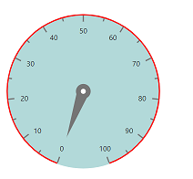

## Minimum and maximum

The [Minimum](https://help.syncfusion.com/cr/blazor/Syncfusion.Blazor.CircularGauge.CircularGaugeAxis.html#Syncfusion_Blazor_CircularGauge_CircularGaugeAxis_Minimum) and [Maximum](https://help.syncfusion.com/cr/blazor/Syncfusion.Blazor.CircularGauge.CircularGaugeAxis.html#Syncfusion_Blazor_CircularGauge_CircularGaugeAxis_Maximum) properties enables you to customize the start and end values of an axis.

```cshtml
@using Syncfusion.Blazor.CircularGauge

<SfCircularGauge>
    <CircularGaugeAxes>
        <CircularGaugeAxis Minimum= "50" Maximum= "250">
        </CircularGaugeAxis>
    </CircularGaugeAxes>
</SfCircularGauge>
```

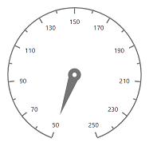

## Start and end angle

You can sweep the Circular Gauge axis from 0 to 360 degrees. By default, the start angle of an axis is 200 degrees and end angle of an axis is 160 degrees. You can customize this option using the [StartAngle](https://help.syncfusion.com/cr/blazor/Syncfusion.Blazor.CircularGauge.CircularGaugeAxis.html#Syncfusion_Blazor_CircularGauge_CircularGaugeAxis_StartAngle) and [EndAngle](https://help.syncfusion.com/cr/blazor/Syncfusion.Blazor.CircularGauge.CircularGaugeAxis.html#Syncfusion_Blazor_CircularGauge_CircularGaugeAxis_EndAngle) properties.

```cshtml
@using Syncfusion.Blazor.CircularGauge

<SfCircularGauge>
    <CircularGaugeAxes>
        <CircularGaugeAxis StartAngle= "270" EndAngle= "90">
        </CircularGaugeAxis>
    </CircularGaugeAxes>
</SfCircularGauge>
```

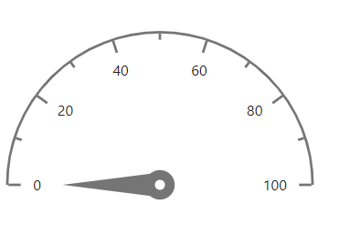

## Axis radius

By default, the radius of an axis is calculated based on the available size. You can customize the axis radius using the [Radius](https://help.syncfusion.com/cr/blazor/Syncfusion.Blazor.CircularGauge.CircularGaugeAxis.html#Syncfusion_Blazor_CircularGauge_CircularGaugeAxis_Radius) property. It takes values either in [percentage](https://help.syncfusion.com/cr/blazor/Syncfusion.Blazor.CircularGauge.CircularGaugeAxis.html#Syncfusion_Blazor_CircularGauge_CircularGaugeAxis_Radius) or in [pixel](https://help.syncfusion.com/cr/blazor/Syncfusion.Blazor.CircularGauge.CircularGaugeAxis.html#Syncfusion_Blazor_CircularGauge_CircularGaugeAxis_Radius).

### In pixel

You can set the radius of the Circular Gauge in pixel as shown below.

```cshtml
@using Syncfusion.Blazor.CircularGauge

<SfCircularGauge>
    <CircularGaugeAxes>
        <CircularGaugeAxis Radius="150px">
        </CircularGaugeAxis>
    </CircularGaugeAxes>
</SfCircularGauge>
```

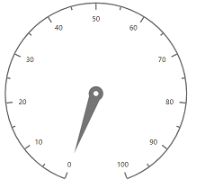

### In percentage

By setting value in percentage, Circular Gauge gets its dimension with respect to its available size. For example, when the [Radius](https://help.syncfusion.com/cr/blazor/Syncfusion.Blazor.CircularGauge.CircularGaugeAxis.html#Syncfusion_Blazor_CircularGauge_CircularGaugeAxis_Radius) is ‘50%’, gauge renders to the half of the available size.

```cshtml
@using Syncfusion.Blazor.CircularGauge

<SfCircularGauge>
    <CircularGaugeAxes>
        <CircularGaugeAxis Radius="50%"></CircularGaugeAxis>
    </CircularGaugeAxes>
</SfCircularGauge>
```

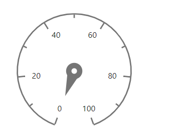

## Ticks

You can customize the [Height](https://help.syncfusion.com/cr/blazor/Syncfusion.Blazor.CircularGauge.TickModel.html#Syncfusion_Blazor_CircularGauge_TickModel_Height), [Color](https://help.syncfusion.com/cr/blazor/Syncfusion.Blazor.CircularGauge.TickModel.html#Syncfusion_Blazor_CircularGauge_TickModel_Color), and [Width](https://help.syncfusion.com/cr/blazor/Syncfusion.Blazor.CircularGauge.TickModel.html#Syncfusion_Blazor_CircularGauge_TickModel_Width) of major ticks and minor ticks using the [CircularGaugeAxisMajorTicks](https://help.syncfusion.com/cr/aspnetcore-blazor/Syncfusion.Blazor.CircularGauge.CircularGaugeAxisMajorTicks.html) and [CircularGaugeAxisMinorTicks](https://help.syncfusion.com/cr/aspnetcore-blazor/Syncfusion.Blazor.CircularGauge.CircularGaugeAxisMinorTicks.html) tags.

By default, [Interval](https://help.syncfusion.com/cr/blazor/Syncfusion.Blazor.CircularGauge.TickModel.html#Syncfusion_Blazor_CircularGauge_TickModel_Interval) for [CircularGaugeAxisMajorTicks](https://help.syncfusion.com/cr/aspnetcore-blazor/Syncfusion.Blazor.CircularGauge.CircularGaugeAxisMajorTicks.html) will be calculated automatically. You can customize the interval for major ticks and minor ticks using the [Interval](https://help.syncfusion.com/cr/blazor/Syncfusion.Blazor.CircularGauge.TickModel.html#Syncfusion_Blazor_CircularGauge_TickModel_Interval) property.

```cshtml
@using Syncfusion.Blazor.CircularGauge

<SfCircularGauge>
    <CircularGaugeAxes>
        <CircularGaugeAxis>
            <CircularGaugeAxisMajorTicks Interval="10" Color="red" Height="10" Width="3">
            </CircularGaugeAxisMajorTicks>
            <CircularGaugeAxisMinorTicks Interval="5" Color="green" Height="5" Width="2">
            </CircularGaugeAxisMinorTicks>
        </CircularGaugeAxis>
    </CircularGaugeAxes>
</SfCircularGauge>
```

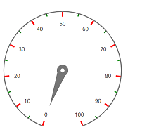

### Tick position

The minor ticks and major ticks can be positioned using the [Offset](https://help.syncfusion.com/cr/blazor/Syncfusion.Blazor.CircularGauge.TickModel.html#Syncfusion_Blazor_CircularGauge_TickModel_Offset) and [Position](https://help.syncfusion.com/cr/blazor/Syncfusion.Blazor.CircularGauge.TickModel.html#Syncfusion_Blazor_CircularGauge_TickModel_Position) properties.

* The [Offset](https://help.syncfusion.com/cr/blazor/Syncfusion.Blazor.CircularGauge.TickModel.html#Syncfusion_Blazor_CircularGauge_TickModel_Offset) defines the distance between the axis and ticks. By default, offset value is 0.

* The [Position](https://help.syncfusion.com/cr/aspnetcore-blazor/Syncfusion.Blazor.CircularGauge.Position.html) will place the ticks on the axis. By default, ticks will be placed inside the axis. Its possible values are 'Position.Inside', 'Position.Outside', and 'Position.Cross'.

```cshtml
@using Syncfusion.Blazor.CircularGauge

<SfCircularGauge>
    <CircularGaugeAxes>
        <CircularGaugeAxis>
            <CircularGaugeAxisMajorTicks Color="red"
                                         Height="10" Width="3"
                                         Position = "Position.Inside"
                                         Offset="5">
            </CircularGaugeAxisMajorTicks>
            <CircularGaugeAxisMinorTicks Color="green"
                                         Height="5" Width="2"
                                         Position = "Position.Inside"
                                         Offset="5">
            </CircularGaugeAxisMinorTicks>
        </CircularGaugeAxis>
    </CircularGaugeAxes>
</SfCircularGauge>
```

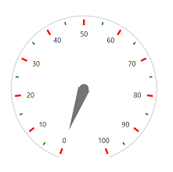

## Labels

The labels of an axis can be customized using the [CircularGaugeAxisLabelFont](https://help.syncfusion.com/cr/aspnetcore-blazor/Syncfusion.Blazor.CircularGauge.CircularGaugeAxisLabelFont.html) tag in [CircularGaugeAxisLabelStyle](https://help.syncfusion.com/cr/aspnetcore-blazor/Syncfusion.Blazor.CircularGauge.CircularGaugeAxisLabelStyle.html) option.

```cshtml
@using Syncfusion.Blazor.CircularGauge

<SfCircularGauge>
    <CircularGaugeAxes>
        <CircularGaugeAxis>
            <CircularGaugeAxisLabelStyle>
                <CircularGaugeAxisLabelFont Color="red" Size="20px" FontWeight="Bold">
                </CircularGaugeAxisLabelFont>
            </CircularGaugeAxisLabelStyle>
        </CircularGaugeAxis>
    </CircularGaugeAxes>
</SfCircularGauge>
```

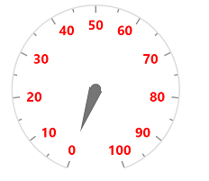

### Label position

The labels can be moved using the [Offset](https://help.syncfusion.com/cr/blazor/Syncfusion.Blazor.CircularGauge.CircularGaugeAxisLabelStyle.html#Syncfusion_Blazor_CircularGauge_CircularGaugeAxisLabelStyle_Offset) or [Position](https://help.syncfusion.com/cr/aspnetcore-blazor/Syncfusion.Blazor.CircularGauge.Position.html) property.

* The [Offset](https://help.syncfusion.com/cr/blazor/Syncfusion.Blazor.CircularGauge.CircularGaugeAxisLabelStyle.html#Syncfusion_Blazor_CircularGauge_CircularGaugeAxisLabelStyle_Offset) defines the distance between the labels and ticks. By default, offset value is 0.

* The [Position](https://help.syncfusion.com/cr/blazor/Syncfusion.Blazor.CircularGauge.LabelModel.html#Syncfusion_Blazor_CircularGauge_LabelModel_Position) specifies the label position. By default, the labels will be placed inside the axis. Its possible values are 'Position.Inside', 'Position.Outside' and 'Position.Cross'.

```cshtml
@using Syncfusion.Blazor.CircularGauge

<SfCircularGauge>
    <CircularGaugeAxes>
        <CircularGaugeAxis>
            <CircularGaugeAxisLabelStyle Position="Position.Outside"
                                Offset="5">
            </CircularGaugeAxisLabelStyle>
        </CircularGaugeAxis>
    </CircularGaugeAxes>
</SfCircularGauge>
```

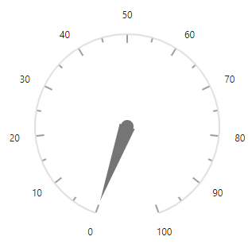

### Auto angle

The labels can be swept along the axis angle by enabling the [AutoAngle](https://help.syncfusion.com/cr/blazor/Syncfusion.Blazor.CircularGauge.CircularGaugeAxisLabelStyle.html#Syncfusion_Blazor_CircularGauge_CircularGaugeAxisLabelStyle_AutoAngle) property.

```cshtml
@using Syncfusion.Blazor.CircularGauge

<SfCircularGauge>
    <CircularGaugeAxes>
        <CircularGaugeAxis>
            <CircularGaugeAxisLabelStyle AutoAngle="true"></CircularGaugeAxisLabelStyle>
        </CircularGaugeAxis>
    </CircularGaugeAxes>
</SfCircularGauge>
```

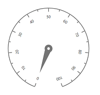

### Smart labels

When an axis makes a complete circle, then the first and last labels of the axis will overlap with each other. So, you need to either hide first or last label using the [HiddenLabel](https://help.syncfusion.com/cr/blazor/Syncfusion.Blazor.CircularGauge.CircularGaugeAxisLabelStyle.html#Syncfusion_Blazor_CircularGauge_CircularGaugeAxisLabelStyle_HiddenLabel) property. When 'HiddenLabel' value is [First](https://help.syncfusion.com/cr/aspnetcore-blazor/Syncfusion.Blazor.CircularGauge.HiddenLabel.html), the first label will be hidden and when the 'HiddenLabel' value is [Last](https://help.syncfusion.com/cr/aspnetcore-blazor/Syncfusion.Blazor.CircularGauge.HiddenLabel.html), the last label will be hidden.

```cshtml
@using Syncfusion.Blazor.CircularGauge

<SfCircularGauge>
    <CircularGaugeAxes>
        <CircularGaugeAxis Minimum="0"
                           Maximum="12"
                           EndAngle="360"
                           StartAngle="0">
            <CircularGaugeAxisLabelStyle Position="Position.Inside"
                                HiddenLabel="HiddenLabel.First">
            </CircularGaugeAxisLabelStyle>
            <CircularGaugeAxisMajorTicks Interval="1"
                                         Height="10"
                                         Position="Position.Inside">
            </CircularGaugeAxisMajorTicks>
            <CircularGaugeAxisMinorTicks Interval="0.2"
                                         Height="5"
                                         Position="Position.Inside">
            </CircularGaugeAxisMinorTicks>
        </CircularGaugeAxis>
    </CircularGaugeAxes>
</SfCircularGauge>
```

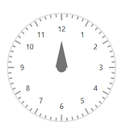

### Label format

The axis labels can be formatted using the [Format](https://help.syncfusion.com/cr/blazor/Syncfusion.Blazor.CircularGauge.CircularGaugeAxisLabelStyle.html#Syncfusion_Blazor_CircularGauge_CircularGaugeAxisLabelStyle_Format) property in [CircularGaugeAxisLabelStyle](https://help.syncfusion.com/cr/aspnetcore-blazor/Syncfusion.Blazor.CircularGauge.CircularGaugeAxisLabelStyle.html), it supports all globalize format.

```cshtml
@using Syncfusion.Blazor.CircularGauge

<SfCircularGauge>
    <CircularGaugeAxes>
        <CircularGaugeAxis>
            <CircularGaugeAxisLabelStyle Format="p1"></CircularGaugeAxisLabelStyle>
        </CircularGaugeAxis>
    </CircularGaugeAxes>
</SfCircularGauge>
```

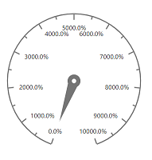

The following table describes the result of applying some commonly used label formats on numeric values.

<!-- markdownlint-disable MD033 -->
<table>
<tr>
<td><b>Label Value</b></td>
<td><b>Label Format property value</b></td>
<td><b>Result </b></td>
<td><b>Description </b></td>
</tr>
<tr>
<td>1000</td>
<td>n1</td>
<td>1000.0</td>
<td>The number is rounded to 1 decimal place.</td>
</tr>
<tr>
<td>1000</td>
<td>n2</td>
<td>1000.00</td>
<td>The number is rounded to 2 decimal places.</td>
</tr>
<tr>
<td>1000</td>
<td>n3</td>
<td>1000.000</td>
<td>The number is rounded to 3 decimal places.</td>
</tr>
<tr>
<td>0.01</td>
<td>p1</td>
<td>1.0%</td>
<td>The number is converted to percentage with 1 decimal place.</td>
</tr>
<tr>
<td>0.01</td>
<td>p2</td>
<td>1.00%</td>
<td>The number is converted to percentage with 2 decimal places.</td>
</tr>
<tr>
<td>0.01</td>
<td>p3</td>
<td>1.000%</td>
<td>The number is converted to percentage with 3 decimal places.</td>
</tr>
<tr>
<td>1000</td>
<td>c1</td>
<td>$1,000.0</td>
<td>The currency symbol is appended to number, and the number is rounded to 1 decimal place.</td>
</tr>
<tr>
<td>1000</td>
<td>c2</td>
<td>$1,000.00</td>
<td>The currency symbol is appended to number, and the number is rounded to 2 decimal places.</td>
</tr>
</table>

### Custom label format

Axis labels support custom label format using placeholder like {value}°C, in which the value represent the axis label. e.g., 20°C.

```cshtml
@using Syncfusion.Blazor.CircularGauge

<SfCircularGauge>
    <CircularGaugeAxes>
        <CircularGaugeAxis>
            <CircularGaugeAxisLabelStyle Format="{value}°C"></CircularGaugeAxisLabelStyle>
        </CircularGaugeAxis>
    </CircularGaugeAxes>
</SfCircularGauge>
```

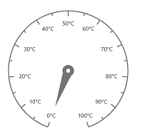

### Show last label

If the maximum value does not enter the interval of major ticks, the last label will be hidden by default. If you want to display the last label, set the property value [ShowLastLabel](https://help.syncfusion.com/cr/blazor/Syncfusion.Blazor.CircularGauge.CircularGaugeAxis.html#Syncfusion_Blazor_CircularGauge_CircularGaugeAxis_ShowLastLabel) to true.

```cshtml
@using Syncfusion.Blazor.CircularGauge

<SfCircularGauge>
    <CircularGaugeAxes>
        <CircularGaugeAxis Maximum="100"
                           ShowLastLabel="true">
            <CircularGaugeAxisMajorTicks Interval="30"></CircularGaugeAxisMajorTicks>
        </CircularGaugeAxis>
    </CircularGaugeAxes>
</SfCircularGauge>
```

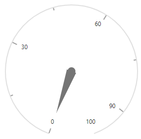

### Hide intersecting axis labels

When the axis labels overlap with each other, you can hide the intersected labels by setting the `HideIntersectingLabel` property to true in the axis.

```cshtml
<SfCircularGauge>
    <CircularGaugeAxes>
        <CircularGaugeAxis Maximum="200" StartAngle="270" EndAngle="90" Minimum="0" HideIntersectingLabel="true">
            <CircularGaugeAxisMajorTicks Interval="4"></CircularGaugeAxisMajorTicks>
            <CircularGaugeAxisMinorTicks Interval="2"></CircularGaugeAxisMinorTicks>
        </CircularGaugeAxis>
    </CircularGaugeAxes>
</SfCircularGauge>
```

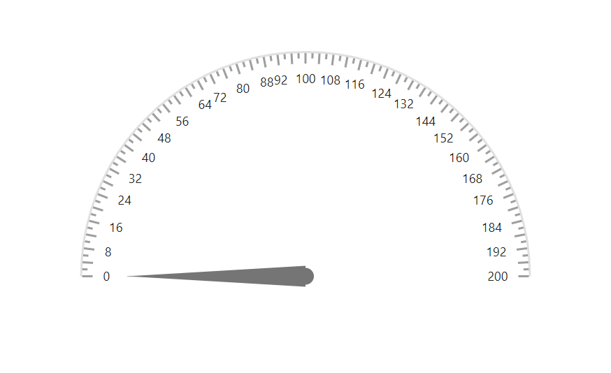

## Axis direction

You can change the axis direction of the circular gauge using [Direction](https://help.syncfusion.com/cr/aspnetcore-blazor/Syncfusion.Blazor.CircularGauge.GaugeDirection.html) property. Following axis directions are available in the circular gauge.

* ClockWise
* AntiClockWise

```cshtml
@using Syncfusion.Blazor.CircularGauge

<SfCircularGauge>
    <CircularGaugeAxes>
        <CircularGaugeAxis Direction="GaugeDirection.AntiClockWise">
        </CircularGaugeAxis>
    </CircularGaugeAxes>
</SfCircularGauge>
```

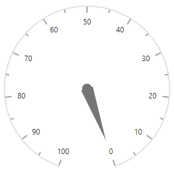

## Multiple axes

In addition to the default axis, you can add n number of axis to a gauge. Each axis will have its own ranges, pointers, annotations, and customization options.

```cshtml
@using Syncfusion.Blazor.CircularGauge

<SfCircularGauge>
    <CircularGaugeAxes>
        <CircularGaugeAxis Minimum="0"
                           Maximum="140">
            <CircularGaugePointers>
                <CircularGaugePointer Type="PointerType.Needle">
                </CircularGaugePointer>
            </CircularGaugePointers>
        </CircularGaugeAxis>
        <CircularGaugeAxis Minimum="-20"
                           Maximum="60">
            <CircularGaugePointers>
                <CircularGaugePointer Type="PointerType.Marker"
                                      MarkerShape="GaugeShape.InvertedTriangle"
                                      MarkerHeight="20"
                                      MarkerWidth="20">
                </CircularGaugePointer>
            </CircularGaugePointers>
            <CircularGaugeAxisMajorTicks Position="Position.Outside">
            </CircularGaugeAxisMajorTicks>
            <CircularGaugeAxisMinorTicks Position="Position.Outside">
            </CircularGaugeAxisMinorTicks>
            <CircularGaugeAxisLabelStyle Position="Position.Outside">
            </CircularGaugeAxisLabelStyle>
        </CircularGaugeAxis>
    </CircularGaugeAxes>
</SfCircularGauge>
```

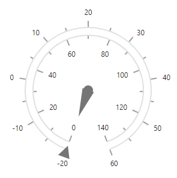