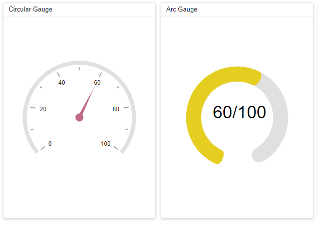
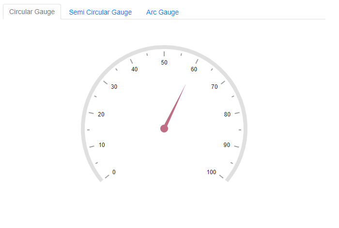

# Render Circular Gauge component inside other components

The Circular Gauge can be rendered within components such as the Dashboard Layout, Tabs, Dialog, and others. In general, the Circular Gauge component renders before other components, so a boolean variable ((i.e. boolean flag) is used to determine when to begin rendering the Circular Gauge component.

## Circular Gauge component inside Dashboard Layout

When the Circular Gauge component renders within a panel of the Dashboard Layout component, its rendering begins concurrently with the Dashboard Layout component's rendering. As a result, the size of the Circular Gauge component will not be proper. To properly render the Circular Gauge component, a boolean variable (i.e. **IsInitialRender**) must be created and it is used to determine the Circular Gauge component's rendering. The boolean variable is set to **false** by default, so the Circular Gauge component will not be rendered initially. When the Dashboard Layout component is rendered, its [Created](https://help.syncfusion.com/cr/blazor/Syncfusion.Blazor.Layouts.DashboardLayoutEvents.html#Syncfusion_Blazor_Layouts_DashboardLayoutEvents_Created) event is fired, and the boolean variable (i.e. **IsInitialRender**) in this event must be changed to **true** to initiate the render of the Circular Gauge component.

When you drag and resize the Dashboard Layout's panel, the Circular Gauge component is not notified, so the Circular Gauge are not properly rendered within the panel. To avoid this scenario, the Circular Gauge component's [Refresh](https://help.syncfusion.com/cr/blazor/Syncfusion.Blazor.CircularGauge.SfCircularGauge.html#Syncfusion_Blazor_CircularGauge_SfCircularGauge_RefreshAsync) method must be called in the Dashboard Layout's [OnResizeStop](https://help.syncfusion.com/cr/blazor/Syncfusion.Blazor.Layouts.DashboardLayoutEvents.html#Syncfusion_Blazor_Layouts_DashboardLayoutEvents_OnResizeStop) and [OnWindowResize](https://help.syncfusion.com/cr/blazor/Syncfusion.Blazor.Layouts.DashboardLayoutEvents.html#Syncfusion_Blazor_Layouts_DashboardLayoutEvents_OnWindowResize) events. Because the panel size of the Dashboard Layout is determined after a delay, a 1000 millisecond delay must be provided before refreshing the Circular Gauge component.

```cshtml
@using Syncfusion.Blazor.CircularGauge
@using Syncfusion.Blazor.Layouts

<SfDashboardLayout AllowResizing="@AllowResizing"  AllowFloating="@AllowFloating" CellSpacing="@CellSpacing" Columns="@Columns">
<DashboardLayoutEvents Created="Created" OnResizeStop="@ResizingHandler" OnWindowResize="@ResizingHandler" Resizing="ResizingHandler"></DashboardLayoutEvents>
    <DashboardLayoutPanels>
        <DashboardLayoutPanel Id="24" Row="0" Col="5" SizeX="5" SizeY="7">
            <HeaderTemplate><div> Circular Gauge </div></HeaderTemplate>
            <ContentTemplate>
                @if (IsInitialRender)
                {
                     <SfCircularGauge @ref="Gauge" ID="CircularGauge" Background="transparent" Height="100%" Width="100%">
                        <CircularGaugeAxes>
                            <CircularGaugeAxis Radius="80%" StartAngle="230" EndAngle="130">
                                <CircularGaugeAxisLabelStyle Offset="-1">
                                    <CircularGaugeAxisLabelFont FontFamily="inherit"></CircularGaugeAxisLabelFont>
                                </CircularGaugeAxisLabelStyle>
                                <CircularGaugeAxisLineStyle Width="8" Color="#E0E0E0" />
                                <CircularGaugeAxisMajorTicks Offset="5" />
                                <CircularGaugeAxisMinorTicks Offset="5" />
                                <CircularGaugePointers>
                                    <CircularGaugePointer Value=60 Radius="60%" PointerWidth="7" Color="#c06c84">
                                        <CircularGaugePointerAnimation Duration="500" />
                                        <CircularGaugeCap Radius="8" Color="#c06c84">
                                            <CircularGaugeCapBorder Width="0" />
                                        </CircularGaugeCap>
                                        <CircularGaugeNeedleTail Length="0%" />
                                    </CircularGaugePointer>
                                </CircularGaugePointers>
                            </CircularGaugeAxis>
                        </CircularGaugeAxes>
                    </SfCircularGauge>
                }
            </ContentTemplate>
        </DashboardLayoutPanel> 
    </DashboardLayoutPanels>
</SfDashboardLayout>

@code {
    public bool IsInitialRender { get; set; }
    SfCircularGauge Gauge;
    public double[] CellSpacing = { 10, 10 };
    public bool FloatCheck = true;
    public bool ResizeCheck = true;
    public int Columns = 20;
    public bool AllowFloating { get; set; } = true;
    public bool AllowResizing { get; set; } = true; 

    public async void Created(Object args)
    {
        IsInitialRender = true;

    }
    
    public async void ResizingHandler()
    {
        await Task.Delay(1000);
        Gauge.Refresh();
    }

}

```


## Circular Gauge component inside Tab

When the Circular Gauge component renders within the Tab component, its rendering begins concurrently with the Tab component's rendering. As a result, the size of the Circular Gauge component will not be proper. To properly render the Circular Gauge component, a boolean variable (i.e. **IsInitialRender**) must be created and it is used to determine the Circular Gauge component's rendering. The boolean variable is set to **false** by default, so the Circular Gauge component will not be rendered initially. When the Tab component is rendered, its [Created](https://help.syncfusion.com/cr/blazor/Syncfusion.Blazor.Navigations.TabEvents.html#Syncfusion_Blazor_Navigations_TabEvents_Created) event is fired, and the boolean variable (i.e. **IsInitialRender**) in this event must be changed to **true** to initiate the render of the Circular Gauge component.

```cshtml

@using Syncfusion.Blazor.Navigations
@using Syncfusion.Blazor.CircularGauge

    <SfTab CssClass="default-tab">
        <TabEvents Created="Created"></TabEvents>
        <TabItems>
            <TabItem>
                <ChildContent>
                    <TabHeader Text="Circular Gauge"></TabHeader>
                </ChildContent>
                <ContentTemplate>
                 @if (IsInitialRender)
                 {
                        <SfCircularGauge @ref="Gauge" ID="CircularGauge" Background="transparent">
                        <CircularGaugeAxes>
                            <CircularGaugeAxis Radius="80%" StartAngle="230" EndAngle="130">
                                <CircularGaugeAxisLabelStyle Offset="-1">
                                    <CircularGaugeAxisLabelFont FontFamily="inherit"></CircularGaugeAxisLabelFont>
                                </CircularGaugeAxisLabelStyle>
                                <CircularGaugeAxisLineStyle Width="8" Color="#E0E0E0" />
                                <CircularGaugeAxisMajorTicks Offset="5" />
                                <CircularGaugeAxisMinorTicks Offset="5" />
                                <CircularGaugePointers>
                                    <CircularGaugePointer Value=60 Radius="60%" PointerWidth="7" Color="#c06c84">
                                        <CircularGaugePointerAnimation Duration="500" />
                                        <CircularGaugeCap Radius="8" Color="#c06c84">
                                            <CircularGaugeCapBorder Width="0" />
                                        </CircularGaugeCap>
                                        <CircularGaugeNeedleTail Length="0%" />
                                    </CircularGaugePointer>
                                </CircularGaugePointers>
                            </CircularGaugeAxis>
                        </CircularGaugeAxes>
                    </SfCircularGauge>
                 }   
                 </ContentTemplate>
            </TabItem>
            <TabItem>
                <ChildContent>
                    <TabHeader Text="Circular Gauge Ranges"></TabHeader>
                </ChildContent>
                 <ContentTemplate>
                 @if (IsInitialRender)
                 {
                    <SfCircularGauge ID="GaugeOne" @ref="Gauge">
                            <CircularGaugeAxes>
                                <CircularGaugeAxis>
                                    <CircularGaugeRanges>
                                        <CircularGaugeRange Start="40" End="80">
                                        </CircularGaugeRange>
                                    </CircularGaugeRanges>
                                </CircularGaugeAxis>
                            </CircularGaugeAxes>
                    </SfCircularGauge>
                 }   
                 </ContentTemplate>
            </TabItem>
            <TabItem>
                <ChildContent>
                    <TabHeader Text="Semi Circular Gauge"></TabHeader>
                </ChildContent>
                 <ContentTemplate>
                 @if (IsInitialRender)
                 {
                    <SfCircularGauge ID="Gauge" @ref="Gauge">
                        <CircularGaugeAxes>
                            <CircularGaugeAxis Maximum="200" StartAngle="270" EndAngle="90" Minimum="0" HideIntersectingLabel="true">
                                <CircularGaugeAxisMajorTicks Interval="4"></CircularGaugeAxisMajorTicks>
                                <CircularGaugeAxisMinorTicks Interval="2"></CircularGaugeAxisMinorTicks>
                            </CircularGaugeAxis>
                        </CircularGaugeAxes>
                    </SfCircularGauge>
                 }   
                 </ContentTemplate>
            </TabItem>
        </TabItems>
    </SfTab>
@code{
    SfCircularGauge Gauge;
    public bool IsInitialRender { get; set; }
    public void Created()
    {
        IsInitialRender = true;
    }
    }

```



## Circular Gauge component inside Dialog

When the Circular Gauge component renders within the Dialog component, its rendering begins concurrently with the Dialog component's rendering. As a result, the size of the Circular Gauge component will not be proper. To properly render the Circular Gauge component, a boolean variable (i.e. **IsInitialRender**) must be created and it is used to determine the Circular Gauge component's rendering. The boolean variable is set to **false** by default, so the Circular Gauge component will not be rendered initially. When the Dialog component is being opened, its [OnOpen](https://help.syncfusion.com/cr/blazor/Syncfusion.Blazor.Popups.DialogEvents.html#Syncfusion_Blazor_Popups_DialogEvents_OnOpen) event is fired, and the boolean variable (i.e. **IsInitialRender**) in this event must be changed to **true** to initiate the render of the Circular Gauge component. When the Dialog component is closed, its [Closed](https://help.syncfusion.com/cr/blazor/Syncfusion.Blazor.Popups.DialogEvents.html#Syncfusion_Blazor_Popups_DialogEvents_Closed) event is fired, and the boolean variable (i.e. **IsInitialRender**) in this event must be changed to **false**.

```cshtml

@using Syncfusion.Blazor.Popups
@using Syncfusion.Blazor.CircularGauge

<div class="col-lg-12 control-section" id="target">
    <div>
        @if (this.ShowButton)
        {
            <button class="e-btn" @onclick="@OnClicked">Open</button>
        }
    </div>
    <SfDialog ResizeHandles="@DialogResizeDirections" AllowDragging="true" Height="400px" Width="400px" EnableResize="true" ShowCloseIcon="true" @bind-Visible="Visibility">
        <DialogEvents OnResizeStop="@OnResizeStopHandler" Resizing="OnResizeStopHandler" OnOpen="@DialogOpen" Closed="@DialogClose"></DialogEvents>
        <DialogTemplates>
            <Header>Circular Gauge</Header>
            <Content> 
                @if(IsInitialRender)
                {  
                   <SfCircularGauge @ref="Gauge" ID="CircularGauge" Background="transparent" Height="100%" Width="100%">
                        <CircularGaugeAxes>
                            <CircularGaugeAxis Radius="80%" StartAngle="230" EndAngle="130">
                                <CircularGaugeAxisLabelStyle Offset="-1">
                                    <CircularGaugeAxisLabelFont FontFamily="inherit"></CircularGaugeAxisLabelFont>
                                </CircularGaugeAxisLabelStyle>
                                <CircularGaugeAxisLineStyle Width="8" Color="#E0E0E0" />
                                <CircularGaugeAxisMajorTicks Offset="5" />
                                <CircularGaugeAxisMinorTicks Offset="5" />
                                <CircularGaugePointers>
                                    <CircularGaugePointer Value=60 Radius="60%" PointerWidth="7" Color="#c06c84">
                                        <CircularGaugePointerAnimation Duration="500" />
                                        <CircularGaugeCap Radius="8" Color="#c06c84">
                                            <CircularGaugeCapBorder Width="0" />
                                        </CircularGaugeCap>
                                        <CircularGaugeNeedleTail Length="0%" />
                                    </CircularGaugePointer>
                                </CircularGaugePointers>
                            </CircularGaugeAxis>
                        </CircularGaugeAxes>
                    </SfCircularGauge>
                }
            </Content>
        </DialogTemplates>
    </SfDialog>
</div>
<style>
    #target {
        min-height: 400px;
    }
</style>
@code {
    SfCircularGauge Gauge;
    public bool IsInitialRender { get; set; }
    public bool Visibility { get; set; } = true;
    public bool ShowButton { get; set; } = false;
    public ResizeDirection[] DialogResizeDirections { get; set; } = new ResizeDirection[] { ResizeDirection.All };

    public async Task OnResizeStopHandler(Microsoft.AspNetCore.Components.Web.MouseEventArgs args)
    {
        await Task.Delay(3000);
        Gauge.Refresh();
    }

    private void DialogOpen(Object args)
    {
        this.ShowButton = false;
        IsInitialRender = true;
    }
    private void DialogClose(Object args)
    {
        this.ShowButton = true;
        IsInitialRender = false;
    }
    private void OnClicked()
    {
        this.Visibility = true;
    }
}

```


## Circular Gauge component inside Accordion

When the Circular Gauge component renders within the Accordion component, its rendering begins concurrently with the Accordion component's rendering. As a result, the size of the Circular Gauge component will not be proper. To properly render the Circular Gauge component, a boolean variable (i.e. **IsInitialRender**) must be created and it is used to determine the Circular Gauge component's rendering. The boolean variable is set to **false** by default, so the Circular Gauge component will not be rendered initially. When the Accordion component is rendered, its [Created](https://help.syncfusion.com/cr/blazor/Syncfusion.Blazor.Navigations.AccordionEvents.html#Syncfusion_Blazor_Navigations_AccordionEvents_Created) event is fired, and the boolean variable (i.e. **IsInitialRender**) in this event must be changed to **true** to initiate the render of the Circular Gauge component.

```cshtml

@using Syncfusion.Blazor.Navigations
@using Syncfusion.Blazor.CircularGauge


```
