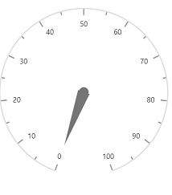

# Getting Started with Blazor CircularGauge Component in Web App

This article provides a step-by-step instructions for building `Blazor Web App` with `Blazor CircularGauge` component using [Visual Studio](https://visualstudio.microsoft.com/vs/).

## Prerequisites

* [System requirements for Blazor components](https://blazor.syncfusion.com/documentation/system-requirements)

## Create a new Blazor Web App

You can create a **Blazor Web App** using Visual Studio 2022 via [Microsoft Templates](https://learn.microsoft.com/en-us/aspnet/core/blazor/tooling?view=aspnetcore-8.0) or the [Syncfusion Blazor Extension](https://blazor.syncfusion.com/documentation/visual-studio-integration/template-studio). While creating a Blazor Web App, configure corresponding [Interactive render mode](https://learn.microsoft.com/en-us/aspnet/core/blazor/components/render-modes?view=aspnetcore-8.0#render-modes) and [Interactivity location](https://learn.microsoft.com/en-us/aspnet/core/blazor/tooling?view=aspnetcore-8.0&pivots=windows).

## Install Syncfusion Blazor CircularGauge and Themes NuGet in the Blazor Web App

Here's an example of how to add **Blazor CircularGauge** component in the app, open the NuGet package manager in Visual Studio (*Tools → NuGet Package Manager → Manage NuGet Packages for Solution*), search and install [Syncfusion.Blazor.CircularGauge](https://www.nuget.org/packages/Syncfusion.Blazor.CircularGauge/) and [Syncfusion.Blazor.Themes](https://www.nuget.org/packages/Syncfusion.Blazor.Themes/). For a web app with 'WebAssembly' or 'Auto' interactive render mode, install the Syncfusion NuGet packages in the project where you intend to add the components.  Alternatively, you can utilize the following package manager command to achieve the same.




Install-Package Syncfusion.Blazor.CircularGauge -Version {{ site.releaseversion }}
Install-Package Syncfusion.Blazor.Themes -Version {{ site.releaseversion }}




N> Syncfusion Blazor components are available in [nuget.org](https://www.nuget.org/packages?q=syncfusion.blazor). Refer to [NuGet packages](https://blazor.syncfusion.com/documentation/nuget-packages) topic for available NuGet packages list with component details.

## Register Syncfusion Blazor Service

Open **~/Components/_Imports.razor** file and import the `Syncfusion.Blazor` and `Syncfusion.Blazor.CircularGauge` namespace .

```cshtml

@using Syncfusion.Blazor
@using Syncfusion.Blazor.CircularGauge
```

Now, register the Syncfusion Blazor Service in the **~/Program.cs** file of your Blazor Web App. For a app with 'WebAssembly' or 'Auto (Server and WebAssembly)' interactive render mode, register the Syncfusion Blazor service in both **~/Program.cs** files of your web app.
```cshtml

....
using Syncfusion.Blazor;
....
builder.Services.AddSyncfusionBlazor();
....

```

## Add stylesheet and script resources

The theme stylesheet and script can be accessed from NuGet through [Static Web Assets](https://blazor.syncfusion.com/documentation/appearance/themes#static-web-assets). Include the stylesheet reference in the `<head>` section and the script reference at the end of the `<body>` in the **~/Components/App.razor** file as shown below:

```html
<head>
    ....
    <link href="_content/Syncfusion.Blazor.Themes/material.css" rel="stylesheet" />
</head>
....
<body>
    ....
    <script src="_content/Syncfusion.Blazor.Core/scripts/syncfusion-blazor.min.js" type="text/javascript"></script>
</body>
```

N> Check out the [Blazor Themes](https://blazor.syncfusion.com/documentation/appearance/themes) topic to discover various methods ([Static Web Assets](https://blazor.syncfusion.com/documentation/appearance/themes#static-web-assets), [CDN](https://blazor.syncfusion.com/documentation/appearance/themes#cdn-reference), and [CRG](https://blazor.syncfusion.com/documentation/common/custom-resource-generator)) for referencing themes in your Blazor application. Also, check out the [Adding Script Reference](https://blazor.syncfusion.com/documentation/common/adding-script-references) topic to learn different approaches for adding script references in your Blazor application.

## Add Syncfusion Blazor CircularGauge component

Add the Syncfusion Blazor CircularGauge component in the **~/Components/Pages/Home.razor** file. If you opt for an interactive location as Per page/component in the web app, define a render mode at the top of the ~Pages/*.razor component, as follows:




@* desired render mode define here *@
@rendermode InteractiveServer







<SfCircularGauge>
    <CircularGaugeAxes>
        <CircularGaugeAxis>
            <CircularGaugePointers>
                <CircularGaugePointer></CircularGaugePointer>
            </CircularGaugePointers>
        </CircularGaugeAxis>
    </CircularGaugeAxes>
</SfCircularGauge>




* Press <kbd>Ctrl</kbd>+<kbd>F5</kbd> (Windows) or <kbd>⌘</kbd>+<kbd>F5</kbd> (macOS) to launch the application. This will render the Syncfusion Blazor CircularGauge component in your default web browser.



## Set pointer value

Pointers are used to indicate values on an axis. You can change the pointer value using the [Value](https://help.syncfusion.com/cr/blazor/Syncfusion.Blazor.CircularGauge.CircularGaugePointer.html#Syncfusion_Blazor_CircularGauge_CircularGaugePointer_Value) property in [CircularGaugePointer](https://help.syncfusion.com/cr/blazor/Syncfusion.Blazor.CircularGauge.CircularGaugePointer.html).

N> In CircularGauge, you can configure multiple axes. On each axis, you can add a pointer.




<SfCircularGauge>
    <CircularGaugeAxes>
        <CircularGaugeAxis>
            <CircularGaugePointers>
                <CircularGaugePointer Value="35">
                </CircularGaugePointer>
            </CircularGaugePointers>
        </CircularGaugeAxis>
    </CircularGaugeAxes>
</SfCircularGauge>





## Adding title for Blazor CircularGauge

Title can be added to the CircularGauge to provide a quick information to the users about the context of the rendered CircularGauge. You can add a title using [Title](https://help.syncfusion.com/cr/blazor/Syncfusion.Blazor.CircularGauge.SfCircularGauge.html#Syncfusion_Blazor_CircularGauge_SfCircularGauge_Title) property in [SfCircularGauge](https://help.syncfusion.com/cr/blazor/Syncfusion.Blazor.CircularGauge.SfCircularGauge.html).




<SfCircularGauge Title="Speedometer">
    <CircularGaugeTitleStyle Color="blue" FontWeight="bold" Size="25"></CircularGaugeTitleStyle>
    <CircularGaugeAxes>
        <CircularGaugeAxis>
            <CircularGaugePointers>
                <CircularGaugePointer>
                </CircularGaugePointer>
            </CircularGaugePointers>
        </CircularGaugeAxis>
    </CircularGaugeAxes>
</SfCircularGauge>





## Adding ranges in the Blazor CircularGauge

Range is used to specify a group of scale values in the gauge. You can set the range start and end using [Start](https://help.syncfusion.com/cr/blazor/Syncfusion.Blazor.CircularGauge.CircularGaugeRange.html#Syncfusion_Blazor_CircularGauge_CircularGaugeRange_Start) and [End](https://help.syncfusion.com/cr/blazor/Syncfusion.Blazor.CircularGauge.CircularGaugeRange.html#Syncfusion_Blazor_CircularGauge_CircularGaugeRange_End) properties in the [CircularGaugeRange](https://help.syncfusion.com/cr/blazor/Syncfusion.Blazor.CircularGauge.CircularGaugeRange.html).




<SfCircularGauge>
    <CircularGaugeAxes>
        <CircularGaugeAxis>
            <CircularGaugeRanges>
                <CircularGaugeRange Start="40" End="80">
                </CircularGaugeRange>
            </CircularGaugeRanges>
        </CircularGaugeAxis>
    </CircularGaugeAxes>
</SfCircularGauge>





## See also

1. [Getting Started with Syncfusion Blazor for client-side in .NET Core CLI](https://blazor.syncfusion.com/documentation/getting-started/blazor-webassembly-dotnet-cli)
2. [Getting Started with Syncfusion Blazor for client-side in Visual Studio](https://blazor.syncfusion.com/documentation/getting-started/blazor-webassembly-visual-studio)
3. [Getting Started with Syncfusion Blazor for server-side in .NET Core CLI](https://blazor.syncfusion.com/documentation/getting-started/blazor-server-side-dotnet-cli)

