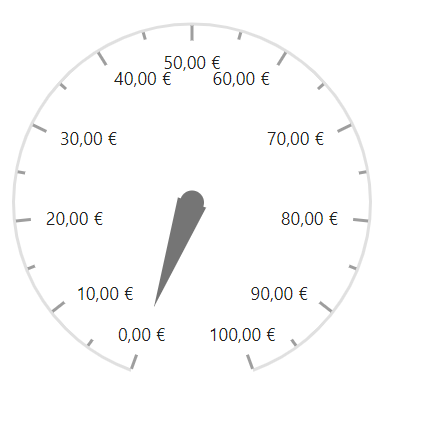

# Globalization

The internationalization library provides support for formatting and parsing the number using the official [Unicode CLDR](http://cldr.unicode.org/) JSON data and also provides the `loadCldr` method to load the culture-specific CLDR JSON data. The Circular Gauge component comes with built-in internationalization support to adapt to different cultures.

By default, all the Blazor components are specific to the English culture ('en-US'). If you need a different culture, follow the given steps:

* Install the [`CLDR-Data`](http://cldr.unicode.org/index/cldr-spec/json) package using the following command (it installs the CLDR JSON data).

```
npm install cldr-data --save
```

To know more about CLDR-Data, refer to [CLDR-Data](http://cldr.unicode.org/index/cldr-spec/json).

After the package has been installed, you can find the culture-specific JSON data under the following location: `\node_modules\cldr-data\main`, and then copy the required `cldr-data` file into the `wwwroot\cldr-data` folder.

Circular Gauge provides internationalization support for below elements.

* Axis label.
* Tooltip.

In the below example axis labels are `globalized` to EUR.

```csharp
@using Syncfusion.Blazor
@using Syncfusion.Blazor.CircularGauge
@using Microsoft.JSInterop;

<SfCircularGauge>
    <CircularGaugeAxes>
        <CircularGaugeAxis>
            <CircularGaugeAxisLabelStyle Format='c' Position="Position.Inside">
            </CircularGaugeAxisLabelStyle>
        </CircularGaugeAxis>
    </CircularGaugeAxes>
</SfCircularGauge>

@code {
    [Inject]
    protected IJSRuntime JsRuntime { get; set; }
    protected override void OnAfterRender()
    {
        this.JsRuntime.Sf().LoadCldrData(new string[] { "wwwroot/cldr-data/de/currencies.json", "wwwroot/cldr-data/de/numbers.json" }).SetCulture("de").SetCurrencyCode("EUR");
    }
}
```

