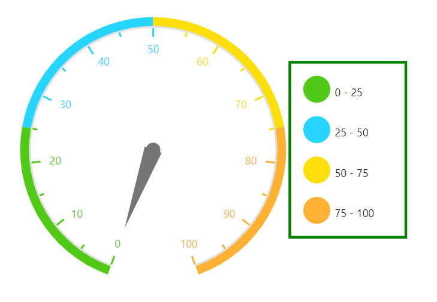
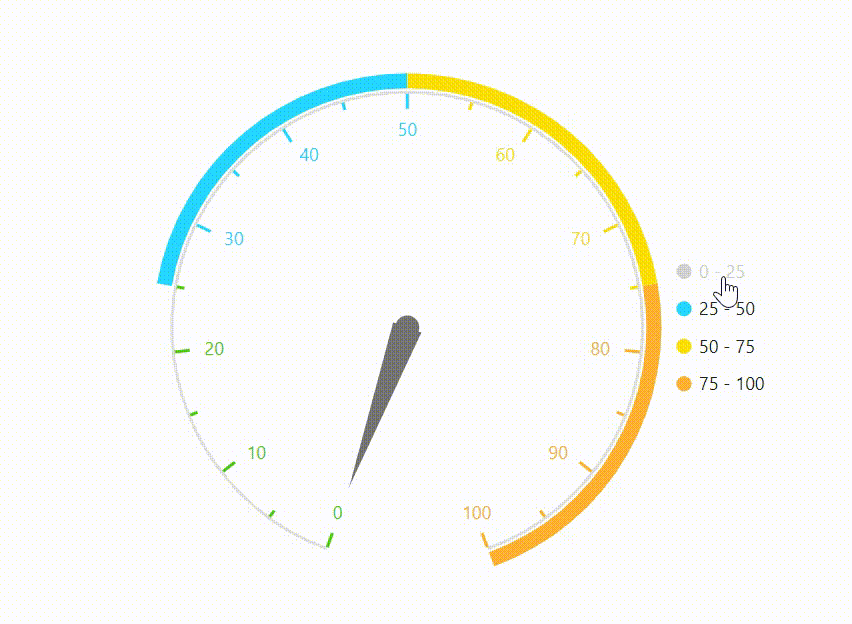
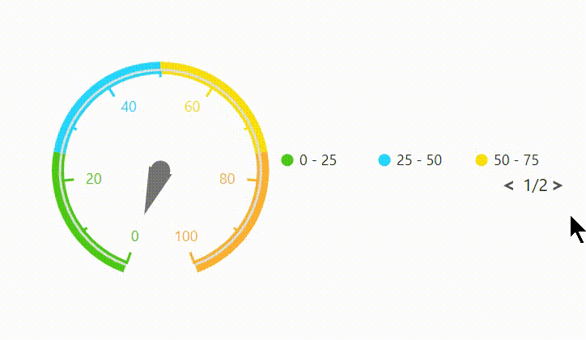
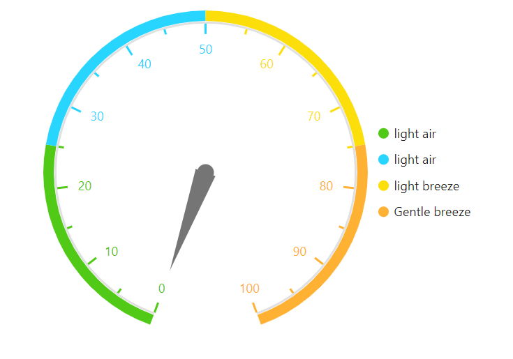

# Legend in Blazor Circular Gauge Component

Legend provides valuable information for interpreting what the circular gauge axis range displays, and they can be represented in various colors, shapes, and other identifiers based on the data. It gives a breakdown of what each symbol represents in the axis range of circular gauge.

You can add the legend for circular gauge ranges by setting the visible property of `CircularGaugeLegendSettings` to true.

<!-- markdownlint-disable MD036 -->

## Legend customization

Customization option is also provided for the legend shape, alignment, and position.

## Position and alignment

The position of the legend is used to place legend in various positions. You can use the `Position` property in `CircularGaugeLegendSettings`. Based on the position, the legend item will be aligned. The following options are available to customize the legend position:

* Top
* Bottom
* Left
* Right
* Custom
* Auto

The legend alignment is used to align the legend items in specific location. You can use the alignment property in `CircularGaugeLegendSettings` to align the legend items. The following options are available to customize the legend alignment:

* Near
* Center
* Far

The legends can also be positioned to absolute position using the `Location` properties available in legendSettings.

### Legend size

The legend size can be modified using the `Height` and `Width` properties in `CircularGaugeLegendSettings`.

### Legend opacity

To specify the transparency for legend shape, set the `Opacity` property in `CircularGaugeLegendSettings`.

### Legend shape

To change the legend item shape, specify the desired `Shape` in the shape property of the legend. By default, the shape of the legend is `Circle`.

It also supports the following shapes:

* Circle
* Rectangle
* Diamond
* Triangle
* InvertedTriangle
* Image

 You can customize a shape using the `ShapeWidth` and `ShapeHeight` properties.

### Legend padding

You can control the spacing between the legend items using the `Padding` option of the legend. The default value of padding is 5.

### Legend border

You can customize the legend border using the `Border` option in the legend. The legend border can be customized using the border `Color` and `Width` properties.

## Font of the legend text

The `Font` of the legend item text can be customized using the following properties:

* fontFamily
* fontStyle
* fontWeight
* opacity
* color
* size

The following code example shows how to add legend in the gauge.

```cshtml
@using Syncfusion.Blazor.CircularGauge

<SfCircularGauge>
<CircularGaugeLegendSettings Visible="true" ShapeWidth="30" ShapeHeight="30" Padding="15">
    <CircularGaugeLegendBorder Color="green" Width="3"></CircularGaugeLegendBorder>
</CircularGaugeLegendSettings>
<CircularGaugeAxes>
    <CircularGaugeAxis Minimum="0" Maximum="100">
        <CircularGaugeAxisMajorTicks UseRangeColor="true">
        </CircularGaugeAxisMajorTicks>
        <CircularGaugeAxisMinorTicks UseRangeColor="true">
        </CircularGaugeAxisMinorTicks>
        <CircularGaugeAxisLabelStyle UseRangeColor="true">
        </CircularGaugeAxisLabelStyle>
        <CircularGaugeRanges>
            <CircularGaugeRange Start="0" End="25" Radius="108%">
            </CircularGaugeRange>
            <CircularGaugeRange Start="25" End="50" Radius="108%">
            </CircularGaugeRange>
            <CircularGaugeRange Start="50" End="75" Radius="108%">
            </CircularGaugeRange>
            <CircularGaugeRange Start="75" End="100" Radius="108%">
            </CircularGaugeRange>
        </CircularGaugeRanges>
    </CircularGaugeAxis>
</CircularGaugeAxes>
</SfCircularGauge>
```



<!-- markdownlint-disable MD036 -->

## Toggle option in legend

The toggle option has been provided for legend. So, if you toggle the legend, the given color will be changed to the corresponding circular gauge range. You can enable the toggle option using `ToggleVisibility` in the `CircularGaugeLegendSettings` property.

```cshtml
@using Syncfusion.Blazor.CircularGauge

<SfCircularGauge>
<CircularGaugeLegendSettings Visible="true" ToggleVisibility="true">
    <CircularGaugeLegendBorder Color="green" Width="3"></CircularGaugeLegendBorder>
</CircularGaugeLegendSettings>
<CircularGaugeAxes>
    <CircularGaugeAxis Minimum="0" Maximum="100">
        <CircularGaugeAxisMajorTicks UseRangeColor="true">
        </CircularGaugeAxisMajorTicks>
        <CircularGaugeAxisMinorTicks UseRangeColor="true">
        </CircularGaugeAxisMinorTicks>
        <CircularGaugeAxisLabelStyle UseRangeColor="true">
        </CircularGaugeAxisLabelStyle>
        <CircularGaugeRanges>
            <CircularGaugeRange Start="0" End="25" Radius="108%">
            </CircularGaugeRange>
            <CircularGaugeRange Start="25" End="50" Radius="108%">
            </CircularGaugeRange>
            <CircularGaugeRange Start="50" End="75" Radius="108%">
            </CircularGaugeRange>
            <CircularGaugeRange Start="75" End="100" Radius="108%">
            </CircularGaugeRange>
        </CircularGaugeRanges>
    </CircularGaugeAxis>
</CircularGaugeAxes>
</SfCircularGauge>
```



## Paging support in legend

By default, paging will be enabled if the legend items exceed the legend bounds. You can view each legend item by navigating between the pages using navigation buttons.

```cshtml
@using Syncfusion.Blazor.CircularGauge

<SfCircularGauge>
<CircularGaugeLegendSettings Visible="true" Height="50">
    <CircularGaugeLegendBorder Color="green" Width="3"></CircularGaugeLegendBorder>
</CircularGaugeLegendSettings>
<CircularGaugeAxes>
    <CircularGaugeAxis Minimum="0" Maximum="100">
        <CircularGaugeAxisMajorTicks UseRangeColor="true">
        </CircularGaugeAxisMajorTicks>
        <CircularGaugeAxisMinorTicks UseRangeColor="true">
        </CircularGaugeAxisMinorTicks>
        <CircularGaugeAxisLabelStyle UseRangeColor="true">
        </CircularGaugeAxisLabelStyle>
        <CircularGaugeRanges>
            <CircularGaugeRange Start="0" End="25" Radius="108%">
            </CircularGaugeRange>
            <CircularGaugeRange Start="25" End="50" Radius="108%">
            </CircularGaugeRange>
            <CircularGaugeRange Start="50" End="75" Radius="108%">
            </CircularGaugeRange>
            <CircularGaugeRange Start="75" End="100" Radius="108%">
            </CircularGaugeRange>
        </CircularGaugeRanges>
    </CircularGaugeAxis>
</CircularGaugeAxes>
</SfCircularGauge>
```



## Legend text customization

You can customize the legend text using `LegendText` property in `CircularGaugeRange`.

```cshtml
@using Syncfusion.Blazor.CircularGauge

<SfCircularGauge>
<CircularGaugeLegendSettings Visible="true" Height="50">
    <CircularGaugeLegendBorder Color="green" Width="3"></CircularGaugeLegendBorder>
</CircularGaugeLegendSettings>
<CircularGaugeAxes>
    <CircularGaugeAxis Minimum="0" Maximum="100">
        <CircularGaugeAxisMajorTicks UseRangeColor="true">
        </CircularGaugeAxisMajorTicks>
        <CircularGaugeAxisMinorTicks UseRangeColor="true">
        </CircularGaugeAxisMinorTicks>
        <CircularGaugeAxisLabelStyle UseRangeColor="true">
        </CircularGaugeAxisLabelStyle>
        <CircularGaugeRanges>
            <CircularGaugeRange Start="0" End="25" Radius="108%" LegendText="light air">
            </CircularGaugeRange>
            <CircularGaugeRange Start="25" End="50" Radius="108%" LegendText="light air">
            </CircularGaugeRange>
            <CircularGaugeRange Start="50" End="75" Radius="108%" LegendText="light breez">
            </CircularGaugeRange>
            <CircularGaugeRange Start="75" End="100" Radius="108%" LegendText="Gentle breez">
            </CircularGaugeRange>
        </CircularGaugeRanges>
    </CircularGaugeAxis>
</CircularGaugeAxes>
</SfCircularGauge>
```

