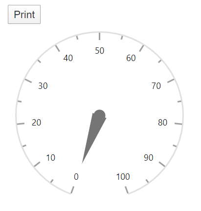

# Print and Export in Blazor Circular Gauge Component

## Print

To use the print functionality, we should set the [`AllowPrint`](https://help.syncfusion.com/cr/blazor/Syncfusion.Blazor.CircularGauge.CircularGaugeModel.html#Syncfusion_Blazor_CircularGauge_CircularGaugeModel_AllowPrint) property to **true**. The rendered circular gauge can be printed directly from the browser by calling the method [`print`](https://help.syncfusion.com/cr/blazor/Syncfusion.Blazor.CircularGauge.SfCircularGauge.html#Syncfusion_Blazor_CircularGauge_SfCircularGauge_Print_System_Object_). You can get the Circular Gauge component object using `@ref="Gauge"`

```cshtml
@using Syncfusion.Blazor.CircularGauge

<button @onclick="PrintGauge">Print</button>
<SfCircularGauge @ref="Gauge" AllowPrint="true">
</SfCircularGauge>

@code {
    SfCircularGauge Gauge;
    void PrintGauge()
    {
        this.Gauge.Print();
    }
}
```



## Export

### Image Export

To use the image export functionality, we should set the [`AllowImageExport`](https://help.syncfusion.com/cr/blazor/Syncfusion.Blazor.CircularGauge.CircularGaugeModel.html#Syncfusion_Blazor_CircularGauge_CircularGaugeModel_AllowImageExport) property to **true**. The rendered circular gauge can be exported as an image using the [`export`](https://help.syncfusion.com/cr/blazor/Syncfusion.Blazor.CircularGauge.SfCircularGauge.html#Syncfusion_Blazor_CircularGauge_SfCircularGauge_Export_Syncfusion_Blazor_CircularGauge_ExportType_System_String_System_Object_System_Nullable_System_Boolean__) method. The method requires two parameters: image type and file name. The circular gauge can be exported as an image in the following formats.

* JPEG
* PNG
* SVG

```cshtml
@using Syncfusion.Blazor.CircularGauge

<button @onclick="ExportGauge">Export</button>
<SfCircularGauge @ref="Gauge" AllowImageExport="true">
</SfCircularGauge>

@code {
    SfCircularGauge Gauge;
    void ExportGauge()
    {
        this.Gauge.Export(ExportType.PNG, "CircularGauge");
    }
}
```


### PDF Export

To use the PDF export functionality, we should set the [`AllowPdfExport`](https://help.syncfusion.com/cr/blazor/Syncfusion.Blazor.CircularGauge.CircularGaugeModel.html#Syncfusion_Blazor_CircularGauge_CircularGaugeModel_AllowPdfExport) property to **true**. The rendered circular gauge can be exported as PDF using the [`export`](https://help.syncfusion.com/cr/blazor/Syncfusion.Blazor.CircularGauge.SfCircularGauge.html#Syncfusion_Blazor_CircularGauge_SfCircularGauge_Export_Syncfusion_Blazor_CircularGauge_ExportType_System_String_System_Object_System_Nullable_System_Boolean__) method. The [`export`](https://help.syncfusion.com/cr/blazor/Syncfusion.Blazor.CircularGauge.SfCircularGauge.html#Syncfusion_Blazor_CircularGauge_SfCircularGauge_Export_Syncfusion_Blazor_CircularGauge_ExportType_System_String_System_Object_System_Nullable_System_Boolean__) method requires three parameters: file type, file name and orientation of the PDF document. The orientation setting is optional and "0" indicates portrait and "1" indicates landscape.

```cshtml
@using Syncfusion.Blazor.CircularGauge

<button @onclick="ExportGauge">Export</button>
<SfCircularGauge @ref="Gauge" AllowPdfExport="true">
</SfCircularGauge>

@code {
    SfCircularGauge Gauge;
    void ExportGauge()
    {
        this.Gauge.Export(ExportType.PDF, "CircularGauge", 0);
    }
}
```

