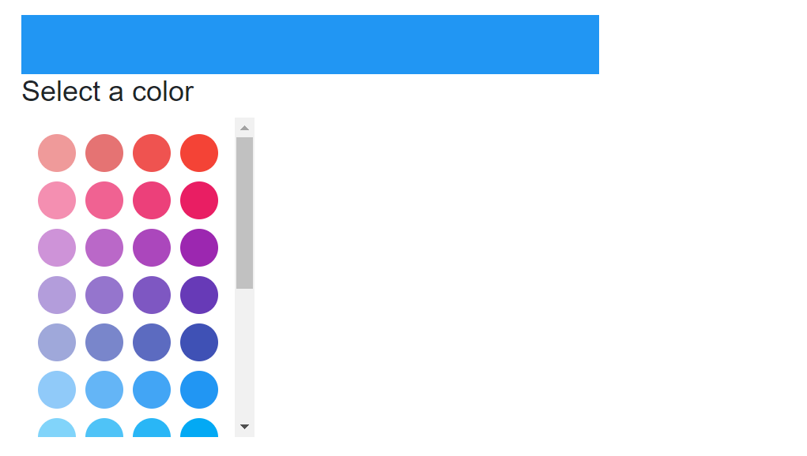

# Customize Color Picker in Blazor Color Picker Component

## Custom Palette

By default, the Palette will be rendered with default colors. To load custom colors in the palette, specify the colors in the [`PresetColors`](https://help.syncfusion.com/cr/blazor/Syncfusion.Blazor.Inputs.SfColorPicker.html#Syncfusion_Blazor_Inputs_SfColorPicker_PresetColors) property. To customize the color palette, add a custom class to palette tiles using [`OnTileRender`](https://help.syncfusion.com/cr/blazor/Syncfusion.Blazor.Inputs.SfColorPicker.html#Syncfusion_Blazor_Inputs_SfColorPicker_OnTileRender) event.

```csharp

@using Syncfusion.Blazor.Inputs

<div id="preview" style="@styleValue"></div>
<h4>Select a color</h4>
<SfColorPicker Mode="ColorPickerMode.Palette" CssClass="circle-palette" ModeSwitcher="false" Inline="true" ShowButtons="false" Columns="4" PresetColors="@customColors" ValueChange="OnChange"></SfColorPicker>

@code {
    private string styleValue = "background-color: #008000";
    private void OnChange(ColorPickerEventArgs args)
    {
        styleValue = "background-color: " + args.CurrentValue.Hex;
    }
    private Dictionary<string, string[]> customColors = new Dictionary<string, string[]> {
        { "Custom", new string[] { "#ef9a9a", "#e57373", "#ef5350", "#f44336", "#f48fb1", "#f06292",
                    "#ec407a", "#e91e63", "#ce93d8", "#ba68c8", "#ab47bc", "#9c27b0", "#b39ddb","#9575cd",
                    "#7e57c2", "#673AB7", "#9FA8DA", "#7986CB", "#5C6BC0", "#3F51B5", "#90CAF9", "#64B5F6",
                    "#42A5F5","#2196F3", "#81D4FA", "#4FC3F7", "#29B6F6", "#03A9F4", "#80DEEA", "#4DD0E1",
                    "#26C6DA", "#00BCD4", "#80CBC4", "#4DB6AC", "#26A69A", "#009688","#A5D6A7", "#81C784",
                    "#66BB6A", "#4CAF50", "#C5E1A5", "#AED581", "#9CCC65", "#8BC34A", "#E6EE9C","#DCE775",
                    "#D4E157", "#CDDC39" }
        }
   };
}

<style>
    #preview {
        height: 50px;
        width: 50%;
    }
    .circle-palette .e-container {
        background-color: transparent;
        border-color: transparent;
        box-shadow: none;
    }
    .circle-palette .e-container .e-custom-palette.e-palette-group {
        height: 182px;
    }
    .circle-palette .e-container .e-palette .e-tile {
        border: 0;
        color: #fff;
        height: 36px;
        font-size: 18px;
        width: 36px;
        line-height: 36px;
        border-radius: 50%;
        margin: 2px 5px;
        font-family: "e-icons";
        font-style: normal;
        font-variant: normal;
        font-weight: normal;
        text-transform: none;
    }
    .circle-palette .e-container .e-palette .e-tile.e-selected::before {
        content: '\e933';
    }
    .circle-palette .e-container .e-palette .e-tile.e-selected {
        outline: none;
    }
</style>

```

Output be like


## Hide input area from picker

By default, the input area will be rendered in Color Picker. To hide the input area from it, add `e-hide-value` class to Color Picker using the [`CssClass`](https://help.syncfusion.com/cr/blazor/Syncfusion.Blazor.Inputs.SfColorPicker.html#Syncfusion_Blazor_Inputs_SfColorPicker_CssClass) property.

In the following sample, the Color Picker is rendered without input area.

```cshtml
@using Syncfusion.Blazor.Inputs

<h4>Choose a color</h4>
<SfColorPicker ModeSwitcher="false" CssClass="e-hide-value"></SfColorPicker>
```

Output be like


## Custom Handle

Color Picker handle shape and UI can be customized. Here, we have customized the handle as svg icon. The same way you can customize the handle based on your requirement.

The following sample show the customized Color Picker handle.

```csharp

@using Syncfusion.Blazor.Inputs

<SfColorPicker Value="#344aae" CssClass="e-custom-picker" ModeSwitcher="false"></SfColorPicker>

<style>
    .e-color-picker-tooltip.e-popup.e-popup-open {
        display: none;
    }
    .e-custom-picker .e-container .e-handler {
        background: transparent url('');
        font-size: 16px;
        height: 16px;
        line-height: 16px;
        margin-left: -8px;
        margin-top: -8px;
        border: none;
        box-shadow: none;
        width: 16px;
    }
</style>

```

Output be like
