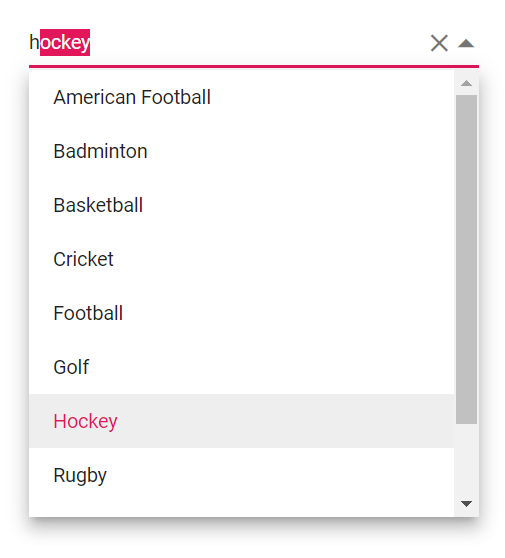

# Filtering in Blazor ComboBox Component

The ComboBox has built-in support to filter data items when [AllowFiltering](https://help.syncfusion.com/cr/blazor/Syncfusion.Blazor.DropDowns.SfComboBox-2.html) is enabled. The filter operation starts as soon as you start typing characters in the component.

```cshtml
@using Syncfusion.Blazor.Data
@using Syncfusion.Blazor.DropDowns

<SfComboBox TValue="string" TItem="EmployeeData" Placeholder="Select a customer" Query="@Query" AllowFiltering=true>
    <SfDataManager Url="https://ej2services.syncfusion.com/production/web-services/api/Employees" Adaptor="Adaptors.WebApiAdaptor" CrossDomain=true></SfDataManager>
    <ComboBoxFieldSettings Text="FirstName" Value="EmployeeID"></ComboBoxFieldSettings>
</SfComboBox>

@code {
    public Query Query = new Query();

    public class EmployeeData
    {
        public int EmployeeID { get; set; }
        public string FirstName { get; set; }
        public string Designation { get; set; }
        public string Country { get; set; }
    }
}
```


## Custom Filtering

The ComboBox component filter queries can be customized. You can also use your own filter libraries to filter data like Fuzzy search.

```cshtml
@using Syncfusion.Blazor.Data

<SfComboBox TValue="string" @ref="comboObj" TItem="Country" Placeholder="e.g. Australia" DataSource="@Countries" AllowFiltering="true">
    <ComboBoxFieldSettings Text="Name" Value="Code"></ComboBoxFieldSettings>
    <ComboBoxEvents TValue="string" TItem="Country" Filtering="OnFilter"></ComboBoxEvents>
</SfComboBox>

@code {

    SfComboBox<string, Country> comboObj { get; set; }

    public class Country
    {
        public string Name { get; set; }

        public string Code { get; set; }
    }

    List<Country> Countries = new List<Country>
    {
        new Country() { Name = "Australia", Code = "AU" },
        new Country() { Name = "Bermuda", Code = "BM" },
        new Country() { Name = "Canada", Code = "CA" },
        new Country() { Name = "Cameroon", Code = "CM" },
        new Country() { Name = "Denmark", Code = "DK" }
    };

    List<Country> CountriesFiltered = new List<Country>
    {
        new Country() { Name = "France", Code = "FR" },
        new Country() { Name = "Finland", Code = "FI" },
        new Country() { Name = "Germany", Code = "DE" },
        new Country() { Name = "Greenland", Code = "GL" }
    };

    private async Task OnFilter(FilteringEventArgs args)
    {
        args.PreventDefaultAction = true;
        var query = new Query().Where(new WhereFilter() { Field = "Name", Operator = "contains", value = args.Text, IgnoreCase = true });

        query = !string.IsNullOrEmpty(args.Text) ? query : new Query();

        await comboObj.FilterAsync(CountriesFiltered, query);
    }
}
```

## Prevent popup opening when filtering

This is achieved by using the [BeforeOpenEventArgs.Cancel](https://help.syncfusion.com/cr/blazor/Syncfusion.Blazor.DropDowns.BeforeOpenEventArgs.html#Syncfusion_Blazor_DropDowns_BeforeOpenEventArgs_Cancel) argument. The `BeforeOpenEventArgs.Cancel` argument is set as `true` when the filtering action takes place and as `false` when there is no filtering action. The Filtering Event can be used to identify when the filtering action is taking place.

In the following example, the isTyped flag is used to track whether the filtering action is taking place. The OnFiltering method sets the flag to true when the filtering action starts, and the OnBeforeOpen method cancels the dropdown opening if the flag is set to true. Finally, the OnBeforeOpen method resets the flag to false to prepare for the next filtering action.








## Properties

### AllowFiltering   

When [AllowFiltering](https://help.syncfusion.com/cr/blazor/Syncfusion.Blazor.DropDowns.SfComboBox-2.html) is set to `true`, filtering option is enabled in the component.

The filter action retrieves matched items through the `Filtering` event based on the characters typed in the TextBox.

Default value of `AllowFiltering` is `false`.

[Click to refer the code for AllowFiltering](https://blazor.syncfusion.com/documentation/combobox/filtering)

### Autofill

Specifies whether suggest a first matched item in input when searching. No action happens when no matches found.

Default value of [Autofill](https://help.syncfusion.com/cr/blazor/Syncfusion.Blazor.DropDowns.SfComboBox-2.html#Syncfusion_Blazor_DropDowns_SfComboBox_2_Autofill) is `false`.





 

