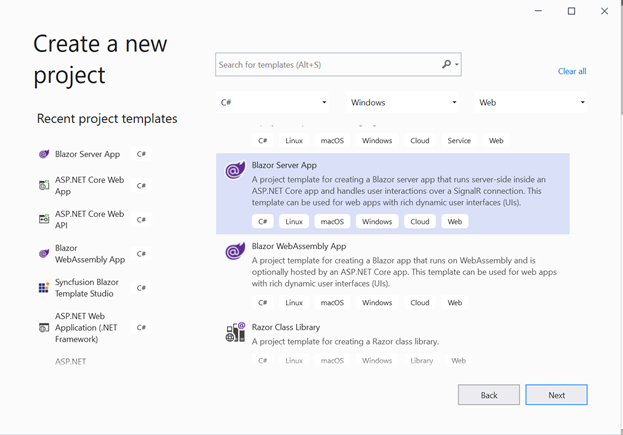
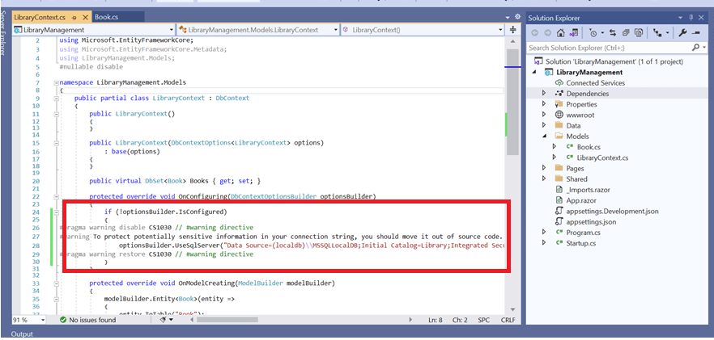
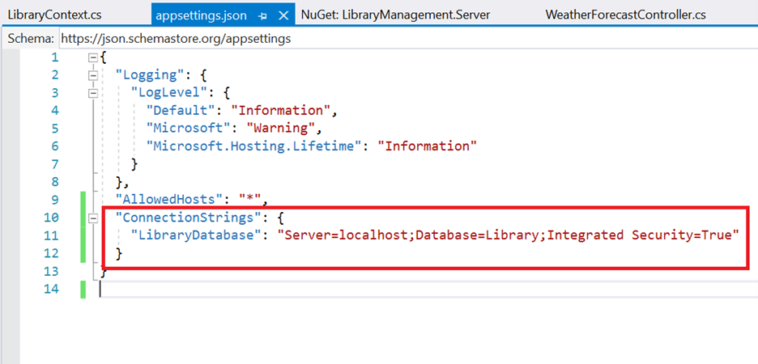
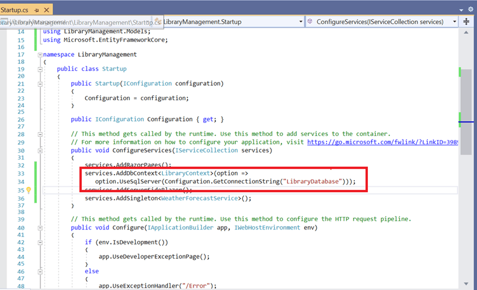
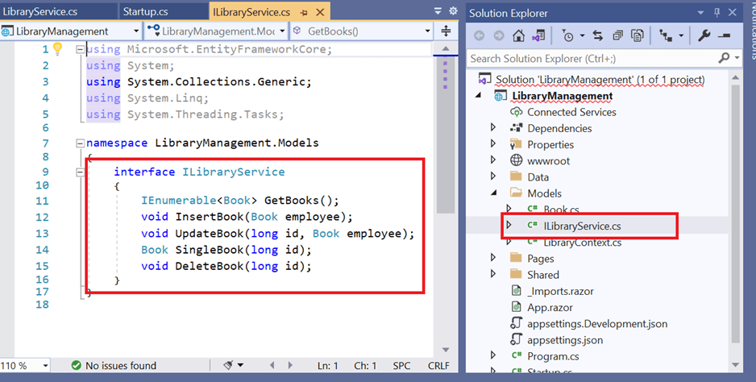
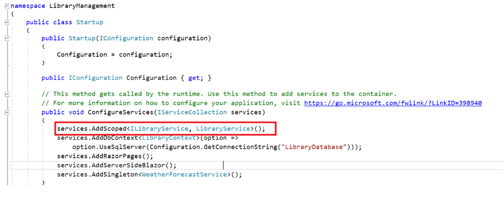
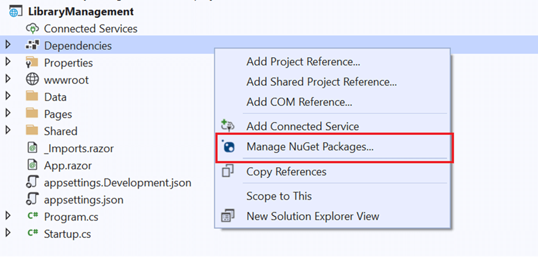

# Bind data from SQL server to Syncfusion Blazor components using Entity Framework and perform CRUD operations

In this topic, we are going to learn how to retrieve data from SQL database using [Entity Framework](https://docs.microsoft.com/en-us/ef/core/) to bind it to the Grid component and perform CRUD operations.  
Entity Framework is an open-source object-relational mapper (O/RM) from Microsoft.  Entity Framework works with many databases. But here, we are going to discuss the step-by-step procedure to create an Entity Framework using the [MS SQL Server](https://en.wikipedia.org/wiki/Microsoft_SQL_Server) database and connect it to the Syncfusion component to perform CRUD operations in a Blazor Server Application.

## Prerequisite software

The following software are needed

* Visual Studio 2019 v16.9.0 or later
* .NET SDK 5.0 or later.
* SQL Server 2019

## Create the database

The first step is to create a Library database and a table named Book to hold a list of books.

* Open SQL Server 2019.
* Now, create a new database named Library.
* Right-click on the created database and select New Query.
* Use the following SQL query to create a table named Book.

```
Create Table Book(
Id BigInt Identity(1,1) Primary Key Not Null,
Name Varchar(200) Not Null,
Author Varchar(100) Not Null,
Quantity int,
Price int Not Null,
Available bit)
```

Now, the Book table design will look like below.


## Create Blazor Server Application

Open Visual Studio 2019 Preview, select Create a New Project, select Blazor Server App, then click Next.



In the next window, provide the project name as LibraryManagement and click Next.


Now, select Target Framework as (.NET 5.0) in the project template and click Create button to create the Blazor Server application.


## Creating DbContext and model class

Now, we are going to scaffold DbContext and model classes from the existing Library database. To perform scaffolding and work with the SQL Server database in our application, we need to install the following NuGet packages.

Run the following commands in the Package Manager Console.

* **Install-Package Microsoft.EntityFrameworkCore.Tools -Version 5.0.6**: This package creates database context and model classes from the database.
* **Install-Package Microsoft.EntityFrameworkCore.SqlServer -Version 5.0.6**: The database provider that allows Entity Framework Core to work with SQL Server.

Once the above packages are installed, we can scaffold DbContext and Model classes. Run the following command in the Package Manager Console under the LibraryManagement project.

```
Scaffold-DbContext “Server=localhost;Database=Library;Integrated Security=True” Microsoft.EntityFrameworkCore.SqlServer -OutputDir Models
```

The above scaffolding command contains the following details for creating DbContext and model classes for the existing database and its tables.

* **Connection string**: Server=localhost;Database=Library;Integrated Security=True
* **Data provider**: Microsoft.EntityFrameworkCore.SqlServer
* **Output directory**: -OutputDir Models

After running the above command, **LibraryContext.cs** and **Book.cs** files will be created under the **LibraryManagement.Models** folder as follows.


We can see that **LibraryContext.cs** file contains the connection string details in the OnConfiguring method.



It is not recommended to have a connection string with sensitive information in the **LibaryContext.cs** file, so we are moving the connection string to the **appsettings.json** file.



Now, the **DbContext** must be configured using connection string and registered as scoped service using the **AddDbContext** method in **Startup.cs**.



## Creating a Data Access Layer

The application is now configured to connect with the Library database using Entity Framework. Now, it’s time to consume data from the Library database. To do so, we need an interface to fetch data from DbContext to the Blazor application.

To create an interface, right-click on the Models folder and create an interface called **ILibraryService.cs**  like below.



Create a data access layer LibraryService.cs.

```c#
using Microsoft.EntityFrameworkCore;
using System;
using System.Collections.Generic;
using System.Linq;
using System.Threading.Tasks;

namespace LibraryManagement.Models
{
    public class LibraryService : ILibraryService
    {
        private LibraryContext _context;
        public LibraryService(LibraryContext context)
        {
            _context = context;
        }

        public void DeleteBook(long id)
        {
            try
            {
                Book ord = _context.Books.Find(id);
                _context.Books.Remove(ord);
                _context.SaveChanges();
            }
            catch
            {
                throw;
            }
        }

        public IEnumerable<Book> GetBooks()
        {
            try
            {
                return _context.Books.ToList();
            }
            catch
            {
                throw;
            }
        }

        public void InsertBook(Book book)
        {
            try
            {
                _context.Books.Add(book);
                _context.SaveChanges();
            }
            catch
            {
                throw;
            }
        }

        public Book SingleBook(long id)
        {
            throw new NotImplementedException();
        }

        public void UpdateBook(long id, Book book)
        {
            try
            {
                var local = _context.Set<Book>().Local.FirstOrDefault(entry => entry.Id.Equals(book.Id));
                // check if local is not null
                if (local != null)
                {
                    // detach
                    _context.Entry(local).State = EntityState.Detached;
                }
                _context.Entry(book).State = EntityState.Modified;
                _context.SaveChanges();
            }
            catch
            {
                throw;
            }
        }
    }
}
```

## Register the Service in Startup.cs

Now, we need to register the **LibraryService** and **ILibraryService** as services in the **startup.cs** file. Kindly register the Scoped Services like below.



## Add Syncfusion Blazor DataGrid package

Before adding Syncfusion Blazor components to the application, we need to move Book.cs file to the LibraryManagement.Models project. Now, we are going to add the **Syncfusion DataGrid** component into the project. Since we are going to explain this process (Data binding and CRUD operation) with the help of the DataGrid component, Right-click on Dependencies and select Manage NuGet Packages to load the required DLLs.



Now, in the Browse tab, search and install the **Syncfusion.Blazor.Grid** NuGet package.


> For this demo, we have used **Syncfusion.Blazor.Grid(19.1.0.66)** NuGet package.  We have released a new Syncfusion.Blazor NuGet package with new enhancement in our every-week release and main release. So, you can check and update to the latest versions by using the following link.

[Grid Editing](https://www.nuget.org/packages/Syncfusion.Blazor.Grid/)

Open **_Import.razor** file and add the following namespaces which are required to use the Syncfusion Blazor components in this application.

```cshtml
@using Syncfusion.Blazor
@using Syncfusion.Blazor.Grids
```

Open **Startup.cs** file and register the Syncfusion service in the **ConfigureServices** method as follows.

```c#
using Syncfusion.Blazor;

namespace LibraryManagement
{
    public class Startup
    {
        public Startup(IConfiguration configuration)
        {
            Configuration = configuration;
        }

        public IConfiguration Configuration { get; }

        // This method gets called at the runtime. Use this method to add services to the container.
        // For more information on how to configure your application, visit https://go.microsoft.com/fwlink/?LinkID=398940
        public void ConfigureServices(IServiceCollection services)
        {
            services.AddRazorPages();
            services.AddServerSideBlazor();
            services.AddSyncfusionBlazor();
            services.AddSingleton<WeatherForecastService>();
        }

        // This method gets called at the runtime. Use this method to configure the HTTP request pipeline.
        public void Configure(IApplicationBuilder app, IWebHostEnvironment env)
        {

        }
    }
```

Themes provide life to components. Syncfusion Blazor has different themes. They are:

* Fabric
* Bootstrap4
* Material
* Bootstrap
* High Contrast

In this demo application, the Fabric theme will be used. To add the theme, open the **Pages/_Host.cshtml** file and add the following CSS reference code.

```html
<link href="_content/Syncfusion.Blazor.Themes/fabric.css" rel="stylesheet" />
```

## Add Syncfusion Blazor DataGrid component to an application

In previous steps, we have successfully configured the Syncfusion Blazor package in the application. Now, we can add the grid component to the **Index.razor** page.

```cshtml
<SfGrid TValue="Book">
</SfGrid>
```

## Bind data to Blazor DataGrid component using Entity Framework

To consume data from the database using **Entity Framework**, we need to inject the LibraryService into the razor page and assign it to the DataGrid’s datasource variable. Here, we have used the **DataSource** property of the DataGrid component to bind the SQL data using Entity Framework in the  Server-side application  

```cshtml
@using LibraryManagement.Models
@inject ILibraryService LibraryService

<SfGrid DataSource="@LibraryBooks" TValue="Book">
</SfGrid>

@code
{
    public IEnumerable<Book> LibraryBooks { get; set; }
    protected override void OnInitialized()
    {
        LibraryBooks = LibraryService.GetBooks();
    }
}
```

Grid columns can be defined using the **GridColumn** component. We are going to create columns using the following code. Let us see the properties used and their usage.

* **Field** property specifies the column name of the Book table to display in the grid column.
* **IsPrimaryKey** property specifies that the given column is a primary key column. Here, Id column is a primary key column.
* **Visible** property specifies the column visibility. Setting as false will hide the column at the user end.
* **Width** property specifies the column width.
* **Format** property helps to format number, currencies, and date in a particular culture. Here, we have formatted the Price column.
* **DisplayAsCheckBox** property renders checkbox in cells and sets check state based on the property value. Here, Available column is rendered as a checkbox column.

```cshtml
@using LibraryManagement.Models
@inject ILibraryService LibraryService
  
<SfGrid DataSource="@LibraryBooks" TValue="Book">
    <GridColumns>
        <GridColumn Field="@nameof(Book.Id)" IsPrimaryKey="true" IsIdentity="true" Visible="false"></GridColumn>
        <GridColumn Field="@nameof(Book.Name)" Width="150"></GridColumn>
        <GridColumn Field="@nameof(Book.Author)" Width="150"></GridColumn>
        <GridColumn Field="@nameof(Book.Quantity)" Width="90" TextAlign="TextAlign.Right"></GridColumn>
        <GridColumn Field="@nameof(Book.Price)" Width="90" Format="C2" TextAlign="TextAlign.Right"></GridColumn>
        <GridColumn Field="@nameof(Book.Available)" DisplayAsCheckBox="true" Width="70"></GridColumn>
    </GridColumns>
</SfGrid>

@code
{
    public IEnumerable<Book> LibraryBooks { get; set; }
    protected override void OnInitialized()
    {
        LibraryBooks = LibraryService.GetBooks();
    }
}
```

Now, the data from the SQL server is loaded into the DataGrid component. Refer to the following screenshot for the output of above.  


## Handling CRUD operations with our Syncfusion Blazor DataGrid component

We can enable editing in the grid component using the **GridEditSettings** component. Grid provides various modes of editing options such as Inline/Normal, Dialog, and Batch editing. Kindly refer to the following documentation for your reference

[Grid Editing](https://blazor.syncfusion.com/documentation/datagrid/editing/#editing)

Here, we are using inline edit mode and **Toolbar** property to show toolbar items for editing.
While using the DataSource property of Grid, changes will be reflected only in the Grid datasource. To reflect them in the database, we need to handle the CRUD operations externally using the  OnActionBegin and OnActionComplete events of Grid.

* **OnActionBegin** – This event will be triggered when the action gets initiated. So, while inserting/updating a record, RequestType Save will be sent in the event arguments to save the changes in the database. Similarly, while deleting a record, RequestType as Delete will be initiated to perform actions externally.  Since for both Update and Insert action, RequestType will be Save, we can differentiate them by using the Args.Action property, which will indicate the current action.
* **OnActionComplete** – It will be triggered when certain actions are completed. Here, we can refresh the Grid component with an updated datasource to reflect the changes.  

We have added the DataGrid editing, toolbar, and OnActionBegin and OnActionComplete event code with the previous Grid model.

```cshtml
@using LibraryManagement.Models
@inject ILibraryService LibraryService

<SfGrid DataSource="@LibraryBooks" Toolbar="@(new List<string>() { "Add", "Edit", "Delete", "Cancel", "Update" })" TValue="Book">
    <GridEditSettings AllowAdding="true" AllowDeleting="true" AllowEditing="true" Mode="EditMode.Normal"></GridEditSettings>
    <GridEvents OnActionBegin="ActionBeginHandler" OnActionComplete="ActionCompleteHandler" TValue="Book"></GridEvents>
    <GridColumns>
        <GridColumn Field="@nameof(Book.Id)" IsPrimaryKey="true" IsIdentity="true" Visible="false"></GridColumn>
        <GridColumn Field="@nameof(Book.Name)" Width="150"></GridColumn>
        <GridColumn Field="@nameof(Book.Author)" Width="150"></GridColumn>
        <GridColumn Field="@nameof(Book.Quantity)" Width="90" TextAlign="TextAlign.Right"></GridColumn>
        <GridColumn Field="@nameof(Book.Price)" Width="90" Format="C2" TextAlign="TextAlign.Right"></GridColumn>
        <GridColumn Field="@nameof(Book.Available)" DisplayAsCheckBox="true" Width="70"></GridColumn>
    </GridColumns>
</SfGrid>

@code
{
    public IEnumerable<Book> LibraryBooks { get; set; }
    protected override void OnInitialized()
    {
        LibraryBooks = LibraryService.GetBooks();
    }
    public void ActionBeginHandler(ActionEventArgs<Book> Args)
    {
        //Will be triggered when CRUD action is initiated
    }
    public void ActionCompleteHandler(ActionEventArgs<Book> Args)
    {
        //will be triggered when CRUD action is complete.
        if (Args.RequestType.Equals(Syncfusion.Blazor.Grids.Action.Save))
        {
            LibraryBooks = LibraryService.GetBooks(); //to fetch the updated data from db to Grid
        }
    }
}
```

> Normal edit mode is the default mode of editing.

### Insert a row

To insert a new row, click the **Add** toolbar button. The new record edit form will look like below.


Clicking the **Update** toolbar button will initiate the insert action in Grid. Now, the **OnActionBegin** event will be triggered with a **RequestType** as **Save**. We can insert the record into our database (Book table) by calling the **Addbook()** method of the **LibraryService**.

```c#
public void ActionBeginHandler(ActionEventArgs<Book> Args)
{
    if (Args.RequestType.Equals(Syncfusion.Blazor.Grids.Action.Save))
    {
        if (Args.Action == "Add")
        {
            // Insert the changes into your database here.
            LibraryService.InsertBook(Args.Data);
        }
    }
}
```


### Update a row

To edit a row, select any row and click the **Edit** toolbar button. The edit form will look like below.


Now, we have changed the Price column value to 125 from 250. Clicking the **Update** toolbar button will initiate the update action and trigger the OnActionBegin event with **Save RequestType**. Here, we can update the record in the Book table by calling the **UpdateBook()** method of the LibraryService when **Args.Action** is **Edit**.  Refer to the following code example.  

```c#
public void ActionBeginHandler(ActionEventArgs<Book> Args)
{
    if (Args.RequestType.Equals(Syncfusion.Blazor.Grids.Action.Save))
    {
        if (Args.Action == "Edit")
        {
            //Update the changes into your database here.
            LibraryService.UpdateBook(Args.Data.Id, Args.Data);
        }
    }
}
```

The resultant grid will look like below.


### Delete a row

To delete a row, select any row and click the **Delete** toolbar button. Deleting operation will initiate the OnActionBegin event with RequstType as Delete. Now, we can delete the record from the database by calling **DeleteBook()** method of LibraryService with the selected record`s primary key value. Refer to the following code example.

```c#
public void ActionBeginHandler(ActionEventArgs<Book> Args)
{
    if (Args.RequestType.Equals(Syncfusion.Blazor.Grids.Action.Delete))
    {
        //Remove the record from your database
        LibraryService.DeleteBook(Args.Data.Id);
    }
}
```


> Please find the sample from this [Github](https://github.com/SyncfusionExamples/blazor-server-datagrid-efcore-crud/) location.
