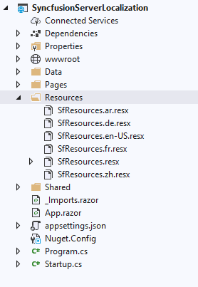
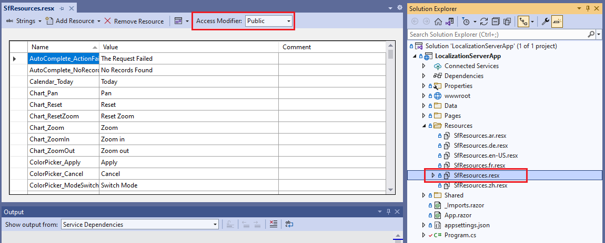
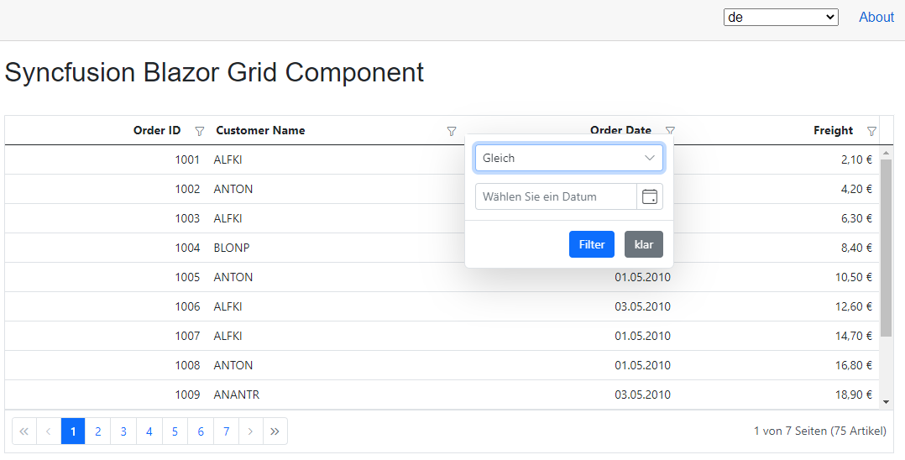

# Localization of Syncfusion Blazor Components

Localization is the process of translating the application resources into differenct language for the specific cultures. You can localize the Syncfusion Blazor components by adding a resource file for each language.

## Adding culture based resx files

Syncfusion components can be localizaed using the Resource `.resx` files. You can find the default and culture based localization files in the below GitHub repo.

> You can get default and culture based resource files from [GitHub](https://github.com/syncfusion/blazor-locale).

Copy default resx file (`SfResources.resx`) and the other needed resx files based on the culture need to be localized and add it into **Resources** folder. 



After adding the resource file in the application, double click default resx (`SfResources.resx`) file and open **Resource Editor**. In the Resource Editor, change **Access Modifier** option as **Public** to generate `designer.cs` file.



## Create and register localization service

[ISyncfusionStringLocalizer](https://help.syncfusion.com/cr/blazor/Syncfusion.Blazor.ISyncfusionStringLocalizer.html) which acts as a middleware to connect the Syncfusion Blazor UI components and resource files, uses [ResourceManager](https://help.syncfusion.com/cr/blazor/Syncfusion.Blazor.ISyncfusionStringLocalizer.html#Syncfusion_Blazor_ISyncfusionStringLocalizer_ResourceManager) to provide culture specfic resources at runtime. Create a class implementing `ISyncfusionStringLocalizer`. In the newly created class, return the `ResourceManager` created in the above step for [ResourceManager](https://help.syncfusion.com/cr/blazor/Syncfusion.Blazor.ISyncfusionStringLocalizer.html#Syncfusion_Blazor_ISyncfusionStringLocalizer_ResourceManager) property and change [GetText](https://help.syncfusion.com/cr/blazor/Syncfusion.Blazor.ISyncfusionStringLocalizer.html#Syncfusion_Blazor_ISyncfusionStringLocalizer_GetText_System_String_) method to return localized string using resource manager.

In the below code, `SyncfusionLocalizer` class implements `ISyncfusionStringLocalizer` interface and `ResourceManager` configured to return the cached ResourceManager instance of default resource file create in **Adding culture based resx files** step above. 





using Syncfusion.Blazor;

public class SyncfusionLocalizer : ISyncfusionStringLocalizer
{
    public string GetText(string key)
    {
        return this.ResourceManager.GetString(key);
    }

    public System.Resources.ResourceManager ResourceManager
    {
        get
        {
            // Replace the ApplicationNamespace with your application name.
            return ApplicationNamespace.Resources.SfResources.ResourceManager;
        }
    }
}





Register the `ISyncfusionStringLocalizer` implementation to localize the Syncfusion Blazor components based on resources files added in application.

**Blazor Server App**

* For **.NET 6** app, open the **~/Program.cs** file and register the Syncfusion Blazor Service.
* For **.NET 5 and .NET 3.X** app, open the **~/Startup.cs** file and register the Syncfusion Blazor Service.

**Blazor WebAssembly App**
* Open **~/Program.cs** file and register the Syncfusion Blazor Service in the client web app.





...
builder.Services.AddSyncfusionBlazor(options => { options.IgnoreScriptIsolation = true; });
// Register the locale service to localize the  SyncfusionBlazor components.
builder.Services.AddSingleton(typeof(ISyncfusionStringLocalizer), typeof(SyncfusionLocalizer));
...





## Statically set the culture

### Blazor Server App

* For **.NET 6** app, specify the static culture in **~/Program.cs** file.
* For **.NET 5 and .NET 3.X** app, specify the static culture in **~/Startup.cs** file.





...
var app = builder.Build();
app.UseRequestLocalization("de");
...





public void Configure(IApplicationBuilder app, IWebHostEnvironment env)
{
    ...
    app.UseRequestLocalization("de");
    ...
}





### Blazor WASM App

#### Setting the culture Blazor's start option

The app's culture can be set Javascript by setting `applicationCulture` in Blazor's start option by following below steps,

* In `wwwroot/index.html`, prevent Blazor autostart by adding `autostart="false"` attribute to Blazor's `<script>` tag.




<body>
    ...
    <script src="_framework/blazor.webassembly.js" autostart="false"></script>
    ...
</body>







* Add the script block below Blazor's `<script>` tag and before the closing </body> tag to start blazor with specific culture. 


<body>
    ...
    <script src="_framework/blazor.webassembly.js" autostart="false"></script>
    <script>
        Blazor.start({
            applicationCulture: 'de'
        });
    </script>
    ...
</body>





#### Setting the culture in C# code

You can set culture in C# code alternative to setting the culture Blazor's start option. Set the `CultureInfo.DefaultThreadCurrentCulture` and `CultureInfo.DefaultThreadCurrentUICulture` in `Program.cs` to the same culture before ine that builds and runs the `WebAssemblyHostBuilder` (`await builder.Build().RunAsync();`).




using System.Globalization;

CultureInfo.DefaultThreadCurrentCulture = new CultureInfo("de");
CultureInfo.DefaultThreadCurrentUICulture = new CultureInfo("de");






Learn more about in [Statically set the culture](https://docs.microsoft.com/en-us/aspnet/core/blazor/globalization-localization?pivots=webassembly#statically-set-the-culture) topic in Microsoft docs. 

## Dynamically set the culture

The culture can be set dynamically based on user's preference.

### Blazor Server App

* To allow a user to select a culture via UI, a redirect-based approach with a localization cookie using controller. The app persists the user's selected culture via a redirect to a controller. The controller sets the user's selected culture into a cookie and redirects the user back to the original URI. 





using Microsoft.AspNetCore.Localization;
using Microsoft.AspNetCore.Mvc;

CHECK:[Route("[controller]/[action]")]
namespace ScheduleSample.Controllers
{
    public class CultureController : Controller
    {
        public IActionResult SetCulture(string culture, string redirectUri)
        {
            if (culture != null)
            {
                HttpContext.Response.Cookies.Append(
                    CookieRequestCultureProvider.DefaultCookieName,
                    CookieRequestCultureProvider.MakeCookieValue(
                        new RequestCulture(culture)));
            }
            return LocalRedirect(redirectUri);
        }
    }
}





* Create a new razor component (`CultureSwitcher.razor`) inside the `~/Shared` folder which used call the `Set` method of the `CultureController` with the new culture. 





@inject NavigationManager NavigationManager
@inject HttpClient Http

<select @onchange="OnSelected">
    <option hidden>@culture</option>
    <option value="en-US">English (en-US)</option>
    <option value="de">German (de)</option>
    <option value="fr">French (fr)</option>
    <option value="ar">Arabic (ar)</option>
    <option value="zh">Chinese (zh)</option>
</select>

@code {

    private string culture { get; set; }

    protected override async Task OnInitializedAsync()
    {
        await base.OnInitializedAsync();
        this.culture = System.Globalization.CultureInfo.CurrentCulture.Name;
    }

    private void OnSelected(ChangeEventArgs e)
    {
        var culture = (string)e.Value;
        var uri = new Uri(NavigationManager.Uri)
            .GetComponents(UriComponents.PathAndQuery, UriFormat.Unescaped);
        var cultureEscaped = Uri.EscapeDataString(culture);
        var uriEscaped = Uri.EscapeDataString(uri);

        var query = $"?culture={cultureEscaped}&redirectUri={uriEscaped}";
        CHECK:NavigationManager.NavigateTo("/" + query, forceLoad:  true);
    }
}





* Add the `CultureSwitcher` component to `~/Shared/MainLayout.razor` to enable the culture switcher in all pages.





<div class="page">
    <div class="sidebar">
        <NavMenu />
    </div>

    <main>
        <div class="top-row px-4">
            <CultureSwitcher />
            <a href="https://docs.microsoft.com/aspnet/" target="_blank">About</a>
        </div>

        <article class="content px-4">
            @Body
        </article>
    </main>
</div>





4.Create a new file inside the `~/Pages` folder and use cookies to store the user-selected culture.

* For .NET 6 app, store the culture in **~Pages/_Host.cshtml** file.

* For .NET 5 and .NET 3.X app, create the **~Pages/_Host.cshtml.cs** and store the culture in that file.





@{
    Layout = "_Layout";
    this.HttpContext.Response.Cookies.Append(
        CookieRequestCultureProvider.DefaultCookieName,
        CookieRequestCultureProvider.MakeCookieValue(
            new RequestCulture(
                CultureInfo.CurrentCulture,
                CultureInfo.CurrentUICulture)));
}





using Microsoft.AspNetCore.Http;
using Microsoft.AspNetCore.Localization;
using Microsoft.AspNetCore.Mvc.RazorPages;
using System.Globalization;

namespace SyncfusionServerLocalization.Pages
{
    public class HostModel : PageModel
    {
        public void OnGet()
        {
            HttpContext.Response.Cookies.Append(
                CookieRequestCultureProvider.DefaultCookieName,
                CookieRequestCultureProvider.MakeCookieValue(
                    new RequestCulture(
                        CultureInfo.CurrentCulture,
                        CultureInfo.CurrentUICulture)));
        }
    }
}





5.You can select the culture dynamically from culture switcher at run time by setting the following ways,





builder.Services.AddSingleton(typeof(ISyncfusionStringLocalizer), typeof(SyncfusionLocalizer));
var supportedCultures = new[] { "en-US", "de", "fr", "ar", "zh" };
var localizationOptions = new RequestLocalizationOptions()
    .SetDefaultCulture(supportedCultures[0])
    .AddSupportedCultures(supportedCultures)
    .AddSupportedUICultures(supportedCultures);
var app = builder.Build();
app.UseRequestLocalization(localizationOptions);





public void ConfigureServices(IServiceCollection services)
{
    // Register the Syncfusion locale service to customize the SyncfusionBlazor component locale culture
    services.AddSingleton(typeof(ISyncfusionStringLocalizer), typeof(SyncfusionLocalizer));
    services.Configure<RequestLocalizationOptions>(options =>
    {
        // Define the list of cultures your app will support
        var supportedCultures = new List<CultureInfo>()
        {
            new CultureInfo("en-US"),
            new CultureInfo("de"),
            new CultureInfo("fr"),
            new CultureInfo("ar"),
            new CultureInfo("zh"),
        };
        // Set the default culture
        options.DefaultRequestCulture = new RequestCulture("en-US");
        options.SupportedCultures = supportedCultures;
        options.SupportedUICultures = supportedCultures;
    });
}





### Blazor WASM App

> For .NET 5 or .NET 6 Blazor Webassembly globalization, we should configure the `BlazorWebAssemblyLoadAllGlobalizationData` in the project file when the application uses large resources and dynamic culture changes.

```xml
<PropertyGroup>
    <BlazorWebAssemblyLoadAllGlobalizationData>true</BlazorWebAssemblyLoadAllGlobalizationData>
</PropertyGroup>
```

1.Add the custom javascript interop function to get or set the culture in `~wwwroot/index.html` file.





<script src="_framework/blazor.webassembly.js"></script>

<script>
    window.cultureInfo = {
        get: () => window.localStorage['BlazorCulture'],
        set: (value) => window.localStorage['BlazorCulture'] = value
    };
</script>





2.Create a new razor file (`CultureSwitcher.razor`) inside the `~/Shared/` folder.





@using  System.Globalization
@inject IJSRuntime JSRuntime
@inject NavigationManager NavigationManager

<select @bind="Culture">
    @foreach (var culture in supportedCultures)
    {
        <option value="@culture">@culture.DisplayName</option>
    }
</select>

@code {
    private CultureInfo[] supportedCultures = new[]
    {
        new CultureInfo("en-US"),
        new CultureInfo("de"),
        new CultureInfo("ar"),
        new CultureInfo("fr"),
        new CultureInfo("zh")
    };

    private CultureInfo Culture
    {
        get => CultureInfo.CurrentCulture;
        set
        {
            if (CultureInfo.CurrentCulture != value)
            {
                var js = (IJSInProcessRuntime)JSRuntime;
                js.InvokeVoid("cultureInfo.set", value.Name);

                NavigationManager.NavigateTo(NavigationManager.Uri, forceLoad:  true);
            }
        }
    }
}





3.Add a `CultureSwitcher` component to `~/Shared/MainLayout.razor` file to enable the culture switcher in all pages.





<div class="page">
    ....
    <main>
        <div class="top-row px-4">
            <CultureSwitcher />
            <a href="https://docs.microsoft.com/aspnet/" target="_blank">About</a>
        </div>
    </main>
</div>





4.You can select the culture dynamically from culture switcher at run time by setting the following ways,





CultureInfo.DefaultThreadCurrentCulture = new CultureInfo("en-US");
CultureInfo.DefaultThreadCurrentUICulture = new CultureInfo("en-US");

// Get the modified culture from culture switcher
var host = builder.Build();
var jsInterop = host.Services.GetRequiredService<IJSRuntime>();
var result = await jsInterop.InvokeAsync<string>("cultureInfo.get");
if (result != null)
{
    // Set the culture from culture switcher
    var culture = new CultureInfo(result);
    CultureInfo.DefaultThreadCurrentCulture = culture;
    CultureInfo.DefaultThreadCurrentUICulture = culture;
}







