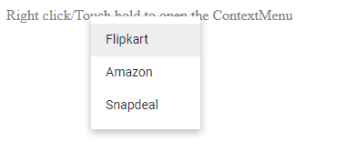

# Icons and Navigation in Blazor ContextMenu Component

## Icons

The Context Menu item have an icon/image in it to provide visual representation of the action. To place the icon on a menu item, set the [`IconCss`](https://help.syncfusion.com/cr/blazor/Syncfusion.Blazor.Navigations.MenuItem.html#Syncfusion_Blazor_Navigations_MenuItem_IconCss) property to e-icons with the required icon CSS. By default, the icon is positioned to the left side of the menu item. In the following sample, the icons for Cut, Copy and Paste menu items are added using the `IconCss` property.

```cshtml
@using Syncfusion.Blazor.Navigations

<div id="target">Right click/Touch hold to open the Context Menu </div>
<SfContextMenu Target="#target" TValue="MenuItem">
    <MenuItems>
        <MenuItem Text="Cut" IconCss="e-icons e-cut"></MenuItem>
        <MenuItem Text="Copy" IconCss="e-icons e-copy"></MenuItem>
        <MenuItem Text="Paste" IconCss="e-icons e-paste"></MenuItem>
    </MenuItems>
</SfContextMenu>

<style>
    #target {
        border: 1px dashed;
        height: 150px;
        padding: 10px;
        position: relative;
        text-align: justify;
        color: gray;
        user-select: none;
    }
    .e-cut::before {
        content: '\e279';
    }
    .e-copy::before {
        content: '\e280';
    }
    .e-paste::before {
        content: '\e601';
    }
</style>

```

Output be like


> The Context Menu provides a set of [icons](https://blazor.syncfusion.com/documentation/appearance/icons/) that can be loaded by applying `e-icons` class name to the element.
You can also use third party icons on the Context Menu using the `IconCss`property.

## Navigation

Navigation in Context Menu is usage to navigate to the other web page when menu item is clicked. This can be achieved by providing link to the menu item using the [`Url`](https://help.syncfusion.com/cr/blazor/Syncfusion.Blazor.Navigations.MenuItem.html#Syncfusion_Blazor_Navigations_MenuItem_Url) property. In the following sample, Navigation URL for Flipkart, Amazon, and Snapdeal menu items are added using the `Url` property.

```cshtml
@using Syncfusion.Blazor.Navigations

<div id="target">Right click/Touch hold to open the ContextMenu </div>
<SfContextMenu Target="#target" TValue="MenuItem">
    <MenuItems>
        <MenuItem Text="Flipkart" Url="https://www.google.co.in/search?q=flipkart"></MenuItem>
        <MenuItem Text="Amazon" Url="https://www.google.co.in/search?q=amazon"></MenuItem>
        <MenuItem Text="Snapdeal" Url="https://www.google.co.in/search?q=snapdeal"></MenuItem>
    </MenuItems>
</SfContextMenu>

<style>
    #target {
        border: 1px dashed;
        height: 150px;
        padding: 10px;
        position: relative;
        text-align: justify;
        color: gray;
        user-select: none;
    }
</style>

```

Output be like

