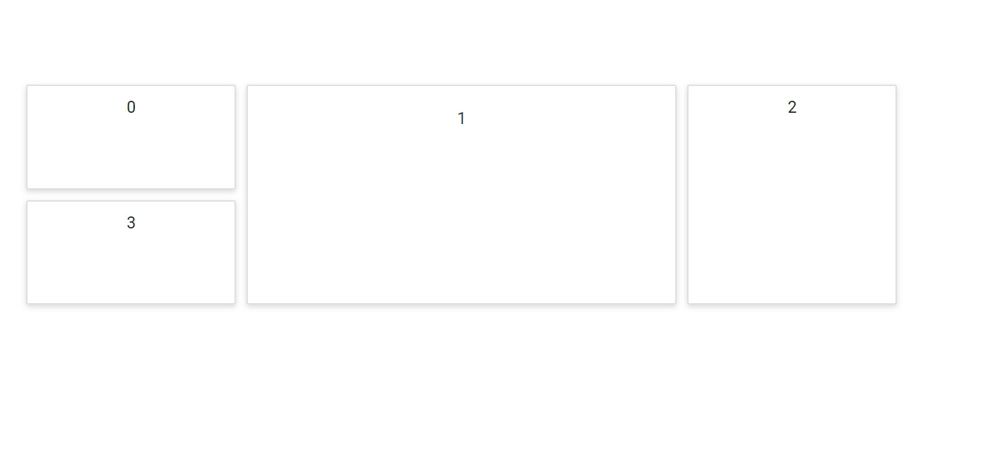

# Floating Panels in Blazor Dashboard Layout Component

The DashboardLayout component is also provided with the panel floating functionality that can be enabled or disabled using the `AllowFloating` property. The floating functionality of the component allows to effectively use the entire layout for the panel’s placement. If the floating functionality is enabled, the panels within the layout will float upwards automatically to occupy the empty cells available in previous rows.

```csharp

@using Syncfusion.Blazor.Layouts

<SfDashboardLayout CellSpacing="@(new double[]{10 ,10 })" Columns="5" CellAspectRatio="2"  AllowFloating="true">
    <DashboardLayoutPanels>
        <DashboardLayoutPanel>
            <ContentTemplate><div>0</div></ContentTemplate>
        </DashboardLayoutPanel>
        <DashboardLayoutPanel SizeX=2 SizeY=2 Column=1>
            <ContentTemplate><div>1</div></ContentTemplate>
        </DashboardLayoutPanel>
        <DashboardLayoutPanel SizeY=2 Column=3>
            <ContentTemplate><div>2</div></ContentTemplate>
        </DashboardLayoutPanel>
        <DashboardLayoutPanel Row=1>
            <ContentTemplate><div>3</div></ContentTemplate>
        </DashboardLayoutPanel>
    </DashboardLayoutPanels>
</SfDashboardLayout>

<style>
    .e-panel-content {
        text-align: center;
        margin-top: 10px;
    }
</style>

```

The following output demonstrates the floating behavior of Dashboard layout component.

