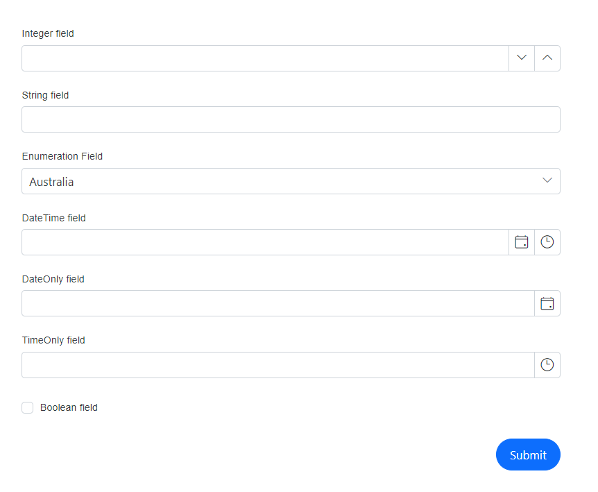

# Auto generation 

Blazor DataForm component generates the editors automatically based on the primitive property types if we use [FormAutoGenerateItems](https://help.syncfusion.com/cr/blazor/Syncfusion.Blazor.DataForm.FormAutoGenerateItems.html) inside it.The types with its corresponding default editor components listed below for reference.

| Type | Component |
| ------------ | ----------------------- |
| `int` , `float`, `decimal`,`double`,`long` | [SfNumericTextBox](https://help.syncfusion.com/cr/blazor/Syncfusion.Blazor.Inputs.SfNumericTextBox-1.html#properties) |
| `string` | [SfTextBox](https://help.syncfusion.com/cr/blazor/Syncfusion.Blazor.Inputs.SfTextBox.html) |
| `DateTime` | [SfDateTimePicker](https://help.syncfusion.com/cr/blazor/Syncfusion.Blazor.Calendars.SfDateTimePicker-1.html) |
| `DateOnly` | [SfDatePicker](https://help.syncfusion.com/cr/blazor/Syncfusion.Blazor.Calendars.SfDatePicker-1.html) |
| `TimeOnly` | [SfTimePicker](https://help.syncfusion.com/cr/blazor/Syncfusion.Blazor.Calendars.SfTimePicker-1.html) |
| `bool` | [SfCheckBox](https://help.syncfusion.com/cr/blazor/Syncfusion.Blazor.Buttons.SfCheckBox-1.html) |
| `enum` | [SfDropDownList](https://help.syncfusion.com/cr/blazor/Syncfusion.Blazor.DropDowns.SfDropDownList-2.html) |

The below example demonstrates the auto generated items with possible types 









## See also

[Explicitly define editors](https://blazor.syncfusion.com/documentation/data-form/form-items)

## Combined auto generated and custom fields

The `FormAutoGenerateItems` can be utilized independently, as demonstrated in the previous example, or it can be placed in-between, above, or below multiple `FormItem` tags. This will create editors for all types except those explicitly defined using `FormItem`.









In the given example, apart from `StringField`, `DateTimeField`, and `BoolField`, the remaining elements will be generated and placed automatically within the specified `FormItem` along with their corresponding editor types.

## Cancel the auto generate fields 

We can prevent the auto generation of fields by explicitly defining the `FormItem` for required fields in model , which will render the editors based on the specified editors.








