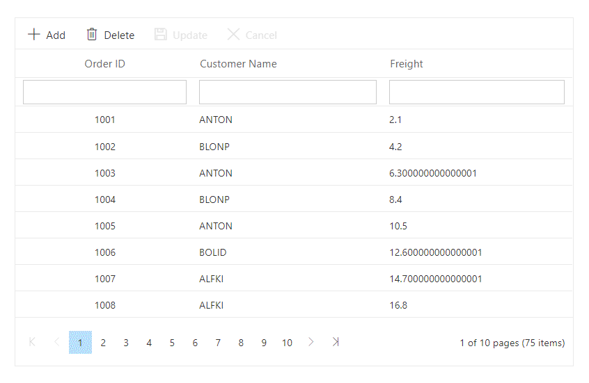

<!-- markdownlint-disable MD024 -->

# Custom Binding in Blazor DataManager Component

The [`SfDataManager`](https://help.syncfusion.com/cr/aspnetcore-blazor/Syncfusion.Blazor.Data.SfDataManager.html) has custom adaptor support which allows you to perform manual operations on the data. This is demonstrated below by implementing custom data binding and editing operations in the DataGrid component.

For implementing custom data binding in DataGrid, the **DataAdaptor** class is used. This abstract class acts as a base class for the custom adaptor.

The **DataAdaptor** abstract class has both synchronous and asynchronous method signatures which can be overridden in the custom adaptor. Following are the method signatures present in this class,

```csharp
public abstract class DataAdaptor
{
    /// <summary>
    /// Performs data Read operation synchronously.
    /// </summary>
    public virtual object Read(DataManagerRequest dataManagerRequest, string key = null)

    /// <summary>
    /// Performs data Read operation asynchronously.
    /// </summary>
    public virtual Task<object> ReadAsync(DataManagerRequest dataManagerRequest, string key = null)

    /// <summary>
    /// Performs Insert operation synchronously.
    /// </summary>
    public virtual object Insert(DataManager dataManager, object data, string key)
    /// <summary>
    /// Performs Insert operation asynchronously.
    /// </summary>
    public virtual Task<object> InsertAsync(DataManager dataManager, object data, string key)

    /// <summary>
    /// Performs Remove operation synchronously.
    /// </summary>
    public virtual object Remove(DataManager dataManager, object data, string keyField, string key)

    /// <summary>
    /// Performs Remove operation asynchronously..
    /// </summary>
    public virtual Task<object> RemoveAsync(DataManager dataManager, object data, string keyField, string key)

    /// <summary>
    /// Performs Update operation synchronously.
    /// </summary>
    public virtual object Update (DataManager dataManager, object data, string keyField, string key)

    /// <summary>
    /// Performs Update operation asynchronously.
    /// </summary>
    public virtual Task<object> UpdateAsync(DataManager dataManager, object data, string keyField, string key)

    /// <summary>
    /// Performs Batch CRUD operations synchronously.
    /// </summary>
    public virtual object BatchUpdate(DataManager dataManager, object changedRecords, object addedRecords, object deletedRecords, string keyField, string key)

    /// <summary>
    /// Performs Batch CRUD operations asynchronously.
    /// </summary>
    public virtual Task<object> BatchUpdateAsync(DataManager dataManager, object changedRecords, object addedRecords, object deletedRecords, string keyField, string key)
}
```

For implementing the custom data binding alone in the DataGrid component provide the custom adaptor class and override the **Read** or **ReadAsync** method of the **DataAdaptor** abstract class.

> If the Read/ReadAsync method is not overridden in the custom adaptor then it will be handled by the default read handler.

For implementing the CRUD operations for the custom bounded data override the following CRUD methods of the **DataAdaptor** abstract class,

* Insert/InsertAsync
* Remove/RemoveAsync
* Update/UpdateAsync
* BatchUpdate/BatchUpdateAsync

> While using batch editing in datagrid, use BatchUpdate/BatchUpdateAsync method to handle the corresponding CRUD operation

The following sample code demonstrates implementing custom adaptor of the [`SfDataManager`](https://help.syncfusion.com/cr/aspnetcore-blazor/Syncfusion.Blazor.Data.SfDataManager.html) for data binding and editing operations in the DataGrid component,

```cshtml
@using Syncfusion.Blazor
@using Syncfusion.Blazor.Data
@using Syncfusion.Blazor.Grids

<SfGrid TValue="Order" ID="Grid" AllowSorting="true" AllowFiltering="true" AllowPaging="true" Toolbar="@(new List<string>() { "Add", "Delete", "Update", "Cancel" })">
    <SfDataManager AdaptorInstance="@typeof(CustomAdaptor)" Adaptor="Adaptors.CustomAdaptor"></SfDataManager>
    <GridPageSettings PageSize="8"></GridPageSettings>
    <GridEditSettings AllowEditing="true" AllowDeleting="true" AllowAdding="true" Mode="@EditMode.Normal"></GridEditSettings>
    <GridColumns>
        <GridColumn Field=@nameof(Order.OrderID) HeaderText="Order ID" IsPrimaryKey="true" TextAlign="@TextAlign.Center" Width="140"></GridColumn>
        <GridColumn Field=@nameof(Order.CustomerID) HeaderText="Customer Name" Width="150"></GridColumn>
        <GridColumn Field=@nameof(Order.Freight) HeaderText="Freight" Width="150"></GridColumn>
    </GridColumns>
</SfGrid>

@code{
    public static List<Order> Orders { get; set; }

    protected override void OnInitialized()
    {
        Orders = Enumerable.Range(1, 75).Select(x => new Order()
        {
            OrderID = 1000 + x,
            CustomerID = (new string[] { "ALFKI", "ANANTR", "ANTON", "BLONP", "BOLID" })[new Random().Next(5)],
            Freight = 2.1 * x,
        }).ToList();
    }

    public class Order
    {
        public int OrderID { get; set; }
        public string CustomerID { get; set; }
        public double Freight { get; set; }
    }

    // Implementing custom adaptor by extending the DataAdaptor class
    public class CustomAdaptor : DataAdaptor
    {
        // Performs data Read operation
        public override object Read(DataManagerRequest dm, string key = null)
        {
            IEnumerable<Order> DataSource = Orders;
            if (dm.Search != null && dm.Search.Count > 0)
            {
                // Searching
                DataSource = DataOperations.PerformSearching(DataSource, dm.Search);
            }
            if (dm.Sorted != null && dm.Sorted.Count > 0)
            {
                // Sorting
                DataSource = DataOperations.PerformSorting(DataSource, dm.Sorted);
            }
            if (dm.Where != null && dm.Where.Count > 0)
            {
                // Filtering
                DataSource = DataOperations.PerformFiltering(DataSource, dm.Where, dm.Where[0].Operator);
            }
            int count = DataSource.Cast<Order>().Count();
            if (dm.Skip != 0)
            {
                //Paging
                DataSource = DataOperations.PerformSkip(DataSource, dm.Skip);
            }
            if (dm.Take != 0)
            {
                DataSource = DataOperations.PerformTake(DataSource, dm.Take);
            }
            return dm.RequiresCounts ? new DataResult() { Result = DataSource, Count = count } : (object)DataSource;
        }

        // Performs Insert operation
        public override object Insert(DataManager dm, object value, string key)
        {
            Orders.Insert(0, value as Order);
            return value;
        }

        // Performs Remove operation
        public override object Remove(DataManager dm, object value, string keyField, string key)
        {
            Orders.Remove(Orders.Where(or => or.OrderID == int.Parse(value.ToString())).FirstOrDefault());
            return value;
        }

        // Performs Update operation
        public override object Update(DataManager dm, object value, string keyField, string key)
        {
            var data = Orders.Where(or => or.OrderID == (value as Order).OrderID).FirstOrDefault();
            if (data != null)
            {
                data.OrderID = (value as Order).OrderID;
                data.CustomerID = (value as Order).CustomerID;
                data.Freight = (value as Order).Freight;
            }
            return value;
        }

        // Performs BatchUpdate operation
        public override object BatchUpdate(DataManager dm, object Changed, object Added, object Deleted, string KeyField, string Key)
        {
            if (Changed != null)
            {
                foreach (var rec in (IEnumerable<Order>)Changed)
                {
                    Orders[0].CustomerID = rec.CustomerID;
                }

            }
            if (Added != null)
            {
                foreach (var rec in (IEnumerable<Order>)Added)
                {
                    Orders.Add(rec);
                }

            }
            if (Deleted != null)
            {
                foreach (var rec in (IEnumerable<Order>)Deleted)
                {
                    Orders.RemoveAt(0);
                }

            }
            return Orders;
        }
    }
}
```

> If the **DataManagerRequest.RequiresCounts** value is **true**, then the Read/ReadAsync return value must be of **DataResult** with properties **Result** whose value is a collection of records and **Count** whose value is the total number of records. If the **DataManagerRequest.RequiresCounts** is **false**, then simply send the collection of records.

The following GIF demonstrates Grid component with data bound using custom adaptor and the CRUD operations being performed on it,
