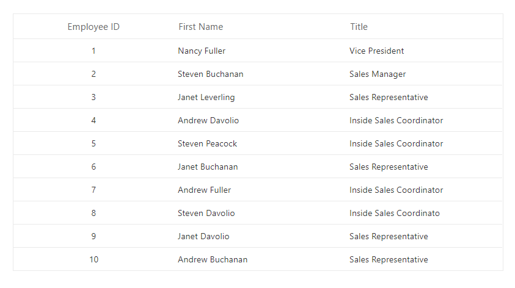
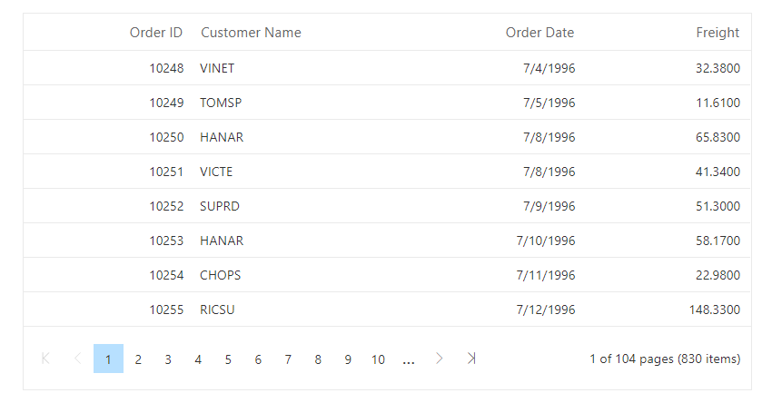

<!-- markdownlint-disable MD024 -->

# Data Binding

The [`SfDataManager`](https://help.syncfusion.com/cr/aspnetcore-blazor/Syncfusion.Blazor.Data.SfDataManager.html) acts as a gateway for both local and remote data source which uses the query to interact with the data source. It supports both local object binding and RESTful JSON data services binding.

## Local data binding

Local data can be bound to the DataGrid component by assigning the array of objects to the [`Json`](https://help.syncfusion.com/cr/blazor/Syncfusion.Blazor.DataManager.html#Syncfusion_Blazor_DataManager_Json) property of [`SfDataManager`](https://help.syncfusion.com/cr/aspnetcore-blazor/Syncfusion.Blazor.Data.SfDataManager.html).

The following sample code demonstrates binding local data through the [`SfDataManager`](https://help.syncfusion.com/cr/aspnetcore-blazor/Syncfusion.Blazor.Data.SfDataManager.html) to the DataGrid component,





@using Syncfusion.Blazor.Data
@using Syncfusion.Blazor.Grids

<SfGrid TValue="EmployeeData" ID="Grid">
    <SfDataManager Json=@Employees></SfDataManager>
    <GridColumns>
        <GridColumn Field=@nameof(EmployeeData.EmployeeID) TextAlign="TextAlign.Center" HeaderText="Employee ID" Width="120"></GridColumn>
        <GridColumn Field=@nameof(EmployeeData.Name) HeaderText="First Name" Width="130"></GridColumn>
        <GridColumn Field=@nameof(EmployeeData.Title) HeaderText="Title" Width="120"></GridColumn>
    </GridColumns>
</SfGrid>

@code{
    public class EmployeeData
    {
        public int EmployeeID { get; set; }
        public string Name { get; set; }
        public string Title { get; set; }
    }

    public EmployeeData[] Employees = new EmployeeData[]
    {
        new EmployeeData { EmployeeID = 1, Name = "Nancy Fuller", Title = "Vice President" },
        new EmployeeData { EmployeeID = 2, Name = "Steven Buchanan", Title = "Sales Manager" },
        new EmployeeData { EmployeeID = 3, Name = "Janet Leverling", Title = "Sales Representative" },
        new EmployeeData { EmployeeID = 4, Name = "Andrew Davolio", Title = "Inside Sales Coordinator" },
        new EmployeeData { EmployeeID = 5, Name = "Steven Peacock", Title = "Inside Sales Coordinator" },
        new EmployeeData { EmployeeID = 6, Name = "Janet Buchanan", Title = "Sales Representative" },
        new EmployeeData { EmployeeID = 7, Name = "Andrew Fuller", Title = "Inside Sales Coordinator" },
        new EmployeeData { EmployeeID = 8, Name = "Steven Davolio", Title = "Inside Sales Coordinato" },
        new EmployeeData { EmployeeID = 9, Name = "Janet Davolio", Title = "Sales Representative" },
        new EmployeeData { EmployeeID = 10, Name = "Andrew Buchanan", Title = "Sales Representative" }
    };
}





The following image represents DataGrid bound with local data through the `SfDataManager` component,

## Remote data binding

Remote data can be bound to the Grid component by binding the [`SfDataManager`](https://help.syncfusion.com/cr/aspnetcore-blazor/Syncfusion.Blazor.Data.SfDataManager.html) component to it and then assigning the service end point URL to the [`Url`](https://help.syncfusion.com/cr/blazor/Syncfusion.Blazor.DataManager.html#Syncfusion_Blazor_DataManager_Url) property of the [`SfDataManager`](https://help.syncfusion.com/cr/aspnetcore-blazor/Syncfusion.Blazor.Data.SfDataManager.html).

The following sample code demonstrates binding remote data through the [`SfDataManager`](https://help.syncfusion.com/cr/aspnetcore-blazor/Syncfusion.Blazor.Data.SfDataManager.html) to the DataGrid component,





@using Syncfusion.Blazor
@using Syncfusion.Blazor.Data
@using Syncfusion.Blazor.Grids

<SfGrid TValue="Order" ID="Grid" AllowPaging="true">
    <SfDataManager Url="https://js.syncfusion.com/demos/ejServices/Wcf/Northwind.svc/Orders" Adaptor="Adaptors.ODataAdaptor"></SfDataManager>
    <GridColumns>
        <GridColumn Field=@nameof(Order.OrderID) HeaderText="Order ID" IsPrimaryKey="true" TextAlign="TextAlign.Right" Width="120"></GridColumn>
        <GridColumn Field=@nameof(Order.CustomerID) HeaderText="Customer Name" Width="150"></GridColumn>
        <GridColumn Field=@nameof(Order.OrderDate) HeaderText=" Order Date" Format="d" Type="ColumnType.Date" TextAlign="TextAlign.Right" Width="130"></GridColumn>
        <GridColumn Field=@nameof(Order.Freight) HeaderText="Freight" Format="C2" TextAlign="TextAlign.Right" Width="120"></GridColumn>
    </GridColumns>
</SfGrid>

@code{
    public class Order {
        public int? OrderID { get; set; }
        public string CustomerID { get; set; }
        public DateTime? OrderDate { get; set; }
        public double? Freight { get; set; }
    }
}





The following image represents DataGrid bound with remote data through the `SfDataManager` component,
