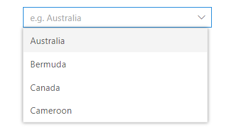
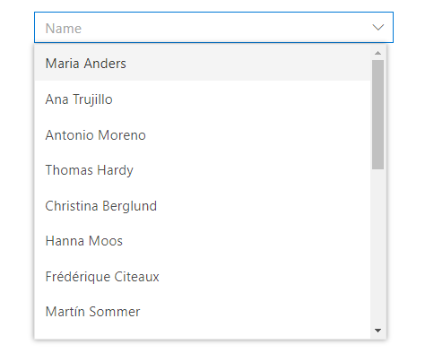

<!-- markdownlint-disable MD024 -->

# Getting Started

This section explains about how to connect the [`SfDataManager`](https://help.syncfusion.com/cr/aspnetcore-blazor/Syncfusion.Blazor.Data.SfDataManager.html) to a data source and perform queries on it in your Blazor Server-Side application. You can refer [Getting Started with Syncfusion Blazor for Server-Side in Visual Studio 2019 page](https://blazor.syncfusion.com/blazor/documentation/getting-started/vs-blazor-server/) for the introduction and configuring the common specifications.

## Importing Syncfusion Blazor component in the application

 1. Install the **Syncfusion.Blazor**  NuGet package to the application by using the **NuGet Package Manager**.

 2. You can add the client-side resources through CDN or from NuGet package in the `<head>` element of the **~/Pages/_Host.cshtml** page.





    <head>
        <environment include="Development">
        ....
        ....
            <link href="_content/Syncfusion.Blazor/styles/fabric.css" rel="stylesheet" />
            <!---CDN--->
            @*<link href="https://cdn.syncfusion.com/blazor/{:version:}/styles/fabric.css" rel="stylesheet" />*@
       </environment>
    </head>





## Adding component package to the application

Open **~/_Imports.razor** file and import the **Syncfusion.Blazor.Data** package.





        @using Syncfusion.Blazor.Data





## Add Data Manager Component

To initialize the [`SfDataManager`](https://help.syncfusion.com/cr/aspnetcore-blazor/Syncfusion.Blazor.Data.SfDataManager.html) component add the below code to your **Index.razor** view page which is present under **~/Pages** folder.





<SfDataManager>

</SfDataManager>





> Since the [`SfDataManager`](https://help.syncfusion.com/cr/aspnetcore-blazor/Syncfusion.Blazor.Data.SfDataManager.html) component is mainly used in conjunction with Syncfusion Blazor components that supports data binding, we are going to use Blazor DataGrid component to depict the usage of [`SfDataManager`](https://help.syncfusion.com/cr/aspnetcore-blazor/Syncfusion.Blazor.Data.SfDataManager.html) throughout this documentation.

## Connection to a data source

The DataManager acts as a gateway for both local and remote data to interact with the data source based on the provided query.

### Binding to JSON data

Local JSON data can be bound to the DataGrid component by assigning the array of objects to the [`Json`](https://help.syncfusion.com/cr/blazor/Syncfusion.Blazor.DataManager.html#Syncfusion_Blazor_DataManager_Json) property of the [`SfDataManager`](https://help.syncfusion.com/cr/aspnetcore-blazor/Syncfusion.Blazor.Data.SfDataManager.html) component.

The following sample code demonstrates binding local data through the [`SfDataManager`](https://help.syncfusion.com/cr/aspnetcore-blazor/Syncfusion.Blazor.Data.SfDataManager.html) to the DataGrid component,





@using Syncfusion.Blazor.Data
@using Syncfusion.Blazor.Grids

<SfGrid TValue="EmployeeData" ID="Grid">
    <SfDataManager Json=@Employees></SfDataManager>
    <GridColumns>
        <GridColumn Field=@nameof(EmployeeData.EmployeeID) TextAlign="TextAlign.Center" HeaderText="Employee ID" Width="120"></GridColumn>
        <GridColumn Field=@nameof(EmployeeData.Name) HeaderText="First Name" Width="130"></GridColumn>
        <GridColumn Field=@nameof(EmployeeData.Title) HeaderText="Title" Width="120"></GridColumn>
    </GridColumns>
</SfGrid>

@code{
    public class EmployeeData
    {
        public int EmployeeID { get; set; }
        public string Name { get; set; }
        public string Title { get; set; }
    }

    public EmployeeData[] Employees = new EmployeeData[]
    {
        new EmployeeData { EmployeeID = 1, Name = "Nancy Fuller", Title = "Vice President" },
        new EmployeeData { EmployeeID = 2, Name = "Steven Buchanan", Title = "Sales Manager" },
        new EmployeeData { EmployeeID = 3, Name = "Janet Leverling", Title = "Sales Representative" },
        new EmployeeData { EmployeeID = 4, Name = "Andrew Davolio", Title = "Inside Sales Coordinator" },
        new EmployeeData { EmployeeID = 5, Name = "Steven Peacock", Title = "Inside Sales Coordinator" },
        new EmployeeData { EmployeeID = 6, Name = "Janet Buchanan", Title = "Sales Representative" },
        new EmployeeData { EmployeeID = 7, Name = "Andrew Fuller", Title = "Inside Sales Coordinator" },
        new EmployeeData { EmployeeID = 8, Name = "Steven Davolio", Title = "Inside Sales Coordinato" },
        new EmployeeData { EmployeeID = 9, Name = "Janet Davolio", Title = "Sales Representative" },
        new EmployeeData { EmployeeID = 10, Name = "Andrew Buchanan", Title = "Sales Representative" }
    };
}





### Binding to OData

Remote data can be bound to the DataGrid component by binding the [`SfDataManager`](https://help.syncfusion.com/cr/aspnetcore-blazor/Syncfusion.Blazor.Data.SfDataManager.html) component to it and then assigning the service end point URL to the [`Url`](https://help.syncfusion.com/cr/blazor/Syncfusion.Blazor.DataManager.html#Syncfusion_Blazor_DataManager_Url) property of the [`SfDataManager`](https://help.syncfusion.com/cr/aspnetcore-blazor/Syncfusion.Blazor.Data.SfDataManager.html).

The following sample code demonstrates binding OData through the [`SfDataManager`](https://help.syncfusion.com/cr/aspnetcore-blazor/Syncfusion.Blazor.Data.SfDataManager.html) to the DataGrid component,





@using Syncfusion.Blazor
@using Syncfusion.Blazor.Data
@using Syncfusion.Blazor.Grids

<SfGrid TValue="Order" ID="Grid" AllowPaging="true">
    <SfDataManager Url="https://js.syncfusion.com/demos/ejServices/Wcf/Northwind.svc/Orders" Adaptor="Adaptors.ODataAdaptor"></SfDataManager>
    <GridColumns>
        <GridColumn Field=@nameof(Order.OrderID) HeaderText="Order ID" IsPrimaryKey="true" TextAlign="TextAlign.Right" Width="120"></GridColumn>
        <GridColumn Field=@nameof(Order.CustomerID) HeaderText="Customer Name" Width="150"></GridColumn>
        <GridColumn Field=@nameof(Order.OrderDate) HeaderText=" Order Date" Format="d" Type="ColumnType.Date" TextAlign="TextAlign.Right" Width="130"></GridColumn>
        <GridColumn Field=@nameof(Order.Freight) HeaderText="Freight" Format="C2" TextAlign="TextAlign.Right" Width="120"></GridColumn>
    </GridColumns>
</SfGrid>

@code{
    public class Order {
        public int? OrderID { get; set; }
        public string CustomerID { get; set; }
        public DateTime? OrderDate { get; set; }
        public double? Freight { get; set; }
    }
}





## Component binding

As mentioned the [`SfDataManager`](https://help.syncfusion.com/cr/aspnetcore-blazor/Syncfusion.Blazor.Data.SfDataManager.html) can be used with Syncfusion components which supports data binding.

Here the [`SfDataManager`](https://help.syncfusion.com/cr/aspnetcore-blazor/Syncfusion.Blazor.Data.SfDataManager.html) is bound with DropDownList component to demonstrate data binding for the components.

### Local data binding

Local data can be bound to the DropDownList component by assigning the array of objects to the [`Json`](https://help.syncfusion.com/cr/blazor/Syncfusion.Blazor.DataManager.html#Syncfusion_Blazor_DataManager_Json) property of the [`SfDataManager`](https://help.syncfusion.com/cr/aspnetcore-blazor/Syncfusion.Blazor.Data.SfDataManager.html) component.

The following sample code demonstrates binding local data through the [`SfDataManager`](https://help.syncfusion.com/cr/aspnetcore-blazor/Syncfusion.Blazor.Data.SfDataManager.html) to the DropDownList component,





@using Syncfusion.Blazor.Data
@using Syncfusion.Blazor.DropDowns

<SfDropDownList Placeholder="e.g. Australia" TValue="Countries">
    <SfDataManager Json=@Country></SfDataManager>
    <DropDownListFieldSettings Value="Name"></DropDownListFieldSettings>
</SfDropDownList>

@code{
    public class Countries
    {
        public string Name { get; set; }

        public string Code { get; set; }
    }

    public Countries[] Country = new Countries[]
    {
        new Countries { Name = "Australia", Code = "AU" },
        new Countries { Name = "Bermuda", Code = "BM" },
        new Countries { Name = "Canada", Code = "CA" },
        new Countries { Name = "Cameroon", Code = "CM" }
    };
}





The following image represents DropDownList bound with local data through the `SfDataManager` component,

### Remote data binding

Remote data can be bound to the DropDownList component by binding the [`SfDataManager`](https://help.syncfusion.com/cr/aspnetcore-blazor/Syncfusion.Blazor.Data.SfDataManager.html) component to it and then assigning the service end point URL to the [`Url`](https://help.syncfusion.com/cr/blazor/Syncfusion.Blazor.DataManager.html#Syncfusion_Blazor_DataManager_Url) property of the [`SfDataManager`](https://help.syncfusion.com/cr/aspnetcore-blazor/Syncfusion.Blazor.Data.SfDataManager.html).

The following sample code demonstrates binding remote data through the [`SfDataManager`](https://help.syncfusion.com/cr/aspnetcore-blazor/Syncfusion.Blazor.Data.SfDataManager.html) to the DropDownList component,





@using Syncfusion.Blazor
@using Syncfusion.Blazor.Data
@using Syncfusion.Blazor.DropDowns

<SfDropDownList Placeholder="Name" TValue="Contact">
    <SfDataManager Url="https://services.odata.org/V4/Northwind/Northwind.svc/Customers" Adaptor="Adaptors.ODataV4Adaptor"></SfDataManager>
    <DropDownListFieldSettings Value="CustomerID" Text="ContactName"></DropDownListFieldSettings>
</SfDropDownList>

@code{
    public class Contact
    {
        public string ContactName { get; set; }

        public string CustomerID { get; set; }
    }
}





The following image represents DropDownList bound with remote data through the `SfDataManager` component,
