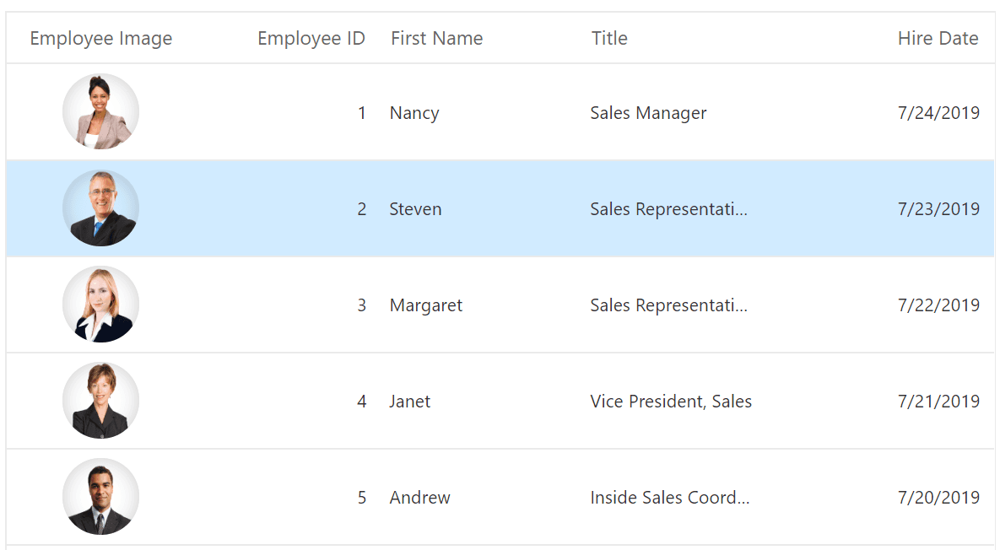
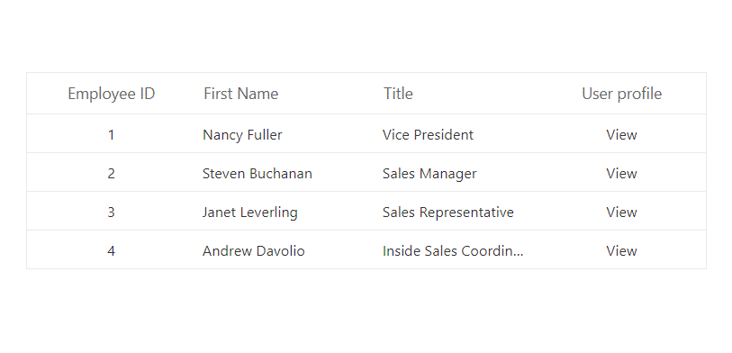

## Column Template in Blazor DataGrid

> Before adding column template to the DataGrid, we strongly recommend you to go through the [template](./templates/#templates) section topic to configure the template.

To know about **Column Template** in Blazor DataGrid Component, you can check this video.



The Column template has options to display custom element value or content in the column. You can use the [Template](https://help.syncfusion.com/cr/blazor/Syncfusion.Blazor.Grids.GridColumn.html#Syncfusion_Blazor_Grids_GridColumn_Template)  of the [GridColumn](https://help.syncfusion.com/cr/aspnetcore-blazor/Syncfusion.Blazor.Grids.GridColumn.html) component to specify the custom content. Inside the [Template](https://help.syncfusion.com/cr/blazor/Syncfusion.Blazor.Grids.GridColumn.html#Syncfusion_Blazor_Grids_GridColumn_Template) , you can access the data using the implicit named parameter **context**.

```cshtml
@using Syncfusion.Blazor.Grids

<SfGrid DataSource="@Employees">
    <GridColumns>
        <GridColumn HeaderText="Employee Image" TextAlign="TextAlign.Center" Width="120">
            <Template>
                @{
                    var employee = (context as EmployeeData);
                    <div class="image">
                        
                    </div>
                }
            </Template>
        </GridColumn>
        <GridColumn Field=@nameof(EmployeeData.EmployeeID) HeaderText="Employee ID" TextAlign="TextAlign.Right" Width="120"></GridColumn>
        <GridColumn Field=@nameof(EmployeeData.FirstName) HeaderText="First Name" Width="130"></GridColumn>
        <GridColumn Field=@nameof(EmployeeData.Title) HeaderText="Title" Width="120"></GridColumn>
        <GridColumn Field=@nameof(EmployeeData.HireDate) HeaderText="Hire Date" Format="d" TextAlign="TextAlign.Right" Width="150"></GridColumn>
    </GridColumns>
</SfGrid>

<style>
    .image img {
        height: 55px;
        width: 55px;
        border-radius: 50px;
        box-shadow: inset 0 0 1px #e0e0e0, inset 0 0 14px rgba(0, 0, 0, 0.2);
    }
</style>

@code{
    public List<EmployeeData> Employees { get; set; }

    protected override void OnInitialized()
    {
        Employees = Enumerable.Range(1, 9).Select(x => new EmployeeData()
        {
            EmployeeID = x,
            FirstName = (new string[] { "Nancy", "Andrew", "Janet", "Margaret", "Steven" })[new Random().Next(5)],
            LastName = (new string[] { "Davolio", "Fuller", "Leverling", "Peacock", "Buchanan" })[new Random().Next(5)],
            Title = (new string[] { "Sales Representative", "Vice President, Sales", "Sales Manager",
                                    "Inside Sales Coordinator" })[new Random().Next(4)],
            HireDate = DateTime.Now.AddDays(-x),
        }).ToList();
    }

    public class EmployeeData
    {
        public int? EmployeeID { get; set; }
        public string FirstName { get; set; }
        public string LastName { get; set; }
        public string Title { get; set; }
        public DateTime? HireDate { get; set; }
    }
}
```

The following screenshot represents the column Template.


### Using conditions inside template

Template elements can be rendered based on required conditions inside the [Template](https://help.syncfusion.com/cr/blazor/Syncfusion.Blazor.Grids.GridColumn.html#Syncfusion_Blazor_Grids_GridColumn_Template) of the [GridColumn](https://help.syncfusion.com/cr/aspnetcore-blazor/Syncfusion.Blazor.Grids.GridColumn.html) component.

In the following code, checkbox is rendered based on Discontinued field value in the datasource. This data can be accessed inside the [Template](https://help.syncfusion.com/cr/blazor/Syncfusion.Blazor.Grids.GridColumn.html#Syncfusion_Blazor_Grids_GridColumn_Template) using the implicit named parameter **context**.

```cshtml
@using Syncfusion.Blazor.Grids

<SfGrid DataSource="@Employees">
    <GridColumns>
        <GridColumn HeaderText="Employee Status" TextAlign="TextAlign.Center" Width="120">
            <Template>
                @{
                    var employee = (context as EmployeeData);
                    <div class="template_checkbox">
                        @if (employee.Discontinued)
                        {
                            <input type="checkbox" checked>
                        }
                        else
                        {
                            <input type="checkbox">
                        }
                    </div>
                }
            </Template>
        </GridColumn>
        <GridColumn Field=@nameof(EmployeeData.EmployeeID) TextAlign="TextAlign.Center" HeaderText="Employee ID" Width="120"></GridColumn>
        <GridColumn Field=@nameof(EmployeeData.FirstName) HeaderText="First Name" Width="130"></GridColumn>
        <GridColumn Field=@nameof(EmployeeData.LastName) HeaderText="Last Name" Width="130"></GridColumn>
        <GridColumn Field=@nameof(EmployeeData.Title) HeaderText="Title" Width="120"></GridColumn>
        <GridColumn Field=@nameof(EmployeeData.HireDate) HeaderText="Hire Date" Format="d" TextAlign="TextAlign.Right" Width="150"></GridColumn>
    </GridColumns>
</SfGrid>

@code{
    public List<EmployeeData> Employees { get; set; }

    protected override void OnInitialized()
    {
        Employees = Enumerable.Range(1, 9).Select(x => new EmployeeData()
        {
            EmployeeID = x,
            FirstName = (new string[] { "Nancy", "Andrew", "Janet", "Margaret", "Steven" })[new Random().Next(5)],
            LastName = (new string[] { "Davolio", "Fuller", "Leverling", "Peacock", "Buchanan" })[new Random().Next(5)],
            Title = (new string[] { "Sales Representative", "Vice President, Sales", "Sales Manager",
                                    "Inside Sales Coordinator" })[new Random().Next(4)],
            HireDate = DateTime.Now.AddDays(-x),
            Discontinued = (new Boolean[] { true, false})[new Random().Next(2)]
        }).ToList();
    }

    public class EmployeeData
    {
        public int? EmployeeID { get; set; }
        public string FirstName { get; set; }
        public string LastName { get; set; }
        public string Title { get; set; }
        public DateTime? HireDate { get; set; }
        public Boolean Discontinued { get; set; }
    }
}
```

The following screenshot represents the Conditional Template.


### Using image inside template

This can be achieved using the Column template property as it has options to display custom elements like, image content in the column. You can use the [Template](https://help.syncfusion.com/cr/blazor/Syncfusion.Blazor.Grids.GridColumn.html#Syncfusion_Blazor_Grids_GridColumn_Template) of the [GridColumn](https://help.syncfusion.com/cr/aspnetcore-blazor/Syncfusion.Blazor.Grids.GridColumn.html) component to specify the custom image content. Inside the [Template](https://help.syncfusion.com/cr/blazor/Syncfusion.Blazor.Grids.GridColumn.html#Syncfusion_Blazor_Grids_GridColumn_Template) , you can access the data using the implicit named parameter **context**.

```cshtml
@using Syncfusion.Blazor.Grids

<SfGrid  DataSource="@Employees">
    <GridColumns>
        <GridColumn HeaderText="Employee Image" TextAlign="TextAlign.Center" Width="120">
            <Template>
                @{
                    var employee = (context as EmployeeData);
                    <div class="image">
                        
                    </div>
                }
            </Template>
        </GridColumn>
        <GridColumn Field=@nameof(EmployeeData.EmployeeID) TextAlign="TextAlign.Right" HeaderText="Employee ID" Width="120"></GridColumn>
        <GridColumn Field=@nameof(EmployeeData.FirstName) HeaderText="First Name" Width="130"></GridColumn>
        <GridColumn Field=@nameof(EmployeeData.Title) HeaderText="Title" Format="C2" Width="120"></GridColumn>
        <GridColumn Field=@nameof(EmployeeData.HireDate) HeaderText="Hire Date" Format="d" TextAlign="TextAlign.Right" Width="150"></GridColumn>
    </GridColumns>
</SfGrid>

<style>
    .image img {
        height: 55px;
        width: 55px;
        border-radius: 50px;
        box-shadow: inset 0 0 1px #e0e0e0, inset 0 0 14px rgba(0, 0, 0, 0.2);
    }
</style>

@code{
    public List<EmployeeData> Employees { get; set; }

    protected override void OnInitialized()
    {
        Employees = Enumerable.Range(1, 5).Select(x => new EmployeeData()
        {
            EmployeeID = x,
            FirstName = (new string[] { "Nancy", "Andrew", "Janet", "Margaret", "Steven" })[new Random().Next(5)],
            Title = (new string[] { "Sales Representative", "Vice President, Sales", "Sales Manager",
                                    "Inside Sales Coordinator" })[new Random().Next(4)],
            HireDate = DateTime.Now.AddDays(-x),
        }).ToList();
    }

    public class EmployeeData
    {
        public int? EmployeeID { get; set; }
        public string FirstName { get; set; }
        public string Title { get; set; }
        public DateTime? HireDate { get; set; }
    }
}
```

The following screenshot represents the Image Template.


### Using hyperlink column and performing routing on click

The Column template property can be used to provide routing links inside the [Template](https://help.syncfusion.com/cr/blazor/Syncfusion.Blazor.Grids.GridColumn.html#Syncfusion_Blazor_Grids_GridColumn_Template) property of the [GridColumn](https://help.syncfusion.com/cr/aspnetcore-blazor/Syncfusion.Blazor.Grids.GridColumn.html). For routing, [UriHelper](https://docs.microsoft.com/en-us/aspnet/core/blazor/routing?view=aspnetcore-3.0#uri-and-navigation-state-helpers) can be utilized.

This can be achieved by initially defining an anchor tag inside the column template and binding click event to it. In this event, the DataGrid data **context** is passed on to its function.

```cshtml
@inject NavigationManager UriHelper
@using Syncfusion.Blazor.Grids

<SfGrid  DataSource="@Employees">
    <GridColumns>
        <GridColumn Field=@nameof(EmployeeData.EmployeeID) TextAlign="TextAlign.Center" HeaderText="Employee ID" Width="120"></GridColumn>
        <GridColumn Field=@nameof(EmployeeData.Name) HeaderText="First Name" Width="130"></GridColumn>
        <GridColumn Field=@nameof(EmployeeData.Title) HeaderText="Title" Width="120"></GridColumn>
        <GridColumn HeaderText="User profile" TextAlign="TextAlign.Center" Width="120">
            <Template>
                @{
                    var Employee = (context as EmployeeData);
                    <div><a href="#" @onclick="@(() => Navigate(Employee))">View</a></div>
                }
            </Template>
        </GridColumn>
    </GridColumns>
</SfGrid>

<style>
    .image img {
        height: 55px;
        width: 55px;
        border-radius: 50px;
        box-shadow: inset 0 0 1px #e0e0e0, inset 0 0 14px rgba(0, 0, 0, 0.2);
    }
</style>

@code{

    List<EmployeeData> Employees = new List<EmployeeData>
    {
        new EmployeeData() { EmployeeID = 1, Name = "Nancy Fuller", Link = "nancy_fuller", Title = "Vice President" },
        new EmployeeData() { EmployeeID = 2, Name = "Steven Buchanan", Link = "steven_buchanan", Title = "Sales Manager" },
        new EmployeeData() { EmployeeID = 3, Name = "Janet Leverling", Link = "janet_leverling", Title = "Sales Representative" },
        new EmployeeData() { EmployeeID = 4, Name = "Andrew Davolio", Link = "andrew_davolio", Title = "Inside Sales Coordinator" }
    };

    public class EmployeeData
    {
        public int EmployeeID { get; set; }
        public string Name { get; set; }
        public string Title { get; set; }
        public string Link { get; set; }
    }
    private void Navigate(EmployeeData Employee)
    {
        UriHelper.NavigateTo($"{ Employee.Link}/{Employee.EmployeeID.ToString()}/{Employee.Name}/{ Employee.Title}");
    }
}
```

In the above code, the url to be navigated is specified in the Link variable of the DataGrid data. Based on this, the page is routed to the corresponding url.

After that, add new razor page for routing with routing url along with the parameters to be received, and initialize it with the required details.

```cshtml
@page "/nancy_fuller/{EmpID}/{Name}/{Title}"

<h2>Hello @Name!</h2>
<br>
<h4><u>Employee Details</u></h4>
<br>
<div><b>Employee ID:</b><div class="details">@EmpID</div></div>
<div><b>Position:</b><div class="details">@Title</div></div>

@code {
    [Parameter]
    private string EmpID { get; set; }
    [Parameter]
    private string Name { get; set; }
    [Parameter]
    private string Title { get; set; }
}
```

The following GIF represents template routing in DataGrid
