# Columns in Blazor DataGrid Component

The column definitions are used as the **DataSource** schema in the DataGrid. This plays a vital role in rendering column values in the required format. The DataGrid operations such as sorting, filtering and grouping etc. are performed based on column definitions. The [Field](https://help.syncfusion.com/cr/blazor/Syncfusion.Blazor.Grids.GridColumn.html#Syncfusion_Blazor_Grids_GridColumn_Field) property of **GridColumn** is necessary to map the datasource values in DataGrid columns.

> 1. If the column [Field](https://help.syncfusion.com/cr/blazor/Syncfusion.Blazor.Grids.GridColumn.html#Syncfusion_Blazor_Grids_GridColumn_Field) is not specified in the dataSource, the column values will be empty.
> 2. If the [Field](https://help.syncfusion.com/cr/blazor/Syncfusion.Blazor.Grids.GridColumn.html#Syncfusion_Blazor_Grids_GridColumn_Field) name contains “dot” operator, it is considered as complex binding.
> 3. It is must to define the [Field](https://help.syncfusion.com/cr/blazor/Syncfusion.Blazor.Grids.GridColumn.html#Syncfusion_Blazor_Grids_GridColumn_Field) property for a [Template](https://help.syncfusion.com/cr/blazor/Syncfusion.Blazor.Grids.GridColumn.html#Syncfusion_Blazor_Grids_GridColumn_Template) column, to perform CRUD or Data Operations such as filtering, searching etc.

## Auto generation

The [Columns](https://help.syncfusion.com/cr/blazor/Syncfusion.Blazor.Grids.ColumnModel.html#Syncfusion_Blazor_Grids_ColumnModel_Columns) are automatically generated when [Columns](https://help.syncfusion.com/cr/blazor/Syncfusion.Blazor.Grids.ColumnModel.html#Syncfusion_Blazor_Grids_ColumnModel_Columns) declaration is empty or undefined while initializing the datagrid. All the columns in the **DataSource** are bound as datagrid columns.

```cshtml
@using Syncfusion.Blazor.Grids

<SfGrid DataSource="@Orders"></SfGrid>

@code{
    public List<Order> Orders { get; set; }

    protected override void OnInitialized()
    {
        Orders = Enumerable.Range(1, 75).Select(x => new Order()
        {
            OrderID = 1000 + x,
            CustomerID = (new string[] { "ALFKI", "ANANTR", "ANTON", "BLONP", "BOLID" })[new Random().Next(5)],
            Freight = 2.1 * x,
            OrderDate = DateTime.Now.AddDays(-x),
        }).ToList();
    }

    public class Order
    {
        public int? OrderID { get; set; }
        public string CustomerID { get; set; }
        public DateTime? OrderDate { get; set; }
        public double? Freight { get; set; }
    }
}
```

## Dynamic column building

It is possible to dynamically build and customize each of the DataGrid column using the type of the model.

You can refer the following code example to achieve this.

```cshtml
@using Syncfusion.Blazor.Grids

<SfGrid DataSource="@OrderData">
    <GridEditSettings AllowEditing="true" AllowAdding="true" AllowDeleting="true"></GridEditSettings>
    <GridColumns>
        @foreach (var prop in typeof(Order).GetProperties())
        {
            <GridColumn Field="@prop.Name" IsPrimaryKey="@(prop.Name == "OrderID")" AllowEditing="@prop.CanWrite"></GridColumn>
        }
    </GridColumns>
</SfGrid>

@code{
    public List<Order> OrderData = new List<Order>
    {
        new Order() { OrderID = 10248, CustomerID = "VINET", EmployeeID = 4 },
        new Order() { OrderID = 10249, CustomerID = "TOMSP", EmployeeID = 5 },
        new Order() { OrderID = 10250, CustomerID = "HANAR", EmployeeID = 6 }
    };

    public class Order
    {
        public int? OrderID { get; set; }
        public string CustomerID { get; set; }
        public int? EmployeeID { get; set; }
    }
}
```

The following image represents DataGrid with dynamically build columns,


## Complex data binding

You can achieve complex data binding in the DataGrid by using the dot(.) operator in the column.field. In the following examples, **Name.FirstName** and **Name.LastName** are complex data.

```cshtml
@using Syncfusion.Blazor.Grids

<SfGrid DataSource="@Employees" Height="315">
    <GridColumns>
        <GridColumn Field=@nameof(EmployeeData.EmployeeID) HeaderText="EmployeeID" TextAlign="TextAlign.Right" Width="120"></GridColumn>
        <GridColumn Field="Name.FirstName" HeaderText="First Name" Width="150"></GridColumn>
        <GridColumn Field="Name.LastName" HeaderText="Last Name"Width="130"></GridColumn>
        <GridColumn Field=@nameof(EmployeeData.Title) HeaderText="Title" Format="C2" TextAlign="TextAlign.Right" Width="120"></GridColumn>
    </GridColumns>
</SfGrid>

@code{
    public List<EmployeeData> Employees { get; set; }

    protected override void OnInitialized()
    {
    Employees = Enumerable.Range(1, 9).Select(x => new EmployeeData()
    {
        EmployeeID = x,
        Name = new EmployeeName() {
            FirstName = (new string[] { "Nancy", "Andrew", "Janet", "Margaret", "Steven" })[new Random().Next(5)],
            LastName =(new string[] { "Davolio", "Fuller", "Leverling", "Peacock", "Buchanan" })[new Random().Next(5)]
        },
        Title = (new string[] { "Sales Representative", "Vice President, Sales", "Sales Manager",
                                              "Inside Sales Coordinator" })[new Random().Next(4)],
    }).ToList();
    }

    public class EmployeeData
    {
        public int? EmployeeID { get; set; }
        public EmployeeName Name { get; set; }
        public string Title { get; set; }
    }

    public class EmployeeName
    {
        public string FirstName { get; set; }
        public string LastName { get; set; }
    }
}
```

The following image represents complex data binding


>For OData and ODataV4 adaptors, you need to add expand query to the query property (of DataGrid) to load the complex data.

### ExpandoObject Complex data binding

Before proceeding this, learn about [ExpandoObject Binding](https://blazor.syncfusion.com/documentation/datagrid/data-binding/#expandoobject-binding). You can achieve ExpandoObject complex data binding in the DataGrid by using the dot(.) operator in the column.field. In the following examples, `CustomerID.Name` and `ShipCountry.Country` are complex data.

```cshtml
@using Syncfusion.Blazor.Grids
@using System.Dynamic

<SfGrid DataSource="@Orders" AllowPaging="true" AllowFiltering="true" AllowSorting="true" AllowGrouping="true" Toolbar="@ToolbarItems">
    <GridEditSettings AllowAdding="true" AllowDeleting="true" AllowEditing="true"></GridEditSettings>
    <GridColumns>
        <GridColumn Field="OrderID" HeaderText="Order ID" IsPrimaryKey="true" TextAlign="TextAlign.Right" Width="120"></GridColumn>
        <GridColumn Field="CustomerID.Name" HeaderText="Customer Name" Width="120"></GridColumn>
        <GridColumn Field="Freight" HeaderText="Freight" Format="C2" TextAlign="TextAlign.Right" Width="120"></GridColumn>
        <GridColumn Field="OrderDate" HeaderText=" Order Date" Format="d" TextAlign="TextAlign.Right" Width="130" Type="ColumnType.Date"></GridColumn>
        <GridColumn Field="ShipCountry.Country" HeaderText="Ship Country"  Width="150"></GridColumn>
        <GridColumn Field="Verified" HeaderText="Active" DisplayAsCheckBox="true" Width="150"></GridColumn>
    </GridColumns>
</SfGrid>

@code {
    public List<ExpandoObject> Orders { get; set; } = new List<ExpandoObject>();
    private List<string> ToolbarItems = new List<string>() { "Add", "Edit", "Delete", "Update", "Cancel" };

    protected override void OnInitialized()
    {
        Orders = Enumerable.Range(1, 75).Select((x) =>
        {
            dynamic d = new ExpandoObject();
            dynamic customerName = new ExpandoObject();
            dynamic countryName = new ExpandoObject();
            d.OrderID = 1000 + x;
            customerName.Name = (new string[] { "ALFKI", "ANANTR", "ANTON", "BLONP", "BOLID" })[new Random().Next(5)];
            d.CustomerID = customerName;
            d.Freight = (new double[] { 2, 1, 4, 5, 3 })[new Random().Next(5)] * x;
            d.OrderDate = (new DateTime[] { new DateTime(2010, 11, 5), new DateTime(2018, 10, 3), new DateTime(1995, 9, 9), new DateTime(2012, 8, 2), new DateTime(2015, 4, 11) })[new Random().Next(5)];
            countryName.Country = (new string[] { "USA", "UK" })[new Random().Next(2)];
            d.ShipCountry = countryName;
            d.Verified = (new bool[] { true, false })[new Random().Next(2)];

            return d;
        }).Cast<ExpandoObject>().ToList<ExpandoObject>();

    }
}
```

> * you can perform the Data operations and CRUD operations for Complex ExpandoObject binding fields too.

The following image represents ExpandoObject complex data binding


### DynamicObject Complex data binding

Before proceeding this, learn about [DynamicObject Binding](https://blazor.syncfusion.com/documentation/datagrid/data-binding/#dynamicobject-binding). You can achieve DynamicObject complex data binding in the datagrid by using the dot(.) operator in the column.field. In the following examples, `CustomerID.Name` and `ShipCountry.Country` are complex data.

```cshtml
@using Syncfusion.Blazor.Grids
@using System.Dynamic

<SfGrid DataSource="@Orders" AllowPaging="true" AllowFiltering="true" AllowSorting="true" AllowGrouping="true" Toolbar="@ToolbarItems">
    <GridEditSettings AllowAdding="true" AllowDeleting="true" AllowEditing="true"></GridEditSettings>
    <GridColumns>
        <GridColumn Field="OrderID" HeaderText="Order ID" IsPrimaryKey="true" TextAlign="TextAlign.Right" Width="120"></GridColumn>
        <GridColumn Field="CustomerID.Name" HeaderText="Customer Name" Width="150"></GridColumn>
        <GridColumn Field="OrderDate" HeaderText="Order Date" Format="d" Type="ColumnType.Date" TextAlign="TextAlign.Right" EditType="EditType.DatePickerEdit" Width="130"></GridColumn>
        <GridColumn Field="Freight" HeaderText="Freight" Format="C2" TextAlign="TextAlign.Right" Width="120"></GridColumn>
        <GridColumn Field="ShipCountry.Country" HeaderText="Ship Country" Width="150"></GridColumn>
    </GridColumns>
</SfGrid>

@code {
    private List<string> ToolbarItems = new List<string>() { "Add", "Edit", "Delete", "Update", "Cancel" };
    public List<DynamicDictionary> Orders = new List<DynamicDictionary>() { };
    protected override void OnInitialized()
    {
        Orders = Enumerable.Range(1, 1075).Select((x) =>
        {
            dynamic d = new DynamicDictionary();
            dynamic combo = new DynamicDictionary();
            dynamic countryName = new DynamicDictionary();
            d.OrderID = 1000 + x;
            combo.Name = (new string[] { "ALFKI", "ANANTR", "ANTON", "BLONP", "BOLID" })[new Random().Next(5)];
            d.CustomerID = combo;
            d.Freight = (new double[] { 2, 1, 4, 5, 3 })[new Random().Next(5)] * x;
            d.OrderDate = DateTime.Now.AddDays(-x);
            countryName.Country = (new string[] { "USA", "UK" })[new Random().Next(2)];
            d.ShipCountry = countryName;
            return d;
        }).Cast<DynamicDictionary>().ToList<DynamicDictionary>();
    }
    public class DynamicDictionary : DynamicObject
    {
        Dictionary<string, object> dictionary = new Dictionary<string, object>();

        public override bool TryGetMember(GetMemberBinder binder, out object result)
        {
            string name = binder.Name;
            return dictionary.TryGetValue(name, out result);
        }
        public override bool TrySetMember(SetMemberBinder binder, object value)
        {
            dictionary[binder.Name] = value;
            return true;
        }

        public override System.Collections.Generic.IEnumerable<string> GetDynamicMemberNames()
        {
            return this.dictionary?.Keys;
        }
    }
}
```

> * you can perform the Data operations and CRUD operations for Complex DynamicObject binding fields too.

The following image represents DynamicObject complex data binding


## Foreign key column

Foreign key column can be enabled by using [ForeignDataSource](https://help.syncfusion.com/cr/blazor/Syncfusion.Blazor.Grids.GridColumn.html), [ForeignKeyField](https://help.syncfusion.com/cr/blazor/Syncfusion.Blazor.Grids.GridColumn.html#Syncfusion_Blazor_Grids_GridColumn_ForeignKeyField) and [ForeignKeyValue](https://help.syncfusion.com/cr/blazor/Syncfusion.Blazor.Grids.GridColumn.html#Syncfusion_Blazor_Grids_GridColumn_ForeignKeyValue) properties of **GridForeignColumn** directive.

* [ForeignDataSource](https://help.syncfusion.com/cr/blazor/Syncfusion.Blazor.Grids.GridColumn.html) - Defines the foreign data.
* [ForeignKeyField](https://help.syncfusion.com/cr/blazor/Syncfusion.Blazor.Grids.GridColumn.html#Syncfusion_Blazor_Grids_GridColumn_ForeignKeyField) - Defines the mapping column name to the foreign data.
* [ForeignKeyValue](https://help.syncfusion.com/cr/blazor/Syncfusion.Blazor.Grids.GridColumn.html#Syncfusion_Blazor_Grids_GridColumn_ForeignKeyValue) - Defines the display field from the foreign data.

### Foreign key column - Local Data

In the following example, **Employee Name** is a foreign column which shows **FirstName** column from foreign data.

```cshtml
@using Syncfusion.Blazor.Grids

<SfGrid DataSource="@Orders" Height="315">
    <GridColumns>
        <GridColumn Field=@nameof(Order.OrderID) HeaderText="Order ID" TextAlign="TextAlign.Right" Width="120"></GridColumn>
        <GridForeignColumn Field=@nameof(Order.EmployeeID) HeaderText="Employee Name" ForeignKeyValue="FirstName" ForeignDataSource="@Employees" Width="150"></GridForeignColumn>
        <GridColumn Field=@nameof(Order.OrderDate) HeaderText="Order Date" Format="d" Type="ColumnType.Date" TextAlign="TextAlign.Right" Width="130"></GridColumn>
        <GridColumn Field=@nameof(Order.Freight) HeaderText="Freight" Format="C2" TextAlign="TextAlign.Right" Width="120"></GridColumn>
    </GridColumns>
</SfGrid>

@code{
    public List<Order> Orders { get; set; }
    public List<EmployeeData> Employees { get; set; }

    protected override void OnInitialized()
    {
        Orders = Enumerable.Range(1, 75).Select(x => new Order()
        {
            OrderID = 1000 + x,
            EmployeeID = x,
            Freight = 2.1 * x,
            OrderDate = DateTime.Now.AddDays(-x),
        }).ToList();

        Employees = Enumerable.Range(1, 75).Select(x => new EmployeeData()
        {
            EmployeeID = x,
            FirstName = (new string[] { "Nancy", "Andrew", "Janet", "Margaret", "Steven" })[new Random().Next(5)],
        }).ToList();
    }

    public class Order
    {
        public int? OrderID { get; set; }
        public int? EmployeeID { get; set; }
        public DateTime? OrderDate { get; set; }
        public double? Freight { get; set; }
    }

    public class EmployeeData
    {
        public int? EmployeeID { get; set; }
        public string FirstName { get; set; }
    }
}
```

### ForeignKey Column - Remote Data

In the following example, **Employee Name** is a foreign column which shows **FirstName** column from foreign data.

```cshtml
@using Syncfusion.Blazor
@using Syncfusion.Blazor.Grids
@using Syncfusion.Blazor.Grids.Internal

<SfGrid DataSource="@Orders" Height="250">
    <GridColumns>
        <GridColumn Field=@nameof(Order.OrderID) HeaderText="Order ID" TextAlign="TextAlign.Right" Width="120"></GridColumn>
        <GridForeignColumn TValue="EmployeeData" Field=@nameof(Order.EmployeeID) HeaderText="Employee Name" ForeignKeyValue="FirstName" Width="150">
            <Syncfusion.Blazor.Data.SfDataManager Url="https://js.syncfusion.com/demos/ejServices/Wcf/Northwind.svc/Employees" CrossDomain="true" Adaptor="Adaptors.ODataAdaptor">
            </Syncfusion.Blazor.Data.SfDataManager>
        </GridForeignColumn>
        <GridColumn Field=@nameof(Order.OrderDate) HeaderText="Order Date" Format="d" Type="ColumnType.Date" TextAlign="TextAlign.Right" Width="130"></GridColumn>
        <GridColumn Field=@nameof(Order.Freight) HeaderText="Freight" Format="C2" TextAlign="TextAlign.Right" Width="120"></GridColumn>
    </GridColumns>
</SfGrid>


@code{

    public List<Order> Orders { get; set; }

    protected override void OnInitialized()
    {
        Orders = Enumerable.Range(1, 75).Select(x => new Order()
        {
            OrderID = 1000 + x,
            EmployeeID = x,
            Freight = 2.1 * x,
            OrderDate = DateTime.Now.AddDays(-x),
        }).ToList();
    }

    public class Order
    {
        public int? OrderID { get; set; }
        public int? EmployeeID { get; set; }
        public DateTime? OrderDate { get; set; }
        public double? Freight { get; set; }
    }

    public class EmployeeData
    {
        public int? EmployeeID { get; set; }
        public string FirstName { get; set; }
    }
}
```

The following image represents foreign key column
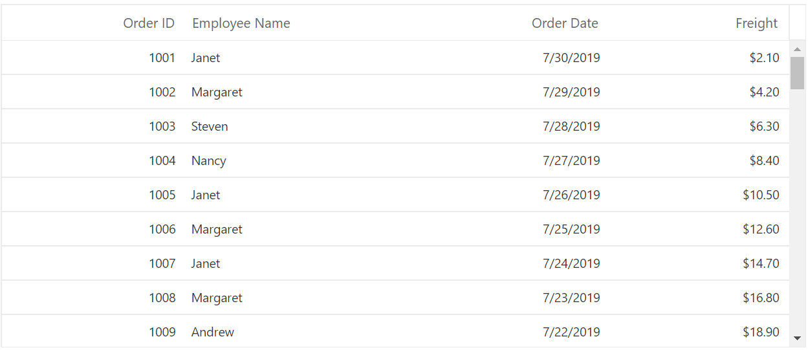

> * For remote data, the sorting and grouping is done based on [ForeignKeyField](https://help.syncfusion.com/cr/blazor/Syncfusion.Blazor.Grids.GridColumn.html#Syncfusion_Blazor_Grids_GridColumn_ForeignKeyField) instead of [ForeignKeyValue](https://help.syncfusion.com/cr/blazor/Syncfusion.Blazor.Grids.GridColumn.html#Syncfusion_Blazor_Grids_GridColumn_ForeignKeyValue).
> * If [ForeignKeyField](https://help.syncfusion.com/cr/blazor/Syncfusion.Blazor.Grids.GridColumn.html#Syncfusion_Blazor_Grids_GridColumn_ForeignKeyField) is not defined, then the column uses [Field](https://help.syncfusion.com/cr/blazor/Syncfusion.Blazor.Charts.ChartSeries.html#Syncfusion_Blazor_Charts_ChartSeries_StackingGroup) property of **GridColumn** tag helper.

## Header text

By default, column header title is displayed from column [Field](https://help.syncfusion.com/cr/blazor/Syncfusion.Blazor.Grids.GridColumn.html#Syncfusion_Blazor_Grids_GridColumn_Field) value. To override the default header title, you have to define the **HeaderText** value in the [HeaderText](https://help.syncfusion.com/cr/blazor/Syncfusion.Blazor.Grids.GridColumn.html#Syncfusion_Blazor_Grids_GridColumn_HeaderText) property of **GridColumn** directive.

```cshtml
@using Syncfusion.Blazor.Grids

<SfGrid DataSource="@Orders" Height="315">
    <GridColumns>
        <GridColumn Field=@nameof(Order.OrderID) HeaderText="Order ID" TextAlign="TextAlign.Right" Width="120"></GridColumn>
        <GridColumn Field=@nameof(Order.CustomerID) HeaderText="Customer Name" Width="150"></GridColumn>
        <GridColumn Field=@nameof(Order.OrderDate) HeaderText="Order Date" Format="d" Type="ColumnType.Date" TextAlign="TextAlign.Right" Width="130"></GridColumn>
        <GridColumn Field=@nameof(Order.Freight) HeaderText="Freight" Format="C2" TextAlign="TextAlign.Right" Width="120"></GridColumn>
    </GridColumns>
</SfGrid>

@code{
    public List<Order> Orders { get; set; }

    protected override void OnInitialized()
    {
        Orders = Enumerable.Range(1, 75).Select(x => new Order()
        {
            OrderID = 1000 + x,
            CustomerID = (new string[] { "ALFKI", "ANANTR", "ANTON", "BLONP", "BOLID" })[new Random().Next(5)],
            Freight = 2.1 * x,
            OrderDate = DateTime.Now.AddDays(-x),
        }).ToList();
    }

    public class Order {
        public int? OrderID { get; set; }
        public string CustomerID { get; set; }
        public DateTime? OrderDate { get; set; }
        public double? Freight { get; set; }
    }
}
```

The Output image for header text is as follows
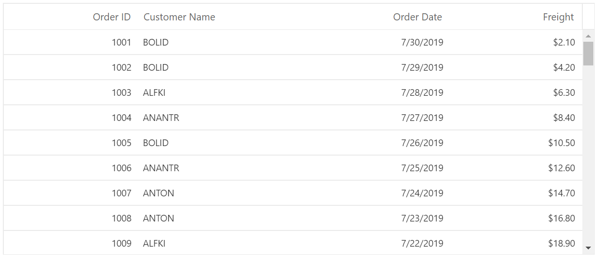

> * If both the [Field](https://help.syncfusion.com/cr/blazor/Syncfusion.Blazor.Grids.GridColumn.html#Syncfusion_Blazor_Grids_GridColumn_Field) and [HeaderText](https://help.syncfusion.com/cr/blazor/Syncfusion.Blazor.Grids.GridColumn.html#Syncfusion_Blazor_Grids_GridColumn_HeaderText)
are not defined in the column, the column renders with “empty” header text.

## Header template

> Before adding header template to the datagrid, we strongly recommend you to go through the [template](./templates/#templates) section topic to configure the template.

To know about **Header Template** in Blazor DataGrid Component, you can check this video.



The Header Template has options to display custom element value or content in the header. You can use the [HeaderTemplate](https://help.syncfusion.com/cr/blazor/Syncfusion.Blazor.Grids.GridColumn.html#Syncfusion_Blazor_Grids_GridColumn_HeaderTemplate)  of the [GridColumn](https://help.syncfusion.com/cr/aspnetcore-blazor/Syncfusion.Blazor.Grids.GridColumn.html) component to specify the custom content.

```cshtml
@using Syncfusion.Blazor.Grids

<SfGrid DataSource="@Employees" AllowPaging="true" Height="315">
    <GridColumns>
        <GridColumn Field=@nameof(EmployeeData.EmployeeID) TextAlign="TextAlign.Right" Width="120">
            <HeaderTemplate>
                <div>
                    <span class="e-icon-userlogin e-icons employee"></span> Emp ID
                </div>
            </HeaderTemplate>
        </GridColumn>
        <GridColumn Field=@nameof(EmployeeData.FirstName) HeaderText="First Name" Width="130"></GridColumn>
        <GridColumn Field=@nameof(EmployeeData.OrderDate) HeaderText="Last Name" Format="d" TextAlign="TextAlign.Right" Width="120">
            <HeaderTemplate>
                <div>
                    <span class="e-icon-calender e-icons headericon"></span> Order Date
                </div>
            </HeaderTemplate>
        </GridColumn>
        <GridColumn Field=@nameof(EmployeeData.City) HeaderText="City" Width="150"></GridColumn>
        <GridColumn Field=@nameof(EmployeeData.Country) HeaderText="Country" TextAlign="TextAlign.Right" Width="150"></GridColumn>
    </GridColumns>
</SfGrid>

<style>

    @@font-face {
        font-family: 'ej2-headertemplate';
        src: url() format('truetype');
        font-weight: normal;
        font-style: normal;
    }

    .e-grid .e-icon-userlogin::before {
        font-family: 'ej2-headertemplate';
        width: 15px !important;
        content: '\e702';
    }

    .e-grid .e-icon-calender::before {
        font-family: 'ej2-headertemplate';
        width: 15px !important;
        content: '\e960';
    }
</style>

@code{
    public List<EmployeeData> Employees { get; set; }

    protected override void OnInitialized()
    {
        Employees = Enumerable.Range(1, 9).Select(x => new EmployeeData()
        {
            EmployeeID = x,
            FirstName = (new string[] { "Nancy", "Andrew", "Janet", "Margaret", "Steven" })[new Random().Next(5)],
            OrderDate = DateTime.Now.AddDays(-x),
            City = (new string[] { "Seattle", "Tacoma", "Redmond", "Kirkland", "London" })[new Random().Next(5)],
            Country = (new string[] { "USA", "UK"})[new Random().Next(2)],
        }).ToList();
    }

    public class EmployeeData
    {
        public int? EmployeeID { get; set; }
        public string FirstName { get; set; }
        public DateTime? OrderDate { get; set; }
        public string  City{ get; set; }
        public string Country { get; set; }
    }
}
```

The following screenshot represents the Header Template.
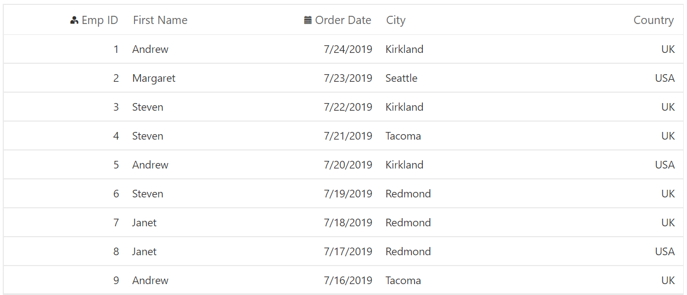

## Column template

> Before adding column template to the DataGrid, we strongly recommend you to go through the [template](./templates/#templates) section topic to configure the template.

To know about **Column Template** in Blazor DataGrid Component, you can check this video.



The Column template has options to display custom element value or content in the column. You can use the [Template](https://help.syncfusion.com/cr/blazor/Syncfusion.Blazor.Grids.GridColumn.html#Syncfusion_Blazor_Grids_GridColumn_Template)  of the [GridColumn](https://help.syncfusion.com/cr/aspnetcore-blazor/Syncfusion.Blazor.Grids.GridColumn.html) component to specify the custom content. Inside the [Template](https://help.syncfusion.com/cr/blazor/Syncfusion.Blazor.Grids.GridColumn.html#Syncfusion_Blazor_Grids_GridColumn_Template) , you can access the data using the implicit named parameter **context**.

```cshtml
@using Syncfusion.Blazor.Grids

<SfGrid DataSource="@Employees">
    <GridColumns>
        <GridColumn HeaderText="Employee Image" TextAlign="TextAlign.Center" Width="120">
            <Template>
                @{
                    var employee = (context as EmployeeData);
                    <div class="image">
                        
                    </div>
                }
            </Template>
        </GridColumn>
        <GridColumn Field=@nameof(EmployeeData.EmployeeID) HeaderText="Employee ID" TextAlign="TextAlign.Right" Width="120"></GridColumn>
        <GridColumn Field=@nameof(EmployeeData.FirstName) HeaderText="First Name" Width="130"></GridColumn>
        <GridColumn Field=@nameof(EmployeeData.Title) HeaderText="Title" Width="120"></GridColumn>
        <GridColumn Field=@nameof(EmployeeData.HireDate) HeaderText="Hire Date" Format="d" TextAlign="TextAlign.Right" Width="150"></GridColumn>
    </GridColumns>
</SfGrid>

<style>
    .image img {
        height: 55px;
        width: 55px;
        border-radius: 50px;
        box-shadow: inset 0 0 1px #e0e0e0, inset 0 0 14px rgba(0, 0, 0, 0.2);
    }
</style>

@code{
    public List<EmployeeData> Employees { get; set; }

    protected override void OnInitialized()
    {
        Employees = Enumerable.Range(1, 9).Select(x => new EmployeeData()
        {
            EmployeeID = x,
            FirstName = (new string[] { "Nancy", "Andrew", "Janet", "Margaret", "Steven" })[new Random().Next(5)],
            LastName = (new string[] { "Davolio", "Fuller", "Leverling", "Peacock", "Buchanan" })[new Random().Next(5)],
            Title = (new string[] { "Sales Representative", "Vice President, Sales", "Sales Manager",
                                    "Inside Sales Coordinator" })[new Random().Next(4)],
            HireDate = DateTime.Now.AddDays(-x),
        }).ToList();
    }

    public class EmployeeData
    {
        public int? EmployeeID { get; set; }
        public string FirstName { get; set; }
        public string LastName { get; set; }
        public string Title { get; set; }
        public DateTime? HireDate { get; set; }
    }
}
```

The following screenshot represents the column Template.


### Using conditions inside template

Template elements can be rendered based on required conditions inside the [Template](https://help.syncfusion.com/cr/blazor/Syncfusion.Blazor.Grids.GridColumn.html#Syncfusion_Blazor_Grids_GridColumn_Template) of the [GridColumn](https://help.syncfusion.com/cr/aspnetcore-blazor/Syncfusion.Blazor.Grids.GridColumn.html) component.

In the following code, checkbox is rendered based on Discontinued field value in the datasource. This data can be accessed inside the [Template](https://help.syncfusion.com/cr/blazor/Syncfusion.Blazor.Grids.GridColumn.html#Syncfusion_Blazor_Grids_GridColumn_Template) using the implicit named parameter **context**.

```cshtml
@using Syncfusion.Blazor.Grids

<SfGrid DataSource="@Employees">
    <GridColumns>
        <GridColumn HeaderText="Employee Status" TextAlign="TextAlign.Center" Width="120">
            <Template>
                @{
                    var employee = (context as EmployeeData);
                    <div class="template_checkbox">
                        @if (employee.Discontinued)
                        {
                            <input type="checkbox" checked>
                        }
                        else
                        {
                            <input type="checkbox">
                        }
                    </div>
                }
            </Template>
        </GridColumn>
        <GridColumn Field=@nameof(EmployeeData.EmployeeID) TextAlign="TextAlign.Center" HeaderText="Employee ID" Width="120"></GridColumn>
        <GridColumn Field=@nameof(EmployeeData.FirstName) HeaderText="First Name" Width="130"></GridColumn>
        <GridColumn Field=@nameof(EmployeeData.LastName) HeaderText="Last Name" Width="130"></GridColumn>
        <GridColumn Field=@nameof(EmployeeData.Title) HeaderText="Title" Width="120"></GridColumn>
        <GridColumn Field=@nameof(EmployeeData.HireDate) HeaderText="Hire Date" Format="d" TextAlign="TextAlign.Right" Width="150"></GridColumn>
    </GridColumns>
</SfGrid>

@code{
    public List<EmployeeData> Employees { get; set; }

    protected override void OnInitialized()
    {
        Employees = Enumerable.Range(1, 9).Select(x => new EmployeeData()
        {
            EmployeeID = x,
            FirstName = (new string[] { "Nancy", "Andrew", "Janet", "Margaret", "Steven" })[new Random().Next(5)],
            LastName = (new string[] { "Davolio", "Fuller", "Leverling", "Peacock", "Buchanan" })[new Random().Next(5)],
            Title = (new string[] { "Sales Representative", "Vice President, Sales", "Sales Manager",
                                    "Inside Sales Coordinator" })[new Random().Next(4)],
            HireDate = DateTime.Now.AddDays(-x),
            Discontinued = (new Boolean[] { true, false})[new Random().Next(2)]
        }).ToList();
    }

    public class EmployeeData
    {
        public int? EmployeeID { get; set; }
        public string FirstName { get; set; }
        public string LastName { get; set; }
        public string Title { get; set; }
        public DateTime? HireDate { get; set; }
        public Boolean Discontinued { get; set; }
    }
}
```

The following screenshot represents the Conditional Template.
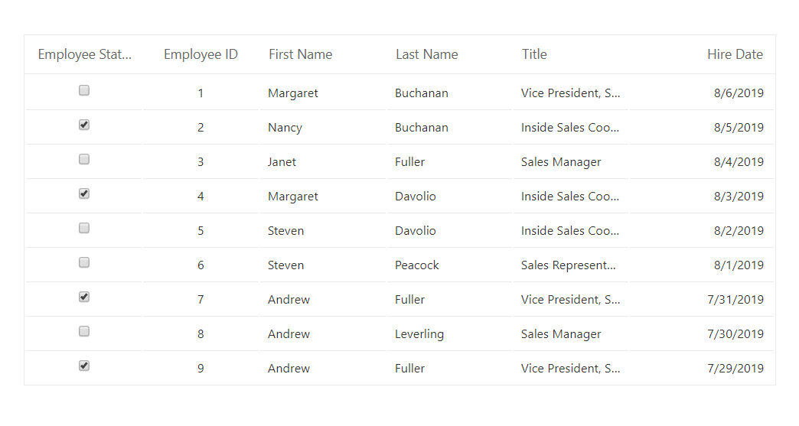

### Using image inside template

This can be achieved using the Column template property as it has options to display custom elements like, image content in the column. You can use the [Template](https://help.syncfusion.com/cr/blazor/Syncfusion.Blazor.Grids.GridColumn.html#Syncfusion_Blazor_Grids_GridColumn_Template) of the [GridColumn](https://help.syncfusion.com/cr/aspnetcore-blazor/Syncfusion.Blazor.Grids.GridColumn.html) component to specify the custom image content. Inside the [Template](https://help.syncfusion.com/cr/blazor/Syncfusion.Blazor.Grids.GridColumn.html#Syncfusion_Blazor_Grids_GridColumn_Template) , you can access the data using the implicit named parameter **context**.

```cshtml
@using Syncfusion.Blazor.Grids

<SfGrid  DataSource="@Employees">
    <GridColumns>
        <GridColumn HeaderText="Employee Image" TextAlign="TextAlign.Center" Width="120">
            <Template>
                @{
                    var employee = (context as EmployeeData);
                    <div class="image">
                        
                    </div>
                }
            </Template>
        </GridColumn>
        <GridColumn Field=@nameof(EmployeeData.EmployeeID) TextAlign="TextAlign.Right" HeaderText="Employee ID" Width="120"></GridColumn>
        <GridColumn Field=@nameof(EmployeeData.FirstName) HeaderText="First Name" Width="130"></GridColumn>
        <GridColumn Field=@nameof(EmployeeData.Title) HeaderText="Title" Format="C2" Width="120"></GridColumn>
        <GridColumn Field=@nameof(EmployeeData.HireDate) HeaderText="Hire Date" Format="d" TextAlign="TextAlign.Right" Width="150"></GridColumn>
    </GridColumns>
</SfGrid>

<style>
    .image img {
        height: 55px;
        width: 55px;
        border-radius: 50px;
        box-shadow: inset 0 0 1px #e0e0e0, inset 0 0 14px rgba(0, 0, 0, 0.2);
    }
</style>

@code{
    public List<EmployeeData> Employees { get; set; }

    protected override void OnInitialized()
    {
        Employees = Enumerable.Range(1, 5).Select(x => new EmployeeData()
        {
            EmployeeID = x,
            FirstName = (new string[] { "Nancy", "Andrew", "Janet", "Margaret", "Steven" })[new Random().Next(5)],
            Title = (new string[] { "Sales Representative", "Vice President, Sales", "Sales Manager",
                                    "Inside Sales Coordinator" })[new Random().Next(4)],
            HireDate = DateTime.Now.AddDays(-x),
        }).ToList();
    }

    public class EmployeeData
    {
        public int? EmployeeID { get; set; }
        public string FirstName { get; set; }
        public string Title { get; set; }
        public DateTime? HireDate { get; set; }
    }
}
```

The following screenshot represents the Image Template.
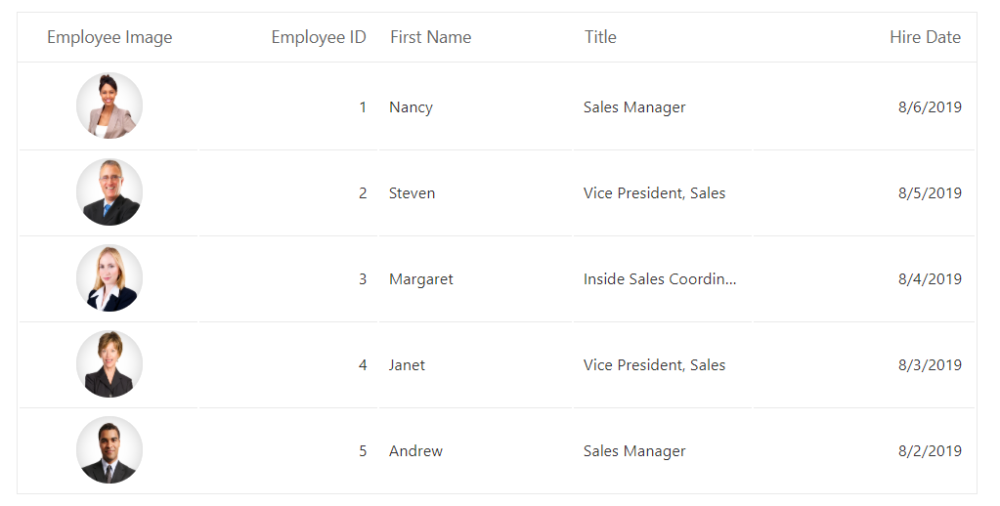

### Using hyperlink column and performing routing on click

The Column template property can be used to provide routing links inside the [Template](https://help.syncfusion.com/cr/blazor/Syncfusion.Blazor.Grids.GridColumn.html#Syncfusion_Blazor_Grids_GridColumn_Template) property of the [GridColumn](https://help.syncfusion.com/cr/aspnetcore-blazor/Syncfusion.Blazor.Grids.GridColumn.html). For routing, [UriHelper](https://docs.microsoft.com/en-us/aspnet/core/blazor/routing?view=aspnetcore-3.0#uri-and-navigation-state-helpers) can be utilized.

This can be achieved by initially defining an anchor tag inside the column template and binding click event to it. In this event, the DataGrid data **context** is passed on to its function.

```cshtml
@inject NavigationManager UriHelper
@using Syncfusion.Blazor.Grids

<SfGrid  DataSource="@Employees">
    <GridColumns>
        <GridColumn Field=@nameof(EmployeeData.EmployeeID) TextAlign="TextAlign.Center" HeaderText="Employee ID" Width="120"></GridColumn>
        <GridColumn Field=@nameof(EmployeeData.Name) HeaderText="First Name" Width="130"></GridColumn>
        <GridColumn Field=@nameof(EmployeeData.Title) HeaderText="Title" Width="120"></GridColumn>
        <GridColumn HeaderText="User profile" TextAlign="TextAlign.Center" Width="120">
            <Template>
                @{
                    var Employee = (context as EmployeeData);
                    <div><a href="#" @onclick="@(() => Navigate(Employee))">View</a></div>
                }
            </Template>
        </GridColumn>
    </GridColumns>
</SfGrid>

<style>
    .image img {
        height: 55px;
        width: 55px;
        border-radius: 50px;
        box-shadow: inset 0 0 1px #e0e0e0, inset 0 0 14px rgba(0, 0, 0, 0.2);
    }
</style>

@code{

    List<EmployeeData> Employees = new List<EmployeeData>
    {
        new EmployeeData() { EmployeeID = 1, Name = "Nancy Fuller", Link = "nancy_fuller", Title = "Vice President" },
        new EmployeeData() { EmployeeID = 2, Name = "Steven Buchanan", Link = "steven_buchanan", Title = "Sales Manager" },
        new EmployeeData() { EmployeeID = 3, Name = "Janet Leverling", Link = "janet_leverling", Title = "Sales Representative" },
        new EmployeeData() { EmployeeID = 4, Name = "Andrew Davolio", Link = "andrew_davolio", Title = "Inside Sales Coordinator" }
    };

    public class EmployeeData
    {
        public int EmployeeID { get; set; }
        public string Name { get; set; }
        public string Title { get; set; }
        public string Link { get; set; }
    }
    private void Navigate(EmployeeData Employee)
    {
        UriHelper.NavigateTo($"{ Employee.Link}/{Employee.EmployeeID.ToString()}/{Employee.Name}/{ Employee.Title}");
    }
}
```

In the above code, the url to be navigated is specified in the Link variable of the DataGrid data. Based on this, the page is routed to the corresponding url.

After that, add new razor page for routing with routing url along with the parameters to be received, and initialize it with the required details.

```cshtml
@page "/nancy_fuller/{EmpID}/{Name}/{Title}"

<h2>Hello @Name!</h2>
<br>
<h4><u>Employee Details</u></h4>
<br>
<div><b>Employee ID:</b><div class="details">@EmpID</div></div>
<div><b>Position:</b><div class="details">@Title</div></div>

@code {
    [Parameter]
    private string EmpID { get; set; }
    [Parameter]
    private string Name { get; set; }
    [Parameter]
    private string Title { get; set; }
}
```

The following GIF represents template routing in DataGrid


## Column type

Column type can be specified using the [Type](https://help.syncfusion.com/cr/blazor/Syncfusion.Blazor.Grids.GridColumn.html#Syncfusion_Blazor_Grids_GridColumn_Type) property. It specifies the type of data the column binds.

If the format is defined for a column, the column uses type to select the appropriate format option (number or date).

DataGrid column supports the following types:

* String
* Number
* Boolean
* Date
* DateTime
* CheckBox

> If the [Type](https://help.syncfusion.com/cr/blazor/Syncfusion.Blazor.Grids.GridColumn.html#Syncfusion_Blazor_Grids_GridColumn_Type) is not defined, it will be determined from the first record of the [DataSource](https://help.syncfusion.com/cr/blazor/Syncfusion.Blazor.Grids.GridColumn.html). In case, if the first record of the [DataSource](https://help.syncfusion.com/cr/blazor/Syncfusion.Blazor.Grids.GridColumn.html) is null/blank value for a column then it is necessary to define the [Type](https://help.syncfusion.com/cr/blazor/Syncfusion.Blazor.Grids.GridColumn.html#Syncfusion_Blazor_Grids_GridColumn_Type) for that column.
### Difference between Boolean type and CheckBox type column

* Use GridColumn [Type](https://help.syncfusion.com/cr/blazor/Syncfusion.Blazor.Grids.GridColumn.html#Syncfusion_Blazor_Grids_GridColumn_Type) as Boolean if you want to bind boolean values from your datasource and/or edit Boolean property value from your Type.
* Use CheckBox as GridColumn [Type](https://help.syncfusion.com/cr/blazor/Syncfusion.Blazor.Grids.GridColumn.html#Syncfusion_Blazor_Grids_GridColumn_Type) for the purpose of selection/deselection of the whole row.

>See also section [Render boolean values as checkbox](https://blazor.syncfusion.com/documentation/datagrid/columns/#render-boolean-values-as-checkbox) to render boolean values as checkbox in GridColumn.

## Column chooser

The column chooser has options to show or hide columns dynamically. It can be enabled by defining the [ShowColumnChooser](https://help.syncfusion.com/cr/blazor/Syncfusion.Blazor.Charts.ChartSeries.html#Syncfusion_Blazor_Charts_ChartSeries_Fill) as true.

```cshtml
@using Syncfusion.Blazor.Grids

<SfGrid DataSource="@Employees" ShowColumnChooser="true" Toolbar=@ToolbarItems>
    <GridColumns>
        <GridColumn Field=@nameof(EmployeeData.EmployeeID) TextAlign="TextAlign.Center" HeaderText="Employee ID" Width="120"></GridColumn>
        <GridColumn Field=@nameof(EmployeeData.FirstName) HeaderText="First Name" ShowInColumnChooser="false" Width="130"></GridColumn>
        <GridColumn Field=@nameof(EmployeeData.LastName) HeaderText="Last Name" Width="130"></GridColumn>
        <GridColumn Field=@nameof(EmployeeData.Title) HeaderText="Title" Width="120"></GridColumn>
        <GridColumn Field=@nameof(EmployeeData.HireDate) HeaderText="Hire Date" Format="d" TextAlign="TextAlign.Right" Width="150"></GridColumn>
    </GridColumns>
</SfGrid>

@code{
    public string[] ToolbarItems = new string[] { "ColumnChooser" };

    public List<EmployeeData> Employees { get; set; }

    protected override void OnInitialized()
    {
        Employees = Enumerable.Range(1, 9).Select(x => new EmployeeData()
        {
            EmployeeID = x,
            FirstName = (new string[] { "Nancy", "Andrew", "Janet", "Margaret", "Steven" })[new Random().Next(5)],
            LastName = (new string[] { "Davolio", "Fuller", "Leverling", "Peacock", "Buchanan" })[new Random().Next(5)],
            Title = (new string[] { "Sales Representative", "Vice President, Sales", "Sales Manager",
                                    "Inside Sales Coordinator" })[new Random().Next(4)],
            HireDate = DateTime.Now.AddDays(-x),
        }).ToList();
    }

    public class EmployeeData
    {
        public int? EmployeeID { get; set; }
        public string FirstName { get; set; }
        public string LastName { get; set; }
        public string Title { get; set; }
        public DateTime? HireDate { get; set; }
    }
}
```

> You can hide the column names in column chooser by defining the [ShowInColumnChooser](https://help.syncfusion.com/cr/blazor/Syncfusion.Blazor.Grids.GridColumn.html#Syncfusion_Blazor_Grids_GridColumn_ShowInColumnChooser) property as false.

The following GIF represents the column chooser functionality in DataGrid
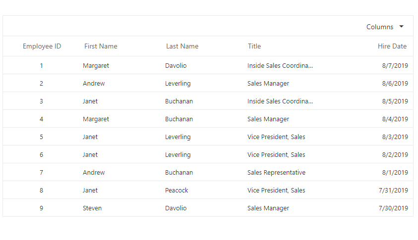

### Open column chooser by external button

The column chooser has options to show or hide columns dynamically. It can be enabled by defining the [ShowColumnChooser](https://help.syncfusion.com/cr/blazor/Syncfusion.Blazor.Charts.ChartSeries.html#Syncfusion_Blazor_Charts_ChartSeries_Fill) as true.

In this following example, we have opened column chooser using external button click.

```cshtml
@using Syncfusion.Blazor.Buttons
@using Syncfusion.Blazor.Grids

<SfButton OnClick="Show" CssClass="e-primary" IsPrimary="true" Content="Open column chooser"></SfButton>

<SfGrid @ref="DefaultGrid" DataSource="@Employees" ShowColumnChooser="true" Toolbar=@ToolbarItems>
    <GridColumns>
        <GridColumn Field=@nameof(EmployeeData.EmployeeID) TextAlign="TextAlign.Center" HeaderText="Employee ID" Width="120"></GridColumn>
        <GridColumn Field=@nameof(EmployeeData.FirstName) HeaderText="First Name" ShowInColumnChooser="false" Width="130"></GridColumn>
        <GridColumn Field=@nameof(EmployeeData.LastName) HeaderText="Last Name" Width="130"></GridColumn>
        <GridColumn Field=@nameof(EmployeeData.Title) HeaderText="Title" Width="120"></GridColumn>
        <GridColumn Field=@nameof(EmployeeData.HireDate) HeaderText="Hire Date" Format="d" TextAlign="TextAlign.Right" Width="150"></GridColumn>
    </GridColumns>
</SfGrid>

@code{
    private SfGrid<EmployeeData> DefaultGrid;

    public string[] ToolbarItems = new string[] { "ColumnChooser" };

    public List<EmployeeData> Employees { get; set; }

    protected override void OnInitialized()
    {
        Employees = Enumerable.Range(1, 9).Select(x => new EmployeeData()
        {
            EmployeeID = x,
            FirstName = (new string[] { "Nancy", "Andrew", "Janet", "Margaret", "Steven" })[new Random().Next(5)],
            LastName = (new string[] { "Davolio", "Fuller", "Leverling", "Peacock", "Buchanan" })[new Random().Next(5)],
            Title = (new string[] { "Sales Representative", "Vice President, Sales", "Sales Manager",
                                    "Inside Sales Coordinator" })[new Random().Next(4)],
            HireDate = DateTime.Now.AddDays(-x),
        }).ToList();
    }

    public void Show()
    {
        this.DefaultGrid.OpenColumnChooser(200, 50);
    }

    public class EmployeeData
    {
        public int? EmployeeID { get; set; }
        public string FirstName { get; set; }
        public string LastName { get; set; }
        public string Title { get; set; }
        public DateTime? HireDate { get; set; }
    }
}
```

The following GIF represents opening column chooser functionality in DataGrid using external button.
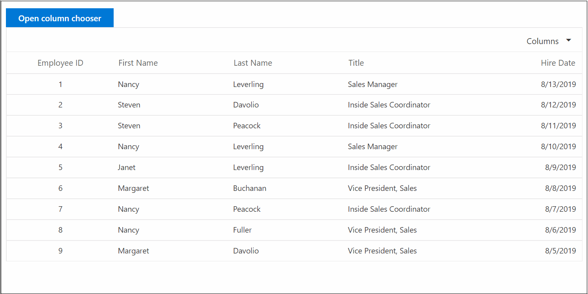

### Column Chooser Template

Using the column chooser template, you can customize the column chooser dialog using <code>Template</code> and <code>FooterTemplate</code> of the [GridColumnChooserSettings](https://help.syncfusion.com/cr/blazor/Syncfusion.Blazor.Grids.GridColumnChooserSettings.html) component. You can access the parameters passed to the templates using implicit parameter named context.

#### Customize the Content of Column Chooser

 The <code>Template</code> tag in the  [GridColumnChooserSettings](https://help.syncfusion.com/cr/blazor/Syncfusion.Blazor.Grids.GridColumnChooserSettings.html) component is used to customize the content in the column chooser dialog. You can type cast the context as <code>ColumnChooserTemplateContext</code> to get columns inside content template.

 ```csharp
@using Syncfusion.Blazor.Grids;

<SfGrid ID="Grid" @ref="Grid" AllowPaging="true" DataSource="@Orders" ShowColumnChooser="true" Toolbar="@ToolbarItems">
    <GridColumnChooserSettings>
        <Template>
                @{
                    var ContextData = context as ColumnChooserTemplateContext;
                    <CustomComponent @key="ContextData.Columns.Count" ColumnContext="ContextData"></CustomComponent>
                }
        </Template>
    </GridColumnChooserSettings>
    <GridColumns>
        <GridColumn Field=@nameof(Order.OrderID) HeaderText="Order ID" TextAlign="TextAlign.Right" Width="120"> </GridColumn>
        <GridColumn Field=@nameof(Order.CustomerID) HeaderText="Customer ID" Width="150"> </GridColumn>
        <GridColumn Field=@nameof(Order.OrderDate) HeaderText="Order Date" Visible="false" Format="d" Type="ColumnType.Date" TextAlign="TextAlign.Right" Width="130"></GridColumn>
        <GridColumn Field=@nameof(Order.Freight) Visible="false" HeaderText="Freight" Format="C2" TextAlign="TextAlign.Right" Width="120"></GridColumn>
        <GridColumn Field=@nameof(Order.EmployeeID) Visible="false" HeaderText="Employee ID" TextAlign="TextAlign.Right" Width="120"> </GridColumn>
        <GridColumn Field=@nameof(Order.FirstName) Visible="false" HeaderText="First Name" Width="150"> </GridColumn>
        <GridColumn Field=@nameof(Order.LastName) HeaderText="Last Name" Visible="false" Format="d" Type="ColumnType.Date" Width="130"> </GridColumn>
        <GridColumn Field=@nameof(Order.Title) HeaderText="Title" Visible="false"  Width="120"> </GridColumn>
        <GridColumn Field=@nameof(Order.HireDate) HeaderText="Hire Date" TextAlign="TextAlign.Right" Width="120"></GridColumn>
    </GridColumns>
</SfGrid>

<style>
    #Grid.e-grid .e-ccdlg .e-cc-searchdiv, #Grid_ccdlg div.e-footer-content {
        display: none;
    }

    #Grid.e-grid .e-ccdlg .e-dlg-content {
        margin-top: 0px;
    }

    .e-list-item.e-level-1.e-checklist.e-focused {
        background-color: none;
    }

    #Grid_ccdlg .e-content {
        overflow-y: unset;
    }
</style>

@code
{
    public SfGrid<Order> Grid { get; set; }
    public string[] ToolbarItems = new string[] { "ColumnChooser" };
    public List<Order> Orders { get; set; }

    protected override void OnInitialized()
    {
        Orders = Enumerable.Range(1, 500).Select(x => new Order()
        {
            OrderID = 1000 + x,
            CustomerID = (new string[] { "ALFKI", "ANANTR", "ANTON", "BLONP", "BOLID" })[new Random().Next(5)],
            Freight = 2.1 * x,
            OrderDate = DateTime.Now.AddDays(-x),
            EmployeeID = x,
            FirstName = (new string[] { "Nancy", "Andrew", "Janet", "Margaret", "Steven" })[new Random().Next(5)],
            LastName = (new string[] { "Davolio", "Fuller", "Leverling", "Peacock", "Buchanan" })[new Random().Next(5)],
            Title = (new string[] { "Sales Representative", "Vice President, Sales", "Sales Manager", "Inside Sales Coordinator" })[new Random().Next(4)],
            HireDate = DateTime.Now.AddDays(-x),
        }).ToList();
    }
}

```

> * You can build reusable custom component based on your customization need as like above code example.
> * In the above example, Syncfusion [ListView](https://blazor.syncfusion.com/documentation/listview/getting-started) component is used as custom component in the content template to show/hide column's.

```csharp
@using Syncfusion.Blazor.Lists;
@using Syncfusion.Blazor.Inputs;

<div class="setMargin">
    <SfTextBox Placeholder="Search" ShowClearButton="true" Input="@OnInput"></SfTextBox>
</div>

<SfListView @ref="ListView" Height="100%" ShowCheckBox="true" DataSource="@CloneData">
    <ListViewFieldSettings TValue="DataModel" Id="Id" Text="Text" ></ListViewFieldSettings>
    <ListViewEvents Clicked="OnClicked" Created="@(()=>OnCreated(ColumnContext.Columns))" TValue="DataModel"></ListViewEvents>
</SfListView>

<style>
    .setMargin{
        margin-bottom: 10px;
    }
</style>

@code
{
    public List<DataModel> CloneData { get; set; } = new List<DataModel>();

    [CascadingParameter]
    public SfGrid<Order> Grid { get; set; }

    [Parameter]
    public ColumnChooserTemplateContext ColumnContext { get; set; }

    public SfListView<DataModel> ListView { get; set; }

    async Task OnInput(InputEventArgs eventArgs)
    {
        CloneData = DataSource.FindAll(e => e.Text.ToLower().StartsWith(eventArgs.Value.ToLower()));
        await Task.Delay(100);
        await Preselect();
    }

    protected override async Task OnInitializedAsync()
    {
        CloneData = DataSource;
        await Task.Delay(100);
        await Preselect();
    }

    List<DataModel> DataSource = new List<DataModel>
    {
        new DataModel() { Text = "Order ID", Id = "OrderID" },
        new DataModel() { Text = "Customer ID", Id ="CustomerID"},
        new DataModel() { Text = "Employee ID", Id = "EmployeeID" },
        new DataModel() { Text = "First Name", Id = "FirstName"},
        new DataModel() { Text = "Order Date", Id = "OrderDate" },
        new DataModel() { Text = "Last Name", Id = "LastName" },
        new DataModel() { Text = "Hire Date", Id = "HireDate"},
        new DataModel() { Text = "Title", Id = "Title"},
        new DataModel() { Text = "Freight", Id = "Freight"},
    };

    public async Task Preselect()
    {
        var cols = ColumnContext.Columns.FindAll(x => x.Visible == true).ToList();
        var selectlist = new List<DataModel>();
        foreach (var column in cols)
        {
            selectlist.Add(DataSource.Where(x => x.Text == column.HeaderText).FirstOrDefault());
        }
        if (selectlist.Count > 0)
        {
            if (ListView != null)
            {
                await ListView?.CheckItemsAsync(selectlist.AsEnumerable());
            }
        }
    }

    public async Task OnCreated(List<GridColumn> args)
    {
        await Preselect();
    }

    public async Task OnClicked(ClickEventArgs<DataModel> args)
    {
        if (args.IsChecked)
        {
            await Grid.HideColumnAsync(args.Text);
        }
        else
        {
            await Grid.ShowColumnAsync(args.Text);
        }
    }
}
```


#### Customize the Footer of Column Chooser

 The <code>FooterTemplate</code> tag in the  [GridColumnChooserSettings](https://help.syncfusion.com/cr/blazor/Syncfusion.Blazor.Grids.GridColumnChooserSettings.html) component is used to customize the footer in the column chooser dialog. You can type cast the context as <code>ColumnChooserFooterTemplateContext</code> to get columns inside FooterTemplate.

```csharp
@using Syncfusion.Blazor.Grids
@using Syncfusion.Blazor.Buttons

<SfGrid @ref="grid" TValue="OrdersDetails" DataSource="@GridData" ShowColumnChooser="true" Toolbar="@( new List<string>() { "ColumnChooser"})" AllowPaging="true">
    <GridColumnChooserSettings>
        <FooterTemplate>
            @{
                var ContextData = context as ColumnChooserFooterTemplateContext;
                var visibles = ContextData.Columns.Where(x => x.Visible).Select(x => x.HeaderText).ToArray();
                var hiddens = ContextData.Columns.Where(x => !x.Visible).Select(x => x.HeaderText).ToArray();
            }
            <SfButton IsPrimary="true" OnClick="@(async () => {
            await grid.ShowColumnsAsync(visibles);
            await grid.HideColumnsAsync(hiddens); })">Submit</SfButton>
            <SfButton @onclick="@(async () => await ContextData.CancelAsync())">Abort</SfButton>
        </FooterTemplate>
    </GridColumnChooserSettings>
    <GridColumns>
        <GridColumn Field=@nameof(OrdersDetails.OrderID) HeaderText="Order ID" TextAlign="TextAlign.Right" IsPrimaryKey="true" Width="120"></GridColumn>
        <GridColumn Field=@nameof(OrdersDetails.CustomerID) HeaderText="Customer Name" Width="150"></GridColumn>
        <GridColumn Field=@nameof(OrdersDetails.OrderDate) HeaderText="Order Date" Format="d" Type="ColumnType.Date" TextAlign="TextAlign.Right" Width="130"></GridColumn>
        <GridColumn Field=@nameof(OrdersDetails.Freight) HeaderText="Freight" Format="C2" TextAlign="TextAlign.Right" Width="120"></GridColumn>
        <GridColumn Field=@nameof(OrdersDetails.ShippedDate) HeaderText="Shipped Date" Format="d" Type="ColumnType.Date" TextAlign="TextAlign.Right" Width="150"></GridColumn>
        <GridColumn Field=@nameof(OrdersDetails.ShipCountry) HeaderText="Ship Country" Visible="false" Width="150"></GridColumn>
        <GridColumn Field=@nameof(OrdersDetails.ShipCity) HeaderText="Ship City" Visible="false" Width="150"></GridColumn>
    </GridColumns>
</SfGrid>

@code{
    public List<OrdersDetails> GridData { get; set; }
    SfGrid<OrdersDetails> grid { get; set; }

    protected override void OnInitialized()
    {
        GridData = Enumerable.Range(1, 75).Select(x => new OrdersDetails()
        {
            OrderID = 1000 + x,
            CustomerID = (new string[] { "ALFKI", "ANANTR", "ANTON", "BLONP", "BOLID" })[new Random().Next(5)],
            Freight = 2.1 * x,
            OrderDate = DateTime.Now.AddDays(-x),
            ShippedDate = DateTime.Now.AddDays(+x),
            ShipCountry = (new string[] { "Denmark", "Brazil", "Germany", "Austria" })[new Random().Next(4)],
            ShipCity = (new string[] { "Berlin", "Madrid", "Marseille" })[new Random().Next(3)]
        }).ToList();
    }

    public class OrdersDetails
    {
        public int? OrderID { get; set; }
        public string CustomerID { get; set; }
        public DateTime? OrderDate { get; set; }
        public double? Freight { get; set; }
        public DateTime? ShippedDate { get; set; }
        public string ShipCountry { get; set; }
        public string ShipCity { get; set; }
    }
}
```

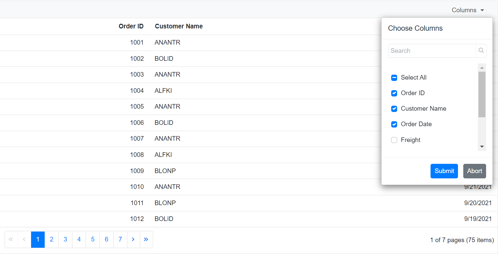

## Format

To format cell values based on specific culture, use the [Format](https://help.syncfusion.com/cr/blazor/Syncfusion.Blazor.Grids.GridColumn.html#Syncfusion_Blazor_Grids_GridColumn_Format) property of **GridColumn** component . The DataGrid uses **Internalization** library to format **number** and **date**.
values.

```cshtml
@using Syncfusion.Blazor.Grids

<SfGrid DataSource="@Orders" Height="315">
    <GridColumns>
        <GridColumn Field=@nameof(Order.OrderID) HeaderText="Order ID" TextAlign="TextAlign.Right" Width="120"></GridColumn>
        <GridColumn Field=@nameof(Order.CustomerID) HeaderText="Customer Name" Width="150"></GridColumn>
        <GridColumn Field=@nameof(Order.OrderDate) HeaderText="Order Date" Format="d" Type="ColumnType.Date" TextAlign="TextAlign.Right" Width="130"></GridColumn>
        <GridColumn Field=@nameof(Order.Freight) HeaderText="Freight" Format="C2" TextAlign="TextAlign.Right" Width="120"></GridColumn>
    </GridColumns>
</SfGrid>

@code{
    public List<Order> Orders { get; set; }

    protected override void OnInitialized()
    {
        Orders = Enumerable.Range(1, 75).Select(x => new Order()
        {
            OrderID = 1000 + x,
            CustomerID = (new string[] { "ALFKI", "ANANTR", "ANTON", "BLONP", "BOLID" })[new Random().Next(5)],
            Freight = 2.1 * x,
            OrderDate = DateTime.Now.AddDays(-x),
        }).ToList();
    }

    public class Order {
        public int? OrderID { get; set; }
        public string CustomerID { get; set; }
        public DateTime? OrderDate { get; set; }
        public double? Freight { get; set; }
    }
}

```

> By default, the **number** and **date** values are formatted in **en-US** locale.

### Number formatting

The number or integer values can be formatted using the following format strings.

Format |Description |Remarks
-----|-----|-----
N | Denotes numeric type. | The numeric format is followed by integer value as N2, N3. etc which denotes the number of precision to be allowed.
C | Denotes currency type. | The currency format is followed by integer value as C2, C3. etc which denotes the number of precision to be allowed.
P | Denotes percentage type | The percentage format expects the input value to be in the range of 0 to 1. For example the cell value **0.2** is formatted as **20%**. The percentage format is followed by integer value as P2, P3. etc which denotes the number of precision to be allowed.

### Date formatting

You can format date values either using built-in date format string.

For built-in date format, you can specify the [Format](https://help.syncfusion.com/cr/blazor/Syncfusion.Blazor.Grids.GridColumn.html#Syncfusion_Blazor_Grids_GridColumn_Format) property of **GridColumn** as string.

## Visibility

You can hide any particular column in DataGrid before rendering by defining the [Visible](https://help.syncfusion.com/cr/blazor/Syncfusion.Blazor.Grids.GridColumn.html#Syncfusion_Blazor_Grids_GridColumn_Visible) property of **GridColumn** as false. In the following sample, **Freight** column is defined as visible false.

```cshtml
@using Syncfusion.Blazor.Grids

<SfGrid DataSource="@Orders" Height="315">
    <GridColumns>
        <GridColumn Field=@nameof(Order.OrderID) HeaderText="Order ID" TextAlign="TextAlign.Right" Width="120"></GridColumn>
        <GridColumn Field=@nameof(Order.CustomerID) HeaderText="Customer Name" Width="150"></GridColumn>
        <GridColumn Field=@nameof(Order.OrderDate) HeaderText="Order Date" Format="d" Type="ColumnType.Date" TextAlign="TextAlign.Right" Width="130"></GridColumn>
        <GridColumn Field=@nameof(Order.Freight) HeaderText="Freight" Format="C2" TextAlign="TextAlign.Right" Visible="false" Width="120"></GridColumn>
    </GridColumns>
</SfGrid>

@code{
    public List<Order> Orders { get; set; }

    protected override void OnInitialized()
    {
        Orders = Enumerable.Range(1, 75).Select(x => new Order()
        {
            OrderID = 1000 + x,
            CustomerID = (new string[] { "ALFKI", "ANANTR", "ANTON", "BLONP", "BOLID" })[new Random().Next(5)],
            Freight = 2.1 * x,
            OrderDate = DateTime.Now.AddDays(-x),
        }).ToList();
    }

    public class Order {
        public int? OrderID { get; set; }
        public string CustomerID { get; set; }
        public DateTime? OrderDate { get; set; }
        public double? Freight { get; set; }
    }
}
```

The following screenshot represents the DataGrid with Freight column set to visible false.
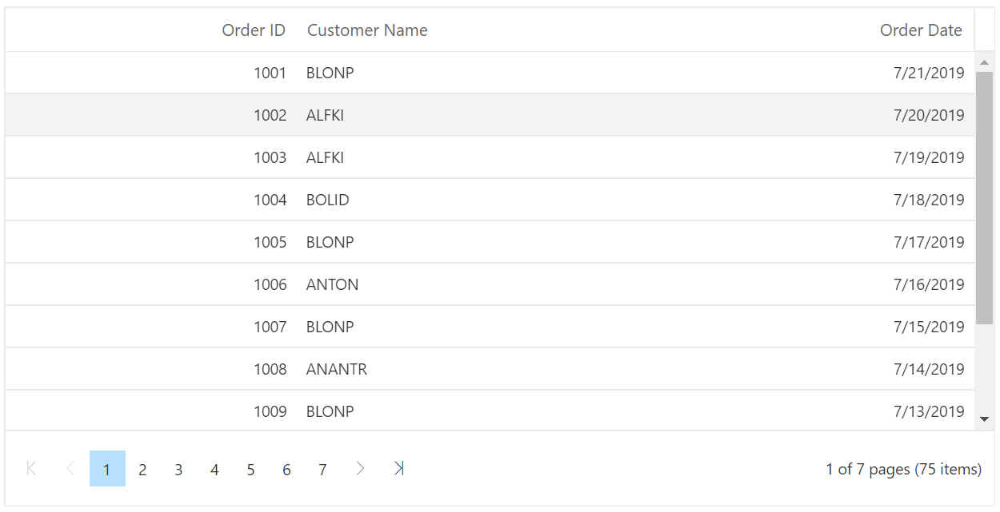

## Width

The column width can be set using the **Width** property of the **GridColumn**. The unit of the width value can be either in pixel (px) or percentage (%). By default, the grid tables use `table-layout:fixed` to speed up the table rendering.

* Columns will respect the width value irrespective of its cell content width.
* Columns with no width set will share the available space equally.
* When all columns are provided with a width value and the cumulative width of all columns is greater than the grid element width, a horizontal scrollbar will be shown.
* When only some columns are provided with the width value and if the cumulative width of the columns is greater than the grid element width then columns with no width might be invisible as their width is zero.
* When only some columns are provided with the width value and if the cumulative width of the columns is lesser than the grid element width then columns with no width will share the available space evenly.
* When no width is provided in a column and MinWidth property is defined, if the cumulative width of the column is greater than the grid element width then MinWidth would be used as the column width to avoid it from becoming invisible.

## Autofit

You can auto fit a column interactively by double clicking the right border of the header cells.

### Autofit columns at initial rendering

**AutoFit** resizes the column to fit the widest cell’s content without wrapping. To enable AutoFit for specific columns, you need to set the AutoFit property to true.

```cshtml
@using Syncfusion.Blazor.Grids

<SfGrid DataSource="@Orders" Height="315">
    <GridColumns>
        <GridColumn Field=@nameof(Order.OrderID) HeaderText="Order ID" TextAlign="TextAlign.Right" Width="120"></GridColumn>
        <GridColumn Field=@nameof(Order.CustomerID) HeaderText="Customer Name" Width="150" AutoFit="true"></GridColumn>
        <GridColumn Field=@nameof(Order.OrderDate) HeaderText="Order Date" Format="d" AutoFit="true" Type="ColumnType.Date" TextAlign="TextAlign.Right" Width="130"></GridColumn>
        <GridColumn Field=@nameof(Order.Freight) HeaderText="Freight" Format="C2" TextAlign="TextAlign.Right" Width="120"></GridColumn>
    </GridColumns>
</SfGrid>

@code{
    public List<Order> Orders { get; set; }

    protected override void OnInitialized()
    {
        Orders = Enumerable.Range(1, 75).Select(x => new Order()
        {
            OrderID = 1000 + x,
            CustomerID = (new string[] { "ALFKI", "ANANTR", "ANTON", "BLONP", "BOLID" })[new Random().Next(5)],
            Freight = 2.1 * x,
            OrderDate = DateTime.Now.AddDays(-x),
        }).ToList();
    }

    public class Order
    {
        public int? OrderID { get; set; }
        public string CustomerID { get; set; }
        public DateTime? OrderDate { get; set; }
        public double? Freight { get; set; }
    }
}
```

In the  following Image, **Autofit** Property is set to true for CustomerName and OrderDate.
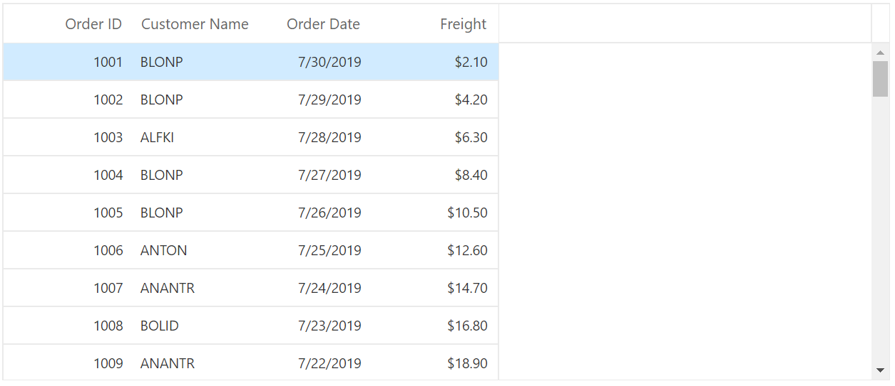

### Autofit columns by method

The **AutoFitColumns** method resizes the column to fit the widest cell's content without wrapping. You can autofit a specific column at initial rendering by invoking the **AutoFitColumns** method in the [DataBound](https://help.syncfusion.com/cr/blazor/Syncfusion.Blazor.Grids.SfGrid-1.html) event.

```cshtml
@using Syncfusion.Blazor.Grids

<SfGrid @ref="Grid" DataSource="@Orders" Height="315" Width="540">
    <GridEvents DataBound="DataboundHandler" TValue="Order"></GridEvents>
    <GridColumns>
        <GridColumn Field=@nameof(Order.OrderID) HeaderText="Order ID" TextAlign="TextAlign.Right" Width="120"></GridColumn>
        <GridColumn Field=@nameof(Order.CustomerID) HeaderText="Customer Name" Width="150"></GridColumn>
        <GridColumn Field=@nameof(Order.OrderDate) HeaderText="Order Date" Format="d" Type="ColumnType.Date" TextAlign="TextAlign.Right" Width="130"></GridColumn>
        <GridColumn Field=@nameof(Order.Freight) HeaderText="Freight" Format="C2" TextAlign="TextAlign.Right" Width="120"></GridColumn>
    </GridColumns>
</SfGrid>

@code{
    private SfGrid<Order> Grid;

    public List<Order> Orders { get; set; }

    protected override void OnInitialized()
    {
        Orders = Enumerable.Range(1, 75).Select(x => new Order()
        {
            OrderID = 1000 + x,
            CustomerID = (new string[] { "ALFKI", "ANANTR", "ANTON", "BLONP", "BOLID" })[new Random().Next(5)],
            Freight = 2.1 * x,
            OrderDate = DateTime.Now.AddDays(-x),
        }).ToList();
    }

    public class Order
    {
        public int? OrderID { get; set; }
        public string CustomerID { get; set; }
        public DateTime? OrderDate { get; set; }
        public double? Freight { get; set; }
    }

    public void DataboundHandler(object args)
    {
        this.Grid.AutoFitColumns(new string[] { "OrderDate", "Freight" });
    }
}
```

The following image represents AutoFit column by method
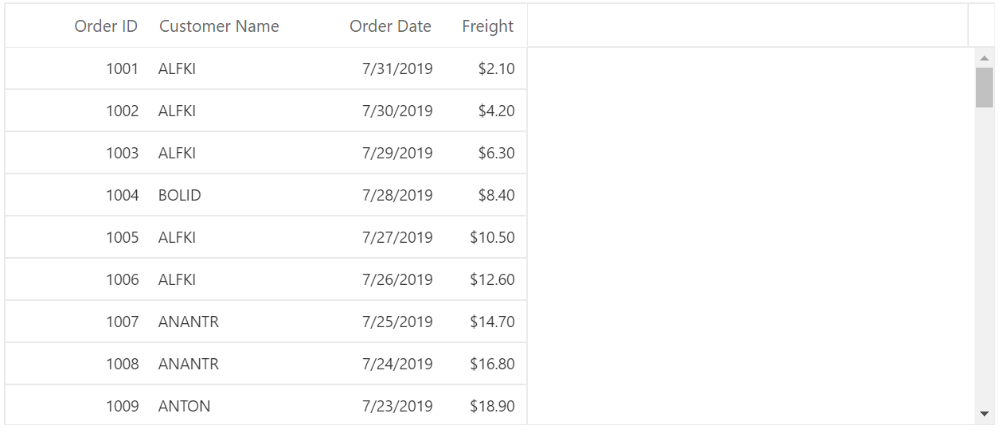

> You can autofit all the columns by invoking the **AutoFitColumns** method without column names.

## Reorder

Reordering can be done by drag and drop of a particular column header from one index to another index within the DataGrid. To enable reordering, set the [AllowReordering](https://help.syncfusion.com/cr/blazor/Syncfusion.Blazor.Grids.SfGrid-1.html#Syncfusion_Blazor_Grids_SfGrid_1_AllowReordering) property to true.

```cshtml
@using Syncfusion.Blazor.Grids

<SfGrid DataSource="@Orders" Height="315" AllowReordering="true" AllowPaging="true">
    <GridColumns>
        <GridColumn Field=@nameof(Order.OrderID) HeaderText="Order ID" TextAlign="TextAlign.Right" Width="120"></GridColumn>
        <GridColumn Field=@nameof(Order.CustomerID) HeaderText="Customer Name" Width="150"></GridColumn>
        <GridColumn Field=@nameof(Order.OrderDate) HeaderText="Order Date" Format="d" Type="ColumnType.Date" TextAlign="TextAlign.Right" Width="130"></GridColumn>
        <GridColumn Field=@nameof(Order.Freight) HeaderText="Freight" Format="C2" TextAlign="TextAlign.Right" Width="120"></GridColumn>
    </GridColumns>
</SfGrid>

@code{
    public List<Order> Orders { get; set; }

    protected override void OnInitialized()
    {
        Orders = Enumerable.Range(1, 75).Select(x => new Order()
        {
            OrderID = 1000 + x,
            CustomerID = (new string[] { "ALFKI", "ANANTR", "ANTON", "BLONP", "BOLID" })[new Random().Next(5)],
            Freight = 2.1 * x,
            OrderDate = DateTime.Now.AddDays(-x),
        }).ToList();
    }

    public class Order {
        public int? OrderID { get; set; }
        public string CustomerID { get; set; }
        public DateTime? OrderDate { get; set; }
        public double? Freight { get; set; }
    }
}
```

The following represents Reordering of columns
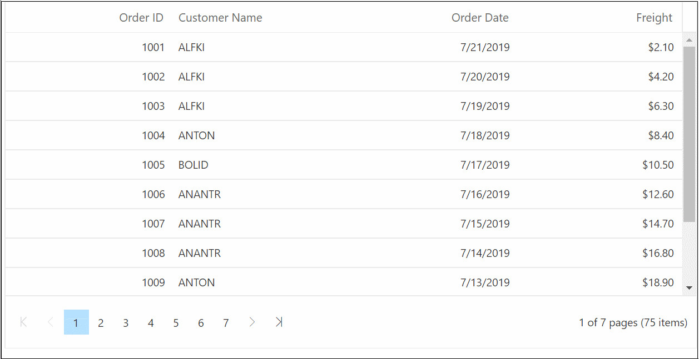

> You can disable reordering a particular column by setting the [AllowReordering](https://help.syncfusion.com/cr/blazor/Syncfusion.Blazor.Grids.GridColumn.html#Syncfusion_Blazor_Grids_GridColumn_AllowReordering) property of **GridColumn** as false.

### Reorder single column

DataGrid has option to reorder single column either by Interaction or by using the [ReorderColumns](https://help.syncfusion.com/cr/blazor/Syncfusion.Blazor.Grids.SfGrid-1.html#Syncfusion_Blazor_Grids_SfGrid_1_ReorderColumns_System_Collections_Generic_List_System_String__System_String_) method. In the following sample, **Freight** column is reordered to last column position by using the method.

```cshtml
@using Syncfusion.Blazor.Buttons
@using Syncfusion.Blazor.Grids

<SfButton OnClick="ReorderBtn" CssClass="e-primary" IsPrimary="true" Content="Reorder Freight"></SfButton>
<SfGrid @ref="DefaultGrid" DataSource="@Orders" AllowReordering="true" AllowPaging="true" Height="315">
    <GridColumns>
        <GridColumn Field=@nameof(Order.OrderID) HeaderText="Order ID" IsPrimaryKey="true" TextAlign="TextAlign.Center" Width="120"></GridColumn>
        <GridColumn Field=@nameof(Order.CustomerName) TextAlign="TextAlign.Center" HeaderText="Customer Name" Width="120"></GridColumn>
        <GridColumn Field=@nameof(Order.Freight) HeaderText="Freight" Format="C2" TextAlign="TextAlign.Center" MinWidth="10" Width="120" MaxWidth="200"></GridColumn>
        <GridColumn Field=@nameof(Order.OrderDate) HeaderText="Order Date" Format="d" TextAlign="TextAlign.Center" Width="130"></GridColumn>
    </GridColumns>
</SfGrid>

@code{
    private SfGrid<Order> DefaultGrid;

    public List<Order> Orders { get; set; }

    protected override void OnInitialized()
    {
        Orders = Enumerable.Range(1, 75).Select(x => new Order()
        {
            OrderID = 1000 + x,
            CustomerName = (new string[] { "ALFKI", "ANANTR", "ANTON", "BLONP", "BOLID" })[new Random().Next(5)],
            Freight = 2.1 * x,
            OrderDate = DateTime.Now.AddDays(-x),
        }).ToList();
    }

    public void ReorderBtn()
    {
        this.DefaultGrid.ReorderColumns("Freight", "OrderDate");
    }

    public class Order
    {
        public int? OrderID { get; set; }
        public string CustomerName { get; set; }
        public DateTime? OrderDate { get; set; }
        public double? Freight { get; set; }
    }
}
```

The following GIF represents Reordering column **Freight** by using method,
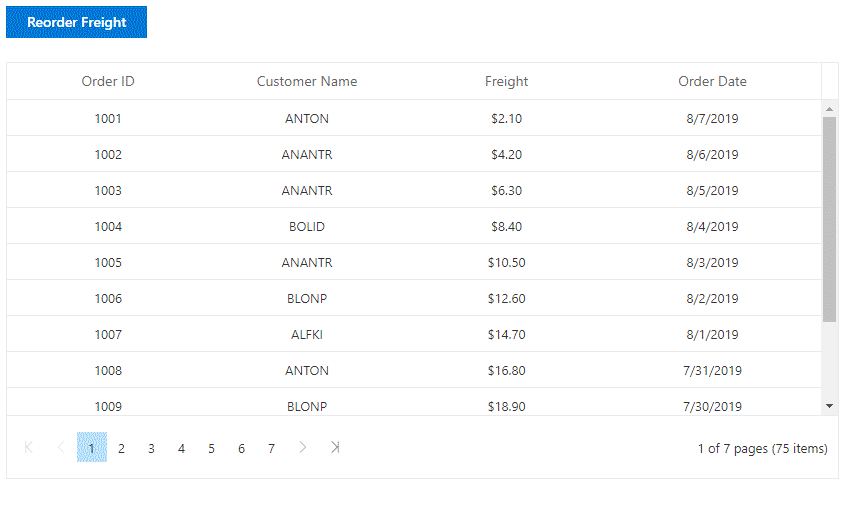

### Reorder multiple columns

User can reorder a single column at a time by Interaction. Sometimes, we need to reorder multiple columns at the same time. This can be achieved programmatically by using [ReorderColumns](https://help.syncfusion.com/cr/blazor/Syncfusion.Blazor.Grids.SfGrid-1.html#Syncfusion_Blazor_Grids_SfGrid_1_ReorderColumns_System_Collections_Generic_List_System_String__System_String_) method.

In the following sample, **Customer Name** and **Freight** columns are reordered to last column position by using this method on button click.

```cshtml
@using Syncfusion.Blazor.Buttons
@using Syncfusion.Blazor.Grids

<SfButton OnClick="ReorderBtn" CssClass="e-primary" IsPrimary="true" Content="Reorder Customer Name and Freight"></SfButton>
<SfGrid @ref="DefaultGrid" DataSource="@Orders" AllowReordering="true" AllowPaging="true" Height="315">
    <GridColumns>
        <GridColumn Field=@nameof(Order.OrderID) HeaderText="Order ID" IsPrimaryKey="true" TextAlign="TextAlign.Center" Width="120"></GridColumn>
        <GridColumn Field=@nameof(Order.CustomerName) TextAlign="TextAlign.Center" HeaderText="Customer Name" Width="120"></GridColumn>
        <GridColumn Field=@nameof(Order.Freight) HeaderText="Freight" Format="C2" TextAlign="TextAlign.Center" MinWidth="10" Width="120" MaxWidth="200"></GridColumn>
        <GridColumn Field=@nameof(Order.OrderDate) HeaderText="Order Date" Format="d" TextAlign="TextAlign.Center" Width="130" Type="ColumnType.Date"></GridColumn>
    </GridColumns>
</SfGrid>

@code{
    private SfGrid<Order> DefaultGrid;

    public List<Order> Orders { get; set; }

    protected override void OnInitialized()
    {
        Orders = Enumerable.Range(1, 75).Select(x => new Order()
        {
            OrderID = 1000 + x,
            CustomerName = (new string[] { "ALFKI", "ANANTR", "ANTON", "BLONP", "BOLID" })[new Random().Next(5)],
            Freight = 2.1 * x,
            OrderDate = DateTime.Now.AddDays(-x),
        }).ToList();
    }

    public void ReorderBtn()
    {
        this.DefaultGrid.ReorderColumns(new string[] {"CustomerName", "Freight"}, "OrderDate");
    }

    public class Order {
        public int? OrderID { get; set; }
        public string CustomerName { get; set; }
        public DateTime? OrderDate { get; set; }
        public double? Freight { get; set; }
    }
}
```

The following GIF represents Reordering Columns **Freight** and **OrderDate** by using method
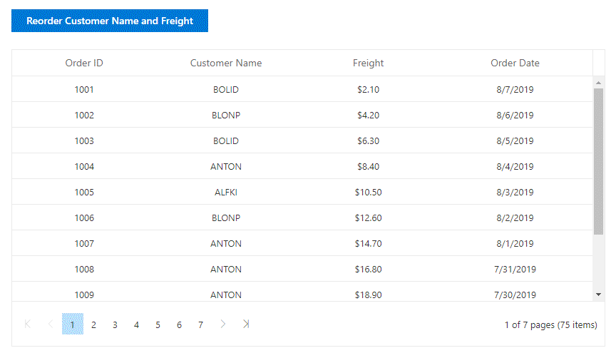

<!-- Reorder events

During the reorder action, the grid component triggers the below events,

1. [`ColumnDragStart`] -  Triggers when a column header element drag(move) starts.
2. [`ColumnDrag`]      -  Triggers when a column header element is dragged(moved) continuously.
3. [`ColumnDrop`]      -  Triggers when a column header element is dropped on the target column.

```cshtml
@using Syncfusion.Blazor.Grids

<SfGrid DataSource="@Orders" AllowReordering="true" AllowPaging="true" Height ="315">
<GridEvents ColumnDragStart="OnDragStart" ColumnDrag="OnDragging" ColumnDrop="OnDrop" TValue="Order"></GridEvents>
    <GridColumns>
        <GridColumn Field=@nameof(Order.OrderID) HeaderText="Order ID" IsPrimaryKey="true" TextAlign="TextAlign.Right" Width="120"></GridColumn>
        <GridColumn Field=@nameof(Order.CustomerName) HeaderText="Customer Name" Width="120"></GridColumn>
        <GridColumn Field=@nameof(Order.Freight) HeaderText="Freight" Format="C2" TextAlign="TextAlign.Right" MinWidth="10" Width="120" MaxWidth="200"></GridColumn>
        <GridColumn Field=@nameof(Order.OrderDate) HeaderText="Order Date" Format="d" TextAlign="TextAlign.Right" Width="130" Type="ColumnType.Date"></GridColumn>
    </GridColumns>
</SfGrid>

@code{

    public List<Order> Orders { get; set; }

    protected override void OnInitialized()
    {
        Orders = Enumerable.Range(1, 75).Select(x => new Order()
        {
            OrderID = 1000 + x,
            CustomerName = (new string[] { "ALFKI", "ANANTR", "ANTON", "BLONP", "BOLID" })[new Random().Next(5)],
            Freight = 2.1 * x,
            OrderDate = DateTime.Now.AddDays(-x),
        }).ToList();
    }

    public void OnDragStart() {
        // Perform required operations here
    }

    public void OnDragging() {
        // Perform required operations here
    }

    public void OnDrop() {
        // Perform required operations here
    }

    public class Order {
        public int? OrderID { get; set; }
        public string CustomerName { get; set; }
        public DateTime? OrderDate { get; set; }
        public double? Freight { get; set; }
    }
}
``` -->

<!-- ## Lock columns

You can lock columns by using [`LockColumn`](https://help.syncfusion.com/cr/blazor/Syncfusion.Blazor.Grids.GridColumn.html#Syncfusion_Blazor_Grids_GridColumn_LockColumn) property. The locked columns will be moved to the first position and can’t be reordered.

In the following example, Order ID column is locked and its reordering functionality is disabled.

```cshtml
@using Syncfusion.Blazor.Grids

<SfGrid DataSource="@Employees" AllowReordering="true" Height="215">
    <GridColumns>
        <GridColumn Field=@nameof(EmployeeData.EmployeeID) LockColumn="true" TextAlign="TextAlign.Center" HeaderText="Employee ID" Width="120"></GridColumn>
        <GridColumn Field=@nameof(EmployeeData.Name) HeaderText="First Name" Width="130"></GridColumn>
        <GridColumn Field=@nameof(EmployeeData.Title) HeaderText="Title" Width="120"></GridColumn>
        <GridColumn Field=@nameof(EmployeeData.HireDate) HeaderText="Hire Date" Format="d" TextAlign="TextAlign.Right" Width="150" Type="ColumnType.Date"></GridColumn>
    </GridColumns>
</SfGrid>

@code{
    public List<EmployeeData> Employees = new List<EmployeeData>
    {
        new EmployeeData() { EmployeeID = 1, Name = "Nancy Fuller", Title = "Vice President", HireDate = DateTime.Now.AddDays(-80) },
        new EmployeeData() { EmployeeID = 2, Name = "Steven Buchanan", Title = "Sales Manager", HireDate = DateTime.Now.AddDays(-60) },
        new EmployeeData() { EmployeeID = 3, Name = "Janet Leverling", Title = "Sales Representative", HireDate = DateTime.Now.AddDays(-34) },
        new EmployeeData() { EmployeeID = 4, Name = "Andrew Davolio", Title = "Inside Sales Coordinator", HireDate = DateTime.Now.AddDays(-22) },
        new EmployeeData() { EmployeeID = 5, Name = "Margaret Peacock", Title = "Sales", HireDate = DateTime.Now.AddDays(-12) },
    };

    public class EmployeeData
    {
        public int? EmployeeID { get; set; }
        public string Name { get; set; }
        public string Title { get; set; }
        public DateTime HireDate { get; set; }
    }
}
``` -->

## Column resizing

Column width can be resized by clicking and dragging the right edge of the column header. While dragging, the width of the respective column will be resized immediately. Each column can be auto resized by double-clicking the right edge of the column header to fit the width of that column based on the widest cell content. To enable column resize, set the [AllowResizing](https://help.syncfusion.com/cr/blazor/Syncfusion.Blazor.Grids.SfGrid-1.html#Syncfusion_Blazor_Grids_SfGrid_1_AllowResizing) property to true.

```cshtml
@using Syncfusion.Blazor.Grids

<SfGrid DataSource="@Orders" AllowResizing="true">
    <GridColumns>
        <GridColumn Field=@nameof(Order.OrderID) HeaderText="Order ID" TextAlign="TextAlign.Right" Width="120"></GridColumn>
        <GridColumn Field=@nameof(Order.CustomerID) HeaderText="Customer Name" Width="150"></GridColumn>
        <GridColumn Field=@nameof(Order.OrderDate) HeaderText="Order Date" Visible="false" Format="d" TextAlign="TextAlign.Right" Width="130" Type="ColumnType.Date"></GridColumn>
        <GridColumn Field=@nameof(Order.Freight) HeaderText="Freight" Format="C2" TextAlign="TextAlign.Right" Width="120"></GridColumn>
    </GridColumns>
</SfGrid>

@code{
    public List<Order> Orders { get; set; }

    protected override void OnInitialized()
    {
        Orders = Enumerable.Range(1, 75).Select(x => new Order()
        {
            OrderID = 1000 + x,
            CustomerID = (new string[] { "ALFKI", "ANANTR", "ANTON", "BLONP", "BOLID" })[new Random().Next(5)],
            Freight = 2.1 * x,
            OrderDate = DateTime.Now.AddDays(-x),
        }).ToList();
    }

    public class Order {
        public int? OrderID { get; set; }
        public string CustomerID { get; set; }
        public DateTime? OrderDate { get; set; }
        public double? Freight { get; set; }
    }
}
```

The following GIF represents column resizing, 
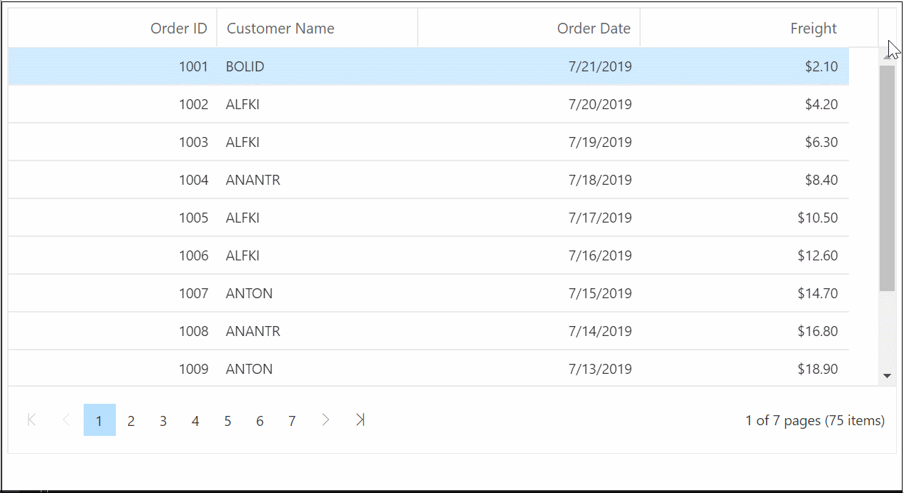

> You can disable resizing for a particular column by setting the [AllowResizing](https://help.syncfusion.com/cr/blazor/Syncfusion.Blazor.Grids.GridColumn.html#Syncfusion_Blazor_Grids_GridColumn_AllowResizing) property of **GridColumn** component to false.
> In RTL mode, you can click and drag the left edge of the header cell to resize the column.

### Min and max width

Column resize can be restricted between minimum and maximum width by defining the [MinWidth](https://help.syncfusion.com/cr/blazor/Syncfusion.Blazor.Grids.GridColumn.html#Syncfusion_Blazor_Grids_GridColumn_MinWidth) and [MaxWidth](https://help.syncfusion.com/cr/blazor/Syncfusion.Blazor.Grids.GridColumn.html#Syncfusion_Blazor_Grids_GridColumn_MaxWidth) properties in  **GridColumn** component.

In the following sample, minimum and maximum width are defined for **CustomerID** and **Freight** columns.

```cshtml
@using Syncfusion.Blazor.Grids

<SfGrid DataSource="@Orders" AllowResizing="true">
    <GridColumns>
        <GridColumn Field=@nameof(Order.OrderID) HeaderText="Order ID" TextAlign="TextAlign.Right" Width="120"></GridColumn>
        <GridColumn Field=@nameof(Order.CustomerID) HeaderText="Customer Name" MinWidth="10" Width="120" MaxWidth="200"></GridColumn>
        <GridColumn Field=@nameof(Order.OrderDate) HeaderText="Order Date" Format="d" TextAlign="TextAlign.Right" Width="130" Type="ColumnType.Date"></GridColumn>
        <GridColumn Field=@nameof(Order.Freight) HeaderText="Freight" Format="C2" TextAlign="TextAlign.Right" MinWidth="10" Width="120" MaxWidth="200"></GridColumn>  
    </GridColumns>
</SfGrid>

@code{
    public List<Order> Orders { get; set; }

    protected override void OnInitialized()
    {
        Orders = Enumerable.Range(1, 75).Select(x => new Order()
        {
            OrderID = 1000 + x,
            CustomerID = (new string[] { "ALFKI", "ANANTR", "ANTON", "BLONP", "BOLID" })[new Random().Next(5)],
            Freight = 2.1 * x,
            OrderDate = DateTime.Now.AddDays(-x),
        }).ToList();
    }

    public class Order {
        public int? OrderID { get; set; }
        public string CustomerID { get; set; }
        public DateTime? OrderDate { get; set; }
        public double? Freight { get; set; }
    }
}
```

### Resize stacked column

Stacked columns can be resized by clicking and dragging the right edge of the stacked column header. While dragging, the width of the respective child columns will be resized at the same time. You can disable resize for any particular stacked column by setting [AllowResizing](https://help.syncfusion.com/cr/blazor/Syncfusion.Blazor.Grids.GridColumn.html#Syncfusion_Blazor_Grids_GridColumn_AllowResizing) property **GridColumn** as **false** to its columns.

```cshtml
@using Syncfusion.Blazor.Grids

<SfGrid DataSource="@Orders" AllowResizing="true" AllowPaging="true" Height="315">
    <GridColumns>
        <GridColumn Field=@nameof(Order.OrderID) HeaderText="Order ID" TextAlign="TextAlign.Right" Width="120"></GridColumn>
        <GridColumn HeaderText=" Order Details">
            <GridColumns>
                <GridColumn Field=@nameof(Order.OrderDate) Width="130" HeaderText="Order Date" Format="d" TextAlign="TextAlign.Right" MinWidth="10"></GridColumn>
                <GridColumn Field=@nameof(Order.Freight) Width="135" HeaderText="Freight($)" Format="C2" TextAlign="TextAlign.Right" MinWidth="10" AllowResizing=false></GridColumn>
            </GridColumns>
        </GridColumn>
    </GridColumns>
</SfGrid>

@code{
    public List<Order> Orders { get; set; }

    protected override void OnInitialized()
    {
        Orders = Enumerable.Range(1, 75).Select(x => new Order()
        {
            OrderID = 1000 + x,
            CustomerID = (new string[] { "ALFKI", "ANANTR", "ANTON", "BLONP", "BOLID" })[new Random().Next(5)],
            Freight = 2.1 * x,
            OrderDate = DateTime.Now.AddDays(-x),
        }).ToList();
    }

    public class Order
    {
        public int? OrderID { get; set; }
        public string CustomerID { get; set; }
        public DateTime? OrderDate { get; set; }
        public double? Freight { get; set; }
    }
}
```

Resizing of stacked header is shown below
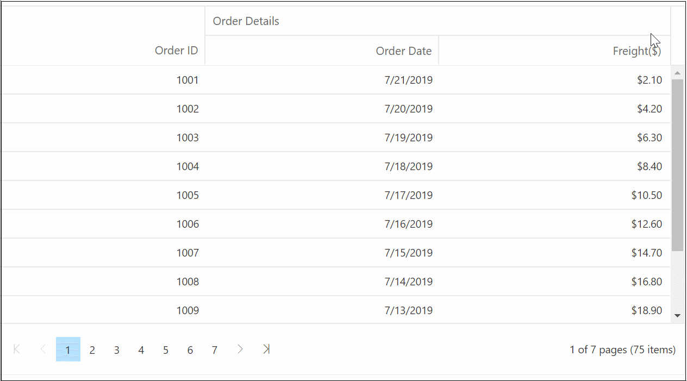

### Touch interaction

When the right edge of the header cell is tapped, a floating handler will be visible over the right border of the column. To resize the column, tap and drag the floating handler as needed. You can autoFit a column by using the Column menu of the DataGrid.

The following screenshot represents the column resizing in touch device.

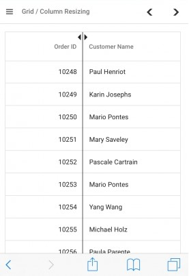

<!-- Resize events

During the resizing action the grid component triggers the below events,

1. [`ResizeStart`]  -  Triggers when a column resize starts.
2. [`Resizing`]     -  Triggers when a column is getting resized continuously.
3. [`ResizeStop`]   -  Triggers when a column resize stops.

```cshtml
@using Syncfusion.Blazor.Grids

<SfGrid DataSource="@Orders" AllowResizing="true" AllowPaging="true" Height ="315">
<GridEvents ResizeStart="OnResizeStart" Resizing="OnResizing" ResizeStop="OnResizeStop" TValue="Order"></GridEvents>
    <GridColumns>
        <GridColumn Field=@nameof(Order.OrderID) HeaderText="Order ID" IsPrimaryKey="true" TextAlign="TextAlign.Right" Width="120"></GridColumn>
        <GridColumn Field=@nameof(Order.CustomerName) HeaderText="Customer Name" Width="120"></GridColumn>
        <GridColumn Field=@nameof(Order.Freight) HeaderText="Freight" Format="C2" TextAlign="TextAlign.Right" MinWidth="10" Width="120" MaxWidth="200"></GridColumn>
        <GridColumn Field=@nameof(Order.OrderDate) HeaderText="Order Date" Format="d" TextAlign="TextAlign.Right" Width="130" Type="ColumnType.Date"></GridColumn>
    </GridColumns>
</SfGrid>

@code{

    public List<Order> Orders { get; set; }

    protected override void OnInitialized()
    {
        Orders = Enumerable.Range(1, 75).Select(x => new Order()
        {
            OrderID = 1000 + x,
            CustomerName = (new string[] { "ALFKI", "ANANTR", "ANTON", "BLONP", "BOLID" })[new Random().Next(5)],
            Freight = 2.1 * x,
            OrderDate = DateTime.Now.AddDays(-x),
        }).ToList();
    }

    public void OnResizeStart() {
        // Perform required operations here
    }

    public void OnResizing() {
        // Perform required operations here
    }

    public void OnResizeStop() {
        // Perform required operations here
    }

    public class Order {
        public int? OrderID { get; set; }
        public string CustomerName { get; set; }
        public DateTime? OrderDate { get; set; }
        public double? Freight { get; set; }
    }
}
``` -->

## Column menu

The column menu has options to integrate features like sorting, grouping, filtering, column chooser, and autofit in it. When the user clicks on multiple icon of the column this menu gets displayed. To enable column menu, you need to define the [ShowColumnMenu](https://help.syncfusion.com/cr/blazor/Syncfusion.Blazor.Grids.GridColumn.html#Syncfusion_Blazor_Grids_GridColumn_ShowColumnMenu) property as true.

The default menu items are displayed in the following table,

| Item | Description |
|-----|-----|
| **SortAscending** | Sort the current column in ascending order. |
| **SortDescending** | Sort the current column in descending order. |
| **Group** | Group the current column. |
| **Ungroup** | Ungroup the current column. |
| **AutoFit** | Auto fit the current column. |
| **AutoFitAll** | Auto fit all columns. |
| **ColumnChooser** | Choose the column visibility. |
| **Filter** | Show the filter option as given in filterSettings [Type](https://help.syncfusion.com/cr/blazor/Syncfusion.Blazor.Grids.GridFilterSettings.html#Syncfusion_Blazor_Grids_GridFilterSettings_Type) property |

```cshtml
@using Syncfusion.Blazor.Grids

<SfGrid DataSource="@Orders" Height="315" AllowGrouping="true" ColumnMenuItems=@MenuItems AllowFiltering="true" ShowColumnMenu="true" AllowPaging="true">
    <GridFilterSettings Type="FilterType.CheckBox"></GridFilterSettings>
    <GridGroupSettings ShowGroupedColumn="true"></GridGroupSettings>
    <GridColumns>
        <GridColumn Field=@nameof(Order.OrderID) HeaderText="Order ID" TextAlign="TextAlign.Center" Width="120"></GridColumn>
        <GridColumn Field=@nameof(Order.CustomerID) HeaderText="Customer Name" Width="150" TextAlign="TextAlign.Center" ShowColumnMenu="false"></GridColumn>
        <GridColumn Field=@nameof(Order.OrderDate) HeaderText="Order Date" Format="d" Type="ColumnType.Date" TextAlign="TextAlign.Center" Width="130"></GridColumn>
        <GridColumn Field=@nameof(Order.Freight) HeaderText="Freight" Format="C2" TextAlign="TextAlign.Center" Width="120"></GridColumn>
    </GridColumns>
</SfGrid>

@code{
    public string[] MenuItems = new string[] { "Group", "Ungroup", "ColumnChooser", "Filter" };

    public List<Order> Orders { get; set; }

    protected override void OnInitialized()
    {
        Orders = Enumerable.Range(1, 75).Select(x => new Order()
        {
            OrderID = 1000 + x,
            CustomerID = (new string[] { "ALFKI", "ANANTR", "ANTON", "BLONP", "BOLID" })[new Random().Next(5)],
            Freight = 2.1 * x,
            OrderDate = DateTime.Now.AddDays(-x),
        }).ToList();
    }

    public class Order
    {
        public int? OrderID { get; set; }
        public string CustomerID { get; set; }
        public DateTime? OrderDate { get; set; }
        public double? Freight { get; set; }
    }
}
```

> * You can disable column menu for a particular column by defining the column's [ShowColumnMenu](https://help.syncfusion.com/cr/blazor/Syncfusion.Blazor.Grids.GridColumn.html#Syncfusion_Blazor_Grids_GridColumn_ShowColumnMenu) property as false.
> * You can customize the default menu items by defining the [ColumnMenuItems](https://help.syncfusion.com/cr/blazor/Syncfusion.Blazor.Charts.ChartSeries.html#Syncfusion_Blazor_Charts_ChartSeries_Type) with the required items.

The following image represents DataGrid with column menu property enabled,
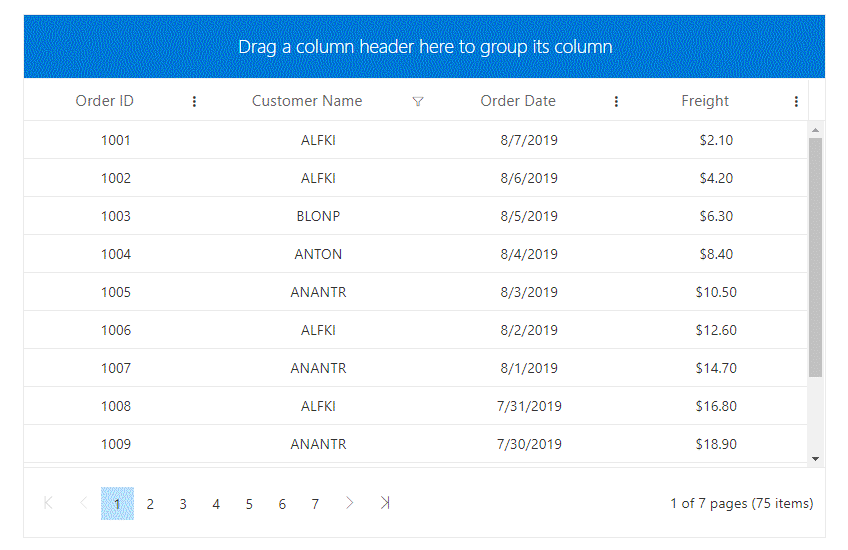

<!-- Column menu events

The grid component triggers the below events when column menu operations are performed,

1. [`ColumnMenuOpen`]   -  Triggers before the column menu opens
2. [`ColumnMenuItemClicked`]  -  Triggers when a column menu is clicked

```cshtml
@using Syncfusion.Blazor.Grids

<SfGrid DataSource="@Orders" ShowColumnMenu="true" AllowGrouping="true" AllowFiltering="true" AllowPaging="true" Height ="315">
<GridEvents ColumnMenuOpen="OnMenuOpen" ColumnMenuItemClicked="OnMenuClick" TValue="Order"></GridEvents>
    <GridColumns>
        <GridColumn Field=@nameof(Order.OrderID) HeaderText="Order ID" IsPrimaryKey="true" TextAlign="TextAlign.Right" Width="120"></GridColumn>
        <GridColumn Field=@nameof(Order.CustomerName) HeaderText="Customer Name" Width="120"></GridColumn>
        <GridColumn Field=@nameof(Order.Freight) HeaderText="Freight" Format="C2" TextAlign="TextAlign.Right" MinWidth="10" Width="120" MaxWidth="200"></GridColumn>
        <GridColumn Field=@nameof(Order.OrderDate) HeaderText="Order Date" Format="d" TextAlign="TextAlign.Right" Width="130" Type="ColumnType.Date"></GridColumn>
    </GridColumns>
</SfGrid>

@code{

    public List<Order> Orders { get; set; }

    protected override void OnInitialized()
    {
        Orders = Enumerable.Range(1, 75).Select(x => new Order()
        {
            OrderID = 1000 + x,
            CustomerName = (new string[] { "ALFKI", "ANANTR", "ANTON", "BLONP", "BOLID" })[new Random().Next(5)],
            Freight = 2.1 * x,
            OrderDate = DateTime.Now.AddDays(-x),
        }).ToList();
    }

    public void OnMenuOpen() {
        // Perform required operations here
    }

    public void OnMenuClick() {
        // Perform required operations here
    }

    public class Order {
        public int? OrderID { get; set; }
        public string CustomerName { get; set; }
        public DateTime? OrderDate { get; set; }
        public double? Freight { get; set; }
    }
}
``` -->

<!-- Custom column menu item

Custom column menu items can be added by defining the [`ColumnMenuItems`](https://help.syncfusion.com/cr/blazor/Syncfusion.Blazor.Charts.ChartSeries.html#Syncfusion_Blazor_Charts_ChartSeries_Type) as a collection of the [`ColumnMenuItemModel`](https://help.syncfusion.com/cr/aspnetcore-blazor/Syncfusion.Blazor.Grids.ColumnMenuItemModel.html).

Actions for the customized items can be defined in the [`ColumnMenuItemClicked`] event.

```cshtml
@using Syncfusion.Blazor.Grids
@using Syncfusion.Blazor.Navigations

<SfGrid @ref="Grid" DataSource="@Orders" Height="315" ColumnMenuItems=@MenuItems AllowSorting="true" ShowColumnMenu="true" AllowPaging="true">
    <GridEvents ColumnMenuItemClicked="OnMenuClick" TValue="Order"></GridEvents>
    <GridSortSettings Columns=@SortSettings></GridSortSettings>
    <GridColumns>
        <GridColumn Field=@nameof(Order.OrderID) HeaderText="Order ID" TextAlign="TextAlign.Center" Width="120"></GridColumn>
        <GridColumn Field=@nameof(Order.CustomerID) HeaderText="Customer Name" Width="150" TextAlign="TextAlign.Center" ShowColumnMenu="false"></GridColumn>
        <GridColumn Field=@nameof(Order.OrderDate) HeaderText="Order Date" Format="d" Type="ColumnType.Date" TextAlign="TextAlign.Center" Width="130"></GridColumn>
        <GridColumn Field=@nameof(Order.Freight) HeaderText="Freight" Format="C2" TextAlign="TextAlign.Center" Width="120"></GridColumn>
    </GridColumns>
</SfGrid>

@code{

    private SfGrid<Order> Grid;

    public List<ColumnMenuItemModel> MenuItems = new List<ColumnMenuItemModel>()
    {
        new ColumnMenuItemModel() { Text = "Clear Sorting", Id = "gridclearsorting" }
    };

    public List<SortDescriptorModel> SortSettings = new List<SortDescriptorModel>()
    {
        new SortDescriptorModel() { Direction = SortDirection.Ascending, Field = "OrderID" }
    };

    public class SortSetting
    {
        public string Direction { get; set; }
        public string Field { get; set; }
    }

    public List<Order> Orders { get; set; }

    protected override void OnInitialized()
    {
        Orders = Enumerable.Range(1, 75).Select(x => new Order()
        {
            OrderID = 1000 + x,
            CustomerID = (new string[] { "ALFKI", "ANANTR", "ANTON", "BLONP", "BOLID" })[new Random().Next(5)],
            Freight = 2.1 * x,
            OrderDate = DateTime.Now.AddDays(-x),
        }).ToList();
    }

    public class Order
    {
        public int? OrderID { get; set; }
        public string CustomerID { get; set; }
        public DateTime? OrderDate { get; set; }
        public double? Freight { get; set; }
    }

    public void OnMenuClick(MenuEventArgs args)
    {
        if (args.Item.Id == "gridclearsorting") {
            this.Grid.ClearSorting();
        }
    }

}
``` 

The following GIF shows the sorting cleared on clicking the custom column menu item in Grid
-->

<!-- Customize menu items for particular columns

Sometimes, you have a scenario where you need to hide an item from column menu for particular columns alone. For this case, you need to set the [`Hide`] property of the [`ColumnMenuOpenEventArgs`](https://help.syncfusion.com/cr/blazor/Syncfusion.Blazor.Grids.ColumnMenuOpenEventArgs.html#Syncfusion_Blazor_Grids_ColumnMenuOpenEventArgs__ctor) as true in the [`ColumnMenuOpen`] event.

In the following sample code, Filter item is hidden in column menu for the OrderID column.

```cshtml
@using Syncfusion.Blazor.Grids

<SfGrid DataSource="@Orders" Height="315" AllowSorting="true" AllowFiltering="true" AllowGrouping="true"  ShowColumnMenu="true" AllowPaging="true">
    <GridEvents ColumnMenuOpen="OnMenuOpen" TValue="Order"></GridEvents>
    <GridFilterSettings Type=FilterType.Menu></GridFilterSettings>
    <GridColumns>
        <GridColumn Field=@nameof(Order.OrderID) HeaderText="Order ID" TextAlign="TextAlign.Center" Width="120"></GridColumn>
        <GridColumn Field=@nameof(Order.CustomerID) HeaderText="Customer Name" Width="150" TextAlign="TextAlign.Center" ShowColumnMenu="false"></GridColumn>
        <GridColumn Field=@nameof(Order.OrderDate) HeaderText="Order Date" Format="d" Type="ColumnType.Date" TextAlign="TextAlign.Center" Width="130"></GridColumn>
        <GridColumn Field=@nameof(Order.Freight) HeaderText="Freight" Format="C2" TextAlign="TextAlign.Center" Width="120"></GridColumn>
    </GridColumns>
</SfGrid>

@code{
    public List<Order> Orders { get; set; }

    protected override void OnInitialized()
    {
        Orders = Enumerable.Range(1, 75).Select(x => new Order()
        {
            OrderID = 1000 + x,
            CustomerID = (new string[] { "ALFKI", "ANANTR", "ANTON", "BLONP", "BOLID" })[new Random().Next(5)],
            Freight = 2.1 * x,
            OrderDate = DateTime.Now.AddDays(-x),
        }).ToList();
    }

    public class Order
    {
        public int? OrderID { get; set; }
        public string CustomerID { get; set; }
        public DateTime? OrderDate { get; set; }
        public double? Freight { get; set; }
    }

    public void OnMenuOpen(MenuEventArgs args)
    {
        foreach (ColumnMenuItemModel Item in args.Items) {
            if (Item.Text == "Filter" && args.Column.Field == "OrderID") {
                Item.Hide = true;
            } else {
                Item.Hide = false;
            }
        }
    }
}
``` 

The following GIF shows the customized column menu item for particular column in Grid -->

<!-- Column spanning

The grid has option to span the adjacent cells. To achieve this, define the [`ColSpan`](https://help.syncfusion.com/cr/blazor/Syncfusion.Blazor.Grids.QueryCellInfoEventArgs-1.html#Syncfusion_Blazor_Grids_QueryCellInfoEventArgs_1_ColSpan) attribute in the [`QueryCellInfo`](https://help.syncfusion.com/cr/blazor/Syncfusion.Blazor.Grids.GridEvents-1.html#Syncfusion_Blazor_Grids_GridEvents_1_QueryCellInfo) event.

In the following demo, the cells have been spanned based on the employees schedule

```cshtml
@using Syncfusion.Blazor.Grids

<SfGrid DataSource="@MergeData" GridLines=GridLine.Both AllowTextWrap="true">
        <GridEvents TValue="@Merge" QueryCellInfo="QueryCellEvent"></GridEvents>
    <GridColumns>
        <GridColumn Field=@nameof(Merge.EmployeeID) TextAlign="TextAlign.Right" HeaderText="Employee ID" Width="120"></GridColumn>
        <GridColumn Field=@nameof(Merge.EmployeeName) HeaderText="Employee Name" Width="200"></GridColumn>
        <GridColumn Field=@nameof(Merge.Time900) HeaderText="9.00 AM" Width="100"></GridColumn>
        <GridColumn Field=@nameof(Merge.Time930) HeaderText="9.30 AM" Width="100"></GridColumn>
        <GridColumn Field=@nameof(Merge.Time1000) HeaderText="10.00 AM" Width="100"></GridColumn>
        <GridColumn Field=@nameof(Merge.Time1030) HeaderText="10.30 AM" Width="100"></GridColumn>
        <GridColumn Field=@nameof(Merge.Time1100) HeaderText="11.00 AM" Width="100"></GridColumn>
        <GridColumn Field=@nameof(Merge.Time1130) HeaderText="11.30 AM" Width="100"></GridColumn>
        <GridColumn Field=@nameof(Merge.Time1200) HeaderText="12.00 PM" Width="100"></GridColumn>
        <GridColumn Field=@nameof(Merge.Time1230) HeaderText="12.30 PM" Width="100"></GridColumn>
        <GridColumn Field=@nameof(Merge.Time100) HeaderText="1.00 PM" Width="100"></GridColumn>
        <GridColumn Field=@nameof(Merge.Time130) HeaderText="1.30 PM" Width="100"></GridColumn>
        <GridColumn Field=@nameof(Merge.Time200) HeaderText="2.00 PM" Width="100"></GridColumn>
        <GridColumn Field=@nameof(Merge.Time230) HeaderText="2.30 PM" Width="100"></GridColumn>
        <GridColumn Field=@nameof(Merge.Time300) HeaderText="3.00 PM" Width="100"></GridColumn>
        <GridColumn Field=@nameof(Merge.Time330) HeaderText="3.30 PM" Width="100"></GridColumn>
        <GridColumn Field=@nameof(Merge.Time400) HeaderText="4.00 PM" Width="100"></GridColumn>
        <GridColumn Field=@nameof(Merge.Time430) HeaderText="4.30 PM" Width="100"></GridColumn>
        <GridColumn Field=@nameof(Merge.Time500) HeaderText="5.00 PM" Width="100"></GridColumn>
    </GridColumns>
</SfGrid>

@code{
    List<Merge> MergeData = new List<Merge>
    {
        new Merge() { Time900 = "Analysis Tasks", Time930 = "Analysis Tasks", Time1000 = "Team Meeting", Time1030 = "Testing", Time1100 = "Development", Time1130 = "Development", Time1200 = "Development", Time1230 = "Support", Time100 = "Lunch Break", Time130 = "Lunch Break", Time200 = "Lunch Break", Time230 = "Testing", Time300 = "Testing", Time330 = "Development", Time400 = "Conference", Time430 = "Team Meeting", Time500 = "Team Meeting", EmployeeID = 10001, EmployeeName = "Davolio" },
        new Merge() { Time900 = "Task Assign", Time930 = "Support", Time1000 = "Support", Time1030 = "Support", Time1100 = "Testing", Time1130 = "Testing", Time1200 = "Testing", Time1230 = "Testing", Time100 = "Lunch Break", Time130 = "Lunch Break", Time200 = "Lunch Break", Time230 = "Development", Time300 = "Development", Time330 = "Check Mail", Time400 = "Check Mail", Time430 = "Team Meeting", Time500 = "Team Meeting", EmployeeID = 10002, EmployeeName = "Buchanan" },
        new Merge() { Time900 = "Check Mail", Time930 = "Check Mail", Time1000 = "Check Mail", Time1030 = "Analysis Tasks", Time1100 = "Analysis Tasks", Time1130 = "Support", Time1200 = "Support", Time1230 = "Support", Time100 = "Lunch Break", Time130 = "Lunch Break", Time200 = "Lunch Break", Time230 = "Development", Time300 = "Development", Time330 = "Team Meeting", Time400 = "Team Meeting", Time430 = "Development", Time500 = "Development", EmployeeID = 10003, EmployeeName = "Fuller" },
        new Merge() { Time900 = "Testing", Time930 = "Check Mail", Time1000 = "Check Mail", Time1030 = "Support", Time1100 = "Testing", Time1130 = "Testing", Time1200 = "Testing", Time1230 = "Testing", Time100 = "Lunch Break", Time130 = "Lunch Break", Time200 = "Lunch Break", Time230 = "Development", Time300 = "Development", Time330 = "Check Mail", Time400 = "Conference", Time430 = "Conference", Time500 = "Team Meeting", EmployeeID = 10004, EmployeeName = "Leverling" },
        new Merge() { Time900 = "Task Assign", Time930 = "Task Assign", Time1000 = "Task Assign", Time1030 = "Task Assign", Time1100 = "Check Mail", Time1130 = "Support", Time1200 = "Support", Time1230 = "Support", Time100 = "Lunch Break", Time130 = "Lunch Break", Time200 = "Lunch Break", Time230 = "Development", Time300 = "Development", Time330 = "Team Meeting", Time400 = "Team Meeting", Time430 = "Testing", Time500 = "Testing", EmployeeID = 10005, EmployeeName = "Peacock" },
        new Merge() { Time900 = "Testing", Time930 = "Testing", Time1000 = "Support", Time1030 = "Support", Time1100 = "Support", Time1130 = "Team Meeting", Time1200 = "Team Meeting", Time1230 = "Team Meeting", Time100 = "Lunch Break", Time130 = "Lunch Break", Time200 = "Lunch Break", Time230 = "Development", Time300 = "Development", Time330 = "Team Meeting", Time400 = "Team Meeting", Time430 = "Development", Time500 = "Development", EmployeeID = 10006, EmployeeName = "Janet" },
        new Merge() { Time900 = "Analysis Tasks", Time930 = "Analysis Tasks", Time1000 = "Testing", Time1030 = "Development", Time1100 = "Development", Time1130 = "Testing", Time1200 = "Testing", Time1230 = "Testing", Time100 = "Lunch Break", Time130 = "Lunch Break", Time200 = "Lunch Break", Time230 = "Support", Time300 = "Build", Time330 = "Build", Time400 = "Check Mail", Time430 = "Check Mail", Time500 = "Check Mail", EmployeeID = 10007, EmployeeName = "Suyama" },
        new Merge() { Time900 = "Task Assign", Time930 = "Task Assign", Time1000 = "Task Assign", Time1030 = "Development", Time1100 = "Development", Time1130 = "Development", Time1200 = "Testing", Time1230 = "Support", Time100 = "Lunch Break", Time130 = "Lunch Break", Time200 = "Lunch Break", Time230 = "Check Mail", Time300 = "Check Mail", Time330 = "Check Mail", Time400 = "Team Meeting", Time430 = "Team Meeting", Time500 = "Build", EmployeeID = 10008, EmployeeName = "Robert" },
        new Merge() { Time900 = "Check Mail", Time930 = "Team Meeting", Time1000 = "Team Meeting", Time1030 = "Support", Time1100 = "Testing", Time1130 = "Development", Time1200 = "Development", Time1230 = "Development", Time100 = "Lunch Break", Time130 = "Lunch Break", Time200 = "Lunch Break", Time230 = "Check Mail", Time300 = "Check Mail", Time330 = "Check Mail", Time400 = "Team Meeting", Time430 = "Development", Time500 = "Development", EmployeeID = 10009, EmployeeName = "Andrew" },
        new Merge() { Time900 = "Task Assign", Time930 = "Task Assign", Time1000 = "Task Assign", Time1030 = "Analysis Tasks", Time1100 = "Analysis Tasks", Time1130 = "Development", Time1200 = "Development", Time1230 = "Development", Time100 = "Lunch Break", Time130 = "Lunch Break", Time200 = "Lunch Break", Time230 = "Testing", Time300 = "Testing", Time330 = "Testing", Time400 = "Build", Time430 = "Build", Time500 = "Build", EmployeeID = 10010, EmployeeName = "Michael" }
    };

    public class Merge
    {
        public int EmployeeID { get; set; }
        public string EmployeeName { get; set; }
        public string Time900 { get; set; }
        public string Time930 { get; set; }
        public string Time1000 { get; set; }
        public string Time1030 { get; set; }
        public string Time1100 { get; set; }
        public string Time1130 { get; set; }
        public string Time1200 { get; set; }
        public string Time1230 { get; set; }
        public string Time100 { get; set; }
        public string Time130 { get; set; }
        public string Time200 { get; set; }
        public string Time230 { get; set; }
        public string Time300 { get; set; }
        public string Time330 { get; set; }
        public string Time400 { get; set; }
        public string Time430 { get; set; }
        public string Time500 { get; set; }
    }

    public void QueryCellEvent(QueryCellInfoEventArgs<Merge> args)
    {
        var Data = args.Data;
        switch (Data.EmployeeID) {
            case 10001:
                if(args.Column.Field == "Time900" || args.Column.Field == "Time230" || args.Column.Field == "Time430") {
                    args.ColSpan = 2;
                    StateHasChanged();
                } else if(args.Column.Field == "Time1100") {
                    args.ColSpan = 3;
                    StateHasChanged();
                }
                break;
            case 10002:
                if(args.Column.Field == "Time930" || args.Column.Field == "Time230" || args.Column.Field == "Time430") {
                    args.ColSpan = 3;
                    StateHasChanged();
                } else if(args.Column.Field == "Time1100") {
                    args.ColSpan = 4;
                    StateHasChanged();
                }
                break;
            case 10003:
                if(args.Column.Field == "Time900" || args.Column.Field == "Time1130") {
                    args.ColSpan = 3;
                    StateHasChanged();
                } else if(args.Column.Field == "Time1030" || args.Column.Field == "Time230" || args.Column.Field == "Time330" || args.Column.Field == "Time430") {
                    args.ColSpan = 2;
                    StateHasChanged();
                }
                break;
            case 10004:
                if(args.Column.Field == "Time900") {
                    args.ColSpan = 3;
                    StateHasChanged();
                } else if(args.Column.Field == "Time1100") {
                    args.ColSpan = 4;
                    StateHasChanged();
                } else if(args.Column.Field == "Time230" || args.Column.Field == "Time400") {
                    args.ColSpan = 2;
                    StateHasChanged();
                }
                break;
            case 10005:
                if(args.Column.Field == "Time900") {
                    args.ColSpan = 4;
                    StateHasChanged();
                } else if(args.Column.Field == "Time1130") {
                    args.ColSpan = 3;
                    StateHasChanged();
                } else if(args.Column.Field == "Time230" || args.Column.Field == "Time330" || args.Column.Field == "Time430") {
                    args.ColSpan = 2;
                    StateHasChanged();
                }
                break;
            case 10006:
                if(args.Column.Field == "Time900" || args.Column.Field == "Time230" || args.Column.Field == "Time330" || args.Column.Field == "Time430") {
                    args.ColSpan = 2;
                    StateHasChanged();
                } else if(args.Column.Field == "Time1000" || args.Column.Field == "Time1130") {
                    args.ColSpan = 3;
                    StateHasChanged();
                }
                break;
            case 10007:
                if(args.Column.Field == "Time900" || args.Column.Field == "Time1030" || args.Column.Field == "Time300") {
                    args.ColSpan = 2;
                    StateHasChanged();
                } else if(args.Column.Field == "Time1130" || args.Column.Field == "Time400") {
                    args.ColSpan = 3;
                    StateHasChanged();
                }
                break;
            case 10008:
                if(args.Column.Field == "Time900" || args.Column.Field == "Time1030" || args.Column.Field == "Time230") {
                    args.ColSpan = 3;
                    StateHasChanged();
                } else if(args.Column.Field == "Time400") {
                    args.ColSpan = 2;
                    StateHasChanged();
                }
                break;
            case 10009:
                if(args.Column.Field == "Time900" || args.Column.Field == "Time1130") {
                    args.ColSpan = 3;
                    StateHasChanged();
                } else if(args.Column.Field == "Time230" || args.Column.Field == "Time430") {
                    args.ColSpan = 2;
                    StateHasChanged();
                }
                break;
            case 100010:
                if(args.Column.Field == "Time900" || args.Column.Field == "Time1130" || args.Column.Field == "Time230" || args.Column.Field == "Time400") {
                    args.ColSpan = 3;
                    StateHasChanged();
                } else if(args.Column.Field == "Time1030") {
                    args.ColSpan = 2;
                    StateHasChanged();
                }
                break;
        }
    }
}
``` 

The following GIF shows the column spanning in Grid -->

## Responsive columns

You can toggle column visibility based on media queries. This can be achieved by defining Media Queries in the [HideAtMedia](https://help.syncfusion.com/cr/blazor/Syncfusion.Blazor.Grids.GridColumn.html#Syncfusion_Blazor_Grids_GridColumn_HideAtMedia) Column property. The [HideAtMedia](https://help.syncfusion.com/cr/blazor/Syncfusion.Blazor.Grids.GridColumn.html#Syncfusion_Blazor_Grids_GridColumn_HideAtMedia) accepts valid [Media Queries](http://cssmediaqueries.com/what-are-css-media-queries.html).

In the following sample code, for OrderID column - HideAtMedia property value is set as (min-width: 700px). This hides the OrderID column when the browser screen width is less than 700px.

```cshtml
@using Syncfusion.Blazor.Grids

<SfGrid DataSource="@Orders" Height="315">
    <GridColumns>
        <GridColumn Field=@nameof(Order.OrderID) HeaderText="Order ID" HideAtMedia="(min-width: 700px)" TextAlign="TextAlign.Center" Width="120"></GridColumn> // Column hides when browser screen width is less than 700px
        <GridColumn Field=@nameof(Order.CustomerID) HeaderText="Customer Name" HideAtMedia="(max-width: 500px)" Width="150" TextAlign="TextAlign.Center"></GridColumn> // Column shows when browser screen width is less than or equal to 500px
        <GridColumn Field=@nameof(Order.OrderDate) HeaderText="Order Date" HideAtMedia="(min-width: 500px)" Format="d" Type="ColumnType.Date" TextAlign="TextAlign.Center" Width="130"></GridColumn> // Column hides when browser screen width is less than 500px
        <GridColumn Field=@nameof(Order.Freight) HeaderText="Freight" Format="C2" TextAlign="TextAlign.Center" Width="120"></GridColumn> // Column is always displayed
    </GridColumns>
</SfGrid>

@code{
    public List<Order> Orders { get; set; }

    protected override void OnInitialized()
    {
        Orders = Enumerable.Range(1, 75).Select(x => new Order()
        {
            OrderID = 1000 + x,
            CustomerID = (new string[] { "ALFKI", "ANANTR", "ANTON", "BLONP", "BOLID" })[new Random().Next(5)],
            Freight = 2.1 * x,
            OrderDate = DateTime.Now.AddDays(-x),
        }).ToList();
    }

    public class Order
    {
        public int? OrderID { get; set; }
        public string CustomerID { get; set; }
        public DateTime? OrderDate { get; set; }
        public double? Freight { get; set; }
    }
}
```

The following GIF shows the responsive columns behavior when the window is resized,
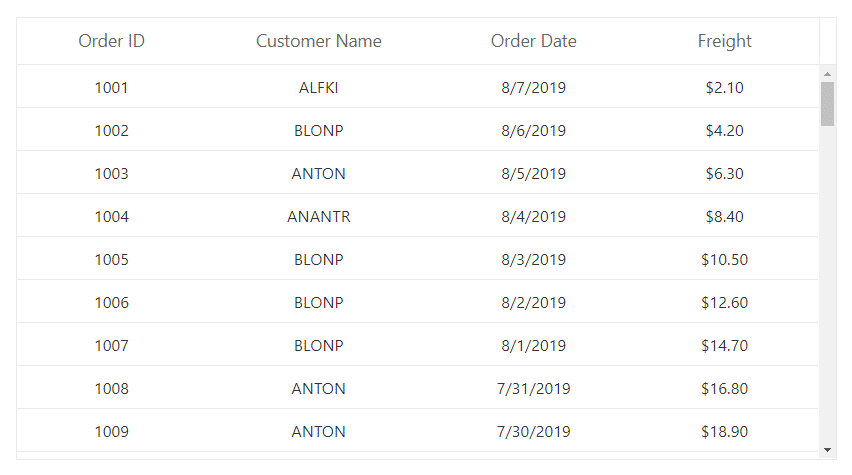
## Controlling datagrid actions

You can enable or disable datagrid action for a particular column by using the [AllowFiltering](https://help.syncfusion.com/cr/blazor/Syncfusion.Blazor.Grids.GridColumn.html#Syncfusion_Blazor_Grids_GridColumn_AllowFiltering), [AllowGrouping](https://help.syncfusion.com/cr/blazor/Syncfusion.Blazor.Grids.GridColumn.html#Syncfusion_Blazor_Grids_GridColumn_AllowGrouping), [AllowSorting](https://help.syncfusion.com/cr/blazor/Syncfusion.Blazor.Grids.GridColumn.html#Syncfusion_Blazor_Grids_GridColumn_AllowSorting), [AllowReordering](https://help.syncfusion.com/cr/blazor/Syncfusion.Blazor.Grids.GridColumn.html#Syncfusion_Blazor_Grids_GridColumn_AllowReordering), and [AllowEditing](https://help.syncfusion.com/cr/blazor/Syncfusion.Blazor.Grids.GridColumn.html#Syncfusion_Blazor_Grids_GridColumn_AllowEditing) properties.

The following sample code shows DataGrid actions disabled for particular columns,

```cshtml
@using Syncfusion.Blazor.Grids

<SfGrid DataSource="@Orders" Height="315" AllowFiltering="true" AllowGrouping="true" AllowSorting="true" AllowReordering="true">
    <GridEditSettings AllowAdding="true" AllowDeleting="true" AllowEditing="true" Mode=EditMode.Normal></GridEditSettings>
    <GridColumns>
        <GridColumn Field=@nameof(Order.OrderID) HeaderText="Order ID" TextAlign="TextAlign.Center" IsPrimaryKey="true" Width="120" AllowGrouping="false"></GridColumn>
        <GridColumn Field=@nameof(Order.CustomerID) HeaderText="Customer Name" Width="150" TextAlign="TextAlign.Center"></GridColumn>
        <GridColumn Field=@nameof(Order.OrderDate) HeaderText="Order Date" Format="d" Type="ColumnType.Date" TextAlign="TextAlign.Center" Width="130" AllowEditing="false" AllowFiltering="false" AllowReordering="false"></GridColumn>
        <GridColumn Field=@nameof(Order.Freight) HeaderText="Freight" Format="C2" TextAlign="TextAlign.Center" Width="120" AllowSorting="false"></GridColumn>
    </GridColumns>
</SfGrid>

@code{
    public List<Order> Orders { get; set; }

    protected override void OnInitialized()
    {
        Orders = Enumerable.Range(1, 75).Select(x => new Order()
        {
            OrderID = 1000 + x,
            CustomerID = (new string[] { "ALFKI", "ANANTR", "ANTON", "BLONP", "BOLID" })[new Random().Next(5)],
            Freight = 2.1 * x,
            OrderDate = DateTime.Now.AddDays(-x),
        }).ToList();
    }

    public class Order
    {
        public int? OrderID { get; set; }
        public string CustomerID { get; set; }
        public DateTime? OrderDate { get; set; }
        public double? Freight { get; set; }
    }
}
```

The following GIF shows the DataGrid actions for different columns,


## Show/hide columns by external button

You can show or hide DataGrid columns dynamically using external buttons by invoking the [ShowColumns](https://help.syncfusion.com/cr/blazor/Syncfusion.Blazor.Grids.SfGrid-1.html#Syncfusion_Blazor_Grids_SfGrid_1_ShowColumns_System_Object_System_String_) or [HideColumns](https://help.syncfusion.com/cr/blazor/Syncfusion.Blazor.Grids.SfGrid-1.html#Syncfusion_Blazor_Grids_SfGrid_1_HideColumns_System_Object_System_String_) method.

The following sample code demonstrates showing and hiding of columns using their header texts **("Order Date", "Freight")** on button click,

```cshtml
@using Syncfusion.Blazor.Buttons
@using Syncfusion.Blazor.Grids

<SfButton OnClick="Show" CssClass="e-primary" Content="Show"></SfButton>
<SfButton OnClick="Hide" CssClass="e-primary" Content="Hide"></SfButton>
<SfGrid @ref="DefaultGrid" DataSource="@Orders" Height="315">
    <GridColumns>
        <GridColumn Field=@nameof(Order.OrderID) HeaderText="Order ID" TextAlign="TextAlign.Center" Width="150"></GridColumn>
        <GridColumn Field=@nameof(Order.CustomerID) HeaderText="Customer Name" Width="150" TextAlign="TextAlign.Center"></GridColumn>
        <GridColumn Field=@nameof(Order.OrderDate) HeaderText="Order Date" Format="d" Type="ColumnType.Date" TextAlign="TextAlign.Center" Width="130"></GridColumn>
        <GridColumn Field=@nameof(Order.Freight) HeaderText="Freight" Format="C2" TextAlign="TextAlign.Center" Width="120"></GridColumn>
    </GridColumns>
</SfGrid>

@code{
    private SfGrid<Order> DefaultGrid;

    public List<Order> Orders { get; set; }

    public string[] ColumnItems = new string[] { "Order Date", "Freight" };

    protected override void OnInitialized()
    {
        Orders = Enumerable.Range(1, 75).Select(x => new Order()
        {
            OrderID = 1000 + x,
            CustomerID = (new string[] { "ALFKI", "ANANTR", "ANTON", "BLONP", "BOLID" })[new Random().Next(5)],
            Freight = 2.1 * x,
            OrderDate = DateTime.Now.AddDays(-x),
        }).ToList();
    }

    public class Order
    {
        public int? OrderID { get; set; }
        public string CustomerID { get; set; }
        public DateTime? OrderDate { get; set; }
        public double? Freight { get; set; }
    }

    public void Show()
    {
        // Show columns by its header text
        this.DefaultGrid.ShowColumns(ColumnItems);
    }

    public void Hide()
    {
        // Hide columns by its header text
        this.DefaultGrid.HideColumns(ColumnItems);
    }
}
```

The following GIF represents the showing/hiding DataGrid columns on button click,
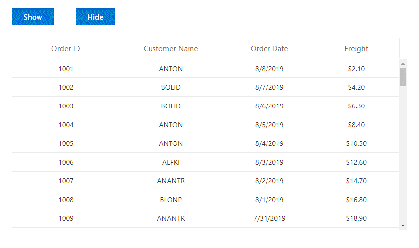

<!-- ValueAccessor

The [`ValueAccessor`](https://help.syncfusion.com/cr/blazor/Syncfusion.Blazor.Grids.GridColumn.html) property is used to access/manipulate the value of the displayed data. You can achieve custom value formatting by using the [`ValueAccessor`](https://help.syncfusion.com/cr/blazor/Syncfusion.Blazor.Grids.GridColumn.html) property.

The following sample code demonstrates the displayed data manipulated for two columns using the [`ValueAccessor`](https://help.syncfusion.com/cr/blazor/Syncfusion.Blazor.Grids.GridColumn.html) property,

```cshtml
@using Syncfusion.Blazor.Grids

<SfGrid DataSource="@Orders" Height="315">
    <GridColumns>
        <GridColumn Field=@nameof(Order.OrderID) HeaderText="Order ID" TextAlign="TextAlign.Center" Width="150"></GridColumn>
        <GridColumn Field=@nameof(Order.CustomerID) HeaderText="Customer Name" Width="150" TextAlign="TextAlign.Center"></GridColumn>
        <GridColumn Field=@nameof(Order.OrderDate) HeaderText="Order Date" Format="d" Type="ColumnType.Date" TextAlign="TextAlign.Center" Width="130"></GridColumn>
        <GridColumn Field=@nameof(Order.Freight) HeaderText="Freight" Format="C2" TextAlign="TextAlign.Center" Width="120" ValueAccessor=@CurrencyFormatter></GridColumn>
    </GridColumns>
</SfGrid>

@code{
    public List<Order> Orders { get; set; }

    protected override void OnInitialized()
    {
        Orders = Enumerable.Range(1, 75).Select(x => new Order()
        {
            OrderID = 1000 + x,
            CustomerID = (new string[] { "ALFKI", "ANANTR", "ANTON", "BLONP", "BOLID" })[new Random().Next(5)],
            Freight = 2.1 * x,
            OrderDate = DateTime.Now.AddDays(-x),
        }).ToList();
    }

    public class Order
    {
        public int? OrderID { get; set; }
        public string CustomerID { get; set; }
        public DateTime? OrderDate { get; set; }
        public double? Freight { get; set; }
    }

    public string CurrencyFormatter(String Field, Object Data, Object Column)
    {
        return "€" + new List<string> Data["Freight"];
    }
}
```

The following image represents the Grid with manipulated column data. -->

<!-- Display array type columns

You can bind an array of objects in a column by using the [`ValueAccessor`](https://help.syncfusion.com/cr/blazor/Syncfusion.Blazor.Grids.GridColumn.html) property.

In the following sample code, the name field has an array of two objects, FirstName and LastName are joined and bound to a column using the [`ValueAccessor`](https://help.syncfusion.com/cr/blazor/Syncfusion.Blazor.Grids.GridColumn.html) property.

```cshtml
@using Syncfusion.Blazor.Grids

<SfGrid DataSource="@Employees">
    <GridColumns>
        <GridColumn Field=@nameof(EmployeeData.EmployeeID) HeaderText="Employee ID" TextAlign="TextAlign.Center" Width="120"></GridColumn>
        <GridColumn Field=@nameof(EmployeeData.Name) HeaderText="Full Name" TextAlign="TextAlign.Center" ValueAccessor=@ValueAccess Width="130"></GridColumn>
        <GridColumn Field=@nameof(EmployeeData.Title) HeaderText="Title" TextAlign="TextAlign.Center" Width="120"></GridColumn>
    </GridColumns>
</SfGrid>

@code{
    List<EmployeeData> Employees = new List<EmployeeData>
    {
        new EmployeeData() { EmployeeID = 1, Name = { FirstName = "Nancy", LastName = "Davolio" }, Title = "Vice President, Sales" },
        new EmployeeData() { EmployeeID = 2, Name = { FirstName = "Andrew", LastName = "Fuller" }, Title = "Sales Representative" },
        new EmployeeData() { EmployeeID = 3, Name = { FirstName = "Steven", LastName = "Buchanan" }, Title = "Sales Representative" },
        new EmployeeData() { EmployeeID = 4, Name = { FirstName = "Michael", LastName = "Suyama" }, Title = "Inside Sales Coordinator" },
        new EmployeeData() { EmployeeID = 5, Name = { FirstName = "Laura", LastName = "Callahan" }, Title = "Sales Manager" },
        new EmployeeData() { EmployeeID = 6, Name = { FirstName = "Anne", LastName = "Dodsworth" }, Title = "Sales Representative" },
        new EmployeeData() { EmployeeID = 7, Name = { FirstName = "Robert", LastName = "King" }, Title = "Sales Representative" },
        new EmployeeData() { EmployeeID = 8, Name = { FirstName = "Margaret", LastName = "Peacock" }, Title = "Sales Representative" }
    };

    public class EmployeeData
    {
        public int EmployeeID { get; set; }
        public EmployeeName Name { get; set; }
        public string Title { get; set; }
    }

    public class EmployeeName
    {
        public string FirstName { get; set; }
        public string LastName { get; set; }
    }

    public string ValueAccess(string Field, object Data, object Column)
    {
        return Data[Field].Select(s => s.LastName || s.FirstName).Join("");
    }
}
```

The following image represents the bound column data in Grid using ValueAccessor property -->

<!-- Expression column

You can achieve the expression column by using the [`ValueAccessor`](https://help.syncfusion.com/cr/blazor/Syncfusion.Blazor.Grids.GridColumn.html) property.

The following sample code demonstrates expression column achieved using [`ValueAccessor`](https://help.syncfusion.com/cr/blazor/Syncfusion.Blazor.Grids.GridColumn.html) for **Calories** column,

```cshtml
@using Syncfusion.Blazor.Grids

<SfGrid DataSource="@FoodInformation">
    <GridColumns>
        <GridColumn Field=@nameof(FoodData.FoodName) HeaderText="Food Name" TextAlign="TextAlign.Center" Width="120"></GridColumn>
        <GridColumn Field=@nameof(FoodData.Time) HeaderText="Intake Time" TextAlign="TextAlign.Center" Width="130"></GridColumn>
        <GridColumn Field=@nameof(FoodData.Protein) HeaderText="Protein" TextAlign="TextAlign.Center" Width="130"></GridColumn>
        <GridColumn Field=@nameof(FoodData.Fat) HeaderText="Fat" TextAlign="TextAlign.Center" Width="120"></GridColumn>
        <GridColumn Field=@nameof(FoodData.Carbohydrate) HeaderText="Carbohydrate" TextAlign="TextAlign.Center" Width="120"></GridColumn>
        <GridColumn HeaderText="Calorie" TextAlign="TextAlign.Center" ValueAccessor=@TotalCalories Width="120"></GridColumn>
    </GridColumns>
</SfGrid>

@code{
    List<FoodData> FoodInformation = new List<FoodData>
    {
        new FoodData() { FoodId = 1, Time = "8:40 AM", FoodName = "CHEESE BURGER", Protein = 15, Fat = 15, Carbohydrate = 28 },
        new FoodData() { FoodId = 2, Time = "10:30 AM", FoodName = "PIZZA", Protein = 15, Fat = 9, Carbohydrate = 8 },
        new FoodData() { FoodId = 3, Time = "12:45 PM", FoodName = "CHICKEN NOODLE", Protein = 4, Fat = 2, Carbohydrate = 9 },
        new FoodData() { FoodId = 4, Time = "5:30 PM", FoodName = "YOGURT", Protein = 10, Fat = 2, Carbohydrate = 43 },
        new FoodData() { FoodId = 5, Time = "6:30 PM", FoodName = "BEEF SANDWICH", Protein = 22, Fat = 13, Carbohydrate = 34 },
        new FoodData() { FoodId = 6, Time = "7:00 PM", FoodName = "CHICKEN BURGER", Protein = 15, Fat = 10, Carbohydrate = 25 },
        new FoodData() { FoodId = 7, Time = "8:00 PM", FoodName = "VEG BURGER", Protein = 14, Fat = 5, Carbohydrate = 53 },
        new FoodData() { FoodId = 8, Time = "9:00 PM", FoodName = "VEG SANDWICH", Protein = 20, Fat = 15, Carbohydrate = 24 },
        new FoodData() { FoodId = 9, Time = "11:00 PM", FoodName = "EGG BURGER", Protein = 25, Fat = 16, Carbohydrate = 35 },
    };

    public class FoodData
    {
        public int FoodId { get; set; }
        public string Time { get; set; }
        public string FoodName { get; set; }
        public int Protein { get; set; }
        public int Fat { get; set; }
        public int Carbohydrate { get; set; }
    }

    public int TotalCalories(string Field, FoodData Data, object Column)
    {
        return Data.Protein * 4 + Data.Fat * 9 + Data.Carbohydrate * 4;
    }
}
```

The following image represents expression column achieved in Grid -->

## Render boolean values as checkbox

To render boolean values as checkbox in columns, you need to set [DisplayAsCheckBox](https://help.syncfusion.com/cr/blazor/Syncfusion.Blazor.Grids.GridColumn.html#Syncfusion_Blazor_Grids_GridColumn_DisplayAsCheckBox) property as true.

The following sample code demonstrates [DisplayAsCheckBox](https://help.syncfusion.com/cr/blazor/Syncfusion.Blazor.Grids.GridColumn.html#Syncfusion_Blazor_Grids_GridColumn_DisplayAsCheckBox) property enabled for **Verified** column,

```cshtml
@using Syncfusion.Blazor.Grids

<SfGrid DataSource="@OrderData">
    <GridColumns>
        <GridColumn Field=@nameof(Order.OrderID) HeaderText="Order ID" TextAlign="TextAlign.Center" Width="120"></GridColumn>
        <GridColumn Field=@nameof(Order.CustomerID) HeaderText="Customer ID" TextAlign="TextAlign.Center" Width="130"></GridColumn>
        <GridColumn Field=@nameof(Order.Freight) HeaderText="Freight" TextAlign="TextAlign.Center" Width="130"></GridColumn>
        <GridColumn Field=@nameof(Order.ShipName) HeaderText="Ship Name" TextAlign="TextAlign.Center" Width="120"></GridColumn>
        <GridColumn Field=@nameof(Order.Verified) HeaderText="Verified" TextAlign="TextAlign.Center" DisplayAsCheckBox="true" Width="120"></GridColumn>
    </GridColumns>
</SfGrid>

@code{
    List<Order> OrderData = new List<Order>
    {
        new Order() { OrderID = 10248, CustomerID = "VINET", Freight = 32.38, ShipName = "Vins et alcools Chevalier", Verified = true },
        new Order() { OrderID = 10249, CustomerID = "TOMSP", Freight = 11.61, ShipName = "Toms Spezialitäten", Verified = false },
        new Order() { OrderID = 10250, CustomerID = "HANAR", Freight = 65.83, ShipName = "Hanari Carnes", Verified = true },
        new Order() { OrderID = 10251, CustomerID = "VICTE", Freight = 41.34, ShipName = "Victuailles en stock", Verified = false },
        new Order() { OrderID = 10252, CustomerID = "SUPRD", Freight = 51.3, ShipName = "Suprêmes délices", Verified = false },
        new Order() { OrderID = 10253, CustomerID = "HANAR", Freight = 58.17, ShipName = "Hanari Carnes", Verified = false },
        new Order() { OrderID = 10254, CustomerID = "CHOPS", Freight = 22.98, ShipName = "Chop-suey Chinese", Verified = true },
        new Order() { OrderID = 10255, CustomerID = "RICSU", Freight = 148.33, ShipName = "Richter Supermarket", Verified = true },
        new Order() { OrderID = 10256, CustomerID = "WELLI", Freight = 13.97, ShipName = "Wellington Importadora", Verified = false },
        new Order() { OrderID = 10257, CustomerID = "HILAA", Freight = 81.91, ShipName = "HILARION-Abastos", Verified = true }
    };
    public class Order
    {
        public int? OrderID { get; set; }
        public string CustomerID { get; set; }
        public double? Freight { get; set; }
        public string ShipName { get; set; }
        public bool Verified { get; set; }
    }
}
```

> Need to define [EditType](https://help.syncfusion.com/cr/blazor/Syncfusion.Blazor.Grids.ColumnModel.html#Syncfusion_Blazor_Grids_ColumnModel_EditType) as **EditType.BooleanEdit** to GridColumn to render checkbox while editing a boolean value.

```cshtml
<GridColumn Field=@nameof(Order.Verified) HeaderText="Verified" Type="ColumnType.Boolean" EditType="EditType.BooleanEdit" TextAlign="TextAlign.Center" DisplayAsCheckBox="true" Width="120"></GridColumn>
```

The following image represents the DisplayAsCheckBox enabled for a DataGrid column,


> You can refer to the [Blazor DataGrid](https://www.syncfusion.com/blazor-components/blazor-datagrid) feature tour page for its groundbreaking feature representations. You can also explore [Blazor DataGrid example](https://blazor.syncfusion.com/demos/datagrid/overview?theme=bootstrap4) to understand how to present and manipulate data.