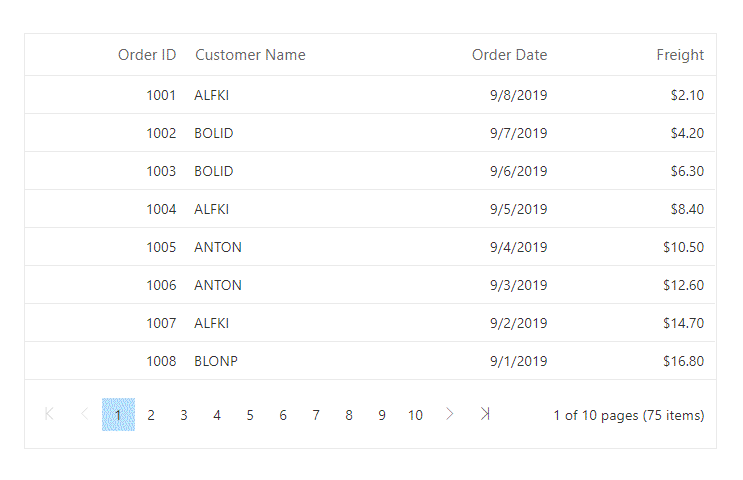
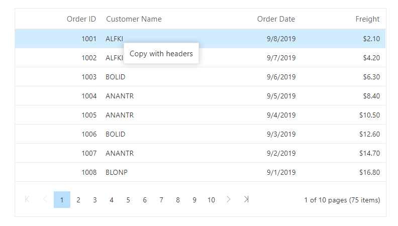

# Context menu

The DataGrid has options to show the context menu when right clicked on it. To enable this feature, you need to define either default or custom item in the [`ContextMenuItems`](https://help.syncfusion.com/cr/aspnetcore-blazor/Syncfusion.Blazor.Grids.ContextMenuItemModel.html) property.

The following table lists the default context menu items,

Items |Description
-----|-----
`AutoFit` | Auto fit the current column.
`AutoFitAll` | Auto fit all columns.
`Edit` | Edit the current record.
`Delete` | Delete the current record.
`Save` | Save the edited record.
`Cancel` | Cancel the edited state.
`Copy` | Copy the selected records.
`PdfExport` | Export the datagrid data as Pdf document.
`ExcelExport` | Export the datagrid data as Excel document.
`CsvExport` | Export the datagrid data as CSV document.
`Group` | Group the current column.
`Ungroup` | Ungroup the current column.
`SortAscending` | Sort the current column in ascending order.
`SortDescending` | Sort the current column in descending order.
`FirstPage` | Go to the first page.
`PrevPage` | Go to the previous page.
`LastPage` | Go to the last page.
`NextPage` | Go to the next page.

The default context menu provides different types of context menu items for the following elements.

Elements | Context Menu Items
-----|-----
Header    |   AutoFit
Header    |   AutoFitAll
Header    |   Group
Header    |   Ungroup
Header    |   SortAscending
Header    |   SortDescending
Content   |   Edit
Content   |   Delete
Content   |   Save
Content   |   Cancel
Content   |   Copy
Content   |   PdfExport
Content   |   ExcelExport
Content   |   CsvExport
Pager     |   FirstPage
Pager     |   PrevPage
Pager     |   LastPage
Pager     |   NextPage

The following sample code demonstrates enabling context menu with its default items,





@using Syncfusion.Blazor.Grids

<SfGrid DataSource="@Orders" AllowSorting="true" AllowPaging="true" AllowExcelExport="true" AllowPdfExport="true" ContextMenuItems="@(new List<object>() { "AutoFit", "AutoFitAll", "SortAscending", "SortDescending","Copy", "Edit", "Delete", "Save", "Cancel","PdfExport", "ExcelExport", "CsvExport", "FirstPage", "PrevPage","LastPage", "NextPage"})">
    <GridPageSettings PageSize="8"></GridPageSettings>
    <GridEditSettings AllowEditing="true" AllowDeleting="true"></GridEditSettings>
    <GridColumns>
        <GridColumn Field=@nameof(Order.OrderID) HeaderText="Order ID" IsPrimaryKey="true" TextAlign="TextAlign.Right" Width="120"></GridColumn>
        <GridColumn Field=@nameof(Order.CustomerID) HeaderText="Customer Name" Width="150"></GridColumn>
        <GridColumn Field=@nameof(Order.OrderDate) HeaderText=" Order Date" Format="d" Type="ColumnType.Date" TextAlign="TextAlign.Right" Width="130"></GridColumn>
        <GridColumn Field=@nameof(Order.Freight) HeaderText="Freight" Format="C2" TextAlign="TextAlign.Right" Width="120"></GridColumn>
    </GridColumns>
</SfGrid>

@code{
    public List<Order> Orders { get; set; }

    protected override void OnInitialized()
    {
        Orders = Enumerable.Range(1, 75).Select(x => new Order()
        {
            OrderID = 1000 + x,
            CustomerID = (new string[] { "ALFKI", "ANANTR", "ANTON", "BLONP", "BOLID" })[new Random().Next(5)],
            Freight = 2.1 * x,
            OrderDate = DateTime.Now.AddDays(-x),
        }).ToList();
    }

    public class Order
    {
        public int? OrderID { get; set; }
        public string CustomerID { get; set; }
        public DateTime? OrderDate { get; set; }
        public double? Freight { get; set; }
    }
}





The following GIF represents the DataGrid enabled with default context menu items,

## Custom context menu items

The custom context menu items can be added by defining the [`ContextMenuItems`](https://help.syncfusion.com/cr/aspnetcore-blazor/Syncfusion.Blazor.Grids.ContextMenuItemModel.html) as a collection of [`ContextMenuItemModel`](https://help.syncfusion.com/cr/aspnetcore-blazor/Syncfusion.Blazor.Grids.ContextMenuItemModel.html). Actions for these customized items can be defined in the [`ContextMenuItemClicked`](https://help.syncfusion.com/cr/blazor/Syncfusion.Blazor.Grids.ContextMenuClickEventArgs-1.html) event.

The following sample code demonstrates defining custom context menu item and its corresponding action in the [`ContextMenuItemClicked`](https://help.syncfusion.com/cr/blazor/Syncfusion.Blazor.Grids.ContextMenuClickEventArgs-1.html) event,





@using Syncfusion.Blazor.Grids

<SfGrid @ref="DefaultGrid" DataSource="@Orders" AllowPaging="true" ContextMenuItems="@(new List<ContextMenuItemModel>() { new ContextMenuItemModel { Text = "Copy with headers", Target = ".e-content", Id = "copywithheader" } })">
    <GridEvents ContextMenuItemClicked="OnContextMenuClick" TValue="Order"></GridEvents>
    <GridPageSettings PageSize="8"></GridPageSettings>
    <GridColumns>
        <GridColumn Field=@nameof(Order.OrderID) HeaderText="Order ID" TextAlign="TextAlign.Right" Width="120" IsPrimaryKey="true"></GridColumn>
        <GridColumn Field=@nameof(Order.CustomerID) HeaderText="Customer Name" Width="150"></GridColumn>
        <GridColumn Field=@nameof(Order.OrderDate) HeaderText=" Order Date" Format="d" Type="ColumnType.Date" TextAlign="TextAlign.Right" Width="130"></GridColumn>
        <GridColumn Field=@nameof(Order.Freight) HeaderText="Freight" Format="C2" TextAlign="TextAlign.Right" Width="120"></GridColumn>
    </GridColumns>
</SfGrid>

@code{
    public List<Order> Orders { get; set; }

    private SfGrid<Order> DefaultGrid;

    protected override void OnInitialized()
    {
        Orders = Enumerable.Range(1, 75).Select(x => new Order()
        {
            OrderID = 1000 + x,
            CustomerID = (new string[] { "ALFKI", "ANANTR", "ANTON", "BLONP", "BOLID" })[new Random().Next(5)],
            Freight = 2.1 * x,
            OrderDate = DateTime.Now.AddDays(-x),
        }).ToList();
    }

    public class Order
    {
        public int? OrderID { get; set; }
        public string CustomerID { get; set; }
        public DateTime? OrderDate { get; set; }
        public double? Freight { get; set; }
    }

    public void OnContextMenuClick(ContextMenuClickEventArgs<Order> args)
    {
        if (args.Item.Id == "copywithheader")
        {
            this.DefaultGrid.Copy(true);
        }
    }
}





The following image represents the DataGrid enabled with custom context menu item,

## Built-in and Custom context menu items

DataGrid have an option to use both built-in and custom context menu items at same time.

The following sample code demonstrates defining built-in and custom context menu items and custom context menu item corresponding action in the [`ContextMenuItemClicked`](https://help.syncfusion.com/cr/blazor/Syncfusion.Blazor.Grids.ContextMenuClickEventArgs-1.html) event,





@using Syncfusion.Blazor.Grids

<SfGrid @ref="DefaultGrid" DataSource="@Orders" AllowPaging="true" ContextMenuItems="@(new List<Object>() { "Copy", new ContextMenuItemModel { Text = "Copy with headers", Target = ".e-content", Id = "copywithheader" } })">
    <GridEvents ContextMenuItemClicked="OnContextMenuClick" TValue="Order"></GridEvents>
    <GridPageSettings PageSize="8"></GridPageSettings>
    <GridColumns>
        <GridColumn Field=@nameof(Order.OrderID) HeaderText="Order ID" TextAlign="TextAlign.Right" Width="120" IsPrimaryKey="true"></GridColumn>
        <GridColumn Field=@nameof(Order.CustomerID) HeaderText="Customer Name" Width="150"></GridColumn>
        <GridColumn Field=@nameof(Order.OrderDate) HeaderText=" Order Date" Format="d" Type="ColumnType.Date" TextAlign="TextAlign.Right" Width="130"></GridColumn>
        <GridColumn Field=@nameof(Order.Freight) HeaderText="Freight" Format="C2" TextAlign="TextAlign.Right" Width="120"></GridColumn>
    </GridColumns>
</SfGrid>

@code{
    public List<Order> Orders { get; set; }

    private SfGrid<Order> DefaultGrid;

    protected override void OnInitialized()
    {
        Orders = Enumerable.Range(1, 75).Select(x => new Order()
        {
            OrderID = 1000 + x,
            CustomerID = (new string[] { "ALFKI", "ANANTR", "ANTON", "BLONP", "BOLID" })[new Random().Next(5)],
            Freight = 2.1 * x,
            OrderDate = DateTime.Now.AddDays(-x),
        }).ToList();
    }

    public class Order
    {
        public int? OrderID { get; set; }
        public string CustomerID { get; set; }
        public DateTime? OrderDate { get; set; }
        public double? Freight { get; set; }
    }

    public void OnContextMenuClick(ContextMenuClickEventArgs<Order> args)
    {
        if (args.Item.Id == "copywithheader")
        {
            this.DefaultGrid.Copy(true);
        }
    }
}





## Sub context menu items in DataGrid

The sub context menu items can be added by defining the collection of **MenuItems** for **Items** Property in [`ContextMenuItems`](https://help.syncfusion.com/cr/aspnetcore-blazor/Syncfusion.Blazor.Grids.ContextMenuItemModel.html) Actions for these customized items can be defined in the [`ContextMenuItemClicked`](https://help.syncfusion.com/cr/blazor/Syncfusion.Blazor.Grids.ContextMenuClickEventArgs-1.html) event.

The following sample code demonstrates defining sub context menu item and its corresponding action in the [`ContextMenuItemClicked`](https://help.syncfusion.com/cr/blazor/Syncfusion.Blazor.Grids.ContextMenuClickEventArgs-1.html) event,





@using Syncfusion.Blazor.Grids
@using Syncfusion.Blazor.Navigations

<SfGrid @ref="DefaultGrid" DataSource="@Orders" AllowPaging="true" ContextMenuItems="@(new List<ContextMenuItemModel>() { new ContextMenuItemModel { Text = "Clipboard", Target = ".e-content", Id = "clipboard", Items = new List<MenuItem>() { new MenuItem { Text = "Copy", Id = "copy" }, new MenuItem { Text ="CopyWithHeader", Id ="copywithheader" } } } })">
    <GridEvents ContextMenuItemClicked="OnContextMenuClick" TValue="Order"></GridEvents>
    <GridPageSettings PageSize="8"></GridPageSettings>
    <GridColumns>
        <GridColumn Field=@nameof(Order.OrderID) HeaderText="Order ID" TextAlign="TextAlign.Right" Width="120" IsPrimaryKey="true"></GridColumn>
        <GridColumn Field=@nameof(Order.OrderID) HeaderText="Order ID" TextAlign="TextAlign.Right" Width="120" IsPrimaryKey="true"></GridColumn>
        <GridColumn Field=@nameof(Order.CustomerID) HeaderText="Customer Name" Width="150"></GridColumn>
        <GridColumn Field=@nameof(Order.OrderDate) HeaderText=" Order Date" Format="d" Type="ColumnType.Date" TextAlign="TextAlign.Right" Width="130"></GridColumn>
        <GridColumn Field=@nameof(Order.Freight) HeaderText="Freight" Format="C2" TextAlign="TextAlign.Right" Width="120"></GridColumn>
    </GridColumns>
</SfGrid>

@code{
    public List<Order> Orders { get; set; }

    private SfGrid<Order> DefaultGrid;

    protected override void OnInitialized()
    {
        Orders = Enumerable.Range(1, 75).Select(x => new Order()
        {
            OrderID = 1000 + x,
            CustomerID = (new string[] { "ALFKI", "ANANTR", "ANTON", "BLONP", "BOLID" })[new Random().Next(5)],
            Freight = 2.1 * x,
            OrderDate = DateTime.Now.AddDays(-x),
        }).ToList();
    }

    public class Order
    {
        public int? OrderID { get; set; }
        public string CustomerID { get; set; }
        public DateTime? OrderDate { get; set; }
        public double? Freight { get; set; }
    }

    public void OnContextMenuClick(ContextMenuClickEventArgs<Order> args)
    {
        if (args.Item.Id == "copywithheader")
        {
            this.DefaultGrid.Copy(true);
        }
        if (args.Item.Id == "copy")
        {
            this.DefaultGrid.Copy(false);
        }
    }
}





## Disable the Context menu for specific columns in DataGrid

Context Menu can be prevented for specific columns using [`ContextMenuOpen`](https://blazor.syncfusion.com/documentation/datagrid/events/#contextmenuopen) event of DataGrid. This is event will be triggered before opening the ContextMenu. We can prevent the context menu from opening by defining the **Cancel** arguments of [`ContextMenuOpen`](https://blazor.syncfusion.com/documentation/datagrid/events/#contextmenuopen) to **false**.

The following sample code demonstrates the disabling the context for specific column using event arguments of [`ContextMenuOpen`](https://blazor.syncfusion.com/documentation/datagrid/events/#contextmenuopen) event,





@using Syncfusion.Blazor.Grids

<SfGrid @ref="DefaultGrid" DataSource="@Orders" AllowPaging="true" ContextMenuItems="@(new List<ContextMenuItemModel>() { new ContextMenuItemModel { Text = "Copy with headers", Target = ".e-content", Id = "copywithheader" } })">
    <GridEvents ContextMenuItemClicked="OnContextMenuClick" ContextMenuOpen="OnContextMenuOpen" TValue="Order"></GridEvents>
    <GridPageSettings PageSize="8"></GridPageSettings>
    <GridColumns>
        <GridColumn Field=@nameof(Order.OrderID) HeaderText="Order ID" TextAlign="TextAlign.Right" Width="120" IsPrimaryKey="true"></GridColumn>
        <GridColumn Field=@nameof(Order.CustomerID) HeaderText="Customer Name" Width="150"></GridColumn>
        <GridColumn Field=@nameof(Order.OrderDate) HeaderText=" Order Date" Format="d" Type="ColumnType.Date" TextAlign="TextAlign.Right" Width="130"></GridColumn>
        <GridColumn Field=@nameof(Order.Freight) HeaderText="Freight" Format="C2" TextAlign="TextAlign.Right" Width="120"></GridColumn>
    </GridColumns>
</SfGrid>

@code{
    public List<Order> Orders { get; set; }

    private SfGrid<Order> DefaultGrid;

    protected override void OnInitialized()
    {
        Orders = Enumerable.Range(1, 75).Select(x => new Order()
        {
            OrderID = 1000 + x,
            CustomerID = (new string[] { "ALFKI", "ANANTR", "ANTON", "BLONP", "BOLID" })[new Random().Next(5)],
            Freight = 2.1 * x,
            OrderDate = DateTime.Now.AddDays(-x),
        }).ToList();
    }

    public class Order
    {
        public int? OrderID { get; set; }
        public string CustomerID { get; set; }
        public DateTime? OrderDate { get; set; }
        public double? Freight { get; set; }
    }

    public void OnContextMenuOpen(ContextMenuOpenEventArgs<Order> Args)
    {
        if (Args.Column.Field == "OrderDate")
        {
            Args.Cancel = true; // to prevent the context  menu from opening
        }
    }

    public void OnContextMenuClick(ContextMenuClickEventArgs<Order> args)
    {
        if (args.Item.Id == "copywithheader")
        {
            this.DefaultGrid.Copy(true);
        }
    }
}





## Disable context menu items dynamically in DataGrid

You can enable or disable context menu items using the **Disabled** property. Here, we enable and disable the **Edit** context menu items in [`ContextMenuOpen`](https://blazor.syncfusion.com/documentation/datagrid/events/#contextmenuopen) event of DataGrid. This is event will be triggered before opening the ContextMenu. We can disabled the context menu item by defining the corresponding context menu items **Disabled** property as **true**.

The following sample code demonstrates how to enable or disable context menu items dynamically in Grid using event arguments of [`ContextMenuOpen`](https://blazor.syncfusion.com/documentation/datagrid/events/#contextmenuopen) event,





@using Syncfusion.Blazor.Grids

<SfGrid DataSource="@Orders" AllowPaging="true" ContextMenuItems="@(new List<object>() { "Edit", "Delete", "Save", "Cancel","PdfExport", "ExcelExport", "CsvExport", "FirstPage", "PrevPage","LastPage", "NextPage"})">
    <GridEvents ContextMenuOpen="OnContextMenuOpen" TValue="Order"></GridEvents>
    <GridPageSettings PageSize="8"></GridPageSettings>
    <GridEditSettings AllowEditing="true" AllowDeleting="true"></GridEditSettings>
    <GridColumns>
        <GridColumn Field=@nameof(Order.OrderID) HeaderText="Order ID" IsPrimaryKey="true" TextAlign="TextAlign.Right" Width="120"></GridColumn>
        <GridColumn Field=@nameof(Order.CustomerID) HeaderText="Customer Name" Width="150"></GridColumn>
        <GridColumn Field=@nameof(Order.OrderDate) HeaderText=" Order Date" Format="d" Type="ColumnType.Date" TextAlign="TextAlign.Right" Width="130"></GridColumn>
        <GridColumn Field=@nameof(Order.Freight) HeaderText="Freight" Format="C2" TextAlign="TextAlign.Right" Width="120"></GridColumn>
    </GridColumns>
</SfGrid>

@code{
    public List<Order> Orders { get; set; }

    protected override void OnInitialized()
    {
        Orders = Enumerable.Range(1, 75).Select(x => new Order()
        {
            OrderID = 1000 + x,
            CustomerID = (new string[] { "ALFKI", "ANANTR", "ANTON", "BLONP", "BOLID" })[new Random().Next(5)],
            Freight = 2.1 * x,
            OrderDate = DateTime.Now.AddDays(-x),
        }).ToList();
    }

    public void OnContextMenuOpen(ContextMenuOpenEventArgs<Order> Args)
    {
#pragma warning disable BL0005
        if (Args.Column.Field == "OrderDate")  // you can check condition based on your requirement
        {
            Args.ContextMenuObj.Items[0].Disabled = true; // to disable edit context menu item
        }
        else
        {
            Args.ContextMenuObj.Items[0].Disabled = false; // to enable edit context menu item
        }
#pragma warning restore BL0005
    }

    public class Order
    {
        public int? OrderID { get; set; }
        public string CustomerID { get; set; }
        public DateTime? OrderDate { get; set; }
        public double? Freight { get; set; }
    }
}





> You can refer to our [Blazor DataGrid](https://www.syncfusion.com/blazor-components/blazor-datagrid) feature tour page for its groundbreaking feature representations. You can also explore our [Blazor DataGrid example](https://blazor.syncfusion.com/demos/datagrid/overview?theme=bootstrap4) to understand how to present and manipulate data.