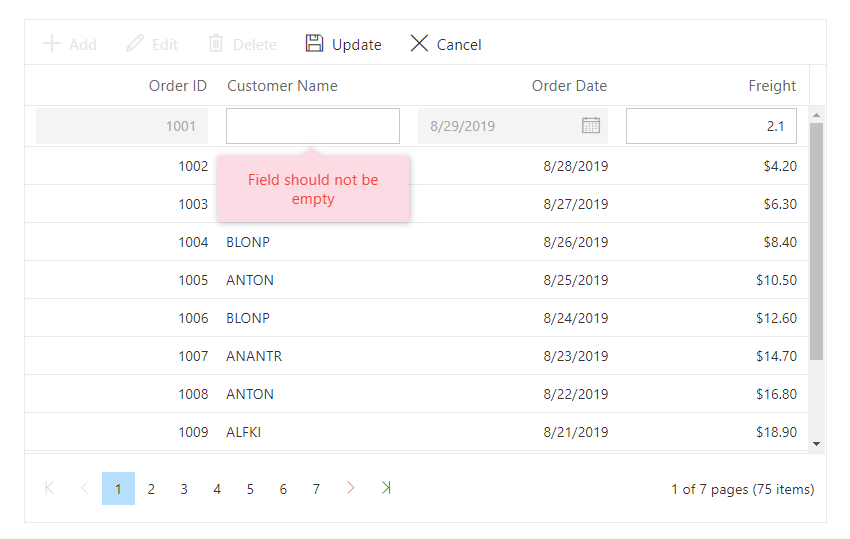

# Data Annotation

Data Annotations helps us to define rules to the model classes or properties to perform data validation and display suitable messages to end users.

The Data Annotation can be enabled by referencing the **System.ComponentModel.DataAnnotations** namespace which maps the data annotations to the corresponding DataGrid Column property.

The list of data annotation attributes that are supported in DataGrid component are provided below,

| Attribute Name | Functionality |
|-------|---------|
| DisplayFormat | Sets 'DisplayFormat' property for the DataGrid column to be rendered.|
| DisplayName | Sets the display name for the DataGrid column.|
| ReadOnly | Sets `AllowEditing` for a particular column |
| Key | Sets `PrimaryKey` in DataGrid Columns |
| Validations are,<br><br>1. RequiredAttribute<br>2. StringLengthAttribute<br>3. RangeAttribute<br>4. RegularExpressionAttribute<br>5. MinLengthAttribute<br>6. MaxLengthAttribute<br>7. EmailAddressAttribute<br>8. CompareAttribute<br>9. DataTypeAttribute<br>10.  DataType.Custom<br>11. DataType.Date<br>12. DataType.DateTime<br>13. DataType.EmailAddress<br>14. DataType.ImageUrl<br>15. DataType.Url | The data annotation validation attributes are used as `validation rules` in the DataGrid CRUD operations|

> DataGrid Property has more priority than Data Annotation. For Instance, if DisplayName Attribute is set to a Field in DataGrid Model class and also HeaderText is set to the same DataGrid column property, then the value of HeaderText property will be considered and shown in the DataGrid header.

The following sample code demonstrates data annotations implemented in the DataGrid component,

```cshtml
@using Syncfusion.Blazor.Grids
@using System.ComponentModel.DataAnnotations;

<SfGrid TValue="Order" DataSource="@Orders" Height="315" AllowPaging="true" Toolbar="@(new List<string>() { "Add", "Edit", "Delete", "Update", "Cancel" })">
    <GridEditSettings AllowAdding="true" AllowEditing="true" AllowDeleting="true"></GridEditSettings>
    <GridColumns>
        <GridColumn Field=@nameof(Order.OrderID) TextAlign="TextAlign.Right" Width="120"></GridColumn>
        <GridColumn Field=@nameof(Order.CustomerID) Width="120"></GridColumn>
        <GridColumn Field=@nameof(Order.OrderDate) EditType="EditType.DatePickerEdit" Format="d" TextAlign="TextAlign.Right" Width="130" Type="ColumnType.Date"></GridColumn>
        <GridColumn Field=@nameof(Order.Freight) HeaderText="Freight" TextAlign="TextAlign.Right" Format="C2" Width="120"></GridColumn>
    </GridColumns>
</SfGrid>

@code{
    public List<Order> Orders { get; set; }

    protected override void OnInitialized()
    {
        Orders = Enumerable.Range(1, 75).Select(x => new Order()
        {
            OrderID = 1000 + x,
            CustomerID = (new string[] { "ALFKI", "ANANTR", "ANTON", "BLONP", "BOLID" })[new Random().Next(5)],
            Freight = 2.1 * x,
            OrderDate = DateTime.Now.AddDays(-x),
        }).ToList();
    }

    public class Order
    {
        // Sets column as primary key
        [Key]
        // Sets column as required and error message to be displayed when empty
        [Required(ErrorMessage ="Order ID  should not be empty")]
        // Sets header text to the column
        [Display(Name = "Order ID")]
        public int? OrderID { get; set; }
        [Display(Name = "Customer Name")]
        // Sets column as required and error message to be displayed when empty
        [Required(ErrorMessage = "Field should not be empty")]
        public string CustomerID { get; set; }
        // Sets data type of column as Date
        [DataType(DataType.Date)]
        [Display(Name = "Order Date")]
        // Sets column as read only
        [Editable(false)]
        public DateTime? OrderDate { get; set; }
        [Display(Name = "Freight")]
        public double? Freight { get; set; }
    }
}
```

The following image represents data annotations enabled in the DataGrid columns,


> You can refer to our [Blazor DataGrid](https://www.syncfusion.com/blazor-components/blazor-datagrid) feature tour page for its groundbreaking feature representations. You can also explore our [Blazor DataGrid example](https://blazor.syncfusion.com/demos/datagrid/overview?theme=bootstrap4) to understand how to present and manipulate data.
