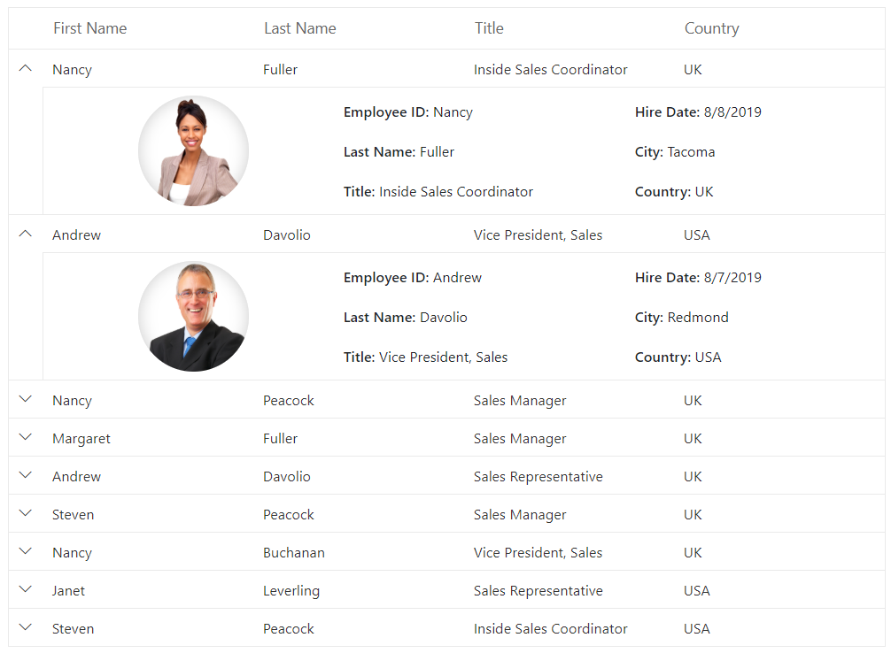
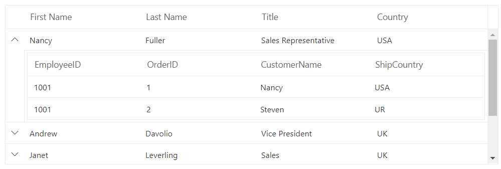

# Detail Template in Blazor DataGrid Component

> Before adding detail template to the datagrid, it is recommended to go through the [template](./templates/#templates) section topic to configure the template.

To know about **Detail Template** in Blazor DataGrid Component, you can check this video.



The detail template provides additional information about a particular row by expanding or collapsing detail content. The **DetailTemplate** should be wrapped around a component named [GridTemplates](./templates/#gridtemplates-component) as follows.

```cshtml
@using Syncfusion.Blazor.Grids

<SfGrid DataSource="@Employees">
    <GridTemplates>
        <DetailTemplate>
            @{
                var employee = (context as EmployeeData);
                <table class="detailtable" width="100%">
                    <colgroup>
                        <col width="35%">
                        <col width="35%">
                        <col width="30%">
                    </colgroup>
                    <tbody>
                        <tr>
                            <td rowspan="4" style="text-align: center;">
                                
                            </td>
                            <td>
                                <span style="font-weight: 500;">Employee ID: </span> @employee.FirstName
                            </td>
                            <td>
                                <span style="font-weight: 500;">Hire Date: </span> @employee.HireDate.Value.ToShortDateString()
                            </td>
                        </tr>
                        <tr>
                            <td>
                                <span style="font-weight: 500;">Last Name: </span> @employee.LastName
                            </td>
                            <td>
                                <span style="font-weight: 500;">City: </span> @employee.City
                            </td>
                        </tr>
                        <tr>
                            <td>
                                <span style="font-weight: 500;">Title: </span> @employee.Title
                            </td>
                            <td>
                                <span style="font-weight: 500;">Country: </span> @employee.Country
                            </td>
                        </tr>
                    </tbody>
                </table>
            }
        </DetailTemplate>
    </GridTemplates>
    <GridColumns>
        <GridColumn Field=@nameof(EmployeeData.FirstName) HeaderText="First Name" Width="110"> </GridColumn>
        <GridColumn Field=@nameof(EmployeeData.LastName) HeaderText="Last Name" Width="110"></GridColumn>
        <GridColumn Field=@nameof(EmployeeData.Title) HeaderText="Title" Width="110"></GridColumn>
        <GridColumn Field=@nameof(EmployeeData.Country) HeaderText="Country" Width="110"></GridColumn>
    </GridColumns>
</SfGrid>

<style type="text/css" class="cssStyles">
    .detailtable td {
        font-size: 13px;
        padding: 4px;
        max-width: 0;
        overflow: hidden;
        text-overflow: ellipsis;
        white-space: nowrap;
    }

    .photo {
        width: 100px;
        height: 100px;
        border-radius: 50px;
        box-shadow: inset 0 0 1px #e0e0e0, inset 0 0 14px rgba(0,0,0,0.2);
    }
</style>

@code{
    public List<EmployeeData> Employees { get; set; }

    protected override void OnInitialized()
    {
        Employees = Enumerable.Range(1, 9).Select(x => new EmployeeData()
        {
            EmployeeID = x,
            FirstName = (new string[] { "Nancy", "Andrew", "Janet", "Margaret", "Steven" })[new Random().Next(5)],
            LastName = (new string[] { "Davolio", "Fuller", "Leverling", "Peacock", "Buchanan" })[new Random().Next(5)],
            Title = (new string[] { "Sales Representative", "Vice President, Sales", "Sales Manager",
                                    "Inside Sales Coordinator" })[new Random().Next(4)],
            HireDate = DateTime.Now.AddDays(-x),
            City = (new string[] { "Seattle", "Tacoma", "Redmond", "Kirkland", "London" })[new Random().Next(5)],
            Country = (new string[] { "USA", "UK" })[new Random().Next(2)],
        }).ToList();
    }

    public class EmployeeData
    {
        public int? EmployeeID { get; set; }
        public string FirstName { get; set; }
        public string LastName { get; set; }
        public string Title { get; set; }
        public DateTime? HireDate { get; set; }
        public string City { get; set; }
        public string Country { get; set; }
    }
}
```




## Rendering custom component

To render the custom component inside the detail row, define the template in the [DetailTemplate](./templates/#detailtemplates-component) and render the custom component in any of the detail row element.

In the following sample, a datagrid component is rendered as custom component using detailed row details.

```cshtml
@using Syncfusion.Blazor.Grids
@using Syncfusion.Blazor.Data

<SfGrid DataSource="@Employees" Height="315px">
    <GridTemplates>
        <DetailTemplate>
            @{
                var employee = (context as EmployeeData);
                <SfGrid DataSource="@Orders" Query="@(new Query().Where("EmployeeID", "equal", employee.EmployeeID))">
                    <GridColumns>
                        <GridColumn Field=@nameof(Order.OrderID) HeaderText="First Name" Width="110"> </GridColumn>
                        <GridColumn Field=@nameof(Order.CustomerName) HeaderText="Last Name" Width="110"></GridColumn>
                        <GridColumn Field=@nameof(Order.ShipCountry) HeaderText="Title" Width="110"></GridColumn>
                    </GridColumns>
                </SfGrid>
            }
        </DetailTemplate>
    </GridTemplates>
    <GridColumns>
        <GridColumn Field=@nameof(EmployeeData.FirstName) HeaderText="First Name" Width="110"> </GridColumn>
        <GridColumn Field=@nameof(EmployeeData.LastName) HeaderText="Last Name" Width="110"></GridColumn>
        <GridColumn Field=@nameof(EmployeeData.Title) HeaderText="Title" Width="110"></GridColumn>
        <GridColumn Field=@nameof(EmployeeData.Country) HeaderText="Country" Width="110"></GridColumn>
    </GridColumns>
</SfGrid>

@code{

    List<EmployeeData> Employees = new List<EmployeeData>
{
        new EmployeeData() {EmployeeID = 1001, FirstName="Nancy", LastName="Fuller", Title="Sales Representative", Country="USA"},
        new EmployeeData() {EmployeeID = 1002, FirstName="Andrew", LastName="Davolio", Title="Vice President", Country="UK"},
        new EmployeeData() {EmployeeID = 1003, FirstName="Janet", LastName="Leverling", Title="Sales", Country="UK"},
        new EmployeeData() {EmployeeID = 1004, FirstName="Margaret", LastName="Peacock", Title="Sales Manager", Country="UAE"},
        new EmployeeData() {EmployeeID = 1005, FirstName="Steven", LastName="Buchanan", Title="Inside Sales Coordinator", Country="USA"},
        new EmployeeData() {EmployeeID = 1006, FirstName="Smith", LastName="Steven", Title="HR Manager", Country="UAE"},
    };

    List<Order> Orders = new List<Order> {
        new Order() {EmployeeID = 1001, OrderID=001, CustomerName="Nancy", ShipCountry="USA"},
        new Order() {EmployeeID = 1001, OrderID=002, CustomerName="Steven", ShipCountry="UR"},
        new Order() {EmployeeID = 1002, OrderID=003, CustomerName="Smith", ShipCountry="UK"},
        new Order() {EmployeeID = 1002, OrderID=004, CustomerName="Smith", ShipCountry="USA"},
        new Order() {EmployeeID = 1003, OrderID=005, CustomerName="Nancy", ShipCountry="ITA"},
        new Order() {EmployeeID = 1003, OrderID=006, CustomerName="Nancy", ShipCountry="UK"},
        new Order() {EmployeeID = 1003, OrderID=007, CustomerName="Steven", ShipCountry="GER"},
        new Order() {EmployeeID = 1004, OrderID=008, CustomerName="Andrew", ShipCountry="GER"},
        new Order() {EmployeeID = 1005, OrderID=009, CustomerName="Fuller", ShipCountry="USA"},
        new Order() {EmployeeID = 1006, OrderID=010, CustomerName="Leverling", ShipCountry="UAE"},
        new Order() {EmployeeID = 1006, OrderID=011, CustomerName="Margaret", ShipCountry="KEN"},
        new Order() {EmployeeID = 1007, OrderID=012, CustomerName="Buchanan", ShipCountry="GER"},
        new Order() {EmployeeID = 1008, OrderID=013, CustomerName="Nancy", ShipCountry="USA"},
        new Order() {EmployeeID = 1006, OrderID=014, CustomerName="Andrew", ShipCountry="UAE"},
    };

    public class EmployeeData
    {
        public int? EmployeeID { get; set; }
        public string FirstName { get; set; }
        public string LastName { get; set; }
        public string Title { get; set; }
        public string Country { get; set; }
    }

    public class Order
    {
        public int? EmployeeID { get; set; }
        public int? OrderID { get; set; }
        public string CustomerName { get; set; }
        public string ShipCountry { get; set; }
    }
}
```




## Expand by external button

By default, detail rows render in collapsed state. You can expand a detail row by invoking the `Expand` method using the external button.

```cshtml
@using Syncfusion.Blazor.Buttons
@using Syncfusion.Blazor.Grids

<SfButton Content="Expand" OnClick="BtnClick"></SfButton>

<SfGrid @ref="GridObj" DataSource="@Employees">
    <GridTemplates>
        <DetailTemplate>
            @{
                var employee = (context as EmployeeData);
                <table class="detailtable" width="100%">
                    <colgroup>
                        <col width="35%">
                        <col width="35%">
                        <col width="30%">
                    </colgroup>
                    <tbody>
                        <tr>
                            <td rowspan="4" style="text-align: center;">
                                
                            </td>
                            <td>
                                <span style="font-weight: 500;">Employee ID: </span> @employee.FirstName
                            </td>
                            <td>
                                <span style="font-weight: 500;">Hire Date: </span> @employee.HireDate.Value.ToShortDateString()
                            </td>
                        </tr>
                        <tr>
                            <td>
                                <span style="font-weight: 500;">Last Name: </span> @employee.LastName
                            </td>
                            <td>
                                <span style="font-weight: 500;">City: </span> @employee.City
                            </td>
                        </tr>
                        <tr>
                            <td>
                                <span style="font-weight: 500;">Title: </span> @employee.Title
                            </td>
                            <td>
                                <span style="font-weight: 500;">Country: </span> @employee.Country
                            </td>
                        </tr>
                    </tbody>
                </table>
            }
        </DetailTemplate>
    </GridTemplates>
    <GridColumns>
        <GridColumn Field=@nameof(EmployeeData.FirstName) HeaderText="First Name" Width="110"> </GridColumn>
        <GridColumn Field=@nameof(EmployeeData.LastName) HeaderText="Last Name" Width="110"></GridColumn>
        <GridColumn Field=@nameof(EmployeeData.Title) HeaderText="Title" Width="110"></GridColumn>
        <GridColumn Field=@nameof(EmployeeData.Country) HeaderText="Country" Width="110"></GridColumn>
    </GridColumns>
</SfGrid>

<style type="text/css" class="cssStyles">
    .detailtable td {
        font-size: 13px;
        padding: 4px;
        max-width: 0;
        overflow: hidden;
        text-overflow: ellipsis;
        white-space: nowrap;
    }

    .photo {
        width: 100px;
        height: 100px;
        border-radius: 50px;
        box-shadow: inset 0 0 1px #e0e0e0, inset 0 0 14px rgba(0,0,0,0.2);
    }
</style>

@code{
    public SfGrid<EmployeeData> GridObj;

    public List<EmployeeData> Employees { get; set; }

    protected override void OnInitialized()
    {
        Employees = Enumerable.Range(1, 9).Select(x => new EmployeeData()
        {
            EmployeeID = x,
            FirstName = (new string[] { "Nancy", "Andrew", "Janet", "Margaret", "Steven" })[new Random().Next(5)],
            LastName = (new string[] { "Davolio", "Fuller", "Leverling", "Peacock", "Buchanan" })[new Random().Next(5)],
            Title = (new string[] { "Sales Representative", "Vice President, Sales", "Sales Manager",
                                    "Inside Sales Coordinator" })[new Random().Next(4)],
            HireDate = DateTime.Now.AddDays(-x),
            City = (new string[] { "Seattle", "Tacoma", "Redmond", "Kirkland", "London" })[new Random().Next(5)],
            Country = (new string[] { "USA", "UK" })[new Random().Next(2)],
        }).ToList();
    }

    public class EmployeeData
    {
        public int? EmployeeID { get; set; }
        public string FirstName { get; set; }
        public string LastName { get; set; }
        public string Title { get; set; }
        public DateTime? HireDate { get; set; }
        public string City { get; set; }
        public string Country { get; set; }
    }

    public void BtnClick()
    {
        this.GridObj.DetailExpandAll();
    }
}
```

> * You can expand all the rows by using `ExpandAll` method.
> * If you want to expand all the rows at initial DataGrid rendering, then use `ExpandAll` method in [dataBound](https://help.syncfusion.com/cr/blazor/Syncfusion.Blazor.Grids.SfGrid-1.html) event of the DataGrid.

## How to set grid instance for child component in detail template

The Grid component has an option to get the child (custom) component details, which are rendered inside the detail template. This can be achieved by setting the instance as a dictionary object in the child component. Also, the key values should be unique.

We have rendered the grid as a child component in a detailed template. In the [OnToolbarClick](https://help.syncfusion.com/cr/blazor/Syncfusion.Blazor.Grids.GridEvents-1.html#Syncfusion_Blazor_Grids_GridEvents_1_OnToolbarClick) event of the child grid, we can get the selected row details of the child grid using the [GetSelectedRecords](https://help.syncfusion.com/cr/blazor/Syncfusion.Blazor.Grids.SfGrid-1.html#Syncfusion_Blazor_Grids_SfGrid_1_GetSelectedRecordsAsync) method. This can be demonstrated in the following sample.

```cshtml
@using Syncfusion.Blazor.Grids
@using Syncfusion.Blazor.Navigations
@using Syncfusion.Blazor.Data
@inject IJSRuntime JS

<SfGrid DataSource="@Employees">
    <GridTemplates>
        <DetailTemplate>
            @{
                var employee = (context as EmployeeData);
            }
            <SfGrid @ref=Grid[(int)employee.EmployeeID] DataSource="@Orders" Toolbar="@Toolbaritems" AllowPaging="true" Query="@(new Query().Where("EmployeeID", "equal", employee.EmployeeID))">
                <GridEvents TValue="Order" OnToolbarClick="@((e)=>ToolbarClickHandler(e, employee.EmployeeID))"></GridEvents>    
                    <GridPageSettings PageSize="6"></GridPageSettings>
                    <GridColumns>
                        <GridColumn Field=@nameof(Order.OrderID) HeaderText="Order ID" TextAlign="TextAlign.Right" Width="110"> </GridColumn>
                        <GridColumn Field=@nameof(Order.CustomerID) HeaderText="Customer ID" Width="110"></GridColumn>
                        <GridColumn Field=@nameof(Order.Freight) HeaderText="Freight" TextAlign="TextAlign.Right" Width="90" Format="C2"></GridColumn>
                        <GridColumn Field=@nameof(Order.ShipCity) HeaderText="Ship City" Width="110"></GridColumn>
                    </GridColumns>
            </SfGrid>
        </DetailTemplate>
    </GridTemplates>
    <GridColumns>
        <GridColumn Field=@nameof(EmployeeData.EmployeeID) HeaderText="EmployeeID" Width="110"> </GridColumn>
        <GridColumn Field=@nameof(EmployeeData.FirstName) HeaderText="First Name" Width="110"> </GridColumn>
        <GridColumn Field=@nameof(EmployeeData.Title) HeaderText="Title" Width="110"></GridColumn>
        <GridColumn Field=@nameof(EmployeeData.Country) HeaderText="Country" Width="110"></GridColumn>
        </GridColumns>
</SfGrid>

@code{
    Dictionary<int?, SfGrid<Order>> Grid = new Dictionary<int?, SfGrid<Order>>();
    public List<EmployeeData> Employees { get; set; }
    public static List<Order> Orders { get; set; }
    private List<Object> Toolbaritems = new List<Object>() {new ItemModel() { Text = "Click", TooltipText = "Click", PrefixIcon = "e-click", Id = "Click" } };
    
    public async Task ToolbarClickHandler(Syncfusion.Blazor.Navigations.ClickEventArgs args, int? EmployeeID)
    {
        if (args.Item.Id == "Click")
        {
            var SelectedRecords = await Grid[(int)EmployeeID].GetSelectedRecordsAsync();
            await JS.InvokeVoidAsync("console.log", SelectedRecords);
        }
    }
    protected override void OnInitialized()
    {
        Orders = Enumerable.Range(1, 9).Select(x => new Order()
        {
            OrderID = 1000 + x,
            EmployeeID = x,
            CustomerID = (new string[] { "ALFKI", "ANANTR", "ANTON", "BLONP", "BOLID" })[new Random().Next(5)],
            Freight = 2.1 * x,
            ShipCity =  (new string[] { "ALFKI", "ANANTR", "ANTON", "BLONP", "BOLID" })[new Random().Next(5)],
        }).ToList();

        Employees = new List<EmployeeData>
        {
            new EmployeeData() {EmployeeID = 1, FirstName="Nancy",  Title="Sales Representative",City="Texas", Country="USA"},
            new EmployeeData() {EmployeeID = 2, FirstName="Andrew",  Title="Vice President",City="London", Country="UK"},
            new EmployeeData() {EmployeeID = 3, FirstName="Janet",  Title="Sales",City="London", Country="UK"},
            new EmployeeData() {EmployeeID = 4, FirstName="Margaret",  Title="Sales Manager",City="London", Country="UK"},
            new EmployeeData() {EmployeeID = 5, FirstName="Steven",  Title="Inside Sales Coordinator",City="Vegas", Country="USA"},
            new EmployeeData() {EmployeeID = 6, FirstName="Smith",  Title="HR Manager",City="Dubai", Country="UAE"},
            new EmployeeData() {EmployeeID = 7, FirstName="Steven",  Title="Inside Sales Coordinator",City="Paris", Country="France"},
            new EmployeeData() {EmployeeID = 8, FirstName="Smith",  Title="HR Manager",City="Mumbai", Country="India"},
            new EmployeeData() {EmployeeID = 9, FirstName="Smith",  Title="HR Manager",City="Chennai", Country="India"},
        };
    }
    public class EmployeeData
    {
        public int? EmployeeID { get; set; }
        public string FirstName { get; set; }
        public string Title { get; set; }
        public string City { get; set; }
        public string Country { get; set; }
    }
    public class Order
    {
        public int? OrderID { get; set; }
        public int? EmployeeID { get; set; }
        public string CustomerID { get; set; }
        public double Freight { get; set; }
        public string ShipCity { get; set; }
    }      
}

```